<a id="top"></a>

# 주식 거래 플랫폼

[](https://openjdk.org/)
[](https://spring.io/projects/spring-boot)
[](https://nextjs.org/)
[](https://react.dev/)
[](https://kafka.apache.org/)
[](https://redis.io/)
[](https://www.postgresql.org/)
[](https://docs.docker.com/compose/)
[](https://nginx.org/)
[](https://stomp.github.io/)

## 문서 포털

문서의 상세 구현, API, 아키텍처, 트러블슈팅은 아래 문서를 참고한다.

| 분류 | 문서 | 분류 | 문서 |
| --- | --- | --- | --- |
| 루트 README | [README](README.md) | 서비스 README | [프론트엔드](StockFrontEnd/README.md) |
| Engineering Notes | [Engineering Notes](docs/ENGINEERING.md) | Database Schema ERD | [Database Schema ERD](docs/database-schema.md) |
| Troubleshooting | [Troubleshooting](docs/TROUBLESHOOTING.md) | Docker | [Docker / 인프라](docker/README.md) |
| user-service | [user-service](StockBackEndDistributed/user-service/README.md) | stock-service | [stock-service](StockBackEndDistributed/stock-service/README.md) |
| order-service | [order-service](StockBackEndDistributed/order-service/README.md) |  |  |

## 목차

> [프로젝트 개요](#프로젝트-개요) ·
> [미리보기](#미리보기) ·
> [시연 영상](#시연-영상) ·
> [주요 구현 내용](#주요-구현-내용) ·
> [시스템 아키텍처](#시스템-아키텍처) ·
> [UI 디자인](#ui-디자인)

> [저장소 구조](#저장소-구조) ·
> [서비스 구성](#서비스-구성) ·
> [실행 방법](#실행-방법) ·
> [보안 참고사항](#보안-참고사항) ·
> [외부 시세 연동 참고](#외부-시세-연동-참고)

## 프로젝트 개요

MSA 기반 주식 거래 프로젝트입니다.<br>
Kafka 이벤트 스트림, Redis 실시간 Candle 저장, WebSocket 실시간 발행,<br>
메모리 OrderBook Matching Engine을 중심으로 주문 접수부터 <br>
체결, 정산, 시세 반영, 차트 갱신까지의 흐름을 분리된 서비스로 구현했습니다.

## 미리보기

### 전체 화면

| 전체 거래 화면 | 시장 종목 화면 |
| --- | --- |
|  | 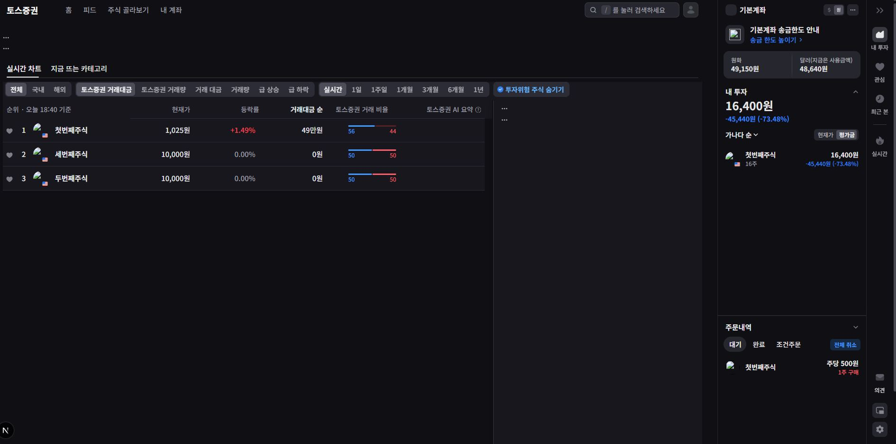 |
| 차트, 호가, 주문, 자산을 함께 확인하는 전체 거래 화면 | 실시간 종목 순위와 투자 자산을 확인하는 시장 화면 |

| 자산 및 주문 사이드바 |  |
| --- | --- |
| 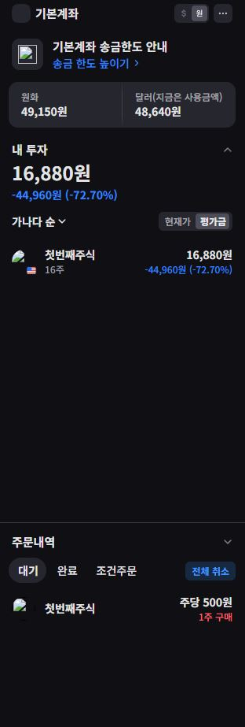 |  |
| 보유 자산과 대기 주문을 확인하는 사이드바 |  |

### 주문 기능

| 매수 주문 | 매도 주문 |
| --- | --- |
| 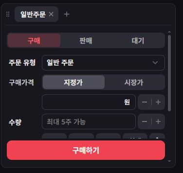 | 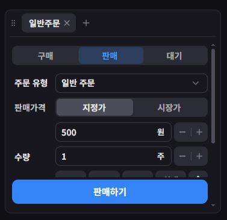 |
| 지정가와 수량을 입력하는 매수 주문 화면 | 지정가와 수량을 입력하는 매도 주문 화면 |

| 대기 주문 | 주문 수정 |
| --- | --- |
| 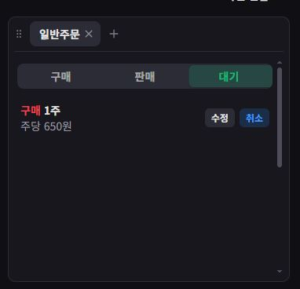 | 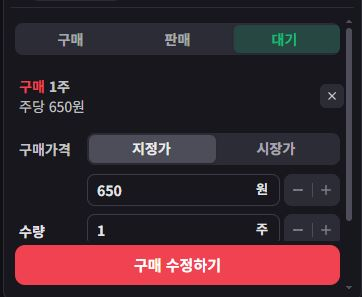 |
| 정정하거나 취소할 수 있는 대기 주문 목록 | 대기 주문의 가격과 수량을 변경하는 화면 |

| 주문 수정과 자산 반영 |  |
| --- | --- |
| 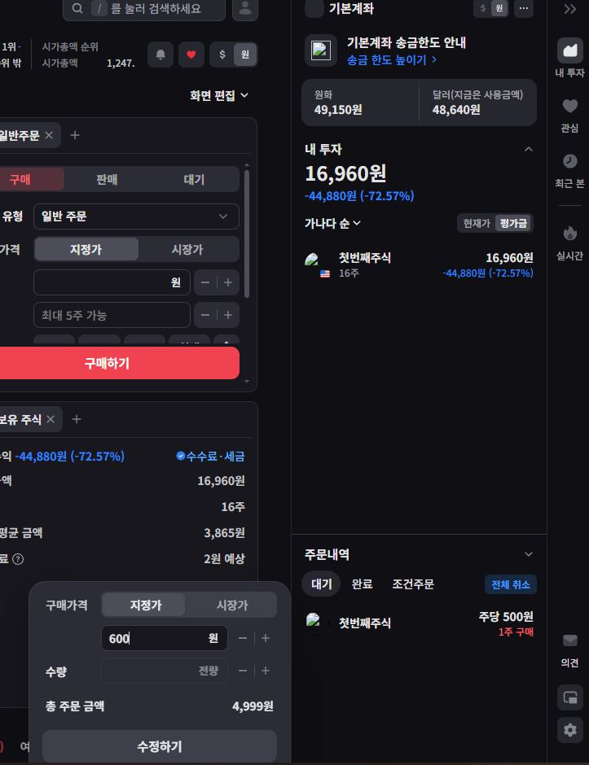 |  |
| 주문 수정 창과 변경된 보유 자산을 함께 확인하는 화면 |  |

### 차트

| 분봉 차트 | 그룹 분봉 선택 |
| --- | --- |
| 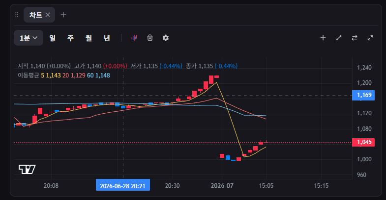 | 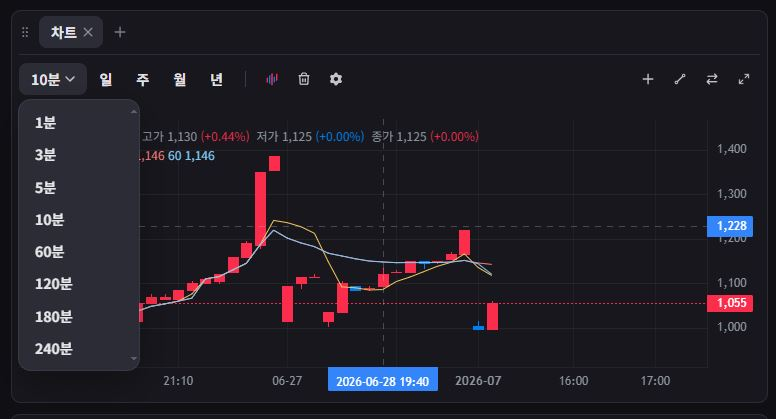 |
| 1분 단위 체결 흐름과 이동평균선을 표시하는 차트 | 1분부터 240분까지 조회 단위를 선택하는 차트 |

| 일봉 차트 | 월봉 차트 |
| --- | --- |
| 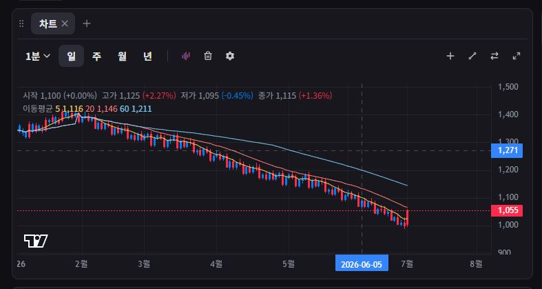 | 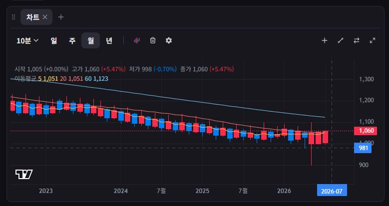 |
| 일별 가격 흐름과 이동평균선을 표시하는 차트 | 월별 장기 가격 흐름을 표시하는 차트 |

| 연봉 차트 |  |
| --- | --- |
| 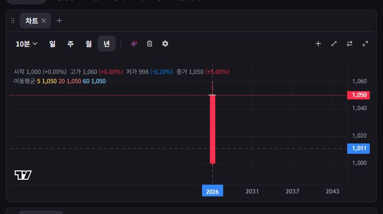 |  |
| 연도별 가격 흐름을 표시하는 차트 |  |

### 호가 및 실시간 기능

| 실시간 호가창 |  |
| --- | --- |
| 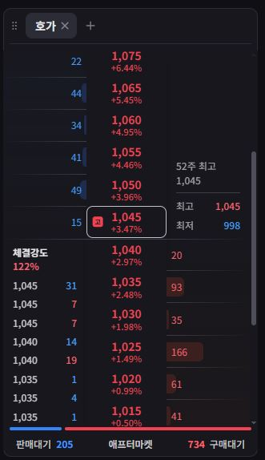 |  |
| 매도·매수 호가와 잔량, 체결강도를 실시간으로 표시하는 화면 |  |

<!--
영상은 GitHub Attachments 또는 YouTube URL을 사용하는 것을 권장합니다.
README에 MP4 파일을 직접 포함하지 않습니다.
-->

## 시연 영상

- [짧은 핵심 시연 영상](VIDEO_SHORT_URL)
- [전체 기능 시연 영상](VIDEO_FULL_URL)

## 주요 구현 내용

| 영역 | 구현 내용 |
| --- | --- |
| MSA 서비스 분리 | 인증/자산은 `user-service`, 종목/시세는 `stock-service`, 주문/체결은 `order-service`가 담당하도록 도메인 경계를 분리 |
| Kafka 이벤트 기반 처리 | 주문은 `order-topic`으로 비동기 처리하고, 체결 결과는 `settlement-topic`, `trade-execution-topic`으로 정산과 시세 반영에 전달 |
| 메모리 OrderBook 매칭 엔진 | `order-service`에서 종목별 OrderBook을 메모리에 유지하고 가격/시간 우선으로 부분 체결과 완료 체결을 처리 |
| Redis 기반 Candle 처리 | 체결로 갱신되는 현재 Candle을 Redis에 먼저 저장하고 Scheduler가 완료 Candle을 DB와 캐시에 반영 |
| WebSocket 실시간 데이터 전송 | 호가, 체결, 주문 상태, 시세, Candle, 사용자 자산 변경을 STOMP WebSocket topic으로 발행 |
| JWT 인증 및 주문 검증 | `user-service`가 JWT 인증과 refresh token 저장을 담당하고, 주문 전 매수 가능 금액과 매도 가능 수량을 검증 |
| 차트/Candle | `order-service`의 Candle API, 현재/완성 Candle WebSocket 발행, 프론트엔드의 초기 조회와 실시간 차트 반영 흐름을 구성 |
| Bot 시뮬레이션 | 시장 시뮬레이션을 위한 Bot 모델, 보유 주식 관리, 주문 실행 구조 구현 |
| 데이터 일관성 | 주문 전 자산 예약, 체결 후 Kafka 정산, 주문 실패 DLT 재처리와 실패 주문 저장 흐름을 구성 |

## 시스템 아키텍처

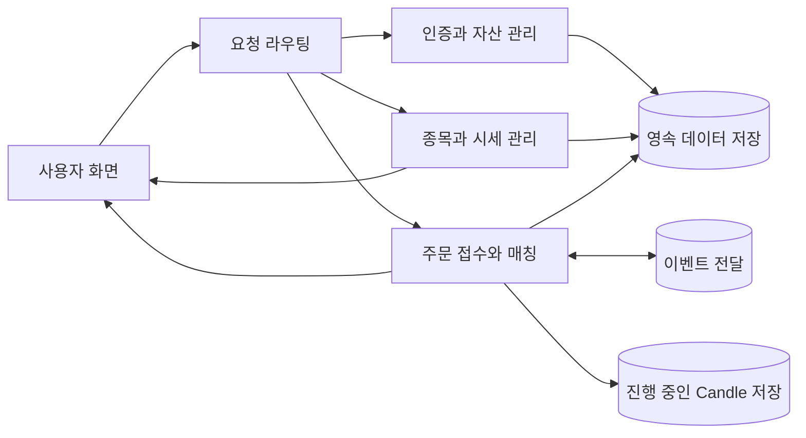

상세 Kafka 흐름, WebSocket topic, Scheduler, 도메인 모델은 [Documentation Index](docs/DOCUMENTATION.md)에서 확인할 수 있다.

## UI 디자인

프론트엔드 UI는 Toss 앱의 디자인을 참고하여 구현했습니다.<br>
Chrome DevTools의 Element/CSS를 참고해 레이아웃과 스타일을 분석했으며
프로젝트 구조에 맞게 직접 구현했습니다.

## 저장소 구조

```text
Stock/
├─ StockFrontEnd/                 # Next.js 프론트엔드
├─ StockBackEndDistributed/        # MSA 백엔드
│  ├─ user-service/                # 인증, 사용자, 자산, 정산
│  ├─ stock-service/               # 종목 API, 실시간 시세 캐시
│  └─ order-service/               # 호가장, 매칭, Candle, WebSocket
├─ StockBackEnd/                   # 레거시 백엔드 프로젝트
├─ StockBackEndMonoless/           # 레거시 백엔드 백업 프로젝트
├─ docs/                           # 공통 설계 문서와 ERD
│  ├─ ENGINEERING.md               # 설계 배경과 기술 선택 이유
│  ├─ TROUBLESHOOTING.md           # 서비스별 트러블슈팅 진입점
│  └─ database-schema.md           # 데이터베이스 스키마 ERD
├─ docker/                         # Kafka, Zookeeper, Nginx 구성
└─ docs/DOCUMENTATION.md           # 문서 포털
```

## 서비스 구성

| 서비스 | 역할 | README |
| --- | --- | --- |
| 프론트엔드 | Next.js 기반 사용자 화면, 주문/차트/호가/WebSocket UI | [StockFrontEnd](StockFrontEnd/README.md) |
| user-service | 인증, 사용자, 자산, 관심종목, 주문 검증, Kafka 정산 | [user-service](StockBackEndDistributed/user-service/README.md) |
| stock-service | 종목 API, 실시간 시세 캐시, 체결 이벤트 반영 | [stock-service](StockBackEndDistributed/stock-service/README.md) |
| order-service | 주문 API, 호가장, 매칭 엔진, Candle, WebSocket, 정산 이벤트 발행 | [order-service](StockBackEndDistributed/order-service/README.md) |

## 실행 방법

### 프론트엔드

```bash
cd StockFrontEnd
npm install
npm run dev
```

Next.js 개발 서버는 기본적으로 `http://localhost:3000`에서 실행됩니다.

### 백엔드

각 백엔드 서비스는 개별 Gradle 프로젝트입니다.

```bash
cd StockBackEndDistributed/user-service
.\gradlew.bat bootRun
```

```bash
cd StockBackEndDistributed/stock-service
.\gradlew.bat bootRun
```

```bash
cd StockBackEndDistributed/order-service
.\gradlew.bat bootRun
```

| 서비스 | 포트 |
| --- | --- |
| user-service | 8081 |
| stock-service | 8082 |
| order-service | 8083 |

### Docker

개발 인프라만 실행:

```bash
cd docker
docker compose up zookeeper kafka nginx
```

전체 Docker 실행:

```bash
cd docker
docker compose -f docker-compose.yml -f docker-compose.prod.yml up --build
```

## 보안 참고사항

각 서비스의 `application-docker.properties`에는 DB, Redis, JWT 등 민감 설정이 포함되어 있습니다. 그렇기에 README와 docs에는 실제 값을 기록하지 않습니다.

- 민감정보는 환경 변수로 분리 필요
- 배포 환경에서는 secret 관리 방식 적용 필요
- 공개 저장소에 민감 설정 파일이 포함되지 않도록 점검 필요

## 외부 시세 연동 참고

KIS 연동은 사용하려고 만들었지만, 프로젝트 내부 캐시 데이터와 KIS 데이터 사이에 불일치가 발생해 현재 사용을 중단했습니다. 지금은 주요 기능 흐름에서 제외된 더미/잔여 코드이며, 실제 시세 갱신 설명은 Kafka 체결 이벤트와 서비스 내부 캐시 데이터를 기준으로 합니다.

<div align="right">

[문서 맨 위로](#top)

</div>


