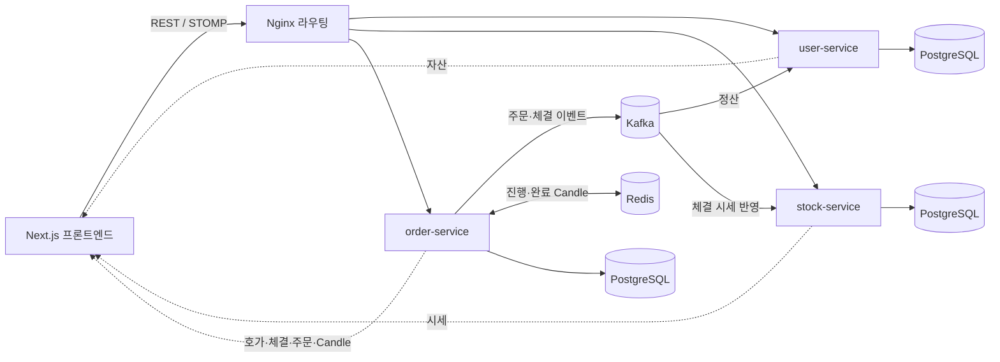
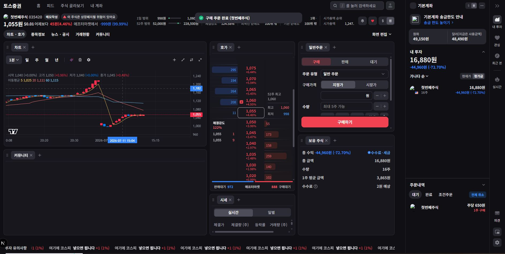

<a id="top"></a>

# 주식 거래 플랫폼

[](https://openjdk.org/)
[](https://spring.io/projects/spring-boot)
[](https://nextjs.org/)
[](https://react.dev/)
[](https://kafka.apache.org/)
[](https://redis.io/)
[](https://www.postgresql.org/)
[](https://docs.docker.com/compose/)
[](https://nginx.org/)
[](https://stomp.github.io/)

MSA 기반 주식 거래 플랫폼입니다. 사용자·자산, 종목·시세, 주문·체결 도메인을 서비스 분리하고 Kafka 이벤트, Redis Candle 캐시, STOMP WebSocket을 연결해 주문 접수부터 체결·정산·시세 및 화면 갱신까지 처리합니다.

## 목차

> [프로젝트 개요](#프로젝트-개요) · [전체 기술 스택](#전체-기술-스택) · [MSA 서비스 구성](#msa-서비스-구성) · [전체 아키텍처](#전체-아키텍처) · [주요 구현 내용](#주요-구현-내용) · [전체 실행 방법](#전체-실행-방법) · [문서 포털](#문서-포털) · [대표 화면 미리보기](#대표-화면-미리보기) · [시연 영상](#시연-영상)


## 문서 포털

| 분류 | 문서 | 분류 | 문서 |
| --- | --- | --- | --- |
| 프론트엔드 | [프론트엔드 상세 문서](StockFrontEnd/README.md) | 사용자 서비스 | [user-service](StockBackEndDistributed/user-service/README.md) |
| 종목 서비스 | [stock-service](StockBackEndDistributed/stock-service/README.md) | 주문 서비스 | [order-service](StockBackEndDistributed/order-service/README.md) |
| 전체 문서 색인 | [Documentation Index](docs/DOCUMENTATION.md) | 설계 노트 | [Engineering Notes](docs/ENGINEERING.md) |
| 데이터 스키마 | [Database Schema ERD](docs/database-schema.md) | 공통 트러블슈팅 | [Troubleshooting](docs/TROUBLESHOOTING.md) |
| 인프라 | [Docker / 인프라](docker/README.md) |  |  |

## 프로젝트 개요

메모리 기반 OrderBook이 가격·시간 우선으로 주문을 매칭하고, 체결 이벤트가 Kafka를 통해 정산과 시세 서비스로 전달됩니다. 체결로 생성되는 Candle은 Redis와 DB에 반영되며, 프론트엔드는 REST API로 초기 상태를 받은 뒤 WebSocket topic을 구독해 호가·체결·주문·자산·차트를 실시간으로 갱신합니다.

```text
Stock/
├─ StockFrontEnd/                  # Next.js 사용자 화면
├─ StockBackEndDistributed/        # MSA 백엔드
│  ├─ user-service/                # 인증, 사용자 자산, 정산
│  ├─ stock-service/               # 종목 API, 실시간 시세
│  └─ order-service/               # 주문, 매칭, Candle, WebSocket
├─ StockBackEnd/                   # 레거시 백엔드 프로젝트
├─ StockBackEndMonoless/           # 레거시 백엔드 백업 프로젝트
├─ docs/                           # 공통 설계, ERD, 트러블슈팅
└─ docker/                         # Kafka, Zookeeper, Nginx 구성
```

## 전체 기술 스택

| 영역 | 기술 |
| --- | --- |
| 프론트엔드 | Next.js 16, React 19, Tailwind CSS 4, Lightweight Charts, Zustand |
| 백엔드 | Java 17, Spring Boot 3.2.2, Gradle |
| 서비스 통신 | REST API, Kafka, STOMP WebSocket, SockJS |
| 데이터 | PostgreSQL, Spring Data JPA, Redis |
| 인프라 | Docker Compose, Nginx, Zookeeper |
| 인증 | JWT, Refresh Token |

## MSA 서비스 구성

| 서비스 | 역할 | README |
| --- | --- | --- |
| 프론트엔드 | 시장·종목 상세, 주문·차트·호가·자산 UI와 실시간 구독 | [StockFrontEnd](StockFrontEnd/README.md) |
| 사용자 서비스 (`user-service`) | 인증, 사용자 자산, 관심 종목, 주문 검증, Kafka 정산 | [user-service](StockBackEndDistributed/user-service/README.md) |
| 종목 서비스 (`stock-service`) | 종목 API, 실시간 시세 캐시, 체결 이벤트의 시세 반영 | [stock-service](StockBackEndDistributed/stock-service/README.md) |
| 주문 서비스 (`order-service`) | 주문 API, OrderBook 매칭, Candle, WebSocket, 정산 이벤트 발행 | [order-service](StockBackEndDistributed/order-service/README.md) |

## 전체 아키텍처



REST 요청은 Nginx를 거쳐 각 도메인 서비스로 전달됩니다. Kafka는 서비스 사이의 비동기 체결·정산 흐름을 분리하고, Redis는 진행 중 Candle 조회를 지원합니다. 각 서비스가 발행하는 STOMP WebSocket 데이터는 프론트엔드의 서비스별 연결 Context에서 구독합니다.

## 주요 구현 내용

| 영역 | 구현 내용 |
| --- | --- |
| 도메인 분리 | 사용자·자산, 종목·시세, 주문·체결 책임을 서비스 경계로 분리 |
| 주문 매칭 | 종목별 메모리 OrderBook에서 가격·시간 우선으로 부분 및 완료 체결 처리 |
| 이벤트 처리 | 주문과 체결 결과를 Kafka topic으로 전달해 정산과 시세 반영을 비동기 처리 |
| Candle | 현재 Candle은 Redis에서 관리하고 완료 Candle은 Scheduler를 통해 DB와 캐시에 반영 |
| 실시간 전송 | 호가, 체결, 주문 상태, 시세, Candle, 사용자 자산 변경을 STOMP topic으로 발행 |
| 인증과 검증 | JWT·Refresh Token 인증, 매수 가능 금액 및 매도 가능 수량 검증 |
| 데이터 일관성 | 주문 시 자산 예약, 체결 시 Kafka 정산, 실패 주문 재처리와 DLT 구성 |
| 거래 시뮬레이션 | Bot 모델과 자동 주문 실행 구조로 시장 흐름 시뮬레이션 |

## 전체 실행 방법

실행 전 PostgreSQL, Redis와 각 서비스의 환경별 설정을 준비해야 합니다. 실제 DB·Redis·JWT 값은 각 서비스 설정 또는 환경 변수로 관리합니다.

### 1. 개발 인프라

```bash
cd docker
docker compose up zookeeper kafka nginx
```

### 2. 백엔드 서비스

각 터미널에서 서비스를 실행합니다.

```bash
cd StockBackEndDistributed/user-service
.\gradlew.bat bootRun
```

```bash
cd StockBackEndDistributed/stock-service
.\gradlew.bat bootRun
```

```bash
cd StockBackEndDistributed/order-service
.\gradlew.bat bootRun
```

| 서비스 | 포트 |
| --- | --- |
| `user-service` | 8081 |
| `stock-service` | 8082 |
| `order-service` | 8083 |

### 3. 프론트엔드

```bash
cd StockFrontEnd
npm install
npm run dev
```

프론트엔드 기본 주소는 `http://localhost:3000`입니다. 환경 변수와 상세 실행·검증 방법은 [프론트엔드 상세 문서](StockFrontEnd/README.md#실행-방법)를 참고합니다.

### 전체 Docker 실행

```bash
cd docker
docker compose -f docker-compose.yml -f docker-compose.prod.yml up --build
```


## 대표 화면 미리보기

| 메인 시장 화면 | 상세 거래 화면 |
| --- | --- |
|  |  |

| 실시간 호가창 |  |
| --- | --- |
|  |  |

주문 정정·취소, 자산 사이드바와 차트 주기별 화면은 [프론트엔드 상세 문서](StockFrontEnd/README.md#주요-화면-미리보기)에서 확인할 수 있습니다.

<!--
영상은 GitHub Attachments 또는 YouTube URL을 사용하는 것을 권장합니다.
README에 MP4 파일을 직접 포함하지 않습니다.
-->

## 시연 영상

- [시연 영상](VIDEO_SHORT_URL)
- [긴 시연 영상](VIDEO_FULL_URL)

## 보안 및 외부 시세 참고

각 서비스의 DB, Redis, JWT 등 민감 설정은 환경 변수 또는 별도 secret으로 관리해야 하며 공개 저장소에 포함하지 않습니다.

KIS 연동 코드는 내부 캐시 데이터와 KIS 데이터 사이의 불일치 때문에 현재 주요 기능 흐름에서 제외되어 있습니다. 실시간 시세 갱신은 Kafka 체결 이벤트와 서비스 내부 캐시 데이터를 기준으로 합니다.

<div align="right">

[문서 맨 위로](#top)

</div>
