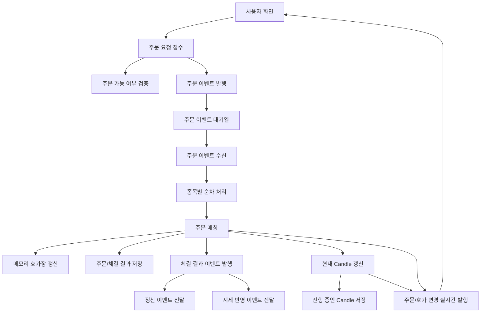

<a id="top"></a>

# 주문 서비스 (order-service)

[](https://openjdk.org/)
[](https://spring.io/projects/spring-boot)
[](https://spring.io/guides/gs/rest-service/)
[](https://spring.io/projects/spring-security)
[](https://spring.io/projects/spring-data-jpa)
[](https://spring.io/projects/spring-data-redis)
[](https://spring.io/projects/spring-kafka)
[](https://docs.spring.io/spring-framework/reference/web/websocket.html)
[](https://docs.spring.io/spring-framework/reference/core/validation.html)
[](https://github.com/jwtk/jjwt)
[](https://www.postgresql.org/)

## 문서 포털

문서의 상세 구현, API, 아키텍처, 트러블슈팅은 아래 문서를 참고하세요.

| 분류 | 문서 | 분류 | 문서 |
| --- | --- | --- | --- |
| 주식 README | [README](../../README.md) | 주문 서비스 README | [README](README.md) |
| 설계 노트 | [Engineering Notes](../../docs/ENGINEERING.md) | 데이터베이스 ERD | [Database Schema ERD](../../docs/database-schema.md) |
| 주문 서비스 개요 | [주문 서비스 개요](docs/00-order-service-overview.md) | 주문 API | [주문 API](docs/01-order-api.md) |
| Kafka 주문 흐름 | [Kafka 주문 흐름](docs/02-kafka-order-flow.md) | 정산/체결 이벤트 | [정산/체결 이벤트](docs/03-settlement-and-trade-events.md) |
| 호가장 | [호가장](docs/04-orderbook.md) | 매칭 엔진 | [매칭 엔진](docs/05-matching-engine.md) |
| Candle 차트 흐름 | [Candle 차트 흐름](docs/06-candle-chart-flow.md) | 실시간 발행 흐름 | [실시간 발행 흐름](docs/07-websocket-flow.md) |
| Bot 거래 구조 | [Bot 거래 구조](docs/08-bot-trading-flow.md) | 초기화/주기 작업 | [초기화/주기 작업](docs/09-initialization-and-scheduler.md) |
| 주문 서비스 이슈 | [order-service 이슈](docs/10-order-service-issues.md) | 주문 서비스 트러블슈팅 | [order-service 트러블슈팅](docs/11-troubleshooting.md) |

## 목차

> [주문 서비스 소개](#주문-서비스-소개) ·
> [주요 구현 내용](#주요-구현-내용)

> [시스템 아키텍처](#시스템-아키텍처) ·
> [실행 방법](#실행-방법)

## 주문 서비스 소개

주문 매칭 및 처리, 현재 분봉 저장(redis candle), 실시간 발행(websocket)을 담당하는 주문 서비스입니다.

`order-service`는 주문과 체결 흐름을 조정합니다. 사용자 주문은  종목별 메모리 호가장에서 매칭된 뒤 정산 이벤트, 체결 이벤트, Candle 갱신, WebSocket 발행으로 이어집니다.

## 주요 구현 내용

| 영역 | 주요 구현 내용 | 사용 기술/처리 방식 | 관련 문서 |
| --- | --- | --- | --- |
| 주문 API | 주문 등록·정정·취소<br>호가 및 사용자 주문 조회 | REST API 제공<br>`features/Order/OrderController.java` | [주문 API](docs/01-order-api.md) |
| 주문 검증 | 매수·매도 가능 여부 확인<br>주문 처리 전 자산 검증 | user-service 동기 요청<br>`features/Order/OrderService.java` | [주문 API](docs/01-order-api.md) |
| Kafka 주문 처리 | `order-topic` 발행 및 소비<br>실패 주문 DLT 재처리 | Kafka 비동기 처리<br>`KafkaProducer`, `KafkaConsumer` | [Kafka 주문 흐름](docs/02-kafka-order-flow.md) |
| 메모리 호가장 | 종목별 `OrderBook` 캐시<br>가격대별 주문 큐 관리 | 종목별 락과 메모리 큐<br>`OrderBookCache`, `PriceLevel` | [호가장](docs/04-orderbook.md) |
| 매칭 엔진 | 가격·시간 우선 주문 매칭<br>부분체결·완료 상태 처리 | 체결 이력과 주문 상태 저장<br>`OrderTradeService.java` | [매칭 엔진](docs/05-matching-engine.md) |
| 정산 이벤트 | user-service 정산 이벤트 발행<br>stock-service 체결 이벤트 발행 | Kafka 기반 후속 처리<br>`SettlementProducer.java` | [정산/체결 이벤트](docs/03-settlement-and-trade-events.md) |
| Candle | Redis 현재 1분봉·일봉 갱신<br>Candle 조회 API 제공 | Redis 캐시와 Candle 집계<br>`features/Candle/*` | [Candle 차트 흐름](docs/06-candle-chart-flow.md) |
| 웹소켓 | 호가와 주문 상태 발행<br>현재·완성 Candle 발행 | WebSocket topic 발행<br>`WebSocketService.java` | [실시간 발행 흐름](docs/07-websocket-flow.md) |
| 초기화 | 종목·호가장·Candle 초기화<br>Bot 캐시 초기화 | 서버 시작 시 캐시 구성<br>`init/*`, `BotInit.java` | [초기화/주기 작업](docs/09-initialization-and-scheduler.md) |

## 시스템 아키텍처



- 주문 요청은 주문 가능 여부 검증을 거친 뒤 이벤트로 발행된다.
- 주문 이벤트는 종목별로 순차 처리되어 같은 종목의 호가장 변경이 충돌하지 않게 한다.
- 매칭 결과는 주문/체결 저장, 정산 이벤트, 시세 반영 이벤트로 이어진다.
- 체결은 현재 Candle을 갱신하고 진행 중인 Candle은 Redis에 저장된다.
- 주문 상태, 호가, Candle 변경은 사용자 화면으로 실시간 발행된다.

## 실행 방법

```bash
.\gradlew.bat bootRun
```

`application-docker.properties` 기준 서비스 포트는 `8083`입니다. DB, Redis, JWT 등 민감 설정 값은 문서에 기록하지 않으며 환경 변수로 분리 필요합니다.

<div align="right">

[문서 맨 위로](#top)

</div>


