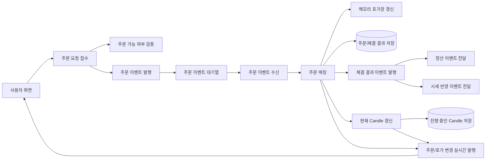

# 주문 서비스 개요

## 문서 포털

문서의 상세 구현, API, 아키텍처, 트러블슈팅은 아래 문서를 참고하세요.

| 분류 | 문서 | 분류 | 문서 |
| --- | --- | --- | --- |
| 루트 README | [README](../../../README.md) | 서비스 README | [README](../README.md) |
| Engineering Notes | [Engineering Notes](../../../docs/ENGINEERING.md) | Database Schema ERD | [Database Schema ERD](../../../docs/database-schema.md) |
| 00 | [주문 서비스 개요](00-order-service-overview.md) | 01 | [주문 API](01-order-api.md) |
| 02 | [Kafka 주문 흐름](02-kafka-order-flow.md) | 03 | [정산/체결 이벤트](03-settlement-and-trade-events.md) |
| 04 | [호가장](04-orderbook.md) | 05 | [매칭 엔진](05-matching-engine.md) |
| 06 | [Candle 차트 흐름](06-candle-chart-flow.md) | 07 | [실시간 발행 흐름](07-websocket-flow.md) |
| 08 | [Bot 거래 구조](08-bot-trading-flow.md) | 09 | [초기화/주기 작업](09-initialization-and-scheduler.md) |
| 10 | [order-service 이슈](10-order-service-issues.md) |  |  |

## 목차

> [주요 책임](#주요-책임) ·
> [전체 구조](#전체-구조) ·
> [주요 디렉터리](#주요-디렉터리) ·
> [설정 주의](#설정-주의)

> [핵심 구현 파일](#핵심-구현-파일)

## 주요 책임

`order-service`는 주문 접수와 체결 처리를 중심으로, 호가장 관리, 정산 이벤트 발행, 체결 기반 Candle 생성, WebSocket 실시간 발행을 담당한다.

현재 코드 기준 주요 책임은 다음과 같다.

- 사용자 주문 접수, 정정, 취소 API 제공
- user-service를 통한 주문 가능 여부와 정정/취소 가능 여부 검증
- Kafka `order-topic` 기반 비동기 주문 처리
- 종목별 메모리 호가장 관리
- 가격/시간 우선 방식의 주문 매칭
- 체결 결과를 user-service 정산 이벤트와 stock-service 체결 이벤트로 발행
- 체결 데이터를 기반으로 Redis 현재 Candle 갱신
- Candle 조회 API와 WebSocket Candle 발행 제공
- 서버 시작 시 종목, 호가장, Candle 캐시, Bot 캐시 초기화
- Bot 모델과 주문 실행 경로 제공

## 주문 서비스 전체 구조

## 주요 디렉터리

기준 경로

`src/main/java/Poi/Stock`

| 디렉터리 | 설명 |
| --- | --- |
| `features/Order` | 주문 API, 주문 서비스, 호가장, 체결 처리 |
| `features/kafka` | 주문 Kafka 생산/소비, 정산 이벤트 생산 |
| `features/Candle` | Candle API, Redis 저장, 스케줄러, 캐시 |
| `features/Websocket` | STOMP WebSocket 발행 |
| `features/Bot` | Bot 엔티티, 캐시, 전략, 주문 실행 경로 |
| `init` | 서버 시작 시 캐시와 호가장 초기화 |
| `config` | 보안, JWT, Redis, WebSocket 설정 |

## 설정 주의

`application-docker.properties`에는 DB, Redis, JWT 등 민감 설정이 포함되어 있다. 해당 값은 문서에 직접 기록하지 않고, 운영 환경에서는 환경 변수로 분리 필요하다.

## 핵심 구현 파일

기준 경로

`StockBackEndDistributed/order-service/src/main`

| 파일 |
| --- |
| `java/Poi/Stock/OrderServiceApplication.java` |
| `java/Poi/Stock/features/Order/OrderController.java` |
| `java/Poi/Stock/features/Order/OrderService.java` |
| `java/Poi/Stock/features/Order/OrderTradeService.java` |
| `java/Poi/Stock/features/kafka/KafkaConsumer.java` |
| `java/Poi/Stock/features/Candle/CandleService.java` |
| `java/Poi/Stock/features/Websocket/WebSocketService.java` |
| `resources/application-docker.properties` |

[문서 맨 위로](#top)

