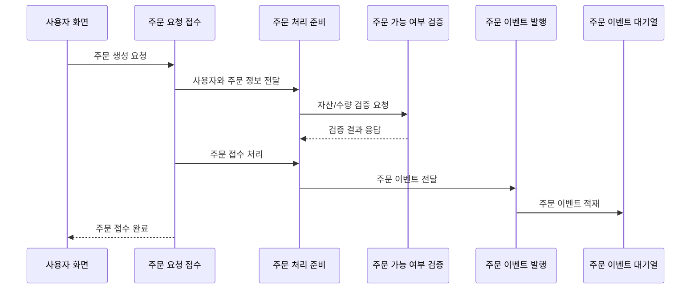

<a id="top"></a>

# 주문 API

## 문서 포털

문서의 상세 구현, API, 아키텍처, 트러블슈팅은 아래 문서를 참고합니다.

| 분류 | 문서 | 분류 | 문서 |
| --- | --- | --- | --- |
| 주식 README | [README](../../../README.md) | 주문 서비스 README | [README](../README.md) |
| 설계 노트 | [Engineering Notes](../../../docs/ENGINEERING.md) | 데이터베이스 ERD | [Database Schema ERD](../../../docs/database-schema.md) |
| 주문 서비스 개요 | [주문 서비스 개요](00-order-service-overview.md) | 주문 API | [주문 API](01-order-api.md) |
| Kafka 주문 흐름 | [Kafka 주문 흐름](02-kafka-order-flow.md) | 정산/체결 이벤트 | [정산/체결 이벤트](03-settlement-and-trade-events.md) |
| 호가장 | [호가장](04-orderbook.md) | 매칭 엔진 | [매칭 엔진](05-matching-engine.md) |
| Candle 차트 흐름 | [Candle 차트 흐름](06-candle-chart-flow.md) | 실시간 발행 흐름 | [실시간 발행 흐름](07-websocket-flow.md) |
| Bot 거래 구조 | [Bot 거래 구조](08-bot-trading-flow.md) | 초기화/주기 작업 | [초기화/주기 작업](09-initialization-and-scheduler.md) |
| 주문 서비스 이슈 | [order-service 이슈](10-order-service-issues.md) |  |  |

## 목차

> [개요](#개요) ·
> [주문 등록](#주문-등록) ·
> [주문 정정](#주문-정정) ·
> [주문 취소](#주문-취소)

> [주문 조회](#주문-조회) ·
> [주문 API 흐름](#주문-api-흐름) ·
> [핵심 구현 파일](#핵심-구현-파일)

## 개요

주문 REST API는 주문 등록, 정정, 취소, 조회 요청을 처리합니다. 인증이 필요한 요청은 JWT에서 확인한 사용자 ID를 기준으로 처리합니다.

호가장 조회와 Candle 조회 일부 경로는 Security 설정에서 허용되어 있습니다.

## 주문 등록

주문 등록 API(`POST /order/trade`)는 사용자 자산과 보유 수량을 검증한 뒤 주문을 비동기로 접수합니다. 요청 본문은 `TradeDTO`를 사용합니다.

### 동작 순서

1. JWT에서 사용자 ID와 Bearer Token을 확인합니다.
2. 사용자 서비스에 주문 가능 여부를 요청합니다.
3. 주문 처리를 요청하는 Kafka Topic(`order-topic`)에 주문 이벤트를 발행합니다.
4. 클라이언트에 접수 결과를 반환합니다.

### 핵심 코드

```java
public ResponseEntity<ApiResponse> stockTrade(
        @RequestBody @Valid TradeDTO tradeDTO,
        Authentication authentication,
        HttpServletRequest request) {
    String userId = authentication.getName();
    String accessToken = resolveToken(request);
    orderService.validateOrder(userId, tradeDTO, accessToken);
    orderService.placeOrder(userId, tradeDTO);
    return ResponseEntity.ok(new ApiResponse(true, "주문 접수 완료"));
}
```

주문 이벤트 전에 자산 예약이 성공했는지 주문 정보와 인증 사용자를 입력받아 검증한 뒤 Kafka에 접수하며, 실제 매칭은 비동기로 이어집니다.

### 구현 위치

- 주문 요청: `features/Order/OrderController.java`
- 주문 검증·접수: `features/Order/OrderService.java`의 `validateOrder()`, `placeOrder()`
- 이벤트 발행: `features/kafka/KafkaProducer.java`

## 주문 정정

주문 정정 API(`POST /order/edit`)는 기존 주문을 확인하고 변경된 조건으로 다시 매칭합니다. 요청 본문은 `TradeDTO`를 사용합니다.

### 동작 순서

1. 기존 주문의 소유자와 상태를 확인합니다.
2. 사용자 서비스에 정정 가능 여부를 요청합니다.
3. 기존 주문을 호가장에서 제거합니다.
4. 주문을 수정하고 다시 매칭합니다.

### 핵심 코드

```java
public ResponseEntity<ApiResponse> stockEdit(
        @RequestBody @Valid TradeDTO tradeDTO,
        Authentication authentication,
        HttpServletRequest request) {
    String accessToken = resolveToken(request);
    String userId = authentication.getName();
    Order order = orderService.validateEditOrder(userId, tradeDTO, accessToken);
    orderService.stockEdit(tradeDTO, order);
    return ResponseEntity.ok(new ApiResponse(true, "주문 접수 완료"));
}
```

정정 요청은 기존 주문 검증을 먼저 수행합니다. 변경 주문과 인증 정보를 입력받아 예약 차액을 확인하고, 통과한 주문만 기존 호가에서 제거한 뒤 재매칭합니다.

### 구현 위치

- 요청 처리: `features/Order/OrderController.java`
- 주문 정정: `features/Order/OrderService.java`의 `stockEdit()`

현재 주문 정정은 일반 주문과 달리 Kafka를 거치지 않고 서비스 내부에서 바로 처리됩니다.

## 주문 취소

주문 취소 API(`POST /order/cancel/{orderId}`)는 예약 자산을 복구하고 대기 중인 주문을 호가장에서 제거합니다.

### 동작 순서

1. 주문 소유자를 확인합니다.
2. 예약 자산을 복구하는 사용자 서비스 API(`/user/cancel-reserve`)를 호출합니다.
3. 주문을 호가장에서 제거하고 취소 결과를 저장합니다.
4. 변경된 호가와 사용자 주문 상태를 실시간으로 발행합니다.

### 핵심 코드

```java
public ResponseEntity<ApiResponse> cancelOrder(
        @PathVariable("orderId") Long orderId,
        Authentication authentication,
        HttpServletRequest request) {
    String userId = authentication.getName();
    String accessToken = resolveToken(request);
    orderCancelService.cancelOrder(userId, orderId, accessToken);
    return ResponseEntity.ok(new ApiResponse(true, "주문 취소 완료"));
}
```

경로의 주문 ID만으로 취소하지 않고 인증과 Access Token을 함께 서비스 계층에 전달하는 코드입니다. 취소가 완료되면 예약 자산, 호가장, 완료 주문 이력과 사용자 WebSocket 상태가 함께 갱신됩니다.

### 구현 위치

- 취소 요청: `features/Order/OrderController.java`
- 취소 처리: `features/Order/OrderCancelService.java`

## 주문 조회

| 역할 | REST API |
| --- | --- |
| 종목별 매도·매수 상위 호가 조회 | `GET /order/orderbook/{stockCode}` |
| 특정 종목의 미체결·부분 체결 주문 조회 | `GET /order/myorder/{stockCode}` |
| 사용자의 전체 미체결·부분 체결 주문 조회 | `GET /order/myallorder` |
| 사용자의 완료 주문 조회 | `GET /completed/order` |

### 동작 순서

1. 인증 사용자 ID를 조회 조건으로 사용합니다.
2. 최신 주문부터 조회해 화면용 DTO로 변환합니다.
3. 주문 상태와 남은 수량을 포함한 목록을 반환합니다.

### 핵심 코드

```java
public List<myAllOrderDTO> getMyAllStockOrder(String userId) {
    List<Order> orders = orderRepository.findByUserIdOrderByCreatedAtDesc(userId);
    return orders.stream().map(order -> {
        myAllOrderDTO dto = new myAllOrderDTO();
        dto.setOrderId(order.getOrderId());
        dto.setStockCode(order.getStockCode());
        dto.setStockName(order.getStockName());
        dto.setTradeType(order.getTradeType());
        dto.setQuantity(order.getQuantity());
        dto.setRemainingQuantity(order.getRemainingQuantity());
        dto.setTradePrice(order.getTradePrice());
        dto.setStatus(order.getStatus());
        dto.setCreatedAt(order.getCreatedAt());
        return dto;
    }).collect(Collectors.toList());
}
```

필요한 상태와 잔여 수량만 전달하기 위한 로직입니다. 사용자 ID를 입력받아 최신순 주문을 DTO로 변환하고 주문 목록 화면에 반영합니다.

### 구현 위치

- 전체 주문 조회: `features/Order/OrderService.java`의 `getMyAllStockOrder()`

## 주문 API 흐름



## 핵심 구현 파일

기준 경로

`StockBackEndDistributed/order-service/src/main/java/Poi/Stock`

| 파일 |
| --- |
| `features/Order/OrderController.java` |
| `features/Order/OrderService.java` |
| `features/Order/OrderCancelService.java` |
| `features/CompletedOrder/CompletedOrderController.java` |
| `DTO/user/TradeDTO.java` |
| `DTO/user/myAllOrderDTO.java` |
| `DTO/user/myStockOrderDTO.java` |

<div align="right">

[문서 맨 위로](#top)

</div>


