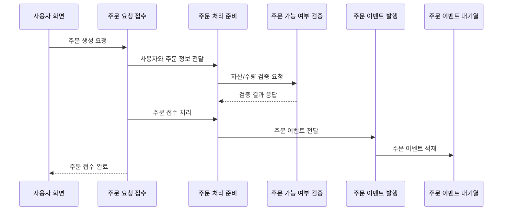

# 주문 API

## 문서 포털

문서의 상세 구현, API, 아키텍처, 트러블슈팅은 아래 문서를 참고하세요.

| 분류 | 문서 | 분류 | 문서 |
| --- | --- | --- | --- |
| 루트 README | [README](../../../README.md) | 서비스 README | [README](../README.md) |
| Engineering Notes | [Engineering Notes](../../../docs/ENGINEERING.md) | Database Schema ERD | [Database Schema ERD](../../../docs/database-schema.md) |
| 00 | [주문 서비스 개요](00-order-service-overview.md) | 01 | [주문 API](01-order-api.md) |
| 02 | [Kafka 주문 흐름](02-kafka-order-flow.md) | 03 | [정산/체결 이벤트](03-settlement-and-trade-events.md) |
| 04 | [호가장](04-orderbook.md) | 05 | [매칭 엔진](05-matching-engine.md) |
| 06 | [Candle 차트 흐름](06-candle-chart-flow.md) | 07 | [실시간 발행 흐름](07-websocket-flow.md) |
| 08 | [Bot 거래 구조](08-bot-trading-flow.md) | 09 | [초기화/주기 작업](09-initialization-and-scheduler.md) |
| 10 | [order-service 이슈](10-order-service-issues.md) |  |  |

## 목차

> [개요](#개요) ·
> [주문 등록](#주문-등록) ·
> [주문 정정](#주문-정정) ·
> [주문 취소](#주문-취소)

> [주문 조회](#주문-조회) ·
> [주문 API 흐름](#주문-api-흐름) ·
> [핵심 구현 파일](#핵심-구현-파일)

## 개요

주문 API는 주문 등록, 정정, 취소, 조회 요청을 처리한다. 인증이 필요한 API는 Spring Security JWT 필터를 통해 사용자 ID를 가져온다.

호가장 조회와 Candle 조회 일부 경로는 Security 설정에서 허용되어 있다.

## 주문 등록

- Method: `POST`
- Path: `/order/trade`
- Request Body: `TradeDTO`
- 처리 흐름:
  1. JWT 인증 사용자 ID를 가져온다.
  2. Authorization 헤더의 Bearer 토큰을 추출한다.
  3. `OrderService.validateOrder`로 user-service에 주문 가능 여부를 검증한다.
  4. `OrderService.placeOrder`가 Kafka `order-topic`으로 주문을 발행한다.

주문 등록 API는 직접 매칭하지 않고 Kafka를 통해 비동기로 처리한다.

## 주문 정정

- Method: `POST`
- Path: `/order/edit`
- Request Body: `TradeDTO`
- 처리 흐름:
  1. 기존 주문 소유자와 상태를 확인한다.
  2. user-service에 정정 가능 여부를 검증한다.
  3. 기존 주문을 호가장에서 제거한다.
  4. 가격/수량을 수정한 뒤 매칭을 수행한다.

현재 주문 정정은 일반 주문과 달리 Kafka를 거치지 않고 서비스 내부에서 바로 처리된다.

## 주문 취소

- Method: `POST`
- Path: `/order/cancel/{orderId}`
- 처리 흐름:
  1. 주문 소유자 확인
  2. user-service `/user/cancel-reserve`로 예약 복구 요청
  3. 메모리 호가장에서 주문 제거
  4. 호가 WebSocket 발행
  5. 사용자 주문 상태 WebSocket 발행
  6. 취소 완료 주문을 `CompletedOrder`로 저장
  7. 원 주문 삭제

## 주문 조회

| Method | Path | 설명 |
| --- | --- | --- |
| `GET` | `/order/orderbook/{stockCode}` | 종목별 매도/매수 상위 호가 조회 |
| `GET` | `/order/myorder/{stockCode}` | 인증 사용자의 특정 종목 미체결/부분체결 주문 조회 |
| `GET` | `/order/myallorder` | 인증 사용자의 전체 미체결/부분체결 주문 조회 |
| `GET` | `/completed/order` | 인증 사용자의 완료 주문 조회 |

## 주문 API 흐름

## 핵심 구현 파일

기준 경로

`StockBackEndDistributed/order-service/src/main/java/Poi/Stock`

| 파일 |
| --- |
| `features/Order/OrderController.java` |
| `features/Order/OrderService.java` |
| `features/Order/OrderCancelService.java` |
| `features/CompletedOrder/CompletedOrderController.java` |
| `DTO/user/TradeDTO.java` |
| `DTO/user/myAllOrderDTO.java` |
| `DTO/user/myStockOrderDTO.java` |

[문서 맨 위로](#top)

