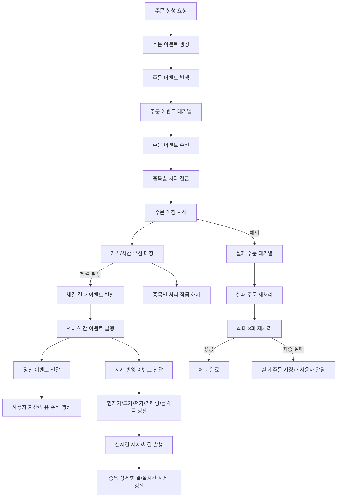

<a id="top"></a>

# Kafka 주문 처리 흐름

## 문서 포털

문서의 상세 구현, API, 아키텍처, 트러블슈팅은 아래 문서를 참고합니다.

| 분류 | 문서 | 분류 | 문서 |
| --- | --- | --- | --- |
| 주식 README | [README](../../../README.md) | 주문 서비스 README | [README](../README.md) |
| 설계 노트 | [Engineering Notes](../../../docs/ENGINEERING.md) | 데이터베이스 ERD | [Database Schema ERD](../../../docs/database-schema.md) |
| 주문 서비스 개요 | [주문 서비스 개요](00-order-service-overview.md) | 주문 API | [주문 API](01-order-api.md) |
| Kafka 주문 흐름 | [Kafka 주문 흐름](02-kafka-order-flow.md) | 정산/체결 이벤트 | [정산/체결 이벤트](03-settlement-and-trade-events.md) |
| 호가장 | [호가장](04-orderbook.md) | 매칭 엔진 | [매칭 엔진](05-matching-engine.md) |
| Candle 차트 흐름 | [Candle 차트 흐름](06-candle-chart-flow.md) | 실시간 발행 흐름 | [실시간 발행 흐름](07-websocket-flow.md) |
| Bot 거래 구조 | [Bot 거래 구조](08-bot-trading-flow.md) | 초기화/주기 작업 | [초기화/주기 작업](09-initialization-and-scheduler.md) |
| 주문 서비스 이슈 | [order-service 이슈](10-order-service-issues.md) |  |  |

## 목차

> [개요](#개요) ·
> [주문 발행](#주문-발행) ·
> [주문 소비](#주문-소비) ·
> [체결 이후 이벤트 발행](#체결-이후-이벤트-발행) ·
> [실패 주문 재처리](#실패-주문-재처리)

> [Kafka 주문 처리 흐름도](#kafka-주문-처리-흐름도) ·
> [종목별 락](#종목별-락) ·
> [핵심 구현 파일](#핵심-구현-파일)

## 개요

주문 등록 요청은 API 응답과 실제 매칭을 분리하여 비동기로 처리합니다. 주문 이벤트는 Kafka를 통해 매칭 처리기로 전달됩니다.

- 주문 처리를 요청하는 Kafka Topic: `order-topic`
- 처리에 실패한 주문을 전달하는 Kafka DLT Topic: `order-topic.DLT`
- 사용자 자산 정산을 요청하는 Kafka Topic: `settlement-topic`
- 종목 시세 반영을 요청하는 Kafka Topic: `trade-execution-topic`
- 일반 컨슈머 그룹: `stock-group`
- DLT 컨슈머 그룹: `stock-dlt-group`

주문 서비스는 주문 매칭 후 체결 결과를 다른 서비스에 전달합니다. 사용자 자산 정산 Topic(`settlement-topic`)은 자산과 보유 주식 갱신으로, 종목 시세 반영 Topic(`trade-execution-topic`)은 현재가와 거래량 갱신으로 이어집니다.

## 주문 발행

주문 생성 요청은 인증 사용자 ID를 주문 데이터에 포함한 뒤 주문 처리 Topic(`order-topic`)에 발행합니다.
요청에는 인증 사용자 ID와 종목 코드가 포함됩니다. 종목 코드는 같은 종목의 이벤트가 순서대로 처리되도록 메시지 키로 사용됩니다.

### 동작 순서

1. 주문 요청을 주문 이벤트로 변환합니다.
2. 종목 코드를 메시지 키로 지정합니다.
3. 주문 처리를 요청하는 Kafka Topic(`order-topic`)에 이벤트를 발행합니다.

### 핵심 코드

```java
public void placeOrder(String userId, TradeDTO tradeDTO) {
    tradeDTO.setUserId(userId);
    kafkaProducer.sendOrder(tradeDTO);
}

public void sendOrder(TradeDTO tradeDTO) {
    kafkaTemplate.send("order-topic", tradeDTO.getStockCode(), tradeDTO);
}
```

인증된 사용자 ID를 주문 이벤트에 덮어쓴 뒤 발행합니다. 종목 코드를 Kafka key로 사용해 같은 종목의 주문 순서를 유지하며, 결과는 주문 Consumer의 매칭 입력이 됩니다.

### 구현 위치

- 주문 이벤트 생성: `Order/OrderService.java`의 `placeOrder()`
- 주문 이벤트 발행: `kafka/KafkaProducer.java`의 `sendOrder()`

## 주문 소비

주문 처리기는 주문 요청을 전달하는 Kafka Topic(`order-topic`)에서 이벤트를 수신합니다. 처리 전 종목별 락을 획득하고 해당 종목의 주문 매칭을 시작합니다.

처리 중 예외가 발생하면 실패 주문을 보관하는 Kafka DLT Topic(`order-topic.DLT`)으로 전달합니다.

### 동작 순서

1. 종목 코드에 해당하는 처리 락을 획득합니다.
2. 주문 매칭과 후속 처리를 실행합니다.
3. 실패 시 원본 주문을 DLT로 보내고 반드시 락을 해제합니다.

### 핵심 코드

```java
@KafkaListener(topics = "order-topic", groupId = "stock-group")
public void consumeOrder(@Payload TradeDTO tradeDTO) {
    stockLock.lock(tradeDTO.getStockCode());
    try {
        orderService.processOrder(tradeDTO);
    } catch (Exception e) {
        log.error("주문 처리 실패: {}", e.getMessage());
        kafkaProducer.sendToDLT(tradeDTO);
    } finally {
        stockLock.unlock(tradeDTO.getStockCode());
    }
}
```

같은 종목의 주문이 동시에 호가장을 변경해 우선순위가 깨지는 문제를 막기 위한 Consumer입니다. 주문 이벤트를 입력받아 종목별로 처리하고, 실패 여부와 관계없이 락을 해제합니다.

### 구현 위치

- 주문 이벤트 수신·재처리: `kafka/KafkaConsumer.java`
- 종목별 잠금: `Lock/StockLock.java`

## 체결 이후 이벤트 발행

주문 매칭이 발생하면 체결 결과를 서비스 간 이벤트로 변환합니다.

- 사용자 자산 정산 요청: `SettlementEvent`를 Kafka Topic(`settlement-topic`)으로 발행합니다.
- 종목 시세 반영 요청: `TradeExecutionList`를 Kafka Topic(`trade-execution-topic`)으로 발행합니다.

사용자 서비스는 자산 정산 Topic(`settlement-topic`)의 이벤트를 기준으로 자산과 보유 주식을 갱신합니다. 매수자의 보유 수량은 증가하고 매도자의 보유 수량은 감소합니다.

종목 서비스는 시세 반영 Topic(`trade-execution-topic`)에서 체결 목록을 받습니다. 종목별 현재가, 고가, 저가, 누적 거래량과 등락률을 갱신한 뒤 사용자 화면에 실시간으로 전달합니다.

이 흐름의 최종 목적지는 Frontend의 실시간 화면입니다. order-service가 체결을 만들고, stock-service가 시세 스냅샷을 갱신한 뒤 WebSocket으로 현재가와 체결 정보를 발행하면 Frontend는 이를 구독해 종목 상세, 체결 내역, 실시간 시세 영역을 갱신합니다.

### 동작 순서

1. 체결 목록을 사용자별 자산 증감 이벤트로 변환합니다.
2. 사용자 정산과 종목 시세 반영을 서로 다른 Topic으로 발행합니다.
3. 각 서비스가 같은 체결 결과를 자신의 상태에 반영합니다.

### 핵심 코드

```java
public void settlement(MatchingResult result) {
    if (!result.getExecutions().isEmpty()) {
        SettlementEvent event = buildSettlementEvent(
                result.getExecutions(), result.getStockCode());
        settlementProducer.sendSettlement(event);
        settlementProducer.sendTradeExecutionStockService(result.getExecutions());
    }
}
```

`MatchingResult`를 입력받아 사용자 정산 이벤트와 종목 체결 목록을 만들고 각 서비스의 Kafka 처리 흐름에 전달합니다.

### 구현 위치

- 체결 후 이벤트 분기: `Order/OrderTradeService.java`의 `settlement()`
- 서비스별 Topic 발행: `kafka/SettlementProducer.java`

## 실패 주문 재처리

실패한 주문은 최대 3회 다시 처리합니다. 계속 실패하면 주문 정보를 저장하고 사용자에게 실시간 오류 메시지를 전달합니다.

### 동작 순서

1. DLT에서 원본 주문을 수신합니다.
2. 최대 3회까지 주문 처리를 재시도합니다.
3. 최종 실패 시 실패 주문 저장과 사용자 알림을 실행합니다.

### 핵심 코드

```java
@KafkaListener(topics = "order-topic.DLT", groupId = "stock-dlt-group")
public void consumeDLT(@Payload TradeDTO tradeDTO) {
    int maxRetry = 3;
    Exception lastException = null;
    for (int attempt = 1; attempt <= maxRetry; attempt++) {
        try {
            orderService.processOrder(tradeDTO);
            return;
        } catch (Exception e) {
            lastException = e;
            if (attempt < maxRetry)
                sleep(attempt);
        }
    }
    failedOrderService.handleFinalFailure(tradeDTO, lastException);
}
```

일시적 장애는 재처리하되 영구 오류가 Consumer를 계속 점유하지 않도록 재시도 횟수를 제한합니다. 실패 주문을 입력받아 성공하면 종료하고, 세 번 모두 실패하면 별도 실패 저장과 사용자 알림으로 전환합니다.

### 구현 위치

- 실패 이벤트 수신·재처리: `kafka/KafkaConsumer.java`의 DLT Consumer
- 실패 주문 저장: `Order/FailedOrder.java`, `Order/FailedOrderRepository.java`

## Kafka 주문 처리 흐름도



## 종목별 락

`StockLock`은 `ConcurrentHashMap<String, ReentrantLock>`으로 종목별 락을 관리합니다. 같은 종목 주문은 순차 처리되도록 잠그지만, 서로 다른 종목은 별도 락으로 처리됩니다.

### 동작 순서

1. 종목 코드별 락을 필요할 때 생성합니다.
2. 같은 종목 주문만 동일한 락을 공유합니다.
3. 처리가 끝나면 해당 종목 락을 해제합니다.

### 핵심 코드

```java
private final ConcurrentHashMap<String, ReentrantLock> lockMap =
        new ConcurrentHashMap<>();

private ReentrantLock getLock(String stockCode) {
    return lockMap.computeIfAbsent(stockCode, k -> new ReentrantLock());
}

public void lock(String stockCode) {
    getLock(stockCode).lock();
}

public void unlock(String stockCode) {
    getLock(stockCode).unlock();
}
```

전역 락으로 모든 종목의 처리량을 제한하지 않고 충돌 가능성이 있는 같은 종목만 직렬화합니다. 종목 코드를 입력으로 독립된 `ReentrantLock`을 재사용해 호가장 변경 순서를 보장합니다.

### 구현 위치

- 종목별 락 관리: `Lock/StockLock.java`

## 핵심 구현 파일

기준 경로

`StockBackEndDistributed/order-service/src/main/java/Poi/Stock/features`

| 파일 |
| --- |
| `kafka/KafkaProducer.java` |
| `kafka/KafkaConsumer.java` |
| `kafka/SettlementProducer.java` |
| `Lock/StockLock.java` |
| `Order/OrderService.java` |
| `Order/OrderTradeService.java` |
| `FailedOrder/FailedOrderService.java` |
| `FailedOrder/FailedOrder.java` |
| `../object/SettlementEvent.java` |
| `../object/TradeExecution.java` |
| `../object/TradeExecutionList.java` |

<div align="right">

[문서 맨 위로](#top)

</div>


