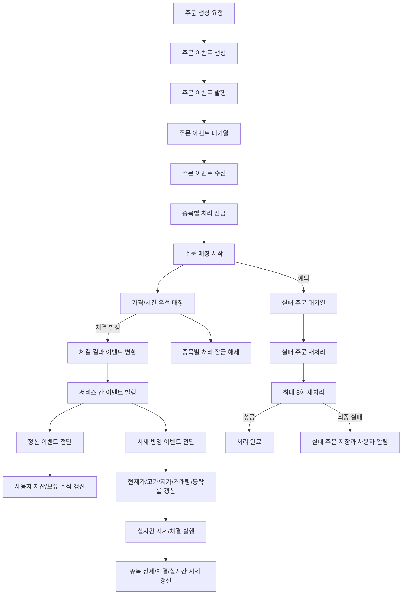

# Kafka 주문 처리 흐름

## 문서 포털

문서의 상세 구현, API, 아키텍처, 트러블슈팅은 아래 문서를 참고하세요.

| 분류 | 문서 | 분류 | 문서 |
| --- | --- | --- | --- |
| 루트 README | [README](../../../README.md) | 서비스 README | [README](../README.md) |
| Engineering Notes | [Engineering Notes](../../../docs/ENGINEERING.md) | Database Schema ERD | [Database Schema ERD](../../../docs/database-schema.md) |
| 00 | [주문 서비스 개요](00-order-service-overview.md) | 01 | [주문 API](01-order-api.md) |
| 02 | [Kafka 주문 흐름](02-kafka-order-flow.md) | 03 | [정산/체결 이벤트](03-settlement-and-trade-events.md) |
| 04 | [호가장](04-orderbook.md) | 05 | [매칭 엔진](05-matching-engine.md) |
| 06 | [Candle 차트 흐름](06-candle-chart-flow.md) | 07 | [실시간 발행 흐름](07-websocket-flow.md) |
| 08 | [Bot 거래 구조](08-bot-trading-flow.md) | 09 | [초기화/주기 작업](09-initialization-and-scheduler.md) |
| 10 | [order-service 이슈](10-order-service-issues.md) |  |  |

## 목차

> [개요](#개요) ·
> [주문 발행](#주문-발행) ·
> [주문 소비](#주문-소비) ·
> [체결 이후 이벤트 발행](#체결-이후-이벤트-발행) ·
> [실패 주문 재처리](#실패-주문-재처리)

> [Kafka 주문 처리 흐름도](#kafka-주문-처리-흐름도) ·
> [종목별 락](#종목별-락) ·
> [핵심 구현 파일](#핵심-구현-파일)

## 개요

주문 등록 및 체결은 REST API에서 바로 체결하지 않고 Kafka를 통해 비동기 처리된다.

- 주문 발행 토픽: `order-topic`
- 주문 실패 DLT 토픽: `order-topic.DLT`
- 정산 이벤트 토픽: `settlement-topic`
- 체결 이벤트 토픽: `trade-execution-topic`
- 일반 컨슈머 그룹: `stock-group`
- DLT 컨슈머 그룹: `stock-dlt-group`

order-service는 주문 매칭까지를 중심으로 처리하지만, 체결이 발생하면 결과를 다른 서비스로 전달한다. `settlement-topic`은 user-service의 자산/보유 주식 갱신으로 이어지고, `trade-execution-topic`은 stock-service의 현재가/거래량/체결 정보 갱신으로 이어진다. stock-service가 갱신한 실시간 시세는 WebSocket을 통해 Frontend 화면에 발행된다.

## 주문 발행

주문 생성 요청은 인증 사용자 ID를 주문 데이터에 포함한 뒤 종목 코드 기준으로 `order-topic`에 발행된다.
구현은 `OrderService.placeOrder()` (주문 생성 요청을 주문 이벤트로 변환하는 기능)와 `KafkaProducer.sendOrder()` (주문 이벤트 발행 기능)에서 담당한다.

## 주문 소비

주문 이벤트 수신 흐름은 `order-topic`을 소비한다. 주문 처리 전 종목별 락을 획득하고, 해당 종목의 주문 매칭을 시작한다.

처리 중 예외가 발생하면 해당 주문은 `order-topic.DLT`로 전달된다.

## 체결 이후 이벤트 발행

주문 매칭이 발생하면 체결 결과를 서비스 간 이벤트로 변환한다.

- `SettlementProducer.sendSettlement`: `SettlementEvent`를 `settlement-topic`으로 발행한다.
- `SettlementProducer.sendTradeExecutionStockService`: `TradeExecutionList`를 `trade-execution-topic`으로 발행한다.

`settlement-topic`은 user-service가 소비한다. user-service는 이 이벤트를 기준으로 사용자 자산과 보유 주식을 갱신한다. 매수자는 보유 수량이 증가하고, 매도자는 보유 수량이 감소하는 정산 흐름으로 이어진다.

`trade-execution-topic`은 stock-service가 소비한다. stock-service는 체결 목록을 받아 종목별 현재가, 고가, 저가, 누적 거래량, 등락률, 체결 정보를 갱신하고 실시간 시세 캐시와 WebSocket 발행 흐름으로 연결한다.

이 흐름의 최종 목적지는 Frontend의 실시간 화면이다. order-service가 체결을 만들고, stock-service가 시세 스냅샷을 갱신한 뒤 WebSocket으로 현재가와 체결 정보를 발행하면 Frontend는 이를 구독해 종목 상세, 체결 내역, 실시간 시세 영역을 갱신한다.

## 실패 주문 재처리

실패 주문 재처리 흐름은 DLT 주문을 최대 3회 재처리한다. 재처리에 계속 실패하면 실패 주문을 저장하고 사용자에게 실시간 에러 메시지를 보낸다.

## Kafka 주문 처리 흐름도

## 종목별 락

`StockLock`은 `ConcurrentHashMap<String, ReentrantLock>`으로 종목별 락을 관리한다. 같은 종목 주문은 순차 처리되도록 잠그지만, 서로 다른 종목은 별도 락으로 처리된다.

## 핵심 구현 파일

기준 경로

`StockBackEndDistributed/order-service/src/main/java/Poi/Stock/features`

| 파일 |
| --- |
| `kafka/KafkaProducer.java` |
| `kafka/KafkaConsumer.java` |
| `kafka/SettlementProducer.java` |
| `Lock/StockLock.java` |
| `Order/OrderService.java` |
| `Order/OrderTradeService.java` |
| `FailedOrder/FailedOrderService.java` |
| `FailedOrder/FailedOrder.java` |
| `../object/SettlementEvent.java` |
| `../object/TradeExecution.java` |
| `../object/TradeExecutionList.java` |

[문서 맨 위로](#top)

