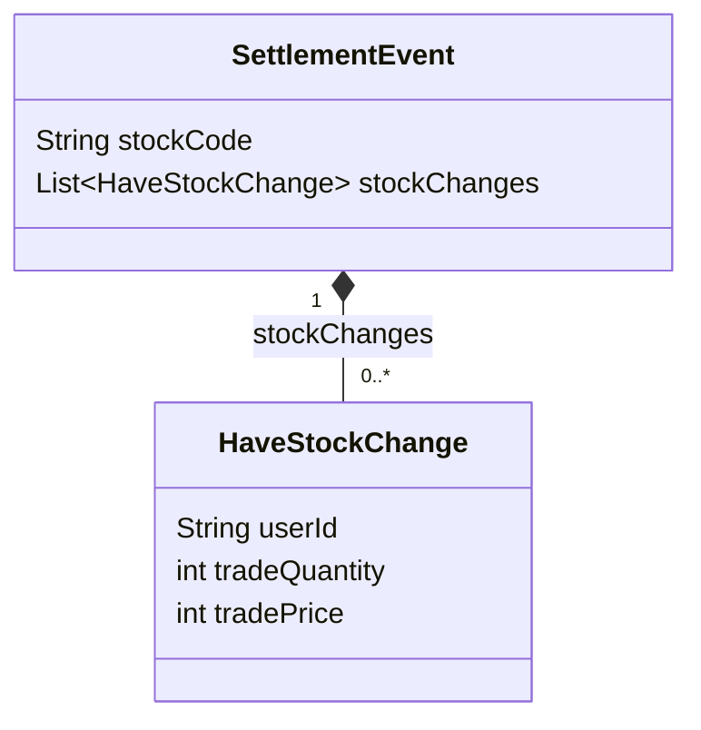
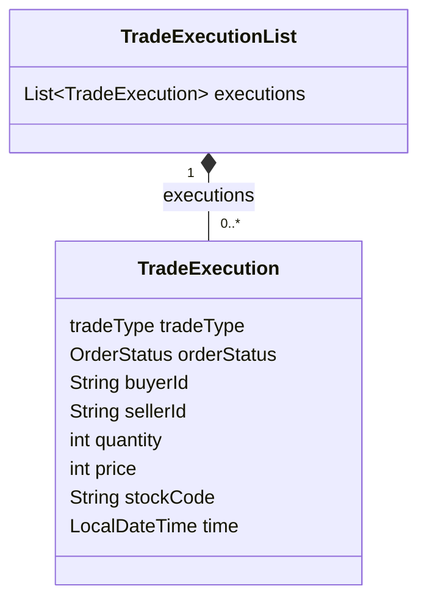
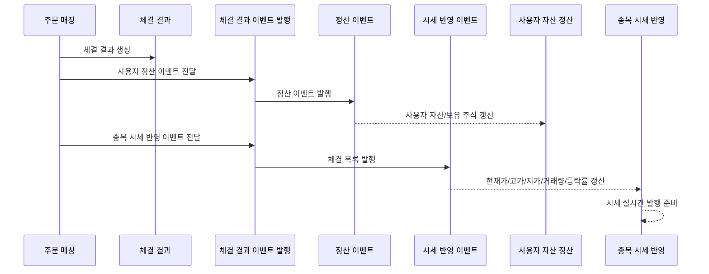
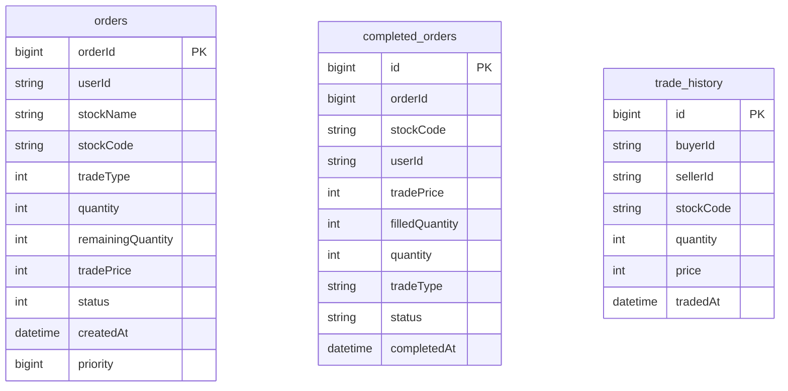

<a id="top"></a>

# 정산 및 체결 이벤트

## 문서 포털

문서의 상세 구현, API, 아키텍처, 트러블슈팅은 아래 문서를 참고합니다.

| 분류 | 문서 | 분류 | 문서 |
| --- | --- | --- | --- |
| 주식 README | [README](../../../README.md) | 주문 서비스 README | [README](../README.md) |
| 설계 노트 | [Engineering Notes](../../../docs/ENGINEERING.md) | 데이터베이스 ERD | [Database Schema ERD](../../../docs/database-schema.md) |
| 주문 서비스 개요 | [주문 서비스 개요](00-order-service-overview.md) | 주문 API | [주문 API](01-order-api.md) |
| Kafka 주문 흐름 | [Kafka 주문 흐름](02-kafka-order-flow.md) | 정산/체결 이벤트 | [정산/체결 이벤트](03-settlement-and-trade-events.md) |
| 호가장 | [호가장](04-orderbook.md) | 매칭 엔진 | [매칭 엔진](05-matching-engine.md) |
| Candle 차트 흐름 | [Candle 차트 흐름](06-candle-chart-flow.md) | 실시간 발행 흐름 | [실시간 발행 흐름](07-websocket-flow.md) |
| Bot 거래 구조 | [Bot 거래 구조](08-bot-trading-flow.md) | 초기화/주기 작업 | [초기화/주기 작업](09-initialization-and-scheduler.md) |
| 주문 서비스 이슈 | [order-service 이슈](10-order-service-issues.md) |  |  |

## 목차

> [개요](#개요) ·
> [체결 결과를 비동기로 전달하는 이유](#체결-결과를-비동기로-전달하는-이유) ·
> [사용자 서비스 정산 이벤트](#사용자-서비스-정산-이벤트) ·
> [SettlementEvent 데이터 구조](#settlementevent-데이터-구조) ·
> [종목 서비스 체결 이벤트](#종목-서비스-체결-이벤트) ·
> [TradeExecutionList 데이터 구조](#tradeexecutionlist-데이터-구조)

> [정산 이벤트 흐름](#정산-이벤트-흐름) ·
> [체결 이력 저장](#체결-이력-저장) ·
> [완료 주문 저장](#완료-주문-저장) ·
> [주문과 체결 데이터 구조](#주문과-체결-데이터-구조) ·
> [핵심 구현 파일](#핵심-구현-파일)

## 개요

주문 매칭이 발생하면 order-service는 체결 결과를 두 방향으로 발행합니다.

- user-service 금액 정산용 이벤트
- stock-service 체결 및 시세 반영 이벤트

이 처리는 `OrderTradeService.settlement`와 `SettlementProducer`에서 수행됩니다.

## 체결 결과를 비동기로 전달하는 이유

이 프로젝트는 MSA 구조로 `order-service`, `user-service`, `stock-service`가 분리되어 있다.<br> 
주문 체결은 order-service에서 발생하지만, 체결 결과는 사용자 자산 정산과 종목 시세 갱신에도 필요합니다. 따라서 체결 결과를 다른 서비스로 전달할 메시지 시스템이 필요합니다.

체결 결과는 사용자 자산과 종목 시세에 각각 반영되어야 합니다. 사용자 서비스에는 정산 이벤트를 전달하는 Kafka Topic(`settlement-topic`)을, 종목 서비스에는 시세 반영 이벤트를 전달하는 Kafka Topic(`trade-execution-topic`)을 사용합니다.

체결 이벤트는 자산과 시세를 갱신하는 기준 데이터입니다. 서비스 간 전달을 분리하고 재처리할 수 있도록 Kafka를 사용합니다.

## 사용자 서비스 정산 이벤트

체결 결과에서 사용자별 보유 주식 변화 정보를 만든 뒤 자산 정산 Topic(`settlement-topic`)으로 발행합니다.

`SettlementEvent`가 user-service로 전달되는 목적은 사용자 자산과 보유 주식 갱신입니다. 매수자는 보유 주식 수량이 증가하고, 매도자는 보유 주식 수량이 감소하는 변화가 `stockChanges`에 담깁니다.

Bot 사용자와 실제 사용자를 구분하는 로직이 있으며, 정산 이벤트에는 Bot 사용자를 제외합니다. 이 필터링은 `OrderTradeService.buildSettlementEvent`에서 수행됩니다.

### 동작 순서

1. 각 체결에서 실제 매수자와 매도자를 구분합니다.
2. 매수 수량은 양수, 매도 수량은 음수로 변환합니다.
3. Bot을 제외한 사용자 변화만 정산 이벤트에 포함합니다.

### 핵심 코드

```java
private SettlementEvent buildSettlementEvent(
        List<TradeExecution> executions, String stockCode) {
    List<haveStockChange> stockChanges = new ArrayList<>();
    for (TradeExecution ex : executions) {
        if (!isBot(ex.getBuyerId()))
            stockChanges.add(new haveStockChange(
                    ex.getBuyerId(), ex.getQuantity(), ex.getPrice()));
        if (!isBot(ex.getSellerId()))
            stockChanges.add(new haveStockChange(
                    ex.getSellerId(), -ex.getQuantity(), ex.getPrice()));
    }
    return new SettlementEvent(stockCode, stockChanges);
}
```

수량의 부호만으로 자산 변화를 적용하도록 정산 payload를 변환합니다. 체결 목록과 종목 코드를 입력받아 `settlement-topic`으로 전달합니다.

### 구현 위치

- 정산 이벤트 변환: `features/Order/OrderTradeService.java`의 `buildSettlementEvent()`

## SettlementEvent 데이터 구조

실제 코드 기준 `SettlementEvent`는 체결 하나의 모든 상세 정보를 그대로 담지 않고, user-service 정산에 필요한 주식 변화 정보를 전달합니다.

기준 파일

`object/SettlementEvent.java`



주식정보에 해당하는 체결 상세 정보는 `SettlementEvent`가 아니라 `TradeExecution`에 있습니다. order-service는 `TradeExecution` 목록을 기반으로 `SettlementEvent`를 만들고, stock-service에는 `TradeExecutionList`를 그대로 전달합니다.

## 종목 서비스 체결 이벤트

체결 목록은 종목 시세 반영 이벤트를 전달하는 Kafka Topic(`trade-execution-topic`)을 통해 종목 서비스로 전달합니다. 종목 서비스는 현재가, 고가, 저가, 거래량, 등락률을 갱신하고 사용자 화면에 실시간 시세를 발행합니다.

## TradeExecutionList 데이터 구조

`TradeExecutionList`는 `List<TradeExecution>`을 감싼 이벤트 객체입니다. <br>
order-service에서 발생한 체결 목록을 stock-service가 한 번에 처리할 수 있도록 전달합니다.

기준 파일

`object/TradeExecutionList.java`, `object/TradeExecution.java`



## 정산 이벤트 흐름



## 체결 이력 저장

체결이 발생하면 `TradeHistory`가 저장됩니다. 단, 매수자와 매도자가 모두 Bot인 체결은 이력 저장에서 제외됩니다.

### 동작 순서

1. 체결이 없으면 저장을 건너뜁니다.
2. 양쪽 모두 Bot인 체결을 제외합니다.
3. 남은 체결을 이력 엔티티로 변환해 일괄 저장합니다.

### 핵심 코드

```java
public void saveTradeHistories(List<TradeExecution> executions) {
    if (executions.isEmpty()) return;
    List<TradeHistory> histories = executions.stream()
            .filter(ex -> !(isBot(ex.getBuyerId()) && isBot(ex.getSellerId())))
            .map(TradeHistory::from)
            .toList();
    if (!histories.isEmpty()) {
        tradeHistoryRepository.saveAll(histories);
    }
}
```

생성용 Bot끼리의 체결은 분리합니다. 체결 목록을 입력받아 실제 사용자가 포함된 거래만 변환하며, 결과는 체결 이력 조회 데이터로 남습니다.

### 구현 위치

- 체결 이력 저장: `features/Order/OrderTradeService.java`의 `saveTradeHistories()`

## 완료 주문 저장

체결 완료된 실제 사용자 주문은 `CompletedOrder`에 저장됩니다. 완료된 원 주문은 `orders` 테이블에서 삭제됩니다. 부분 체결 주문은 남은 수량과 상태가 갱신되어 저장됩니다.

### 동작 순서

1. 완료된 대기 주문을 완료 주문 엔티티로 변환합니다.
2. 원본 미체결 주문을 제거합니다.
3. 부분 체결 주문은 변경된 잔여 수량으로 다시 저장합니다.

### 핵심 코드

```java
if (!result.getPartialResting().isEmpty()) {
    List<Order> partialUserOrders = result.getPartialResting().stream()
            .filter(o -> !isBot(o.getUserId())).toList();
    if (!partialUserOrders.isEmpty()) {
        orderRepository.saveAll(partialUserOrders);
    }
}
if (!incomingIsBot) {
    if (result.getIncomingOrder().isCompleted()) {
        completedOrderRepository.save(
                CompletedOrder.setCompletedOrder(result.getIncomingOrder()));
        orderRepository.delete(result.getIncomingOrder());
    } else {
        orderRepository.save(result.getIncomingOrder());
    }
}
```

완료 주문과 활성 주문을 같은 테이블에 계속 유지하지 않도록 상태별 저장 위치를 분리합니다. 매칭 결과를 입력받아 완료 주문은 이력 테이블로 옮기고, 남은 주문은 갱신된 잔여 수량으로 활성 주문 저장소에 반영합니다.

### 구현 위치

- 주문 상태별 저장: `features/Order/OrderTradeService.java`의 `saveOrders()`

## 주문과 체결 데이터 구조



대기·부분 체결 주문은 `orders`에 남고, 완료·취소된 사용자 주문은 `completed_orders`로 이동합니다. `orders`의 enum 필드는 별도 `Enumerated` 선언이 없어 기본 ordinal 값으로, 완료 주문의 enum 필드는 문자열로 저장합니다. `completed_orders.orderId`와 체결 이력의 사용자 ID는 원본을 추적하기 위한 값이며 실제 FK나 JPA 연관관계로 선언되어 있지 않습니다.

### 테이블 비교

| 테이블 | PK | 저장 시점 | 주요 용도 | 코드 선언 인덱스 |
| --- | --- | --- | --- | --- |
| `orders` | 자동 증가 `orderId` | 주문 접수 후 완료 전 | 매칭 대기와 잔여 수량 관리 | 없음 |
| `completed_orders` | 자동 증가 `id` | 주문 완료 또는 취소 | 사용자 완료 주문 조회 | 없음 |
| `trade_history` | 자동 증가 `id` | 체결 발생 | 매수·매도 체결 이력 보관 | 없음 |

### 구현 위치

- 진행 주문 엔티티: `features/Order/Order.java`
- 완료 주문 엔티티: `features/CompletedOrder/CompletedOrder.java`
- 체결 이력 엔티티: `features/TradeHistory/TradeHistory.java`

## 핵심 구현 파일

기준 경로

`StockBackEndDistributed/order-service/src/main/java/Poi/Stock`

| 파일 |
| --- |
| `features/Order/OrderTradeService.java` |
| `features/kafka/SettlementProducer.java` |
| `object/SettlementEvent.java` |
| `object/TradeExecution.java` |
| `object/TradeExecutionList.java` |
| `features/TradeHistory/TradeHistory.java` |
| `features/CompletedOrder/CompletedOrder.java` |

<div align="right">

[문서 맨 위로](#top)

</div>
