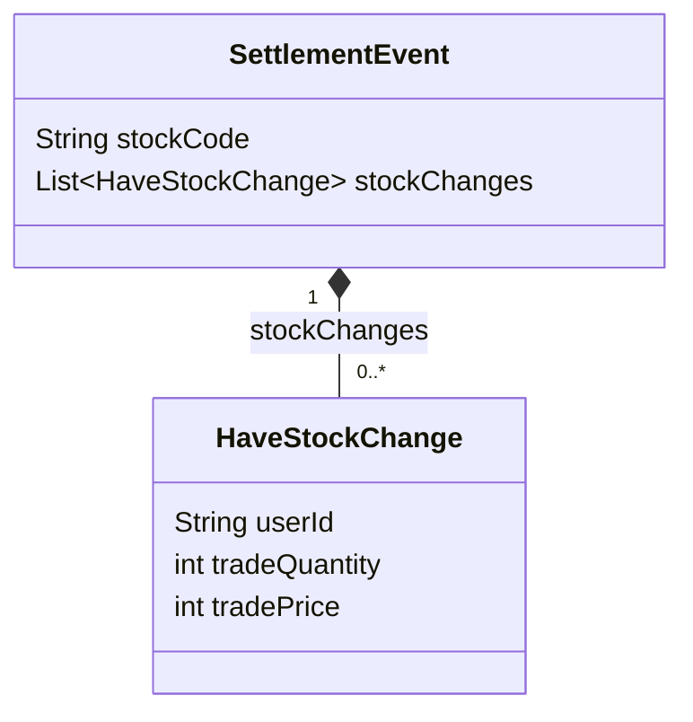
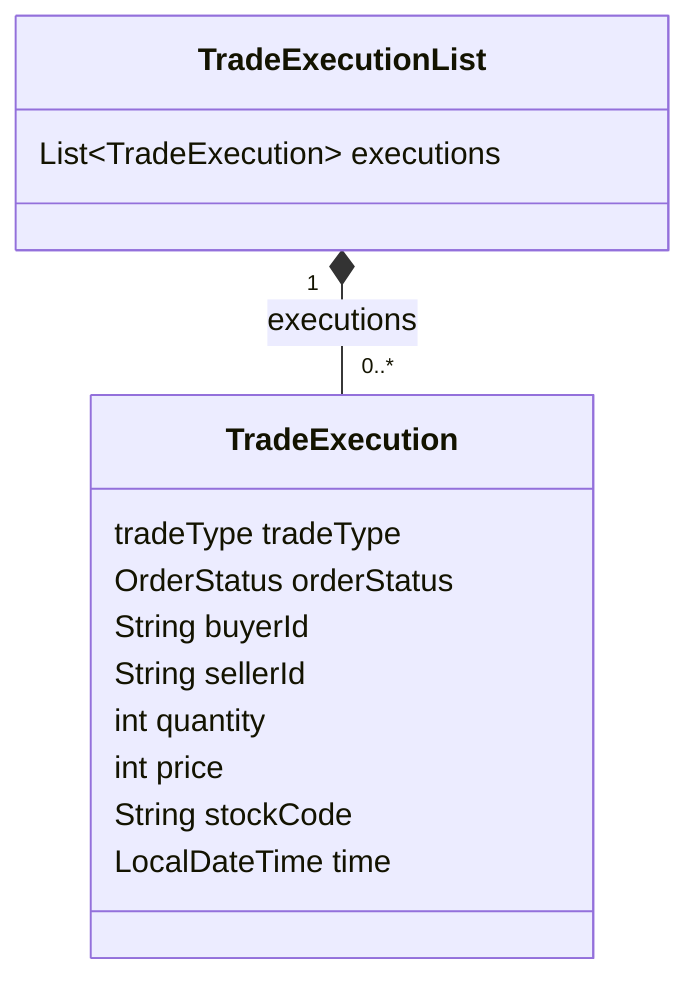
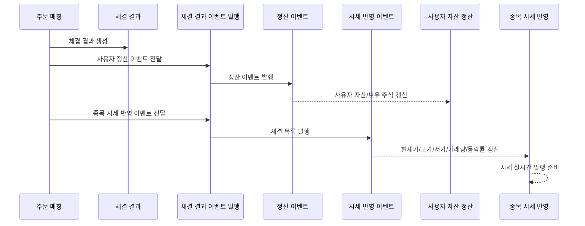

# 정산 및 체결 이벤트

## 문서 포털

문서의 상세 구현, API, 아키텍처, 트러블슈팅은 아래 문서를 참고하세요.

| 분류 | 문서 | 분류 | 문서 |
| --- | --- | --- | --- |
| 루트 README | [README](../../../README.md) | 서비스 README | [README](../README.md) |
| Engineering Notes | [Engineering Notes](../../../docs/ENGINEERING.md) | Database Schema ERD | [Database Schema ERD](../../../docs/database-schema.md) |
| 00 | [주문 서비스 개요](00-order-service-overview.md) | 01 | [주문 API](01-order-api.md) |
| 02 | [Kafka 주문 흐름](02-kafka-order-flow.md) | 03 | [정산/체결 이벤트](03-settlement-and-trade-events.md) |
| 04 | [호가장](04-orderbook.md) | 05 | [매칭 엔진](05-matching-engine.md) |
| 06 | [Candle 차트 흐름](06-candle-chart-flow.md) | 07 | [실시간 발행 흐름](07-websocket-flow.md) |
| 08 | [Bot 거래 구조](08-bot-trading-flow.md) | 09 | [초기화/주기 작업](09-initialization-and-scheduler.md) |
| 10 | [order-service 이슈](10-order-service-issues.md) |  |  |

## 목차

> [개요](#개요) ·
> [Kafka를 사용하는 이유](#kafka를-사용하는-이유) ·
> [사용자 서비스 정산 이벤트](#사용자-서비스-정산-이벤트) ·
> [SettlementEvent 데이터 구조](#settlementevent-데이터-구조) ·
> [종목 서비스 체결 이벤트](#종목-서비스-체결-이벤트) ·
> [TradeExecutionList 데이터 구조](#tradeexecutionlist-데이터-구조)

> [정산 이벤트 흐름](#정산-이벤트-흐름) ·
> [체결 이력 저장](#체결-이력-저장) ·
> [완료 주문 저장](#완료-주문-저장) ·
> [핵심 구현 파일](#핵심-구현-파일)

## 개요

주문 매칭이 발생하면 order-service는 체결 결과를 두 방향으로 발행한다.

- user-service 금액 정산용 이벤트
- stock-service 체결 및 시세 반영 이벤트

이 처리는 `OrderTradeService.settlement`와 `SettlementProducer`에서 수행된다.

## Kafka를 사용하는 이유

이 프로젝트는 MSA 구조로 `order-service`, `user-service`, `stock-service`가 분리되어 있다.  
주문 체결은 order-service에서 발생하지만, 체결 결과는 사용자 자산 정산과 종목 시세 갱신에도 필요하다. 따라서 체결 결과를 다른 서비스로 전달할 메시지 시스템이 필요하다.

order-service는 체결 이후 `SettlementProducer`를 통해 `settlement-topic`과 `trade-execution-topic`으로 이벤트를 발행한다. user-service는 `settlement-topic`을 소비해 사용자 자산과 보유 주식을 정산하고, stock-service는 `trade-execution-topic`을 소비해 현재가, 거래량, 등락률 등 시세 정보를 갱신한다.

체결 이벤트는 자산과 시세를 갱신하는 기준 데이터다. 이벤트가 유실되면 주문은 체결되었지만 사용자 자산 또는 종목 시세가 반영되지 않는 서비스 간 데이터 불일치가 발생할 수 있다. 이러한 이유로 Kafka를 사용해 체결 이벤트를 안정적으로 전달하도록 설계했다.

## 사용자 서비스 정산 이벤트

체결 결과에서 사용자별 보유 주식 변화 정보를 만든 뒤 `settlement-topic`으로 발행한다.

`SettlementEvent`가 user-service로 전달되는 목적은 사용자 자산과 보유 주식 갱신이다. 매수자는 보유 주식 수량이 증가하고, 매도자는 보유 주식 수량이 감소하는 변화가 `stockChanges`에 담긴다.

Bot 사용자와 실제 사용자를 구분하는 로직이 있으며, 정산 이벤트에는 Bot 사용자를 제외한다. 이 필터링은 `OrderTradeService.buildSettlementEvent`에서 수행된다.

## SettlementEvent 데이터 구조

실제 코드 기준 `SettlementEvent`는 체결 하나의 모든 상세 정보를 그대로 담지 않고, user-service 정산에 필요한 주식 변화 정보를 전달한다.

기준 파일

`object/SettlementEvent.java`

주식정보에 해당하는 체결 상세 정보는 `SettlementEvent`가 아니라 `TradeExecution`에 있다. order-service는 `TradeExecution` 목록을 기반으로 `SettlementEvent`를 만들고, stock-service에는 `TradeExecutionList`를 그대로 전달한다.

## 종목 서비스 체결 이벤트

체결 목록은 `TradeExecutionList`로 감싸 `stock-service`로  `trade-execution-topic`을 발행한다. 이 이벤트를 이용해 현재가, 고가, 저가, 거래량, 등락률과 체결 정보를 갱신하고 WebSocket으로 실시간 시세를 발행한다.

## TradeExecutionList 데이터 구조

`TradeExecutionList`는 `List<TradeExecution>`을 감싼 이벤트 객체다.  
order-service에서 발생한 체결 목록을 stock-service가 한 번에 처리할 수 있도록 전달한다.

기준 파일

`object/TradeExecutionList.java`, `object/TradeExecution.java`

## 정산 이벤트 흐름

## 체결 이력 저장

체결이 발생하면 `TradeHistory`가 저장된다. 단, 매수자와 매도자가 모두 Bot인 체결은 이력 저장에서 제외된다.

## 완료 주문 저장

체결 완료된 실제 사용자 주문은 `CompletedOrder`에 저장된다. 완료된 원 주문은 `orders` 테이블에서 삭제된다. 부분 체결 주문은 남은 수량과 상태가 갱신되어 저장된다.

## 핵심 구현 파일

기준 경로

`StockBackEndDistributed/order-service/src/main/java/Poi/Stock`

| 파일 |
| --- |
| `features/Order/OrderTradeService.java` |
| `features/kafka/SettlementProducer.java` |
| `object/SettlementEvent.java` |
| `object/TradeExecution.java` |
| `object/TradeExecutionList.java` |
| `features/TradeHistory/TradeHistory.java` |
| `features/CompletedOrder/CompletedOrder.java` |

[문서 맨 위로](#top)

