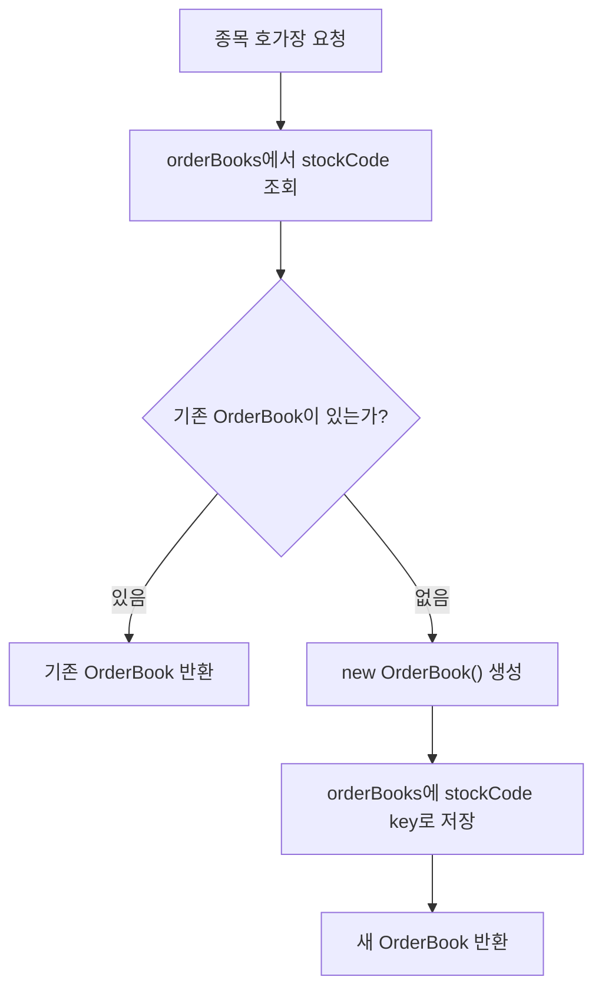
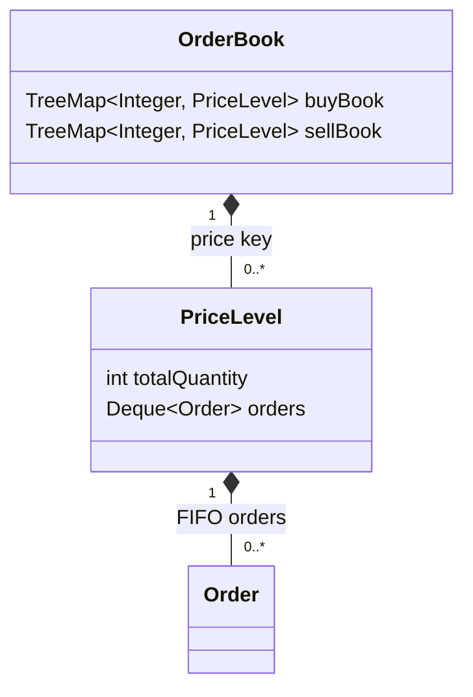
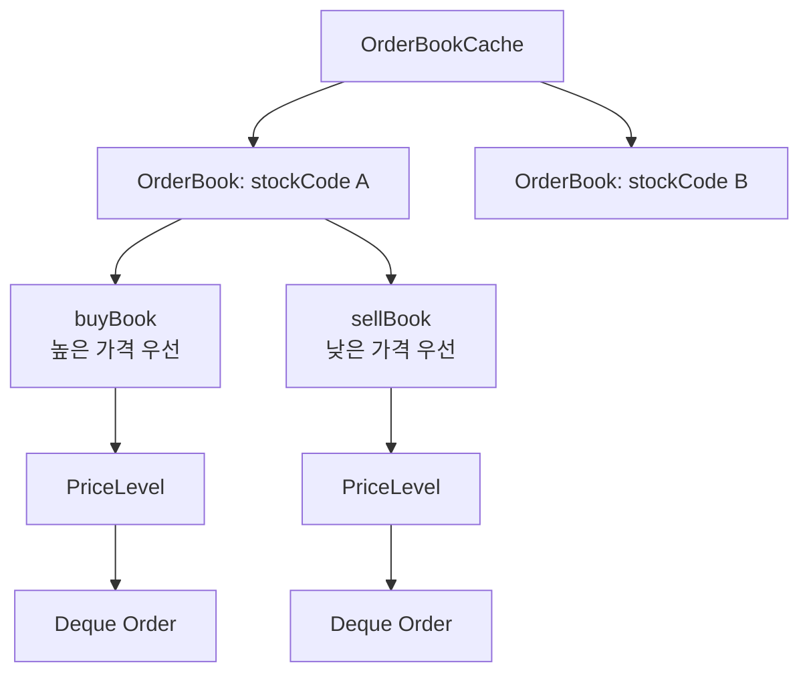

<a id="top"></a>

# 호가장 구조

## 문서 포털

문서의 상세 구현, API, 아키텍처, 트러블슈팅은 아래 문서를 참고합니다.

| 분류 | 문서 | 분류 | 문서 |
| --- | --- | --- | --- |
| 주식 README | [README](../../../README.md) | 주문 서비스 README | [README](../README.md) |
| 설계 노트 | [Engineering Notes](../../../docs/ENGINEERING.md) | 데이터베이스 ERD | [Database Schema ERD](../../../docs/database-schema.md) |
| 주문 서비스 개요 | [주문 서비스 개요](00-order-service-overview.md) | 주문 API | [주문 API](01-order-api.md) |
| Kafka 주문 흐름 | [Kafka 주문 흐름](02-kafka-order-flow.md) | 정산/체결 이벤트 | [정산/체결 이벤트](03-settlement-and-trade-events.md) |
| 호가장 | [호가장](04-orderbook.md) | 매칭 엔진 | [매칭 엔진](05-matching-engine.md) |
| Candle 차트 흐름 | [Candle 차트 흐름](06-candle-chart-flow.md) | 실시간 발행 흐름 | [실시간 발행 흐름](07-websocket-flow.md) |
| Bot 거래 구조 | [Bot 거래 구조](08-bot-trading-flow.md) | 초기화/주기 작업 | [초기화/주기 작업](09-initialization-and-scheduler.md) |
| 주문 서비스 이슈 | [order-service 이슈](10-order-service-issues.md) |  |  |

## 목차

> [개요](#개요) ·
> [호가장 캐시](#호가장-캐시) ·
> [호가장](#호가장) ·
> [PriceLevel](#pricelevel)

> [호가장 조회](#호가장-조회) ·
> [서버 시작 시 호가장 복구](#서버-시작-시-호가장-복구) ·
> [호가장 구조 흐름도](#호가장-구조-흐름도) ·
> [핵심 구현 파일](#핵심-구현-파일)

## 개요

order-service는 종목별 메모리 호가장을 사용합니다. 호가장은 `OrderBookCache`에 저장되며, 각 종목 코드를 key로 `OrderBook`을 관리합니다.

## 호가장 캐시

`OrderBookCache`는 `ConcurrentHashMap<String, OrderBook>` 기반입니다. 종목별 호가장이 없으면 `computeIfAbsent` 방식으로 새 호가장을 생성합니다.

`computeIfAbsent`는 Map에서 값을 찾을 때 사용하는 방식입니다. 지정한 key가 이미 있으면 기존 객체를 반환하고, 없으면 새 객체를 만들어 Map에 저장한 뒤 반환합니다. order-service에서는 이 방식을 사용해 종목별 `OrderBook`을 필요할 때 생성합니다.

여기서 `String`은 종목 코드인 `stockCode`를 의미합니다. 예를 들어 삼성전자, 현대차처럼 서로 다른 종목은 서로 다른 `stockCode`를 key로 사용합니다. `OrderBook`은 해당 종목 하나의 호가장을 관리하는 객체이며, 내부에서 매수 호가와 매도 호가를 분리해 보관합니다.

### 동작 순서

1. 종목 코드로 호가장을 조회합니다.
2. 존재하지 않으면 빈 호가장을 원자적으로 생성합니다.
3. 이후 주문 처리에서 동일한 객체를 공유합니다.

### 핵심 코드

```java
private final Map<String, OrderBook> orderBooks = new ConcurrentHashMap<>();

public OrderBook get(String stockCode) {
    return orderBooks.computeIfAbsent(stockCode, s -> new OrderBook());
}

public void put(String stockCode, OrderBook orderBook) {
    orderBooks.put(stockCode, orderBook);
}

public void remove(String stockCode) {
    orderBooks.remove(stockCode);
}
```

종목마다 독립된 호가장을 유지하면서 같은 객체를 사용하도록 만든 캐시입니다. 종목 코드를 입력받아 기존 호가장을 반환하거나 한 번만 생성하며, 결과는 매칭과 호가 조회의 공통 상태가 됩니다.

### 구현 위치

- 종목별 호가장 캐시: `features/Order/OrderBookCache.java`


조회 흐름:



## 호가장

`OrderBook`은 매수와 매도 호가를 분리해서 관리합니다.

- 매수 호가: 높은 가격 우선 정렬
- 매도 호가: 낮은 가격 우선 정렬

각 가격대는 `PriceLevel`로 관리하며, 같은 가격에서는 주문이 들어온 순서대로 처리됩니다.

### 동작 순서

1. 주문 방향에 따라 매수 또는 매도 `TreeMap`을 선택합니다.
2. 주문 가격의 `PriceLevel`을 조회하거나 생성합니다.
3. 같은 가격대의 큐 뒤에 주문을 추가합니다.

### 핵심 코드

```java
public void addOrder(Order order) {
    TreeMap<Integer, PriceLevel> book = order.getTradeType() == tradeType.BUY
            ? buyBook : sellBook;
    PriceLevel level = book.computeIfAbsent(
            order.getTradePrice(), p -> new PriceLevel());
    level.addOrder(order);
}
```

매수와 매도의 가격 우선순위를 서로 다른 정렬 Map으로 표현해 매칭 때 최우선 가격을 바로 찾도록 합니다. 주문을 입력받아 가격대별 큐에 추가하며, 해당 호가의 누적 수량도 함께 갱신됩니다.

### 구현 위치

- 주문의 호가장 등록: `features/Order/OrderBook.java`의 `addOrder()`

## PriceLevel

`PriceLevel`은 하나의 가격에 등록된 주문들을 관리하는 객체입니다. 예를 들어 70,000원 매수 주문이 여러 개 들어오면, 그 주문들은 하나의 `PriceLevel` 안에서 같은 가격대 주문 목록으로 관리됩니다.

실제 코드에서 `PriceLevel`은 `price` 필드를 직접 들고 있지 않습니다. 가격은 `OrderBook`의 `TreeMap<Integer, PriceLevel>`에서 key로 관리됩니다. 즉, `TreeMap`의 `Integer` key가 가격이고, 그 key에 연결된 값이 해당 가격의 `PriceLevel`입니다.

`PriceLevel`이 관리하는 데이터는 다음과 같습니다.

| 데이터 | 설명 |
| --- | --- |
| `price` | `PriceLevel` 내부 필드는 아니며, `OrderBook`의 `TreeMap<Integer, PriceLevel>` key로 관리되는 가격 |
| `totalQuantity` | 해당 가격대에 남아 있는 전체 주문 수량 |
| `Deque<Order>` | 같은 가격에 등록된 주문 목록 |

같은 가격의 주문은 하나의 `PriceLevel`에 들어갑니다. `PriceLevel.addOrder`는 새 주문을 `Deque`의 뒤에 추가하고, 매칭은 앞의 주문부터 확인합니다. 이 구조 때문에 같은 가격 안에서는 먼저 들어온 주문이 먼저 처리되는 FIFO 순서가 유지됩니다.

### 동작 순서

1. 새 주문을 가격대 큐의 뒤에 추가합니다.
2. 잔여 수량을 가격대 총수량에 더합니다.
3. 매칭은 큐 앞의 주문부터 선택합니다.

### 핵심 코드

```java
public void addOrder(Order order) {
    orders.addLast(order);
    totalQuantity += order.getRemainingQuantity();
}

public Order peek() {
    return orders.peekFirst();
}

public void removeTopOrder() {
    orders.pollFirst();
}
```

동일 가격에서는 가격 비교로 우선순위를 나눌 수 없으므로 `Deque`의 삽입 순서로 시간 우선 원칙을 보장합니다. 주문을 입력받아 뒤에 적재하고 매칭에서는 앞의 주문을 반환해 FIFO 체결 순서를 유지합니다.

### 구현 위치

- 가격대 FIFO 관리: `features/Order/PriceLevel.java`



## 호가장 조회

종목별 상위 매도·매수 가격대를 조회하기 위해 호가장 REST API(`GET /order/orderbook/{stockCode}`)를 호출합니다.

반환 구조는 다음 두 목록을 포함합니다.

- `sellOrders`
- `buyOrders`

### 동작 순서

1. 종목별 호가장을 조회합니다.
2. 매도·매수 Map에서 각각 상위 5개 가격대를 선택합니다.
3. 가격과 누적 수량을 호가 DTO로 반환합니다.

### 핵심 코드

```java
private List<HogaDTO> getTopOrders(NavigableMap<Integer, PriceLevel> book) {
    return book.entrySet().stream()
            .limit(5)
            .map(e -> new HogaDTO(
                    e.getKey(), e.getValue().getTotalQuantity()))
            .toList();
}
```

화면에 필요한 최우선 가격대만 제공하기 위한 조회 로직입니다. 정렬된 호가 Map을 입력받아 상위 5개 가격과 합산 수량만 반환합니다.

### 구현 위치

- 상위 호가 변환: `features/Order/OrderService.java`의 `getTopOrders()`

## 서버 시작 시 호가장 복구

`OrderInit`은 서버 시작 시 DB에서 `PENDING`, `PARTIAL` 상태 주문을 조회해 메모리 호가장에 다시 적재합니다.

### 동작 순서

1. 담당 종목별 활성 매도·매수 주문을 우선순위 순으로 조회합니다.
2. 새 호가장에 조회 순서대로 주문을 적재합니다.
3. 복구한 호가장을 종목별 캐시에 저장합니다.

### 핵심 코드

```java
List<OrderStatus> activeStatuses =
        List.of(OrderStatus.PENDING, OrderStatus.PARTIAL);
for (String stockCode : assignedCodeHolder.getAssignedCodes()) {
    List<Order> sellOrders = orderRepository
            .findByStockCodeAndTradeTypeAndStatusInOrderByTradePriceAscPriorityAsc(
                    stockCode, tradeType.SELL, activeStatuses);
    List<Order> buyOrders = orderRepository
            .findByStockCodeAndTradeTypeAndStatusInOrderByTradePriceDescPriorityAsc(
                    stockCode, tradeType.BUY, activeStatuses);
    OrderBook orderBook = new OrderBook();
    sellOrders.forEach(orderBook::addOrder);
    buyOrders.forEach(orderBook::addOrder);
    orderBookCache.put(stockCode, orderBook);
}
```

서비스 재시작으로 메모리 호가장이 비어도 DB의 활성 주문 우선순위를 그대로 복원하기 위한 초기화 로직입니다. 재구성한 호가장을 캐시에 반영합니다.

### 구현 위치

- 활성 주문 복구: `init/OrderInit.java`의 `init()`

## 호가장 구조 흐름도



## 핵심 구현 파일

기준 경로

`StockBackEndDistributed/order-service/src/main/java/Poi/Stock`

| 파일 |
| --- |
| `features/Order/OrderBookCache.java` |
| `features/Order/OrderBook.java` |
| `features/Order/PriceLevel.java` |
| `features/Order/Order.java` |
| `init/OrderInit.java` |
| `repository/OrderRepository.java` |

<div align="right">

[문서 맨 위로](#top)

</div>


