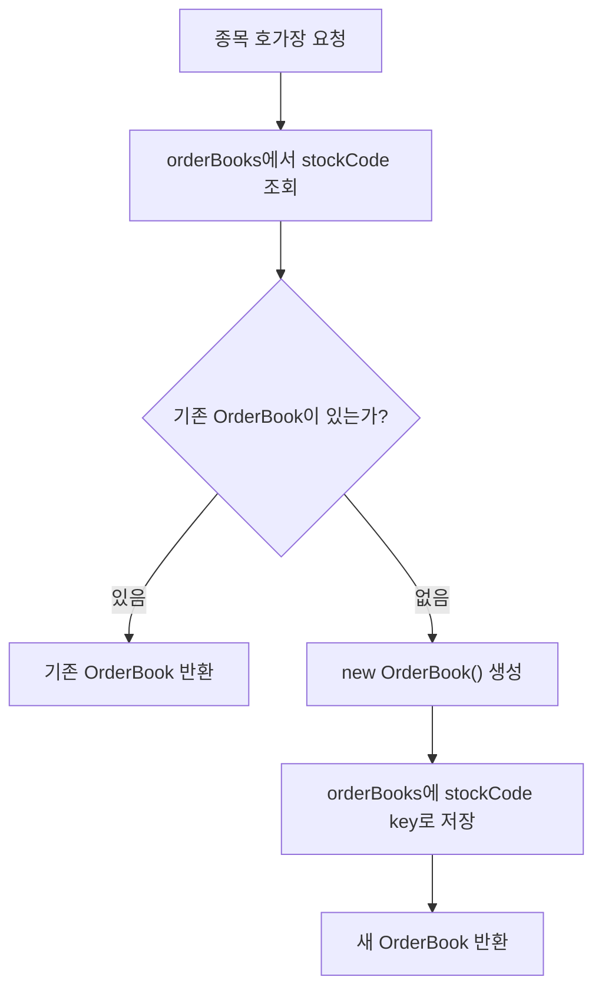
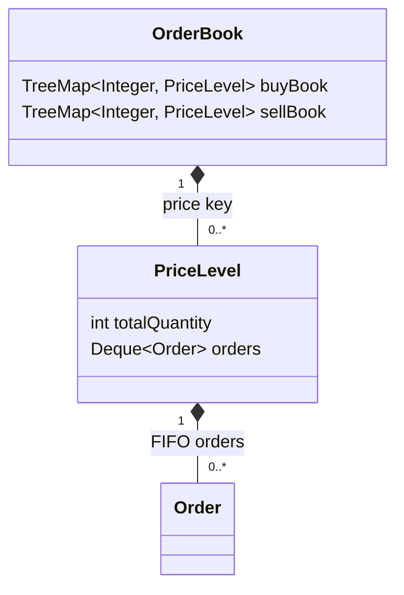
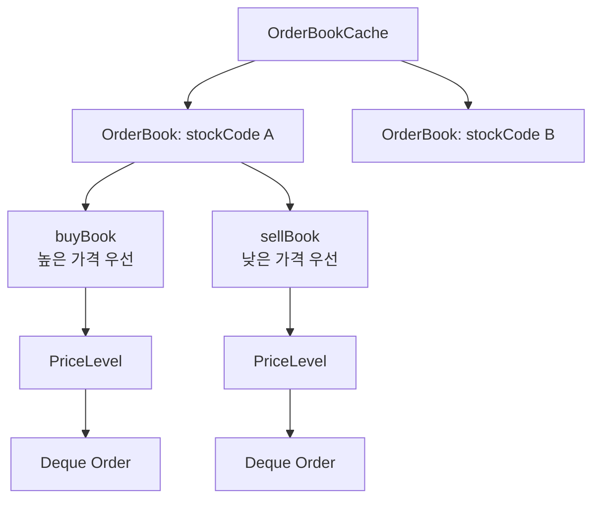

# 호가장 구조

## 문서 포털

문서의 상세 구현, API, 아키텍처, 트러블슈팅은 아래 문서를 참고하세요.

| 분류 | 문서 | 분류 | 문서 |
| --- | --- | --- | --- |
| 루트 README | [README](../../../README.md) | 서비스 README | [README](../README.md) |
| Engineering Notes | [Engineering Notes](../../../docs/ENGINEERING.md) | Database Schema ERD | [Database Schema ERD](../../../docs/database-schema.md) |
| 00 | [주문 서비스 개요](00-order-service-overview.md) | 01 | [주문 API](01-order-api.md) |
| 02 | [Kafka 주문 흐름](02-kafka-order-flow.md) | 03 | [정산/체결 이벤트](03-settlement-and-trade-events.md) |
| 04 | [호가장](04-orderbook.md) | 05 | [매칭 엔진](05-matching-engine.md) |
| 06 | [Candle 차트 흐름](06-candle-chart-flow.md) | 07 | [실시간 발행 흐름](07-websocket-flow.md) |
| 08 | [Bot 거래 구조](08-bot-trading-flow.md) | 09 | [초기화/주기 작업](09-initialization-and-scheduler.md) |
| 10 | [order-service 이슈](10-order-service-issues.md) |  |  |

## 목차

> [개요](#개요) ·
> [호가장 캐시](#호가장-캐시) ·
> [호가장](#호가장) ·
> [PriceLevel](#pricelevel)

> [호가장 조회](#호가장-조회) ·
> [서버 시작 시 호가장 복구](#서버-시작-시-호가장-복구) ·
> [호가장 구조 흐름도](#호가장-구조-흐름도) ·
> [핵심 구현 파일](#핵심-구현-파일)

## 개요

order-service는 종목별 메모리 호가장을 사용한다. 호가장은 `OrderBookCache`에 저장되며, 각 종목 코드를 key로 `OrderBook`을 관리한다.

## 호가장 캐시

`OrderBookCache`는 `ConcurrentHashMap<String, OrderBook>` 기반이다. 종목별 호가장이 없으면 `computeIfAbsent` 방식으로 새 호가장을 생성한다.

`computeIfAbsent`는 Map에서 값을 찾을 때 사용하는 방식이다. 지정한 key가 이미 있으면 기존 객체를 반환하고, 없으면 새 객체를 만들어 Map에 저장한 뒤 반환한다. order-service에서는 이 방식을 사용해 종목별 `OrderBook`을 필요할 때 생성한다.

여기서 `String`은 종목 코드인 `stockCode`를 의미한다. 예를 들어 삼성전자, 현대차처럼 서로 다른 종목은 서로 다른 `stockCode`를 key로 사용한다. `OrderBook`은 해당 종목 하나의 호가장을 관리하는 객체이며, 내부에서 매수 호가와 매도 호가를 분리해 보관한다.

조회 흐름:

## 호가장

`OrderBook`은 매수와 매도 호가를 분리해서 관리한다.

- 매수 호가: 높은 가격 우선 정렬
- 매도 호가: 낮은 가격 우선 정렬

각 가격대는 `PriceLevel`로 관리하며, 같은 가격에서는 주문이 들어온 순서대로 처리된다.

## PriceLevel

`PriceLevel`은 하나의 가격에 등록된 주문들을 관리하는 객체다. 예를 들어 70,000원 매수 주문이 여러 개 들어오면, 그 주문들은 하나의 `PriceLevel` 안에서 같은 가격대 주문 목록으로 관리된다.

실제 코드에서 `PriceLevel`은 `price` 필드를 직접 들고 있지 않다. 가격은 `OrderBook`의 `TreeMap<Integer, PriceLevel>`에서 key로 관리된다. 즉, `TreeMap`의 `Integer` key가 가격이고, 그 key에 연결된 값이 해당 가격의 `PriceLevel`이다.

`PriceLevel`이 관리하는 데이터는 다음과 같다.

| 데이터 | 설명 |
| --- | --- |
| `price` | `PriceLevel` 내부 필드는 아니며, `OrderBook`의 `TreeMap<Integer, PriceLevel>` key로 관리되는 가격 |
| `totalQuantity` | 해당 가격대에 남아 있는 전체 주문 수량 |
| `Deque<Order>` | 같은 가격에 등록된 주문 목록 |

같은 가격의 주문은 하나의 `PriceLevel`에 들어간다. `PriceLevel.addOrder`는 새 주문을 `Deque`의 뒤에 추가하고, 매칭은 앞의 주문부터 확인한다. 이 구조 때문에 같은 가격 안에서는 먼저 들어온 주문이 먼저 처리되는 FIFO 순서가 유지된다.

## 호가장 조회

`GET /order/orderbook/{stockCode}`는 메모리 호가장에서 매도/매수 상위 n개 가격대를 조회한다.

반환 구조는 다음 두 목록을 포함한다.

- `sellOrders`
- `buyOrders`

## 서버 시작 시 호가장 복구

`OrderInit`은 서버 시작 시 DB에서 `PENDING`, `PARTIAL` 상태 주문을 조회해 메모리 호가장에 다시 적재한다.

## 호가장 구조 흐름도

## 핵심 구현 파일

기준 경로

`StockBackEndDistributed/order-service/src/main/java/Poi/Stock`

| 파일 |
| --- |
| `features/Order/OrderBookCache.java` |
| `features/Order/OrderBook.java` |
| `features/Order/PriceLevel.java` |
| `features/Order/Order.java` |
| `init/OrderInit.java` |
| `repository/OrderRepository.java` |

[문서 맨 위로](#top)

