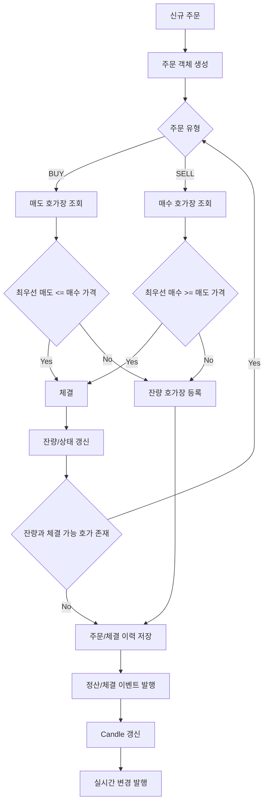

<a id="top"></a>

# 주문 매칭 엔진

## 문서 포털

문서의 상세 구현, API, 아키텍처, 트러블슈팅은 아래 문서를 참고합니다.

| 분류 | 문서 | 분류 | 문서 |
| --- | --- | --- | --- |
| 주식 README | [README](../../../README.md) | 주문 서비스 README | [README](../README.md) |
| 설계 노트 | [Engineering Notes](../../../docs/ENGINEERING.md) | 데이터베이스 ERD | [Database Schema ERD](../../../docs/database-schema.md) |
| 주문 서비스 개요 | [주문 서비스 개요](00-order-service-overview.md) | 주문 API | [주문 API](01-order-api.md) |
| Kafka 주문 흐름 | [Kafka 주문 흐름](02-kafka-order-flow.md) | 정산/체결 이벤트 | [정산/체결 이벤트](03-settlement-and-trade-events.md) |
| 호가장 | [호가장](04-orderbook.md) | 매칭 엔진 | [매칭 엔진](05-matching-engine.md) |
| Candle 차트 흐름 | [Candle 차트 흐름](06-candle-chart-flow.md) | 실시간 발행 흐름 | [실시간 발행 흐름](07-websocket-flow.md) |
| Bot 거래 구조 | [Bot 거래 구조](08-bot-trading-flow.md) | 초기화/주기 작업 | [초기화/주기 작업](09-initialization-and-scheduler.md) |
| 주문 서비스 이슈 | [order-service 이슈](10-order-service-issues.md) |  |  |

## 목차

> [개요](#개요) ·
> [매칭 기준](#매칭-기준) ·
> [체결 가격](#체결-가격) ·
> [체결 결과](#체결-결과)

> [주문 상태 변화](#주문-상태-변화) ·
> [주문 매칭 흐름](#주문-매칭-흐름) ·
> [후속 처리](#후속-처리) ·
> [핵심 구현 파일](#핵심-구현-파일)

## 개요

신규 주문은 반대편 호가와 비교하며 체결 조건을 만족하는 동안 반복해서 매칭합니다. 가격과 접수 시간에 따라 우선순위를 결정합니다.

### 구현 위치

- 반복 매칭: `features/Order/OrderTradeService.java`의 `matchLoop()`
- 호가장 접근: `features/Order/OrderBook.java`

## 매칭 기준

매수 주문:

- 가장 낮은 매도 호가부터 확인합니다.
- 매도 최우선 가격이 매수 주문 가격 이하이면 체결 가능합니다.

매도 주문:

- 가장 높은 매수 호가부터 확인합니다.
- 매수 최우선 가격이 매도 주문 가격 이상이면 체결 가능합니다.

동일 가격대에서는 `PriceLevel`의 큐 순서에 따라 먼저 들어온 주문이 우선됩니다.

### 동작 순서

1. 주문 방향의 반대 호가장을 선택합니다.
2. 최우선 가격이 주문 제한 가격을 만족하는지 검사합니다.
3. 조건이 유지되는 동안 가격·시간 우선으로 반복 체결합니다.

### 핵심 코드

```java
TreeMap<Integer, PriceLevel> oppositeBook = order.getTradeType() == tradeType.BUY
        ? book.getSellBook() : book.getBuyBook();
while (!order.isCompleted() && !oppositeBook.isEmpty()) {
    Integer firstPrice = oppositeBook.firstKey();
    boolean priceMatch = order.getTradeType() == tradeType.BUY
            ? firstPrice <= order.getTradePrice()
            : firstPrice >= order.getTradePrice();
    if (!priceMatch) break;

    PriceLevel level = oppositeBook.get(firstPrice);
    Order restingOrder = level.peek();
    int fillQty = Math.min(
            order.getRemainingQuantity(), restingOrder.getRemainingQuantity());
    order.decreaseRemainingQuantity(fillQty);
    restingOrder.decreaseRemainingQuantity(fillQty);
    level.reduceQuantity(fillQty);
    // 생략: 체결 결과 기록과 소진된 가격대 제거
}
```

매칭 대상 전체를 순회하지 않고 정렬된 반대 호가장의 첫 가격만 반복 확인해 가격 우선을 유지합니다. 신규 주문과 기존 주문의 잔여 수량을 입력으로 가능한 수량만 체결하고, 변경 결과를 주문 상태와 가격대 총수량에 반영합니다.

### 구현 위치

- 가격·시간 우선 매칭: `features/Order/OrderTradeService.java`의 `matchLoop()`

## 체결 가격

체결 가격은 기존 호가장에 있던 상대 주문의 가격을 사용합니다.

### 동작 순서

1. 현재 가격대에서 가장 먼저 접수된 상대 주문을 선택합니다.
2. 상대 주문의 가격을 체결 가격으로 확정합니다.
3. 매수자와 매도자를 주문 방향에 따라 결정합니다.

### 핵심 코드

```java
int fillPrice = restingOrder.getTradePrice();
result.getMatchedPrices().add(fillPrice);
String buyerId = order.getTradeType() == tradeType.BUY
        ? order.getUserId() : restingOrder.getUserId();
String sellerId = order.getTradeType() == tradeType.BUY
        ? restingOrder.getUserId() : order.getUserId();
result.getExecutions().add(new TradeExecution(
        order.getTradeType(), order.getStatus(), buyerId, sellerId,
        fillQty, fillPrice, order.getStockCode(), LocalDateTime.now()));
```

신규 주문 가격으로 체결가를 다시 계산하지 않고 이미 호가장에 대기하던 주문 가격을 사용해 시간 우선 주문의 조건을 보호합니다. 두 주문과 체결 수량을 입력으로 매수자·매도자와 체결가를 확정하고 결과 목록에 누적합니다.

### 구현 위치

- 체결 결과 생성: `features/Order/OrderTradeService.java`의 `matchLoop()`

## 체결 결과

매칭 결과는 `MatchingResult`에 누적됩니다.

포함 정보:

- 종목 코드
- 체결 가격 목록
- 체결 내역 목록
- 완료된 기존 주문
- 부분 체결된 기존 주문
- 신규 주문 상태

## 주문 상태 변화

- 전량 미체결: `PENDING`
- 일부 체결: `PARTIAL`
- 전량 체결: `COMPLETED`
- 취소: `CANCELLED`

### 동작 순서

1. 체결 수량을 잔여 수량에서 차감합니다.
2. 잔여 수량이 0이면 완료 상태로 전환합니다.
3. 잔여 수량이 남으면 부분 체결 상태로 전환합니다.

### 핵심 코드

```java
public void decreaseRemainingQuantity(int qty) {
    if (qty <= 0) {
        this.remainingQuantity = 0;
        this.status = OrderStatus.COMPLETED;
        return;
    }
    if (this.remainingQuantity < qty) {
        throw new IllegalArgumentException("감소 수량이 남은 수량보다 큽니다.");
    }
    this.remainingQuantity -= qty;
    if (this.remainingQuantity == 0) {
        this.status = OrderStatus.COMPLETED;
    } else {
        this.status = OrderStatus.PARTIAL;
    }
}
```

주문 상태와 잔여 수량이 서로 어긋나지 않도록 수량 변경을 엔티티 내부의 한 연산으로 묶습니다. 체결 수량을 입력받아 유효성을 확인하고 `COMPLETED` 또는 `PARTIAL` 상태를 즉시 반영합니다.

### 구현 위치

- 잔여 수량과 상태 전환: `features/Order/Order.java`의 `decreaseRemainingQuantity()`

## 주문 매칭 흐름



## 후속 처리

매칭 후에는 다음 처리가 이어집니다.

- 체결 이력 저장
- 주문 상태 저장 또는 삭제
- 정산 이벤트 발행
- Candle 현재 값 갱신
- 호가와 사용자 주문 상태 WebSocket 발행
- Bot 시세 캐시 갱신

### 동작 순서

1. 매칭 결과의 체결과 주문 상태를 저장합니다.
2. 사용자 정산과 종목 시세 이벤트를 발행합니다.
3. Candle, WebSocket과 Bot 캐시를 갱신합니다.

### 핵심 코드

```java
public void processOrder(TradeDTO tradeDTO) {
    Order order = orderTradeService.setOrder(tradeDTO);
    OrderBook book = orderBookCache.get(order.getStockCode());
    MatchingResult result = orderTradeService.matchLoop(order, book);
    orderTradeService.saveTradeHistories(result.getExecutions());
    orderTradeService.saveOrders(result);
    orderTradeService.settlement(result);
    orderTradeService.updateCurrentCandle(result);
    orderTradeService.sendWebSocket(result, book);
    botService.setBotStockCache(result);
}
```

매칭 결과를 저장한 뒤 처리 순서를 한 곳에서 조정합니다. 주문 DTO를 입력받아 저장·정산·차트·실시간 알림·Bot 상태에 차례로 반영합니다.

### 구현 위치

- 주문 처리 조정: `features/Order/OrderService.java`의 `processOrder()`

## 핵심 구현 파일

기준 경로

`StockBackEndDistributed/order-service/src/main/java/Poi/Stock`

| 파일 |
| --- |
| `features/Order/OrderTradeService.java` |
| `features/Order/OrderService.java` |
| `object/MatchingResult.java` |
| `object/TradeExecution.java` |
| `features/Order/Order.java` |
| `util/EnumUtil.java` |

<div align="right">

[문서 맨 위로](#top)

</div>


