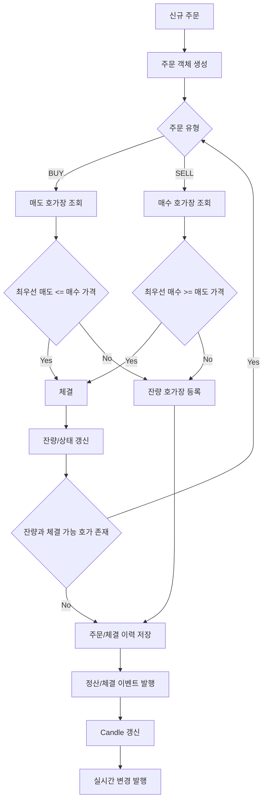

# 주문 매칭 엔진

## 문서 포털

문서의 상세 구현, API, 아키텍처, 트러블슈팅은 아래 문서를 참고하세요.

| 분류 | 문서 | 분류 | 문서 |
| --- | --- | --- | --- |
| 루트 README | [README](../../../README.md) | 서비스 README | [README](../README.md) |
| Engineering Notes | [Engineering Notes](../../../docs/ENGINEERING.md) | Database Schema ERD | [Database Schema ERD](../../../docs/database-schema.md) |
| 00 | [주문 서비스 개요](00-order-service-overview.md) | 01 | [주문 API](01-order-api.md) |
| 02 | [Kafka 주문 흐름](02-kafka-order-flow.md) | 03 | [정산/체결 이벤트](03-settlement-and-trade-events.md) |
| 04 | [호가장](04-orderbook.md) | 05 | [매칭 엔진](05-matching-engine.md) |
| 06 | [Candle 차트 흐름](06-candle-chart-flow.md) | 07 | [실시간 발행 흐름](07-websocket-flow.md) |
| 08 | [Bot 거래 구조](08-bot-trading-flow.md) | 09 | [초기화/주기 작업](09-initialization-and-scheduler.md) |
| 10 | [order-service 이슈](10-order-service-issues.md) |  |  |

## 목차

> [개요](#개요) ·
> [매칭 기준](#매칭-기준) ·
> [체결 가격](#체결-가격) ·
> [체결 결과](#체결-결과)

> [주문 상태 변화](#주문-상태-변화) ·
> [주문 매칭 흐름](#주문-매칭-흐름) ·
> [후속 처리](#후속-처리) ·
> [핵심 구현 파일](#핵심-구현-파일)

## 개요

주문 매칭은 `OrderTradeService.matchLoop`에서 수행된다. 신규 주문은 반대편 호가장과 비교되며, 체결 조건을 만족하는 동안 반복해서 매칭된다.

## 매칭 기준

매수 주문:

- 가장 낮은 매도 호가부터 확인한다.
- 매도 최우선 가격이 매수 주문 가격 이하이면 체결 가능하다.

매도 주문:

- 가장 높은 매수 호가부터 확인한다.
- 매수 최우선 가격이 매도 주문 가격 이상이면 체결 가능하다.

동일 가격대에서는 `PriceLevel`의 큐 순서에 따라 먼저 들어온 주문이 우선된다.

## 체결 가격

체결 가격은 기존 호가장에 있던 상대 주문의 가격을 사용한다.

## 체결 결과

매칭 결과는 `MatchingResult`에 누적된다.

포함 정보:

- 종목 코드
- 체결 가격 목록
- 체결 내역 목록
- 완료된 기존 주문
- 부분 체결된 기존 주문
- 신규 주문 상태

## 주문 상태 변화

- 전량 미체결: `PENDING`
- 일부 체결: `PARTIAL`
- 전량 체결: `COMPLETED`
- 취소: `CANCELLED`

## 주문 매칭 흐름

## 후속 처리

매칭 후에는 다음 처리가 이어진다.

- 체결 이력 저장
- 주문 상태 저장 또는 삭제
- 정산 이벤트 발행
- Candle 현재 값 갱신
- 호가와 사용자 주문 상태 WebSocket 발행
- Bot 시세 캐시 갱신

## 핵심 구현 파일

기준 경로

`StockBackEndDistributed/order-service/src/main/java/Poi/Stock`

| 파일 |
| --- |
| `features/Order/OrderTradeService.java` |
| `features/Order/OrderService.java` |
| `object/MatchingResult.java` |
| `object/TradeExecution.java` |
| `features/Order/Order.java` |
| `util/EnumUtil.java` |

[문서 맨 위로](#top)

