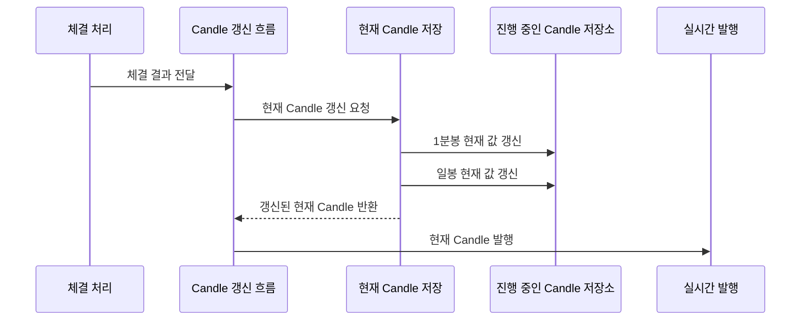
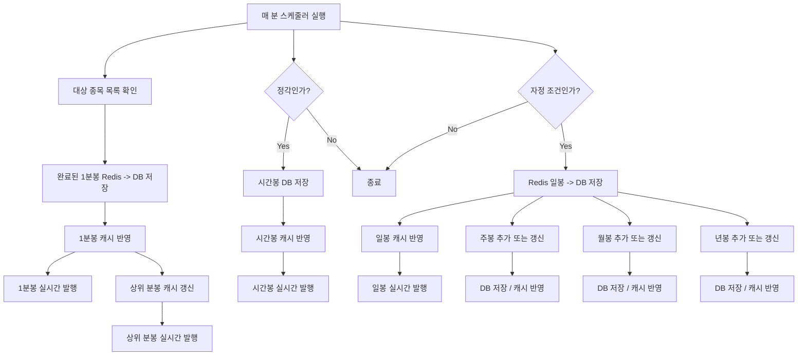

# 캔들 차트 흐름

## 문서 포털

문서의 상세 구현, API, 아키텍처, 트러블슈팅은 아래 문서를 참고하세요.

| 분류 | 문서 | 분류 | 문서 |
| --- | --- | --- | --- |
| 루트 README | [README](../../../README.md) | 서비스 README | [README](../README.md) |
| Engineering Notes | [Engineering Notes](../../../docs/ENGINEERING.md) | Database Schema ERD | [Database Schema ERD](../../../docs/database-schema.md) |
| 00 | [주문 서비스 개요](00-order-service-overview.md) | 01 | [주문 API](01-order-api.md) |
| 02 | [Kafka 주문 흐름](02-kafka-order-flow.md) | 03 | [정산/체결 이벤트](03-settlement-and-trade-events.md) |
| 04 | [호가장](04-orderbook.md) | 05 | [매칭 엔진](05-matching-engine.md) |
| 06 | [Candle 차트 흐름](06-candle-chart-flow.md) | 07 | [실시간 발행 흐름](07-websocket-flow.md) |
| 08 | [Bot 거래 구조](08-bot-trading-flow.md) | 09 | [초기화/주기 작업](09-initialization-and-scheduler.md) |
| 10 | [order-service 이슈](10-order-service-issues.md) |  |  |

## 목차

> [개요](#개요) ·
> [캔들 API](#캔들-api) ·
> [Candle 인터페이스 구조](#candle-인터페이스-구조) ·
> [Redis 캔들 저장](#redis-캔들-저장) ·
> [캔들 캐시](#캔들-캐시)

> [Redis 캔들 저장 흐름](#redis-캔들-저장-흐름) ·
> [완료 캔들 스케줄러 흐름](#완료-캔들-스케줄러-흐름) ·
> [초기 복구](#초기-복구) ·
> [핵심 구현 파일](#핵심-구현-파일)

## 개요

order-service의 Candle 기능은 프론트 차트 API와 실시간 Candle 발행을 담당한다. 체결 발생 시 현재 1분봉과 일봉을 Redis에 갱신하고, 스케줄러에 따라 완료된 Candle을 DB와 메모리 캐시에 반영한다.

Redis에는 현재 진행 중인 1분봉과 일봉을 저장한다. 시간봉, 일봉, 주봉, 월봉, 년봉 같은 상위 Candle은 스케줄러가 완료 Candle 또는 현재 일봉 데이터를 기준으로 집계해 DB와 캐시에 반영한다.

## 캔들 API

| Method | Path | 설명 |
| --- | --- | --- |
| `GET` | `/candle/{stockCode}` | 타입과 시간 범위 기준 Candle 조회 |
| `GET` | `/candle/{stockCode}/init` | 초기 차트 표시용 최근 Candle 조회 |

지원 Candle 타입은 `CandleType` enum에 정의되어 있다.

- 분봉: `ONE_MINUTE`, `THREE_MINUTE`, `FIVE_MINUTE`, `TEN_MINUTE`
- 시간봉: `HOUR`, `TWO_HOUR`, `THREE_HOUR`, `FOUR_HOUR`
- 일/주/월/년: `DAY`, `WEEK`, `MONTH`, `YEAR`

## Candle 인터페이스 구조

Candle 계열 Entity는 `Candle` 인터페이스로 공통 처리된다. `CandleMinute`, `CandleHour`, `CandleDay`, `CandleWeek`, `CandleMonth`, `CandleYear`는 서로 저장 기준 시간은 다르지만 시가, 고가, 저가, 종가, 매수/매도 수량, 거래량, 거래대금처럼 공통으로 다루는 값이 있다.

이 인터페이스는 Java 문법상의 공통 타입을 만들기 위한 목적만이 아니라, Candle 처리 흐름을 타입별로 반복해서 작성하지 않기 위한 구조다. `CandleSchedulerService`, `CandleCacheService`, `CandleCommonService`는 `Candle` 공통 메서드를 사용해 타입별 Candle을 DB 저장, 캐시 반영, 이동평균 계산 흐름에 연결한다.

특히 `Candle.fromRedisMap()` (Redis의 현재 Candle 값을 Candle Entity로 변환하는 기능)은 Redis에 저장된 현재 Candle 값을 공통 필드로 읽고, 필요한 Candle Entity로 변환한다. 이 덕분에 1분봉과 일봉처럼 Redis에서 만들어지는 Candle도 같은 방식으로 다룰 수 있다.

Minute/Hour 계열 Candle은 분 또는 시간 단위의 정확한 시각이 필요하므로 `LocalDateTime time`을 사용한다. 반면 Day/Week/Month/Year 계열 Candle은 특정 날짜를 기준으로 집계되므로 `LocalDate date`를 사용한다.

시간 기준 필드는 다르지만, OHLC와 거래량/거래대금 같은 핵심 값은 공통으로 다루기 때문에 `Candle` 인터페이스를 통해 공통 처리한다. 다만 Entity별 세부 필드가 완전히 동일한 것은 아니며, 현재 코드 기준 `CandleDay`에는 `changeAmount`, `changeRate`가 추가로 있다.

## Redis 캔들 저장

체결이 발생하면 진행 중인 Candle 값을 Redis에 반영하고 실시간 발행에 사용할 현재 Candle을 준비한다.
구현은 `CandleService.saveCandleOrder()` (체결 결과를 Candle 갱신 흐름에 연결하는 기능)와 `CandleSchedulerService.saveCurrentCandle()` (진행 중인 Candle을 Redis에 반영하는 기능)에서 담당한다.

Redis에는 현재 진행 중인 Candle이 저장된다. 현재 구현에서 Redis에 직접 저장되는 진행 중 Candle은 1분봉과 일봉이다.

- 1분봉 현재 값: `candle:1m:{stockCode}:{yyyyMMddHHmm}`
- 일봉 현재 값: `candle:day:{stockCode}:{yyyyMMdd}`
- 저장 락: `lock:candle`

체결이 들어올 때마다 Redis Hash의 `open`, `high`, `low`, `close`, `buyQty`, `sellQty`, `tradeAmount`가 갱신된다. 이후 스케줄러가 완료된 1분봉을 DB로 저장하고, 시간/일/주/월/년 Candle은 저장된 분봉 또는 일봉 데이터를 기준으로 집계/반영한다.

## 캔들 캐시

`CandleCacheService`는 타입과 종목별 최근 Candle을 메모리 캐시에 보관한다. 이동평균은 5, 20, 60 기준으로 계산된다.

## Redis 캔들 저장 흐름

## 완료 캔들 스케줄러 흐름

`CandleScheduler`는 매 분 실행된다.

- 매 분: 완료된 1분봉을 Redis에서 DB로 저장하고, `CandleCacheService`에 반영한 뒤 WebSocket으로 완성 1분봉을 발행한다.
- 매 분: 저장된 1분봉 캐시를 기준으로 3분/5분/10분 상위 분봉 캐시를 갱신하고 WebSocket으로 발행한다.
- 정각: 직전 1시간의 1분봉을 집계해 시간봉을 DB에 저장하고, 캐시에 반영한 뒤 WebSocket으로 발행한다.
- 자정 조건: Redis의 현재 일봉을 DB에 저장하고, 캐시에 반영한 뒤 WebSocket으로 발행한다.
- 자정 조건의 일봉 저장 흐름 안에서 주봉/월봉/년봉도 함께 반영한다.

주봉, 월봉, 년봉은 항상 새로 추가되는 구조가 아니다. 일봉 처리 시 주봉은 해당 주의 월요일, 월봉은 해당 월의 1일, 년봉은 해당 연도의 1월 1일을 기준 날짜로 조회한다. `CandleCommonService.upsertUpperPeriodCandle()` (상위 기간 Candle을 추가하거나 갱신하는 기능)은 이 기준 날짜의 Candle이 이미 있으면 고가, 저가, 종가, 수량, 거래대금 등을 갱신하고, 기간이 바뀌어 해당 Candle이 없으면 새 Candle을 추가한다.

현재 코드 기준 WebSocket 발행 흐름은 1분봉/상위 분봉, 시간봉, 일봉에서 확인된다. 주봉/월봉/년봉은 `CandleCommonService`에서 DB 저장과 `CandleCacheService` 반영까지 수행한다.

## 초기 복구

`CandleInit`은 서버 시작 시 최근 Candle을 DB에서 읽어 메모리 캐시에 적재한다. 이 과정에서 `CandleRestoreService`가 누락된 현재 분봉/일봉 복구를 수행한다.

## 핵심 구현 파일

기준 경로

`StockBackEndDistributed/order-service/src/main/java/Poi/Stock`

| 파일 |
| --- |
| `features/Candle/CandleController.java` |
| `features/Candle/CandleService.java` |
| `features/Candle/CandleScheduler.java` |
| `features/Candle/CandleSchedulerService.java` |
| `features/Candle/CandleCommonService.java` |
| `features/Candle/CandleCacheService.java` |
| `features/Candle/CandleRestoreService.java` |
| `features/Candle/Entity/Candle.java` |
| `init/CandleInit.java` |
| `DTO/user/CandleDTO.java` |

[문서 맨 위로](#top)

