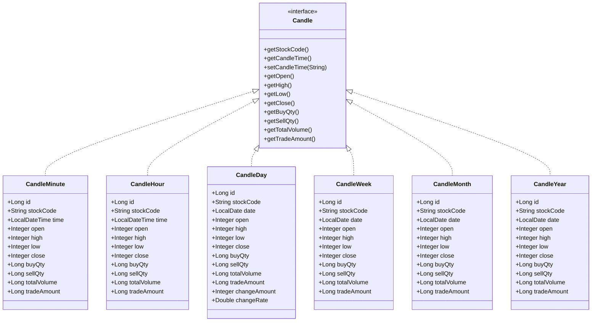
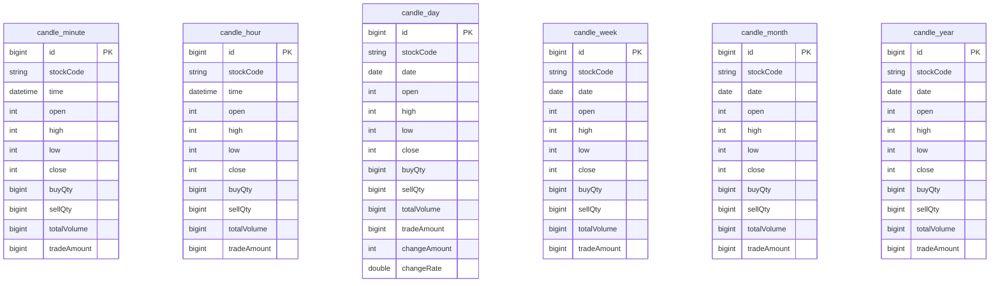
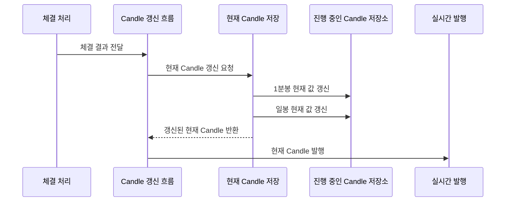
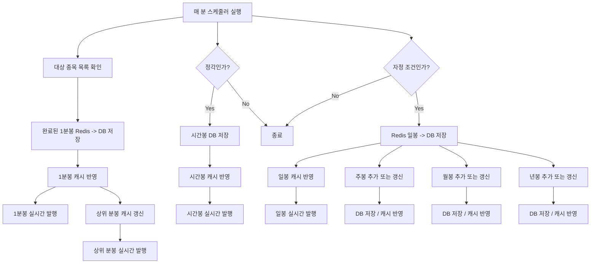

<a id="top"></a>

# 캔들 차트 흐름

## 문서 포털

문서의 상세 구현, API, 아키텍처, 트러블슈팅은 아래 문서를 참고합니다.

| 분류 | 문서 | 분류 | 문서 |
| --- | --- | --- | --- |
| 주식 README | [README](../../../README.md) | 주문 서비스 README | [README](../README.md) |
| 설계 노트 | [Engineering Notes](../../../docs/ENGINEERING.md) | 데이터베이스 ERD | [Database Schema ERD](../../../docs/database-schema.md) |
| 주문 서비스 개요 | [주문 서비스 개요](00-order-service-overview.md) | 주문 API | [주문 API](01-order-api.md) |
| Kafka 주문 흐름 | [Kafka 주문 흐름](02-kafka-order-flow.md) | 정산/체결 이벤트 | [정산/체결 이벤트](03-settlement-and-trade-events.md) |
| 호가장 | [호가장](04-orderbook.md) | 매칭 엔진 | [매칭 엔진](05-matching-engine.md) |
| Candle 차트 흐름 | [Candle 차트 흐름](06-candle-chart-flow.md) | 실시간 발행 흐름 | [실시간 발행 흐름](07-websocket-flow.md) |
| Bot 거래 구조 | [Bot 거래 구조](08-bot-trading-flow.md) | 초기화/주기 작업 | [초기화/주기 작업](09-initialization-and-scheduler.md) |
| 주문 서비스 이슈 | [order-service 이슈](10-order-service-issues.md) |  |  |

## 목차

> [개요](#개요) ·
> [캔들 API](#캔들-api) ·
> [Candle 인터페이스 구조](#candle-인터페이스-구조) ·
> [데이터베이스 구조](#데이터베이스-구조) ·
> [Redis 캔들 저장](#redis-캔들-저장) ·
> [캔들 캐시](#캔들-캐시)

> [Redis 캔들 저장 흐름](#redis-캔들-저장-흐름) ·
> [완료 캔들 스케줄러 흐름](#완료-캔들-스케줄러-흐름) ·
> [초기 복구](#초기-복구) ·
> [핵심 구현 파일](#핵심-구현-파일)

## 개요

order-service의 Candle 기능은 프론트 차트 API와 실시간 Candle 발행을 담당합니다. 체결 발생 시 현재 1분봉과 일봉을 Redis에 갱신하고, 스케줄러에 따라 완료된 Candle을 DB와 메모리 캐시에 반영합니다.

Redis에는 현재 진행 중인 1분봉과 일봉을 저장합니다. 시간봉, 일봉, 주봉, 월봉, 년봉 같은 상위 Candle은 스케줄러가 완료 Candle 또는 현재 일봉 데이터를 기준으로 집계해 DB와 캐시에 반영합니다.

## 캔들 API

차트 API는 종목 코드와 Candle 유형, 선택적인 조회 구간을 받아 화면에 필요한 시계열을 반환합니다.

### 동작 순서

1. 종목 코드와 Candle 유형을 요청에서 읽습니다.
2. 선택적인 시작·종료 시각을 조회 서비스에 전달합니다.
3. 캐시와 DB를 병합한 Candle DTO 목록을 반환합니다.

### 핵심 코드

```java
@GetMapping("/{stockCode}")
public ResponseEntity<List<CandleDTO>> getCandle(
        @PathVariable("stockCode") String stockCode,
        @RequestParam(name = "type", defaultValue = "ONE_MINUTE") CandleType type,
        @RequestParam(name = "startTime", required = false) String startTime,
        @RequestParam(name = "endTime", required = false) String endTime) {
    List<CandleDTO> data = candleService.getCandle(
            type, stockCode, startTime, endTime);
    return ResponseEntity.ok(data);
}
```

분봉부터 연봉까지 차트 호출 규칙이 유형마다 달라지는 문제를 줄입니다. 종목·주기·조회 구간을 입력받아 병합된 DTO를 반환하며, 결과는 차트 초기 조회와 구간 추가 조회에 사용됩니다.

### 구현 위치

- Candle 조회 API: `features/Candle/CandleController.java`의 `getCandle()`

| 역할 | REST API |
| --- | --- |
| 타입과 시간 범위에 따른 과거 Candle 조회 | `GET /candle/{stockCode}` |
| 초기 차트 표시용 최근 Candle 조회 | `GET /candle/{stockCode}/init` |

지원 Candle 타입은 `CandleType` enum에 정의되어 있습니다.

- 분봉: `ONE_MINUTE`, `THREE_MINUTE`, `FIVE_MINUTE`, `TEN_MINUTE`
- 시간봉: `HOUR`, `TWO_HOUR`, `THREE_HOUR`, `FOUR_HOUR`
- 일/주/월/년: `DAY`, `WEEK`, `MONTH`, `YEAR`

## Candle 인터페이스 구조

Candle 계열 Entity는 `Candle` 인터페이스로 공통 처리됩니다. `CandleMinute`, `CandleHour`, `CandleDay`, `CandleWeek`, `CandleMonth`, `CandleYear`는 서로 저장 기준 시간은 다르지만 시가, 고가, 저가, 종가, 매수/매도 수량, 거래량, 거래대금처럼 공통으로 다루는 값이 있습니다.

이 인터페이스는 Java 문법상의 공통 타입을 만들기 위한 목적만이 아니라, Candle 처리 흐름을 타입별로 반복해서 작성하지 않기 위한 구조입니다. `CandleSchedulerService`, `CandleCacheService`, `CandleCommonService`는 `Candle` 공통 메서드를 사용해 타입별 Candle을 DB 저장, 캐시 반영, 이동평균 계산 흐름에 연결합니다.

특히 `Candle.fromRedisMap()` (Redis의 현재 Candle 값을 Candle Entity로 변환하는 기능)은 Redis에 저장된 현재 Candle 값을 공통 필드로 읽고, 필요한 Candle Entity로 변환합니다. 이 덕분에 1분봉과 일봉처럼 Redis에서 만들어지는 Candle도 같은 방식으로 다룰 수 있습니다.

Minute/Hour 계열 Candle은 분 또는 시간 단위의 정확한 시각이 필요하므로 `LocalDateTime time`을 사용합니다. 반면 Day/Week/Month/Year 계열 Candle은 특정 날짜를 기준으로 집계되므로 `LocalDate date`를 사용합니다.

시간 기준 필드는 다르지만, OHLC와 거래량/거래대금 같은 핵심 값은 공통으로 다루기 때문에 `Candle` 인터페이스를 통해 공통 처리합니다. 다만 Entity별 세부 필드가 완전히 동일한 것은 아니며, 현재 코드 기준 `CandleDay`에는 `changeAmount`, `changeRate`가 추가로 있습니다.



위 그림은 Java 인터페이스와 구현 클래스의 공통 처리 관계를 나타냅니다. 실제 데이터베이스 테이블 구조는 아래 ERD와 같습니다.

### 데이터베이스 구조



모든 Candle 테이블은 자동 증가 `id`를 PK로 사용하고 OHLC, 매수·매도 수량, 전체 거래량과 거래대금을 저장합니다. 엔티티 사이에는 실제 외래키나 JPA 연관관계가 없습니다.

### 테이블 비교

| 구분 | 테이블 | 시간 기준 | 일반 복합 인덱스 | 추가 필드 |
| --- | --- | --- | --- | --- |
| 분봉 | `candle_minute` | `LocalDateTime time` | `stockCode, time` | 없음 |
| 시간봉 | `candle_hour` | `LocalDateTime time` | `stockCode, time` | 없음 |
| 일봉 | `candle_day` | `LocalDate date` | `stockCode, date` | `changeAmount`, `changeRate` |
| 주봉 | `candle_week` | `LocalDate date` | `stockCode, date` | 없음 |
| 월봉 | `candle_month` | `LocalDate date` | `stockCode, date` | 없음 |
| 연봉 | `candle_year` | `LocalDate date` | `stockCode, date` | 없음 |

### 구현 위치

- Candle 엔티티: `features/Candle/Entity/CandleMinute.java`, `CandleHour.java`, `CandleDay.java`, `CandleWeek.java`, `CandleMonth.java`, `CandleYear.java`

## Redis 캔들 저장

실시간 체결은 확정 전 1분봉과 일봉을 Redis에 누적해 매 체결마다 데이터베이스를 갱신하지 않도록 합니다.

### 동작 순서

1. 체결 시각으로 1분봉과 일봉 Redis key를 만듭니다.
2. Lua Script로 시가·고가·저가·종가와 거래량을 원자적으로 갱신합니다.
3. Redis 결과를 현재 Candle 객체로 변환합니다.

### 핵심 코드

```java
LocalDateTime minuteTime = executionTime.withSecond(0).withNano(0);
String minuteCandleKey = "candle:1m:" + stockCode + ":" + minuteTime.format(FMT);
String dayCandleKey = "candle:day:" + stockCode + ":"
        + executionTime.format(DateTimeFormatter.ofPattern("yyyyMMdd"));

List<String> minuteResult = redisTemplate.execute(
        new DefaultRedisScript<>(UPDATE_CANDLE_SCRIPT, List.class),
        List.of(minuteCandleKey), String.valueOf(price), String.valueOf(buyQty),
        String.valueOf(sellQty), String.valueOf(tradeAmount));
List<String> dayResult = redisTemplate.execute(
        new DefaultRedisScript<>(UPDATE_CANDLE_SCRIPT, List.class),
        List.of(dayCandleKey), String.valueOf(price), String.valueOf(buyQty),
        String.valueOf(sellQty), String.valueOf(tradeAmount));
```

동시에 발생한 체결이 같은 Candle의 고가·저가와 누적량을 덮어쓰지 않도록 Redis Lua 연산으로 묶습니다. 체결 정보와 시각을 입력받아 1분봉과 일봉을 갱신하고, 변환 결과는 메모리 캐시와 실시간 발행에 이어집니다.

### 구현 위치

- 현재 Candle 저장: `features/Candle/CandleSchedulerService.java`의 `saveCurrentCandle()`

체결이 발생하면 진행 중인 Candle 값을 Redis에 반영하고 실시간 발행에 사용할 현재 Candle을 준비합니다.
구현은 `CandleService.saveCandleOrder()` (체결 결과를 Candle 갱신 흐름에 연결하는 기능)와 `CandleSchedulerService.saveCurrentCandle()` (진행 중인 Candle을 Redis에 반영하는 기능)에서 담당합니다.

Redis에는 현재 진행 중인 Candle이 저장됩니다. 현재 구현에서 Redis에 직접 저장되는 진행 중 Candle은 1분봉과 일봉입니다.

- 1분봉 현재 값: `candle:1m:{stockCode}:{yyyyMMddHHmm}`
- 일봉 현재 값: `candle:day:{stockCode}:{yyyyMMdd}`
- 저장 락: `lock:candle`

체결이 들어올 때마다 Redis Hash의 `open`, `high`, `low`, `close`, `buyQty`, `sellQty`, `tradeAmount`가 갱신됩니다. 이후 스케줄러가 완료된 1분봉을 DB로 저장하고, 시간/일/주/월/년 Candle은 저장된 분봉 또는 일봉 데이터를 기준으로 집계/반영합니다.

## 캔들 캐시

최근 Candle과 이동평균은 주기와 종목별 `Deque`에 유지해 차트 조회와 WebSocket 발행에서 재계산 범위를 제한합니다.

### 동작 순서

1. 같은 시각의 마지막 Candle이 있으면 교체합니다.
2. 이전 Candle을 기준으로 이동평균을 계산합니다.
3. 최신 값을 뒤에 넣고 최대 100개만 유지합니다.

### 핵심 코드

```java
public CandleWithMA<Candle> upsertCandle(
        CandleType type, String stockCode, Candle candle) {
    if (candle == null) return null;
    Map<String, Deque<CandleWithMA<Candle>>> cacheMap =
            candleCache.getTypedStore(type);
    Deque<CandleWithMA<Candle>> finalDeque = cacheMap.compute(stockCode,
            (key, existing) -> {
                Deque<CandleWithMA<Candle>> deque =
                        existing == null ? new ArrayDeque<>() : existing;
                if (!deque.isEmpty() && deque.getLast().getCandle()
                        .getCandleTime().equals(candle.getCandleTime())) {
                    deque.removeLast();
                }
                deque.addLast(calculateLiveMA(deque, candle));
                while (deque.size() > MAX_CACHE_SIZE) deque.removeFirst();
                return deque;
            });
    return finalDeque != null ? finalDeque.getLast() : null;
}
```

진행 중인 같은 시간 구간의 Candle이 중복 적재되지 않도록 마지막 항목을 교체하는 캐시 로직입니다. 주기·종목·Candle을 입력받아 이동평균이 포함된 최신 항목을 반환하며 차트와 실시간 메시지에 반영됩니다.

### 구현 위치

- Candle 캐시 병합: `features/Candle/CandleCacheService.java`의 `upsertCandle()`

`CandleCacheService`는 타입과 종목별 최근 Candle을 메모리 캐시에 보관합니다. 이동평균은 5, 20, 60 기준으로 계산됩니다.

## Redis 캔들 저장 흐름



## 완료 캔들 스케줄러 흐름

`CandleScheduler`는 매 분 실행됩니다.

- 매 분: 완료된 1분봉을 Redis에서 DB로 저장하고, `CandleCacheService`에 반영한 뒤 WebSocket으로 완성 1분봉을 발행합니다.
- 매 분: 저장된 1분봉 캐시를 기준으로 3분/5분/10분 상위 분봉 캐시를 갱신하고 WebSocket으로 발행합니다.
- 정각: 직전 1시간의 1분봉을 집계해 시간봉을 DB에 저장하고, 캐시에 반영한 뒤 WebSocket으로 발행합니다.
- 자정 조건: Redis의 현재 일봉을 DB에 저장하고, 캐시에 반영한 뒤 WebSocket으로 발행합니다.
- 자정 조건의 일봉 저장 흐름 안에서 주봉/월봉/년봉도 함께 반영합니다.

주봉, 월봉, 년봉은 항상 새로 추가되는 구조가 아닙니다. 일봉 처리 시 주봉은 해당 주의 월요일, 월봉은 해당 월의 1일, 년봉은 해당 연도의 1월 1일을 기준 날짜로 조회합니다. `CandleCommonService.upsertUpperPeriodCandle()` (상위 기간 Candle을 추가하거나 갱신하는 기능)은 이 기준 날짜의 Candle이 이미 있으면 고가, 저가, 종가, 수량, 거래대금 등을 갱신하고, 기간이 바뀌어 해당 Candle이 없으면 새 Candle을 추가합니다.

현재 코드 기준 WebSocket 발행 흐름은 1분봉/상위 분봉, 시간봉, 일봉에서 확인됩니다. 주봉/월봉/년봉은 `CandleCommonService`에서 DB 저장과 `CandleCacheService` 반영까지 수행합니다.



## 초기 복구

서비스 시작 시 Redis의 미확정 Candle과 DB의 최근 확정 Candle을 복구해 재시작 전후 차트가 끊기지 않도록 합니다.

### 동작 순서

1. 담당 종목의 Redis 1분봉과 일봉을 복구합니다.
2. 최근 DB Candle을 시간순으로 정렬합니다.
3. 주기별 메모리 캐시를 최대 100개까지 준비합니다.

### 핵심 코드

```java
assignedCodeHolder.getAssignedCodes().forEach(stockCode -> {
    LocalDateTime now = LocalDateTime.now();
    candleRestoreService.restoreMinuteCandle(stockCode, now);
    candleRestoreService.restoreDayCandle(stockCode, now);

    List<CandleMinute> rawMinutes = candleMinuteRepository
            .findByStockCodeOrderByTimeDesc(stockCode, pageRequest);
    if (rawMinutes.isEmpty()) {
        return;
    }
    Collections.reverse(rawMinutes);
    for (CandleType type : CandleType.values()) {
        if (!type.isMinuteType()) continue;
        List<Candle> minutes = type != CandleType.ONE_MINUTE
                ? candleSchedulerService.convertToMinute(rawMinutes, type)
                : candleCommonService.convertGeneric(rawMinutes);
        candleCacheService.putCandles(type, stockCode, minutes);
    }
});
```

Redis의 진행 중 데이터와 DB의 확정 데이터를 함께 복구해 재시작 직후 빈 차트 문제를 막습니다. 담당 종목을 입력 범위로 최근 1분봉을 조회하고 각 분봉 주기로 변환해 메모리 캐시에 반영합니다.

### 구현 위치

- 시작 시 Candle 복구: `init/CandleInit.java`의 `init()`

`CandleInit`은 서버 시작 시 최근 Candle을 DB에서 읽어 메모리 캐시에 적재합니다. 이 과정에서 `CandleRestoreService`가 누락된 현재 분봉/일봉 복구를 수행합니다.

## 핵심 구현 파일

기준 경로

`StockBackEndDistributed/order-service/src/main/java/Poi/Stock`

| 파일 |
| --- |
| `features/Candle/CandleController.java` |
| `features/Candle/CandleService.java` |
| `features/Candle/CandleScheduler.java` |
| `features/Candle/CandleSchedulerService.java` |
| `features/Candle/CandleCommonService.java` |
| `features/Candle/CandleCacheService.java` |
| `features/Candle/CandleRestoreService.java` |
| `features/Candle/Entity/Candle.java` |
| `init/CandleInit.java` |
| `DTO/user/CandleDTO.java` |

<div align="right">

[문서 맨 위로](#top)

</div>
