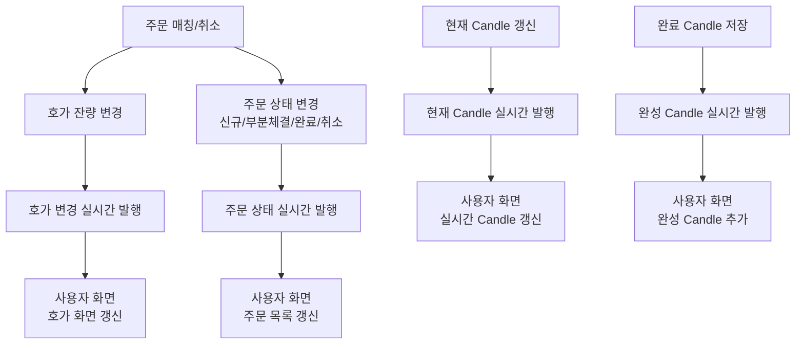

<a id="top"></a>

# 웹소켓 발행 흐름

## 문서 포털

문서의 상세 구현, API, 아키텍처, 트러블슈팅은 아래 문서를 참고합니다.

| 분류 | 문서 | 분류 | 문서 |
| --- | --- | --- | --- |
| 주식 README | [README](../../../README.md) | 주문 서비스 README | [README](../README.md) |
| 설계 노트 | [Engineering Notes](../../../docs/ENGINEERING.md) | 데이터베이스 ERD | [Database Schema ERD](../../../docs/database-schema.md) |
| 주문 서비스 개요 | [주문 서비스 개요](00-order-service-overview.md) | 주문 API | [주문 API](01-order-api.md) |
| Kafka 주문 흐름 | [Kafka 주문 흐름](02-kafka-order-flow.md) | 정산/체결 이벤트 | [정산/체결 이벤트](03-settlement-and-trade-events.md) |
| 호가장 | [호가장](04-orderbook.md) | 매칭 엔진 | [매칭 엔진](05-matching-engine.md) |
| Candle 차트 흐름 | [Candle 차트 흐름](06-candle-chart-flow.md) | 실시간 발행 흐름 | [실시간 발행 흐름](07-websocket-flow.md) |
| Bot 거래 구조 | [Bot 거래 구조](08-bot-trading-flow.md) | 초기화/주기 작업 | [초기화/주기 작업](09-initialization-and-scheduler.md) |
| 주문 서비스 이슈 | [order-service 이슈](10-order-service-issues.md) |  |  |

## 목차

> [개요](#개요) ·
> [발행 채널](#발행-채널) ·
> [호가 발행](#호가-발행) ·
> [주문 상태 발행](#주문-상태-발행)

> [캔들 발행](#캔들-발행) ·
> [웹소켓 발행 흐름](#웹소켓-발행-흐름) ·
> [인증 관련 주의](#인증-관련-주의) ·
> [핵심 구현 파일](#핵심-구현-파일)

## 개요

사용자 화면은 호가, 주문 상태, Candle 변경을 실시간으로 수신합니다. 서버는 STOMP 기반 WebSocket 연결로 변경 데이터를 발행합니다.

실시간 연결 Endpoint:

- 주문 데이터 연결을 시작하는 WebSocket Endpoint(`/ws-order`)

브로커 prefix:

- 여러 사용자가 함께 받는 메시지 Prefix(`/topic`)
- 사용자별 메시지 Prefix(`/queue`)

사용자 destination prefix:

- 사용자 전용 목적지를 구분하는 Prefix(`/user`)

## 발행 채널

| 역할 | WebSocket 경로 |
| --- | --- |
| 종목별 호가 변경을 전달하는 Topic | `/topic/hoga/{stockCode}` |
| 진행 중인 Candle을 전달하는 Topic | `/topic/candle/{stockCode}/{candleType}` |
| 완료된 Candle을 전달하는 Topic | `/topic/candle/completed/{stockCode}/{candleType}` |
| 사용자별 주문 상태 변경을 전달하는 Queue | `/user/queue/orders` |
| 사용자별 주문 실패 메시지를 전달하는 Topic | `/topic/error/{userId}` |

## 호가 발행

주문 매칭이나 취소로 가격대별 잔량이 바뀌면 변경된 호가를 사용자 화면에 발행합니다.

### 동작 순서

1. 변경된 주문 방향과 가격대 잔량을 받습니다.
2. 호가 전용 payload를 구성합니다.
3. 종목별 호가 Topic에 발행합니다.

### 핵심 코드

```java
public void sendHoga(String stockCode, tradeType side, int price, int qty) {
    Map<String, Object> payload = new HashMap<>();
    payload.put("type", "hoga");
    payload.put("side", side.name());
    payload.put("price", price);
    payload.put("qty", qty);
    messagingTemplate.convertAndSend(
            "/topic/hoga/" + stockCode, payload);
}
```

한 가격대만 전달해 실시간 메시지 크기를 제한합니다. 종목·방향·가격·잔량을 입력받아 해당 종목 Topic에 발행하며, 화면은 해당 가격대만 교체합니다.

### 구현 위치

- 호가 발행: `features/Websocket/WebSocketService.java`의 `sendHoga()`

## 주문 상태 발행

신규, 부분 체결, 완료 주문 상태는 해당 사용자에게만 전달합니다. Bot 주문은 사용자 주문 상태 발행 대상에서 제외합니다.

### 동작 순서

1. 주문과 이번 매칭의 체결 수량을 payload로 구성합니다.
2. 사용자 ID로 개인 목적지를 선택합니다.
3. `/queue/orders`에 최신 주문 상태를 발행합니다.

### 핵심 코드

```java
public void sendToUser(String userId, Order order,
        OrderStatus orderStatus, int executedQuantity) {
    Map<String, Object> payload = new HashMap<>();
    payload.put("orderId", order.getOrderId());
    payload.put("stockCode", order.getStockCode());
    payload.put("stockName", order.getStockName());
    payload.put("tradeType", order.getTradeType());
    payload.put("quantity", order.getQuantity());
    payload.put("remainingQuantity", order.getRemainingQuantity());
    payload.put("tradePrice", order.getTradePrice());
    payload.put("status", orderStatus);
    payload.put("executedQuantity", executedQuantity);
    messagingTemplate.convertAndSendToUser(
            userId, "/queue/orders", payload);
}
```
사용자 ID와 변경 주문을 입력받아 잔여·체결 수량을 유저한테 전달하며, 결과는 대기·부분 체결·완료 목록 갱신에 사용됩니다.

### 구현 위치

- 사용자 주문 상태 발행: `features/Websocket/WebSocketService.java`의 `sendOrderUpdate()`

## 캔들 발행

체결 시 진행 중인 Candle을 발행합니다. 주기 작업이 Candle을 완료하면 완료 데이터를 별도 Topic으로 전달합니다.

### 동작 순서

1. 완료 Candle과 이동평균을 확인합니다.
2. 차트에 필요한 OHLC와 수량을 payload로 구성합니다.
3. 종목·주기별 완료 Candle Topic에 발행합니다.

### 핵심 코드

```java
public void sendCompleteCandle(CandleWithMA<Candle> wrapped,
        String stockCode, CandleType candleType) {
    if (wrapped == null || wrapped.getCandle() == null) return;
    Candle candle = wrapped.getCandle();
    Map<String, Object> payload = new HashMap<>();
    payload.put("open", candle.getOpen());
    payload.put("high", candle.getHigh());
    payload.put("low", candle.getLow());
    payload.put("close", candle.getClose());
    payload.put("sellQty", candle.getSellQty());
    payload.put("buyQty", candle.getBuyQty());
    payload.put("time", candle.getCandleTime() != null
            ? candle.getCandleTime().toString() : "");
    payload.put("movingAverages", wrapped.getMa());
    payload.put("candleType", candleType.name());
    messagingTemplate.convertAndSend(
            "/topic/candle/completed/" + stockCode + "/" + candleType.name(), payload);
}
```

진행 중 Candle과 확정 Candle을 다른 Topic으로 분리해 화면이 같은 구간을 중복 추가하지 않도록 합니다. 확정 Candle과 이동평균을 입력받아 완료 데이터에 반영합니다.

### 구현 위치

- Candle 발행: `features/Websocket/WebSocketService.java`
- 완료 Candle 처리: `features/Candle/CandleScheduler.java`

## 웹소켓 발행 흐름



## 인증 관련 주의

실시간 연결은 클라이언트가 전달한 `userId` 헤더를 사용자 식별값으로 사용합니다. REST API의 JWT 인증과 달리 WebSocket 연결 단계에는 동일한 토큰 검증 흐름이 적용되지 않습니다.

## 핵심 구현 파일

기준 경로

`StockBackEndDistributed/order-service/src/main/java/Poi/Stock`

| 파일 |
| --- |
| `config/WebSocketConfig.java` |
| `config/StompPrincipal.java` |
| `features/Websocket/WebSocketService.java` |
| `features/Order/OrderTradeService.java` |
| `features/Order/OrderCancelService.java` |
| `features/Candle/CandleService.java` |
| `features/Candle/CandleSchedulerService.java` |

<div align="right">

[문서 맨 위로](#top)

</div>


