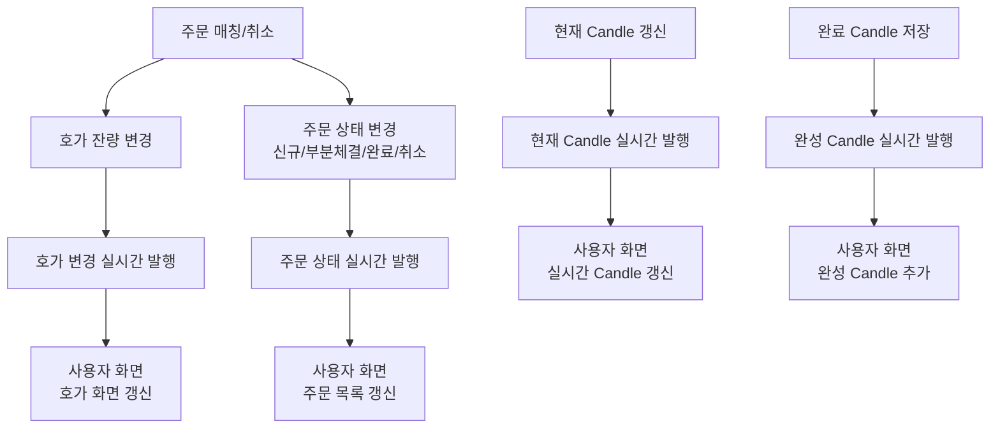

# 웹소켓 발행 흐름

## 문서 포털

문서의 상세 구현, API, 아키텍처, 트러블슈팅은 아래 문서를 참고하세요.

| 분류 | 문서 | 분류 | 문서 |
| --- | --- | --- | --- |
| 루트 README | [README](../../../README.md) | 서비스 README | [README](../README.md) |
| Engineering Notes | [Engineering Notes](../../../docs/ENGINEERING.md) | Database Schema ERD | [Database Schema ERD](../../../docs/database-schema.md) |
| 00 | [주문 서비스 개요](00-order-service-overview.md) | 01 | [주문 API](01-order-api.md) |
| 02 | [Kafka 주문 흐름](02-kafka-order-flow.md) | 03 | [정산/체결 이벤트](03-settlement-and-trade-events.md) |
| 04 | [호가장](04-orderbook.md) | 05 | [매칭 엔진](05-matching-engine.md) |
| 06 | [Candle 차트 흐름](06-candle-chart-flow.md) | 07 | [실시간 발행 흐름](07-websocket-flow.md) |
| 08 | [Bot 거래 구조](08-bot-trading-flow.md) | 09 | [초기화/주기 작업](09-initialization-and-scheduler.md) |
| 10 | [order-service 이슈](10-order-service-issues.md) |  |  |

## 목차

> [개요](#개요) ·
> [발행 채널](#발행-채널) ·
> [호가 발행](#호가-발행) ·
> [주문 상태 발행](#주문-상태-발행)

> [캔들 발행](#캔들-발행) ·
> [웹소켓 발행 흐름](#웹소켓-발행-흐름) ·
> [인증 관련 주의](#인증-관련-주의) ·
> [핵심 구현 파일](#핵심-구현-파일)

## 개요

order-service는 STOMP WebSocket을 통해 호가, 주문 상태, Candle 데이터를 발행한다.

엔드포인트:

- `/ws-order`

브로커 prefix:

- `/topic`
- `/queue`

사용자 destination prefix:

- `/user`

## 발행 채널

| Destination | 설명 |
| --- | --- |
| `/topic/hoga/{stockCode}` | 종목별 호가 변경 |
| `/topic/candle/{stockCode}/{candleType}` | 현재 진행 중인 Candle |
| `/topic/candle/completed/{stockCode}/{candleType}` | 완성된 Candle |
| `/user/queue/orders` | 사용자별 주문 상태 변경 |
| `/topic/error/{userId}` | 사용자별 주문 실패 메시지 |

## 호가 발행

주문 매칭 또는 취소 후 가격대별 잔량이 변경되면 호가 변경 메시지를 발행한다.
구현은 `sendHoga()` (호가 변경 메시지 발행 기능)에서 담당한다.

## 주문 상태 발행

`sendOrderUpdate`는 체결 완료 주문, 부분 체결 주문, 신규 주문 상태를 사용자별 queue로 발행한다. Bot 사용자는 사용자 주문 상태 발행 대상에서 제외된다.

## 캔들 발행

체결 발생 시 현재 Candle이 발행된다. 스케줄러가 완료 Candle을 저장하면 완성 Candle도 별도 topic으로 발행된다.

## 웹소켓 발행 흐름

## 인증 관련 주의

REST API는 JWT 필터를 사용하지만, WebSocket CONNECT에서는 클라이언트가 전달한 `userId` 헤더를 Principal로 설정한다. 이 구조는 개선 필요 항목에 포함한다.

## 핵심 구현 파일

기준 경로

`StockBackEndDistributed/order-service/src/main/java/Poi/Stock`

| 파일 |
| --- |
| `config/WebSocketConfig.java` |
| `config/StompPrincipal.java` |
| `features/Websocket/WebSocketService.java` |
| `features/Order/OrderTradeService.java` |
| `features/Order/OrderCancelService.java` |
| `features/Candle/CandleService.java` |
| `features/Candle/CandleSchedulerService.java` |

[문서 맨 위로](#top)

