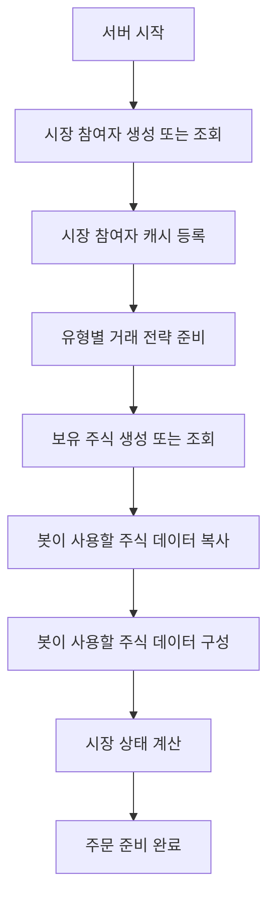
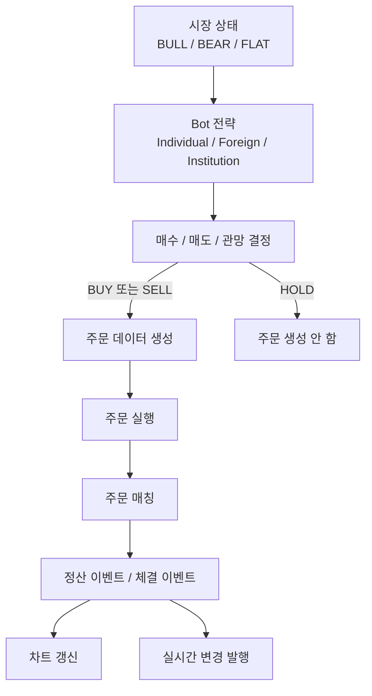
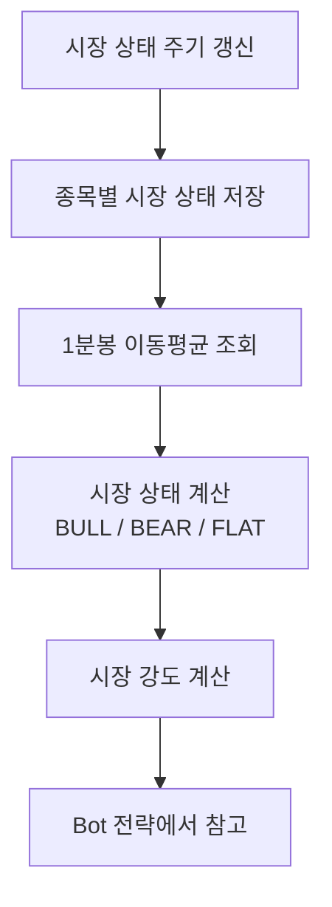
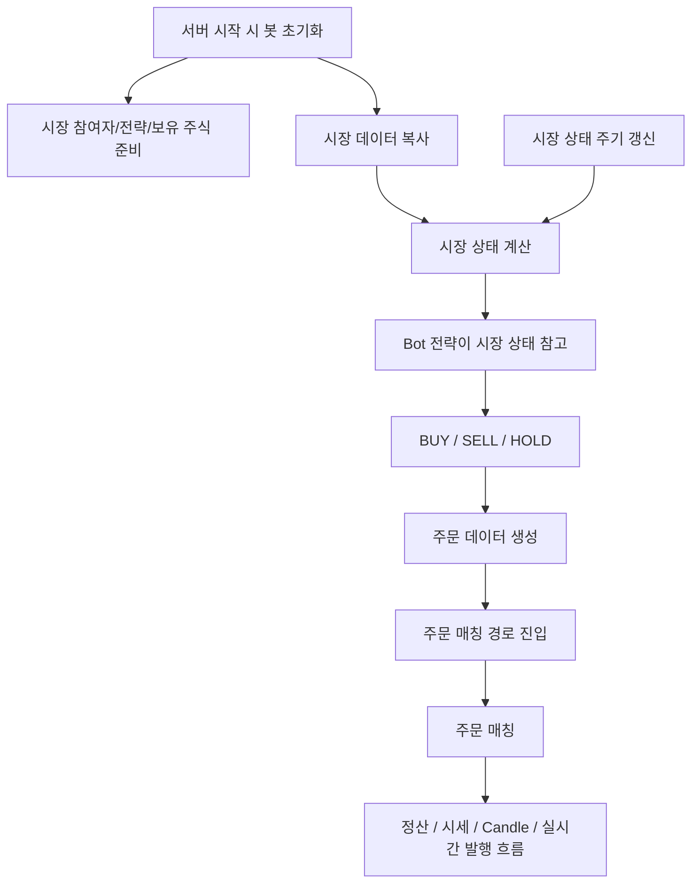

# 봇 거래 구조

## 문서 포털

문서의 상세 구현, API, 아키텍처, 트러블슈팅은 아래 문서를 참고하세요.

| 분류 | 문서 | 분류 | 문서 |
| --- | --- | --- | --- |
| 루트 README | [README](../../../README.md) | 서비스 README | [README](../README.md) |
| Engineering Notes | [Engineering Notes](../../../docs/ENGINEERING.md) | Database Schema ERD | [Database Schema ERD](../../../docs/database-schema.md) |
| 00 | [주문 서비스 개요](00-order-service-overview.md) | 01 | [주문 API](01-order-api.md) |
| 02 | [Kafka 주문 흐름](02-kafka-order-flow.md) | 03 | [정산/체결 이벤트](03-settlement-and-trade-events.md) |
| 04 | [호가장](04-orderbook.md) | 05 | [매칭 엔진](05-matching-engine.md) |
| 06 | [Candle 차트 흐름](06-candle-chart-flow.md) | 07 | [실시간 발행 흐름](07-websocket-flow.md) |
| 08 | [Bot 거래 구조](08-bot-trading-flow.md) | 09 | [초기화/주기 작업](09-initialization-and-scheduler.md) |
| 10 | [order-service 이슈](10-order-service-issues.md) |  |  |

## 목차

> [개요](#개요) ·
> [Bot을 만든 목적](#bot을-만든-목적) ·
> [봇 구성](#봇-구성) ·
> [Bot 전략](#bot-전략) ·
> [시장 상태 저장](#시장-상태-저장) ·
> [봇 초기화](#봇-초기화) ·
> [봇 주문 생성 과정](#봇-주문-생성-과정)

> [시장 상태 갱신](#시장-상태-갱신) ·
> [봇 흐름](#봇-흐름) ·
> [핵심 구현 파일](#핵심-구현-파일)

## 개요

order-service에는 시장 시뮬레이션을 위한 Bot 모델, 보유 주식, 캐시, 전략 클래스, 주문 실행 경로가 구현되어 있다.

## Bot을 만든 목적

Bot은 사용자가 직접 주문하지 않아도 호가장과 체결 흐름을 테스트할 수 있도록 만든 시장 참여자 모델이다. order-service의 매칭 엔진은 상대 주문이 있어야 체결이 발생하므로, Bot은 매수/매도 주문을 생성해 호가장, 체결, 정산, Candle, WebSocket 흐름을 검증할 수 있게 한다.

Bot은 실제 외부 시장을 예측하는 투자 알고리즘이 아니라, 프로젝트 내부에서 시장 상황을 흉내 내기 위한 시뮬레이션 구성이다. 각 Bot은 보유 현금, 보유 주식, 종목별 시세 스냅샷, 시장 상태를 참고해 매수/매도/관망 중 하나를 선택한다.

## 봇 구성

Bot 타입은 `EnumUtil.BotType`에 정의되어 있다.

- `INDIVIDUAL`
- `FOREIGN`
- `INSTITUTION`

각 타입별 전략 클래스가 존재한다.

- `IndividualBot`
- `ForeignBot`
- `InstitutionBot`

공통 전략 기반은 `AbstractBot`에 구현되어 있다.

## Bot 전략

세 Bot은 모두 `AbstractBot`의 공통 흐름을 사용한다. 공통 흐름은 종목별 시세를 조회하고, 시장 상태와 이동평균, Bot 자산, 전략 강도를 조합해 주문 여부를 결정한다. 차이는 각 Bot이 매수/매도/관망 확률을 계산하는 방식과 주문 수량 범위, 기존 주문 취소 성향에 있다.

| Bot | 실제 코드 기준 성향 |
| --- | --- |
| `IndividualBot` | `MA5`, `MA20`, `MA60`과 시장 상태를 함께 본다. 상승장에서는 매수 가중치가 커지고, 하락장에서는 매도 가중치가 커진다. 기본 주문 수량 범위가 작고, 호가가 멀어지거나 시장이 급변하면 주문 취소 확률이 상대적으로 높다. |
| `ForeignBot` | `MA20`, `MA60`을 중심으로 추세를 판단한다. 상승장에서도 정배열과 현재가 위치에 따라 매수 강도를 조정하고, 하락장에서는 매도 가중치를 높인다. 개인 Bot보다 주문 수량 범위가 크고, 취소 기준 호가 범위도 더 넓다. |
| `InstitutionBot` | `MA20`, `MA60`과 현재가 위치를 사용한다. 상승 추세가 뚜렷하면 매수 가중치를 크게 높이고, 하락 추세가 강하면 매도 가중치를 높인다. 주문 수량 범위가 가장 크고, 취소 기준이 넓어 기존 주문을 더 오래 유지하는 성향이다. |

모든 전략은 최종적으로 `BUY`, `SELL`, `HOLD` 중 하나를 선택한다. 선택 결과가 `BUY` 또는 `SELL`이면 `BotOrderService`가 주문용 `TradeDTO`를 만들어 order-service의 매칭 흐름으로 전달한다.

## 시장 상태 저장

`MarketStateHolder`는 종목별 시장 상태를 저장한다. 상태 값은 `BULL`, `BEAR`, `FLAT`이며, 각각 상승장, 하락장, 횡보장을 의미한다.

시장 상태는 1분봉 캐시에 저장된 이동평균을 기준으로 계산한다.

- `MA5 > MA20 > MA60`: `BULL`
- `MA5 < MA20 < MA60`: `BEAR`
- 그 외 또는 이동평균 데이터 부족: `FLAT`

또한 `MA5`와 `MA60`의 괴리율을 기준으로 시장 강도(`intensity`)를 계산한다. Bot 전략은 이 시장 상태와 강도를 참고해 주문 수량, 가격, 매수/매도 확률을 조정한다.

## 봇 초기화

`BotInit`은 서버 시작 시 Bot이 주문을 만들 수 있는 상태를 준비한다.

초기화 흐름은 다음과 같다.

초기 Bot 자산과 보유 주식은 코드에 기본값으로 정의되어 있다. Bot이 처음 생성되면 초기 자산이 설정되고, 종목별 Bot 보유 주식이 없으면 현재 종목 캐시 기준으로 보유 주식을 생성한다.

## 봇 주문 생성 과정

Bot 주문은 시장 상태와 Bot 전략을 기준으로 생성된다. 주문 실행 경로는 `BotOrderService`에 구현되어 있다.

동작 흐름은 다음과 같다.

일반 사용자 주문은 Kafka `order-topic`을 통해 비동기로 처리되지만, Bot 주문은 주문 데이터를 만든 뒤 주문 매칭 경로로 직접 진입한다. 이 경로에서도 매칭 이후 정산, Candle 갱신, 실시간 발행 흐름은 order-service의 기존 처리와 연결된다.

Bot이 생성한 주문은 별도의 호가장을 사용하지 않는다. Bot 주문도 일반 사용자 주문과 동일한 종목별 호가장에 등록된다. 따라서 Bot 주문과 사용자 주문은 같은 시장 안에서 가격 우선, 시간 우선 규칙에 따라 함께 매칭된다.

즉 Bot은 별도의 매칭 시스템이 아니라 프로젝트의 동일한 시장에 참여하는 하나의 참가자로 동작한다.

## 시장 상태 갱신

`BotScheduler`는 Bot 전략이 참고하는 시장 상태를 주기적으로 갱신한다. 이 갱신 결과는 `MarketStateHolder`에 저장되고, Bot 전략은 종목별 `BULL`, `BEAR`, `FLAT` 상태와 시장 강도를 참고해 매수, 매도, 관망 결정을 내린다.

시장 상태 갱신 흐름:

## 봇 흐름

## 핵심 구현 파일

기준 경로

`StockBackEndDistributed/order-service/src/main/java/Poi/Stock/features/Bot`

| 파일 |
| --- |
| `Bot.java` |
| `BotHaveStock.java` |
| `BotInit.java` |
| `BotScheduler.java` |
| `AbstractBot.java` |
| `IndividualBot.java` |
| `ForeignBot.java` |
| `InstitutionBot.java` |
| `BotOrderService.java` |
| `MarketStateHolder.java` |

[문서 맨 위로](#top)

