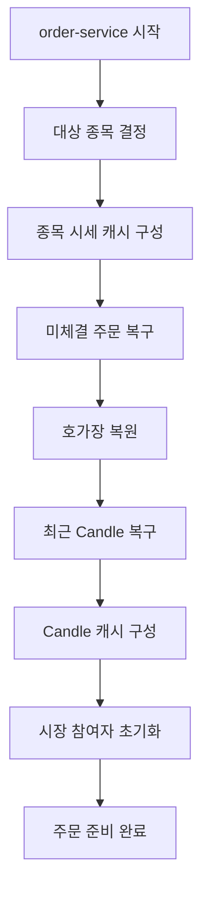
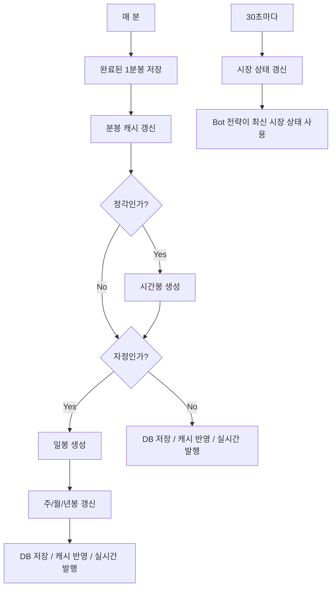

# 스케줄러 및 초기화 

## 문서 포털

문서의 상세 구현, API, 아키텍처, 트러블슈팅은 아래 문서를 참고하세요.

| 분류 | 문서 | 분류 | 문서 |
| --- | --- | --- | --- |
| 루트 README | [README](../../../README.md) | 서비스 README | [README](../README.md) |
| Engineering Notes | [Engineering Notes](../../../docs/ENGINEERING.md) | Database Schema ERD | [Database Schema ERD](../../../docs/database-schema.md) |
| 00 | [주문 서비스 개요](00-order-service-overview.md) | 01 | [주문 API](01-order-api.md) |
| 02 | [Kafka 주문 흐름](02-kafka-order-flow.md) | 03 | [정산/체결 이벤트](03-settlement-and-trade-events.md) |
| 04 | [호가장](04-orderbook.md) | 05 | [매칭 엔진](05-matching-engine.md) |
| 06 | [Candle 차트 흐름](06-candle-chart-flow.md) | 07 | [실시간 발행 흐름](07-websocket-flow.md) |
| 08 | [Bot 거래 구조](08-bot-trading-flow.md) | 09 | [초기화/주기 작업](09-initialization-and-scheduler.md) |
| 10 | [order-service 이슈](10-order-service-issues.md) |  |  |

## 목차

> [서버 시작 초기화](#서버-시작-초기화) ·
> [기본 초기화](#기본-초기화) ·
> [주문 초기화](#주문-초기화) ·
> [캔들 초기화](#캔들-초기화) ·
> [봇 초기화](#봇-초기화)

> [스케줄러](#스케줄러) ·
> [초기화 흐름](#초기화-흐름) ·
> [스케줄러 흐름](#스케줄러-흐름) ·
> [핵심 구현 파일](#핵심-구현-파일)

## 서버 시작 초기화

order-service는 여러 `@PostConstruct` 초기화 컴포넌트를 사용한다.

## 기본 초기화

`Init`은 DB에서 최신 종목을 조회하고, 설정된 할당 종목이 있으면 해당 종목만 대상으로 사용한다.

초기화 내용:

- `AssignedCodeHolder`에 대상 종목 코드 저장
- 최근 일봉 종가와 당일 분봉을 기준으로 `StockCache(종목 캐시)` 초기화
- 현재가, 고가, 저가, 거래량, 등락 금액, 등락률 계산

## 주문 초기화

`OrderInit`은 `Init` 이후 실행된다.

초기화 내용:

- `PENDING`, `PARTIAL` 상태 주문 조회
- 매도 주문은 가격 오름차순, 우선순위 오름차순으로 조회
- 매수 주문은 가격 내림차순, 우선순위 오름차순으로 조회
- 종목별 `OrderBook` 생성 후 `OrderBookCache`에 저장

## 캔들 초기화

`CandleInit`은 `OrderInit` 이후 실행된다.

초기화 내용:

- 누락된 현재 분봉/일봉 복구
- 최근 Candle DB 조회
- Candle 타입별 메모리 캐시 구성
- 이동평균 포함 Candle 캐시 준비

## 봇 초기화

`BotInit`은 `CandleInit` 이후 실행된다.

초기화 내용:

- Bot 엔티티 생성 또는 조회
- Bot 보유 주식 생성 또는 조회
- Bot 캐시와 Bot 시세 캐시 구성
- 시장 상태 초기화

## 스케줄러

활성 스케줄러:

- 매 분 완료된 1분봉 저장
- 분봉 캐시 갱신
- 정각 시간봉 저장
- 자정 일봉 저장과 주/월/년봉 반영
- 30초 간격 시장 상태 갱신

- 개인 Bot 주문 실행
- 외국인 Bot 주문 실행
- 기관 Bot 주문 실행

## 초기화 흐름

## 스케줄러 흐름

## 핵심 구현 파일

기준 경로

`StockBackEndDistributed/order-service/src/main/java/Poi/Stock`

| 파일 |
| --- |
| `init/Init.java` |
| `init/OrderInit.java` |
| `init/CandleInit.java` |
| `features/Bot/BotInit.java` |
| `features/Candle/CandleScheduler.java` |
| `features/Candle/CandleSchedulerService.java` |
| `features/Bot/BotScheduler.java` |
| `util/AssignedCodeHolder.java` |

[문서 맨 위로](#top)

