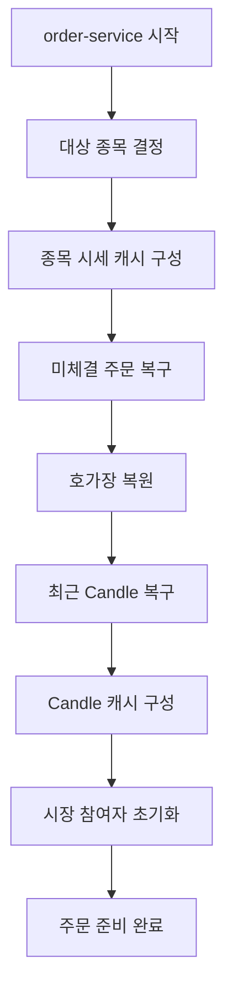
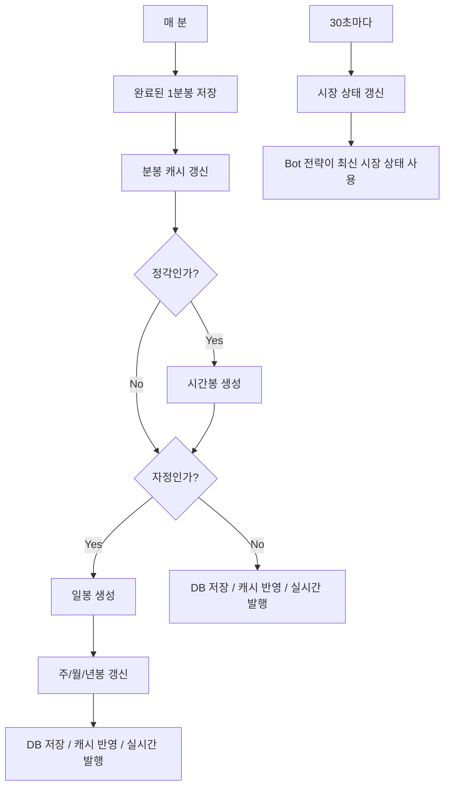

<a id="top"></a>

# 스케줄러 및 초기화 

## 문서 포털

문서의 상세 구현, API, 아키텍처, 트러블슈팅은 아래 문서를 참고합니다.

| 분류 | 문서 | 분류 | 문서 |
| --- | --- | --- | --- |
| 주식 README | [README](../../../README.md) | 주문 서비스 README | [README](../README.md) |
| 설계 노트 | [Engineering Notes](../../../docs/ENGINEERING.md) | 데이터베이스 ERD | [Database Schema ERD](../../../docs/database-schema.md) |
| 주문 서비스 개요 | [주문 서비스 개요](00-order-service-overview.md) | 주문 API | [주문 API](01-order-api.md) |
| Kafka 주문 흐름 | [Kafka 주문 흐름](02-kafka-order-flow.md) | 정산/체결 이벤트 | [정산/체결 이벤트](03-settlement-and-trade-events.md) |
| 호가장 | [호가장](04-orderbook.md) | 매칭 엔진 | [매칭 엔진](05-matching-engine.md) |
| Candle 차트 흐름 | [Candle 차트 흐름](06-candle-chart-flow.md) | 실시간 발행 흐름 | [실시간 발행 흐름](07-websocket-flow.md) |
| Bot 거래 구조 | [Bot 거래 구조](08-bot-trading-flow.md) | 초기화/주기 작업 | [초기화/주기 작업](09-initialization-and-scheduler.md) |
| 주문 서비스 이슈 | [order-service 이슈](10-order-service-issues.md) |  |  |

## 목차

> [서버 시작 초기화](#서버-시작-초기화) ·
> [기본 초기화](#기본-초기화) ·
> [주문 초기화](#주문-초기화) ·
> [캔들 초기화](#캔들-초기화) ·
> [봇 초기화](#봇-초기화)

> [스케줄러](#스케줄러) ·
> [초기화 흐름](#초기화-흐름) ·
> [스케줄러 흐름](#스케줄러-흐름) ·
> [핵심 구현 파일](#핵심-구현-파일)

## 개요

서버 시작 시 주문 처리에 필요한 종목, 호가장, Candle, Bot 데이터를 준비합니다. 실행 중에는 주기 작업으로 완료 Candle 저장과 Bot 주문 생성을 처리합니다.

## 서버 시작 초기화

주문 처리를 시작하기 전에 여러 초기화 컴포넌트가 필요한 데이터를 메모리에 준비합니다. 이 작업은 애플리케이션 시작 시 `@PostConstruct`로 실행합니다.

## 기본 초기화

`Init`은 DB에서 최신 종목을 조회하고, 설정된 할당 종목이 있으면 해당 종목만 대상으로 사용합니다.

초기화 내용:

- `AssignedCodeHolder`에 대상 종목 코드 저장
- 최근 일봉 종가와 당일 분봉을 기준으로 `StockCache(종목 캐시)` 초기화
- 현재가, 고가, 저가, 거래량, 등락 금액, 등락률 계산

### 동작 순서

1. 최신 종목에서 담당 종목을 선택합니다.
2. 담당 종목 코드를 공통 Holder에 저장합니다.
3. 일봉과 당일 분봉으로 시세 캐시를 복구합니다.

### 핵심 코드

```java
List<Stock> latestStocks = stockRepository.findLatestStocks();
List<Stock> targetStocks = assignedCodes.isEmpty()
        ? latestStocks
        : latestStocks.stream()
                .filter(stock -> assignedCodes.contains(stock.getStockCode()))
                .toList();
assignedCodeHolder.setAssignedCodes(
        targetStocks.stream().map(Stock::getStockCode).toList());
```

분산 실행 시 담당하는 종목만 초기화와 스케줄러에서 처리하도록 범위를 결정합니다. 설정과 최신 종목 목록을 입력으로 공통 종목 코드를 만들며, 주문·Candle·Bot 초기화가 같은 범위를 공유합니다.

### 구현 위치

- 담당 종목 결정: `init/Init.java`의 `init()`

## 주문 초기화

`OrderInit`은 `Init` 이후 실행됩니다.

초기화 내용:

- `PENDING`, `PARTIAL` 상태 주문 조회
- 매도 주문은 가격 오름차순, 우선순위 오름차순으로 조회
- 매수 주문은 가격 내림차순, 우선순위 오름차순으로 조회
- 종목별 `OrderBook` 생성 후 `OrderBookCache`에 저장

### 동작 순서

1. 활성 상태 주문을 방향별 우선순위로 조회합니다.
2. 조회된 순서대로 새 호가장에 적재합니다.
3. 종목별 호가장을 캐시에 저장합니다.

### 핵심 코드

```java
List<OrderStatus> activeStatuses =
        List.of(OrderStatus.PENDING, OrderStatus.PARTIAL);
for (String stockCode : assignedCodeHolder.getAssignedCodes()) {
    List<Order> sellOrders = orderRepository
            .findByStockCodeAndTradeTypeAndStatusInOrderByTradePriceAscPriorityAsc(
                    stockCode, tradeType.SELL, activeStatuses);
    List<Order> buyOrders = orderRepository
            .findByStockCodeAndTradeTypeAndStatusInOrderByTradePriceDescPriorityAsc(
                    stockCode, tradeType.BUY, activeStatuses);
    OrderBook orderBook = new OrderBook();
    sellOrders.forEach(orderBook::addOrder);
    buyOrders.forEach(orderBook::addOrder);
    orderBookCache.put(stockCode, orderBook);
}
```

메모리 호가장을 재시작 전과 같은 가격·시간 우선순위로 복원하기 위한 초기화입니다. 활성 주문을 정렬 조회해 호가장에 순서대로 넣고 이후 매칭이 사용하는 캐시에 저장합니다.

### 구현 위치

- 활성 주문 복구: `init/OrderInit.java`의 `init()`

## 캔들 초기화

`CandleInit`은 `OrderInit` 이후 실행됩니다.

초기화 내용:

- 누락된 현재 분봉/일봉 복구
- 최근 Candle DB 조회
- Candle 타입별 메모리 캐시 구성
- 이동평균 포함 Candle 캐시 준비

### 동작 순서

1. Redis의 미확정 Candle을 먼저 복구합니다.
2. DB의 최근 1분봉을 시간순으로 정렬합니다.
3. 각 분봉 주기로 변환해 메모리 캐시를 준비합니다.

### 핵심 코드

```java
candleRestoreService.restoreMinuteCandle(stockCode, now);
candleRestoreService.restoreDayCandle(stockCode, now);
List<CandleMinute> rawMinutes = candleMinuteRepository
        .findByStockCodeOrderByTimeDesc(stockCode, pageRequest);
if (rawMinutes.isEmpty()) {
    return;
}
Collections.reverse(rawMinutes);
for (CandleType type : CandleType.values()) {
    if (!type.isMinuteType()) continue;
    List<Candle> minutes = type != CandleType.ONE_MINUTE
            ? candleSchedulerService.convertToMinute(rawMinutes, type)
            : candleCommonService.convertGeneric(rawMinutes);
    candleCacheService.putCandles(type, stockCode, minutes);
}
```

미확정 Redis 데이터와 확정 DB 데이터를 함께 사용해 재시작 직후 차트 공백을 방지합니다. 담당 종목의 최근 분봉을 입력으로 각 주기 캐시와 이동평균 계산 기반을 복구합니다.

### 구현 위치

- Candle 복구와 캐시 준비: `init/CandleInit.java`의 `init()`

## 봇 초기화

`BotInit`은 `CandleInit` 이후 실행됩니다.

초기화 내용:

- Bot 엔티티 생성 또는 조회
- Bot 보유 주식 생성 또는 조회
- Bot 캐시와 Bot 시세 캐시 구성
- 시장 상태 초기화

### 동작 순서

1. Bot 엔티티와 보유 주식을 조회하거나 생성합니다.
2. Bot 및 전략 인스턴스를 캐시에 등록합니다.
3. 종목 스냅샷 복사본과 시장 상태를 준비합니다.

### 핵심 코드

```java
@PostConstruct
public void init() {
    initBots();
    initBotHaveStocks();
    initBotCache();
}

private void initBotCache() {
    stockCache.getCache().forEach((stockCode, stock) -> {
        StockRealTimeSnapshot copiedStock = stock.botCacheCopy();
        botStockCache.put(stockCode, copiedStock);
        marketStateHolder.updateMarketState(stockCode);
    });
}
```

Bot 전략이 영속 엔티티를 직접 반복 조회하지 않고 실행되도록 필요한 상태를 시작 시 메모리에 구성합니다. 저장된 Bot과 종목 시세를 입력으로 전용 캐시와 시장 상태를 준비합니다.

### 구현 위치

- Bot 실행 상태 초기화: `features/Bot/BotInit.java`

## 스케줄러

활성 스케줄러:

- 매 분 완료된 1분봉 저장
- 분봉 캐시 갱신
- 정각 시간봉 저장
- 자정 일봉 저장과 주/월/년봉 반영
- 30초 간격 시장 상태 갱신

- 개인 Bot 주문 실행
- 외국인 Bot 주문 실행
- 기관 Bot 주문 실행

### 동작 순서

1. 매 분 확정 가능한 1분봉을 Redis에서 DB로 이동합니다.
2. 저장 결과로 분봉 캐시를 갱신합니다.
3. 정각과 자정에는 상위 주기 Candle을 확정합니다.

### 핵심 코드

```java
@Scheduled(cron = "0 * * * * *")
public void candleScheduler() {
    List<String> assignedCodes = assignedCodeHolder.getAssignedCodes();
    LocalDateTime now = LocalDateTime.now();
    List<CandleMinute> savedCandles =
            candleSaveService.save1MinCandle(assignedCodes, now);
    candleSaveService.updateMinuteCaches(savedCandles);
    if (now.getMinute() == 0) {
        candleSaveService.saveHourlyCandles(assignedCodes);
    }
    if (now.getHour() == 0 && now.getMinute() == 0) {
        candleSaveService.saveDailyCandles(assignedCodes);
    }
}
```

각 주기 Candle이 서로 다른 기준 시각으로 확정되는 문제를 막기 위해 하나의 매분 작업에서 분기합니다. 담당 종목과 현재 시각을 입력으로 1분봉부터 상위 주기까지 순서대로 저장하고 캐시와 실시간 발행에 반영합니다.

### 구현 위치

- Candle 확정 스케줄러: `features/Candle/CandleScheduler.java`

## 초기화 흐름



## 스케줄러 흐름



## 핵심 구현 파일

기준 경로

`StockBackEndDistributed/order-service/src/main/java/Poi/Stock`

| 파일 |
| --- |
| `init/Init.java` |
| `init/OrderInit.java` |
| `init/CandleInit.java` |
| `features/Bot/BotInit.java` |
| `features/Candle/CandleScheduler.java` |
| `features/Candle/CandleSchedulerService.java` |
| `features/Bot/BotScheduler.java` |
| `util/AssignedCodeHolder.java` |

<div align="right">

[문서 맨 위로](#top)

</div>


