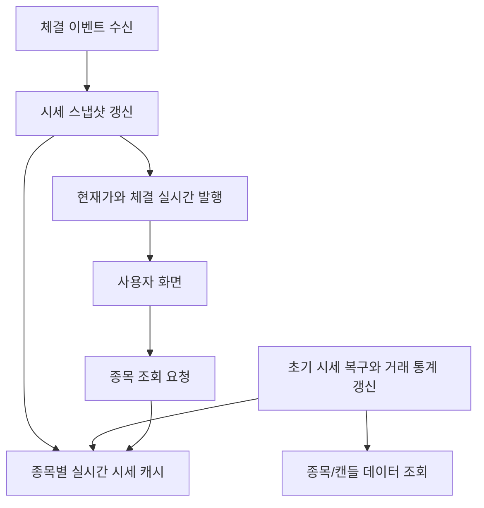

<a id="top"></a>

# 종목 서비스 (stock-service)

[](https://openjdk.org/)
[](https://spring.io/projects/spring-boot)
[](https://spring.io/guides/gs/rest-service/)
[](https://docs.spring.io/spring-framework/reference/web/webflux.html)
[](https://spring.io/projects/spring-security)
[](https://spring.io/projects/spring-data-jpa)
[](https://spring.io/projects/spring-data-redis)
[](https://spring.io/projects/spring-kafka)
[](https://docs.spring.io/spring-framework/reference/web/websocket.html)
[](https://github.com/jwtk/jjwt)
[](https://www.postgresql.org/)

## 문서 포털

문서의 상세 구현, API, 아키텍처, 트러블슈팅은 아래 문서를 참고하세요.

| 분류 | 문서 | 분류 | 문서 |
| --- | --- | --- | --- |
| 주식 README | [README](../../README.md) | 종목 서비스 README | [README](README.md) |
| 설계 노트 | [Engineering Notes](../../docs/ENGINEERING.md) | 데이터베이스 ERD | [Database Schema ERD](../../docs/database-schema.md) |
| 개요 | [개요](docs/01-overview.md) | 종목 API | [종목 API](docs/02-stock-api.md) |
| 실시간 시세 캐시 | [실시간 시세 캐시](docs/03-realtime-stock-cache.md) | Kafka 체결 처리 | [Kafka 체결 처리](docs/04-kafka-trade-execution.md) |
| 실시간 연결 | [실시간 연결](docs/05-websocket.md) | 주기 작업 | [주기 작업](docs/06-scheduler.md) |
| Candle 구조 | [Candle 구조](docs/07-candle-structure.md) | 외부 시세 연동 사용 중단 | [외부 시세 연동 사용 중단](docs/08-external-market-data-disabled.md) |
| 도메인 모델 | [도메인 모델](docs/09-domain-model.md) | 주식 서비스 이슈 | [stock-service 이슈](docs/10-stock-service-issues.md) |
| 주식 서비스 트러블슈팅 | [stock-service 트러블슈팅](docs/11-troubleshooting.md) |  |  |

## 목차

> [서비스 개요](#서비스-개요) ·
> [주요 구현 내용](#주요-구현-내용)

> [시스템 아키텍처](#시스템-아키텍처) ·
> [실행 방법](#실행-방법)

## 서비스 개요

종목 조회, 실시간 시세 스냅샷, Kafka 체결 이벤트 반영, WebSocket 시세 발행을 담당하는 종목 서비스입니다.

`stock-service`는 order-service가 발행한 체결 이벤트로 현재가, 고가, 저가, 누적 거래량, 등락률을 갱신하고 차트 분봉을 이용하여 현재가와 초기 시세 복구, 최근 30분 거래 통계 계산하고 프론트엔드에 WebSocket으로 발행 합니다.

## 주요 구현 내용

| 영역 | 주요 구현 내용 | 사용 기술/처리 방식 | 관련 문서 |
| --- | --- | --- | --- |
| 종목 API | 종목 목록과 단일 종목 조회<br>관심종목용 단일 종목 조회 | REST API 제공<br>`features/Stock/StockController.java` | [종목 API](docs/02-stock-api.md) |
| 실시간 스냅샷 | 현재가·고가·저가 관리<br>거래량과 등락률 관리 | `StockCache` 기반 시세 캐시<br>`StockRealTimeSnapshot.java` | [실시간 시세 캐시](docs/03-realtime-stock-cache.md) |
| Kafka 체결 처리 | `trade-execution-topic` 소비<br>체결 이벤트 기반 종목 시세 반영 | Kafka 이벤트 소비<br>`TradeExecutionConsumer.java` | [Kafka 체결 처리](docs/04-kafka-trade-execution.md) |
| 웹소켓 발행 | 종목별 현재가 발행<br>체결 데이터 실시간 발행 | WebSocket topic 발행<br>`WebSocketService.java` | [실시간 연결](docs/05-websocket.md) |
| 스케줄러 | 서버 시작 시 최신 시세 복구<br>최근 30분 거래 통계 계산 | 초기화 및 주기 작업<br>`StockScheduler`, `StockTradeStatsScheduler` | [주기 작업](docs/06-scheduler.md) |
| Candle 구조 | 초기 시세 복구 데이터 제공<br>최근 30분 통계 계산 지원 | Candle 데이터 조회·집계<br>`features/Candle/*` | [Candle 구조](docs/07-candle-structure.md) |

## 시스템 아키텍처



- 종목 조회 요청은 실시간 시세 캐시를 기준으로 응답한다.
- 체결 이벤트를 수신하면 종목별 현재가, 고가, 저가, 거래량, 등락률을 갱신한다.
- 갱신된 현재가와 체결 데이터는 사용자 화면으로 실시간 발행된다.
- 서버 시작 시 DB의 종목/캔들 데이터로 초기 시세를 복구한다.
- 실행 중에는 최근 30분 거래 통계를 계산해 목록 응답에 반영한다.

## 실행 방법

```bash
.\gradlew.bat bootRun
```

`application-docker.properties` 기준 서비스 포트는 `8082`입니다. DB, Redis, JWT 등 민감 설정 값은 문서에 기록하지 않으며 환경 변수로 분리 필요합니다.

<div align="right">

[문서 맨 위로](#top)

</div>


