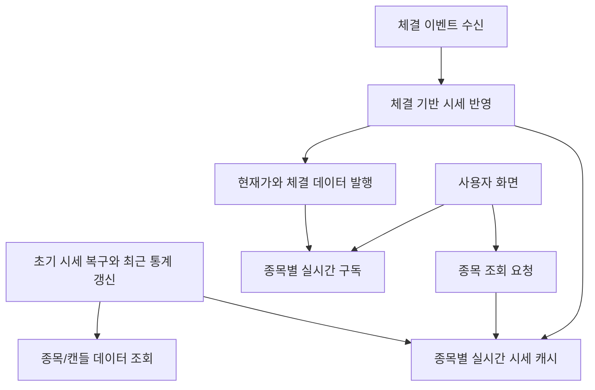

# stock-service 개요

## 문서 포털

문서의 상세 구현, API, 아키텍처, 트러블슈팅은 아래 문서를 참고합니다.

| 분류 | 문서 | 분류 | 문서 |
| --- | --- | --- | --- |
| 주식 README | [README](../../../README.md) | 종목 서비스 README | [README](../README.md) |
| 설계 노트 | [Engineering Notes](../../../docs/ENGINEERING.md) | 데이터베이스 ERD | [Database Schema ERD](../../../docs/database-schema.md) |
| 개요 | [개요](01-overview.md) | 종목 API | [종목 API](02-stock-api.md) |
| 실시간 시세 캐시 | [실시간 시세 캐시](03-realtime-stock-cache.md) | Kafka 체결 처리 | [Kafka 체결 처리](04-kafka-trade-execution.md) |
| 실시간 연결 | [실시간 연결](05-websocket.md) | 주기 작업 | [주기 작업](06-scheduler.md) |
| Candle 구조 | [Candle 구조](07-candle-structure.md) | 외부 시세 연동 사용 중단 | [외부 시세 연동 사용 중단](08-external-market-data-disabled.md) |
| 도메인 모델 | [도메인 모델](09-domain-model.md) | 주식 서비스 이슈 | [stock-service 이슈](10-stock-service-issues.md) |

## 목차

> [개요](#개요) ·
> [주요 책임](#주요-책임) ·
> [외부 의존성](#외부-의존성)

> [분산 캐시 활용 범위](#분산-캐시-활용-범위) ·
> [Candle 사용 범위](#candle-사용-범위) ·
> [상위 구조](#상위-구조) ·
> [핵심 구현 파일](#핵심-구현-파일) · [관련 문서](#관련-문서)

## 개요

종목 서비스는 종목 정보와 실시간 시세를 제공합니다. 시작 시 저장된 종목·Candle 데이터로 시세를 복구하고, 체결 결과를 현재가와 거래량에 반영해 사용자 화면에 전달합니다.

데이터 저장에는 PostgreSQL을 사용하고, 서비스 간 체결 전달에는 Kafka, 화면 갱신에는 WebSocket을 사용합니다.

## 주요 책임

종목 조회, 시세 갱신과 최근 거래 통계 제공을 담당합니다.

### 동작 순서

1. 저장된 종목과 Candle로 초기 시세를 복구합니다.
2. 종목 목록·상세 REST API를 제공합니다.
3. 체결 이벤트를 현재가, 고가, 저가와 거래량에 반영합니다.
4. 종목별 현재가와 체결 내역을 실시간으로 발행합니다.
5. 최근 30분의 매수·매도 수량과 거래대금을 갱신합니다.

### 구현 위치

- 종목 조회와 시세 반영: `features/Stock/StockService.java`
- 실시간 시세 상태: `features/Stock/StockCache.java`
- 초기 복구: `init/StockScheduler.java`
- 최근 거래 통계: `Scheduler/StockTradeStatsScheduler.java`

## 외부 의존성

종목과 Candle은 PostgreSQL에 저장합니다. 체결 이벤트는 Kafka에서 수신하며, Redis를 이용하여 실시간 Candle을 저장합니다.

## Candle 사용 범위

저장된 Candle은 차트 API가 아니라 서비스 시작 시 시세를 복구하고 최근 거래 통계를 계산하는 데 사용합니다.

- 시작 시 `StockScheduler`가 초기 시세 스냅샷을 복구
- `StockTradeStatsScheduler`가 최근 30분 거래 통계를 계산

### 구현 위치

- 분봉 데이터: `features/Candle/CandleMinute.java`
- 일봉 데이터: `features/Candle/CandleDay.java`

## 상위 구조

## 핵심 구현 파일

기준 경로

`StockBackEndDistributed/stock-service`

| 파일 |
| --- |
| `build.gradle` |
| `settings.gradle` |
| `Dockerfile` |
| `src/main/resources/application-docker.properties` |
| `src/main/java/Poi/Stock/StockServiceApplication.java` |

## 관련 문서

- [종목 API](02-stock-api.md)
- [실시간 시세](03-realtime-stock-cache.md)
- [체결 처리](04-kafka-trade-execution.md)

[문서 맨 위로](#top)

