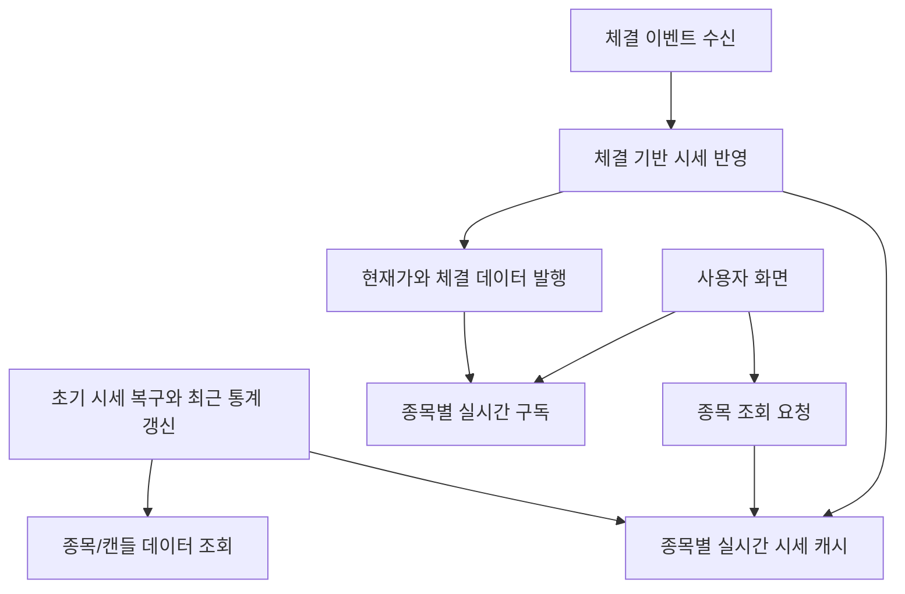

# stock-service 개요

## 문서 포털

문서의 상세 구현, API, 아키텍처, 트러블슈팅은 아래 문서를 참고하세요.

| 분류 | 문서 | 분류 | 문서 |
| --- | --- | --- | --- |
| 루트 README | [README](../../../README.md) | 서비스 README | [README](../README.md) |
| Engineering Notes | [Engineering Notes](../../../docs/ENGINEERING.md) | Database Schema ERD | [Database Schema ERD](../../../docs/database-schema.md) |
| 01 | [개요](01-overview.md) | 02 | [종목 API](02-stock-api.md) |
| 03 | [실시간 시세 캐시](03-realtime-stock-cache.md) | 04 | [Kafka 체결 처리](04-kafka-trade-execution.md) |
| 05 | [실시간 연결](05-websocket.md) | 06 | [주기 작업](06-scheduler.md) |
| 07 | [Candle 구조](07-candle-structure.md) | 08 | [외부 시세 연동 사용 중단](08-external-market-data-disabled.md) |
| 09 | [도메인 모델](09-domain-model.md) | 10 | [stock-service 이슈](10-stock-service-issues.md) |

## 목차

> [개요](#개요) ·
> [주요 책임](#주요-책임) ·
> [핵심 구현 파일](#핵심-구현-파일) ·
> [외부 의존성](#외부-의존성)

> [Redis 사용 범위](#redis-사용-범위) ·
> [Candle 사용 범위](#candle-사용-범위) ·
> [상위 구조](#상위-구조)

## 개요

`stock-service`는 분산 백엔드 구조에서 종목과 실시간 시세 도메인을 담당한다. DB의 종목/캔들 데이터를 기반으로 시작 시 메모리 시세 캐시를 복구하고, Kafka 체결 이벤트를 받아 실시간 시세 스냅샷을 갱신한 뒤 WebSocket으로 클라이언트에 발행한다.

## 주요 책임

- 종목 목록/상세 API 제공
- 관심종목 조회용 종목 상세 API 제공
- 보유 종목 코드 목록 기반 종목 정보 조회
- 실시간 시세 스냅샷 메모리 캐시 관리
- Kafka 체결 이벤트 소비
- 체결 기반 현재가, 고가, 저가, 누적 거래량, 등락률 갱신
- 종목별 WebSocket 시세/체결 발행
- 시작 시 DB 기반 시세 캐시 복구
- 최근 30분 거래 통계 캐시 갱신

## 핵심 구현 파일

기준 경로

`StockBackEndDistributed/stock-service`

| 파일 |
| --- |
| `build.gradle` |
| `settings.gradle` |
| `Dockerfile` |
| `src/main/resources/application-docker.properties` |
| `src/main/java/Poi/Stock/StockServiceApplication.java` |

## 외부 의존성

`stock-service`는 다음 외부 시스템과 연동한다.

- PostgreSQL
- Kafka
- Redis 설정

주의: `application-docker.properties`에는 DB, Redis, JWT 관련 민감정보가 포함되어 있다. 문서에는 값을 기록하지 않으며, 운영/공개 저장소 기준으로는 환경 변수로 분리 필요하다.

## Redis 사용 범위

`RedisConfig`와 `RedisTemplate<String, String>` Bean은 존재한다. 다만 현재 확인 가능한 `stock-service` 주요 흐름에서는 Redis를 직접 사용하는 로직이 거의 없다.

## Candle 사용 범위

`stock-service`의 Candle 구조는 프론트 차트 API 제공용이 아니다. 현재 코드 기준 Candle 데이터는 다음 용도로 사용된다.

- 시작 시 `StockScheduler`가 초기 시세 스냅샷을 복구
- `StockTradeStatsScheduler`가 최근 30분 거래 통계를 계산

## 상위 구조

[문서 맨 위로](#top)

