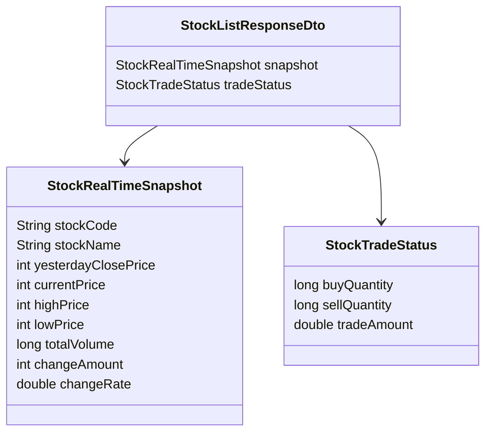

# 종목 API

## 문서 포털

문서의 상세 구현, API, 아키텍처, 트러블슈팅은 아래 문서를 참고하세요.

| 분류 | 문서 | 분류 | 문서 |
| --- | --- | --- | --- |
| 루트 README | [README](../../../README.md) | 서비스 README | [README](../README.md) |
| Engineering Notes | [Engineering Notes](../../../docs/ENGINEERING.md) | Database Schema ERD | [Database Schema ERD](../../../docs/database-schema.md) |
| 01 | [개요](01-overview.md) | 02 | [종목 API](02-stock-api.md) |
| 03 | [실시간 시세 캐시](03-realtime-stock-cache.md) | 04 | [Kafka 체결 처리](04-kafka-trade-execution.md) |
| 05 | [실시간 연결](05-websocket.md) | 06 | [주기 작업](06-scheduler.md) |
| 07 | [Candle 구조](07-candle-structure.md) | 08 | [외부 시세 연동 사용 중단](08-external-market-data-disabled.md) |
| 09 | [도메인 모델](09-domain-model.md) | 10 | [stock-service 이슈](10-stock-service-issues.md) |

## 목차

> [개요](#개요) ·
> [핵심 구현 파일](#핵심-구현-파일) ·
> [엔드포인트](#엔드포인트) ·
> [종목 목록 조회](#종목-목록-조회)

> [단일 종목 조회](#단일-종목-조회) ·
> [관심종목 조회용 API](#관심종목-조회용-api) ·
> [코드 목록 기반 조회](#코드-목록-기반-조회) ·
> [응답 구조](#응답-구조)

## 개요

종목 API는 메모리 시세 캐시(`StockCache`)를 기준으로 종목 목록과 상세 정보를 반환한다. 목록 응답은 실시간 스냅샷과 최근 거래 통계를 함께 포함한다.

## 엔드포인트

| Method | Path | 설명 | 인증 |
| --- | --- | --- | --- |
| GET | `/stock/stocklist` | 전체 종목 목록 조회 | 불필요 |
| GET | `/stock/{stockId}` | 단일 종목 실시간 스냅샷 조회 | 불필요 |
| GET | `/stock/watch/{stockId}` | user-service 관심종목 조회용 단일 종목 조회 | 불필요 |
| POST | `/stock/stocks/info` | 종목 코드 목록으로 여러 종목 정보 조회 | 불필요 |

`SecurityConfig` 기준 `/stock/**`는 permitAll이다.

## 종목 목록 조회

`GET /stock/stocklist`는 전체 종목의 실시간 스냅샷과 최근 거래 통계를 반환한다.
구현은 `StockService.getAllStocks()` (종목 목록 응답 생성 기능)에서 담당한다.

응답 데이터:

- `StockListResponseDto.snapshot`
- `StockListResponseDto.tradeStatus`

`snapshot`은 `StockRealTimeSnapshot`이고, `tradeStatus`는 `StockTradeStatsScheduler`의 캐시에서 가져온 `StockTradeStatus`다.

## 단일 종목 조회

`GET /stock/{stockId}`는 단일 종목의 실시간 스냅샷을 반환한다.
구현은 `StockService.getStock()` (단일 종목 스냅샷 조회 기능)에서 담당한다.

처리 순서:

1. `StockCache`에서 스냅샷 조회
2. 캐시에 있으면 즉시 반환
3. 없으면 DB에서 해당 종목의 최신 `Stock` 조회
4. fallback `StockRealTimeSnapshot` 생성 후 캐시에 저장

fallback snapshot은 가격/거래량 값 대부분을 0으로 생성한다. 이 동작의 주의점은 `10-stock-service-issues.md`에 정리한다.

## 관심종목 조회용 API

`GET /stock/watch/{stockId}`는 `ApiResponse` wrapper 없이 `StockRealTimeSnapshot`을 직접 반환한다. user-service의 관심종목 목록 조회에서 종목 상세 정보를 요청할 때 사용된다.

## 코드 목록 기반 조회

`POST /stock/stocks/info`는 request body의 `codes` 목록을 받아 `StockCache`에서 해당 종목들을 찾아 반환한다.

캐시에 없는 종목은 결과에서 제외된다.

## 응답 구조

## 핵심 구현 파일

기준 경로

`StockBackEndDistributed/stock-service/src/main/java/Poi/Stock`

| 파일 |
| --- |
| `features/Stock/StockController.java` |
| `features/Stock/StockService.java` |
| `features/Stock/StockCache.java` |
| `features/Stock/StockRealTimeSnapshot.java` |
| `features/Stock/StockTradeStatus.java` |
| `DTO/stock/StockListResponseDto.java` |
| `DTO/user/ApiResponse.java` |
| `repository/StockRepository.java` |

[문서 맨 위로](#top)

