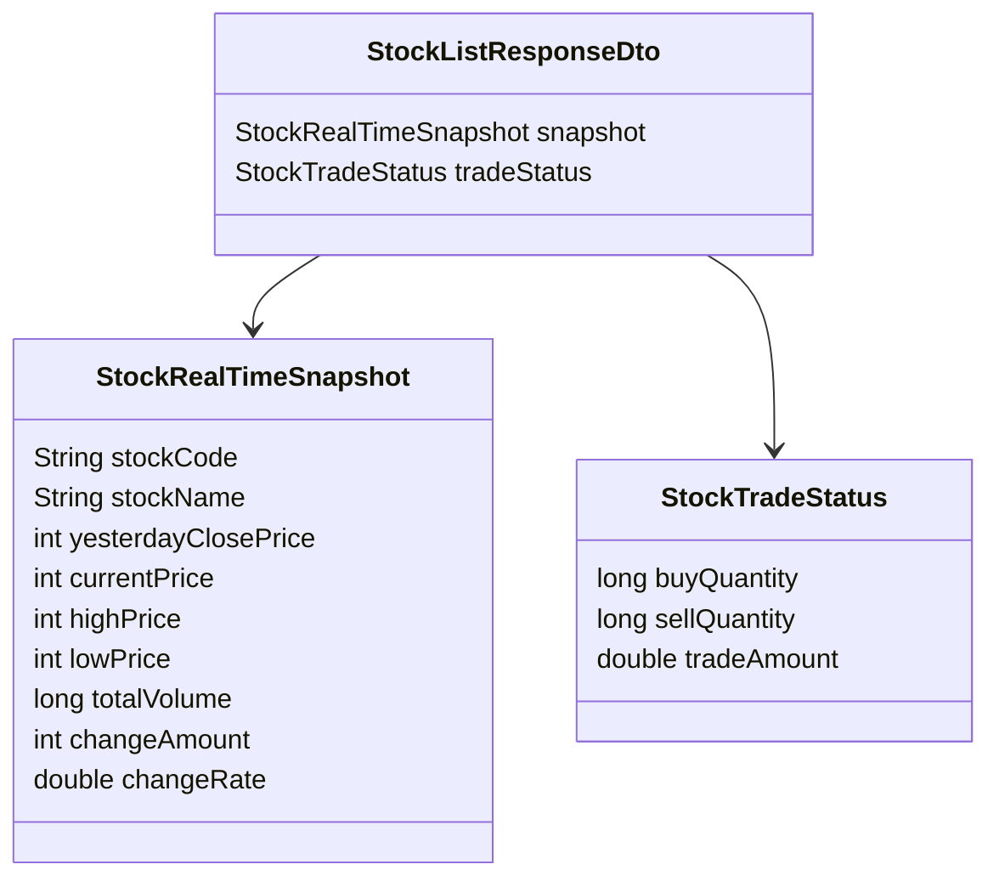

<a id="top"></a>

# 종목 API

## 문서 포털

문서의 상세 구현, API, 아키텍처, 트러블슈팅은 아래 문서를 참고합니다.

| 분류 | 문서 | 분류 | 문서 |
| --- | --- | --- | --- |
| 주식 README | [README](../../../README.md) | 종목 서비스 README | [README](../README.md) |
| 설계 노트 | [Engineering Notes](../../../docs/ENGINEERING.md) | 데이터베이스 ERD | [Database Schema ERD](../../../docs/database-schema.md) |
| 개요 | [개요](01-overview.md) | 종목 API | [종목 API](02-stock-api.md) |
| 실시간 시세 캐시 | [실시간 시세 캐시](03-realtime-stock-cache.md) | Kafka 체결 처리 | [Kafka 체결 처리](04-kafka-trade-execution.md) |
| 실시간 연결 | [실시간 연결](05-websocket.md) | 주기 작업 | [주기 작업](06-scheduler.md) |
| Candle 구조 | [Candle 구조](07-candle-structure.md) | 외부 시세 연동 사용 중단 | [외부 시세 연동 사용 중단](08-external-market-data-disabled.md) |
| 도메인 모델 | [도메인 모델](09-domain-model.md) | 주식 서비스 이슈 | [stock-service 이슈](10-stock-service-issues.md) |

## 목차

> [개요](#개요) ·
> [엔드포인트](#엔드포인트) ·
> [종목 목록 조회](#종목-목록-조회)

> [단일 종목 조회](#단일-종목-조회) ·
> [관심종목 조회용 API](#관심종목-조회용-api) ·
> [코드 목록 기반 조회](#코드-목록-기반-조회) ·
> [응답 구조](#응답-구조) ·
> [핵심 구현 파일](#핵심-구현-파일) · [관련 문서](#관련-문서)
## 개요

종목 REST API는 전체 종목 목록과 선택 종목의 현재 시세를 제공합니다. 목록 응답에는 현재가 스냅샷과 최근 30분 거래 통계가 함께 포함됩니다.


## 엔드포인트

| Method | Path | 설명 | 인증 |
| --- | --- | --- | --- |
| GET | `/stock/stocklist` | 전체 종목 목록 조회 | 불필요 |
| GET | `/stock/{stockId}` | 단일 종목 실시간 스냅샷 조회 | 불필요 |
| GET | `/stock/watch/{stockId}` | user-service 관심종목 조회용 단일 종목 조회 | 불필요 |
| POST | `/stock/stocks/info` | 종목 코드 목록으로 여러 종목 정보 조회 | 불필요 |

`SecurityConfig` 기준 `/stock/**`는 permitAll입니다.

## 종목 목록 조회

전체 종목의 시세와 최근 거래 통계를 조회하는 REST API(`GET /stock/stocklist`)를 제공합니다.

### 동작 순서

1. 메모리에서 종목별 최신 시세를 조회합니다.
2. 최근 매수·매도 수량과 거래대금을 결합합니다.
3. 종목별 목록 응답을 반환합니다.

응답 데이터:

- `StockListResponseDto.snapshot`
- `StockListResponseDto.tradeStatus`

목록 응답의 최신 시세는 `snapshot`, 최근 거래 통계는 `tradeStatus`에 담습니다. 각각 `StockRealTimeSnapshot`과 `StockTradeStatus`를 사용합니다.

### 핵심 코드

```java
public List<StockListResponseDto> getAllStocks() {
    return stockCache.values().stream()
            .map(snapshot -> new StockListResponseDto(snapshot,
                    stockTradeStatsScheduler.getStats(snapshot.getStockCode())))
            .toList();
}
```

목록 API가 데이터베이스로 다시 조회하지 않도록 캐시를 응답의 기준으로 사용합니다. 최근 거래 통계를 결합한 DTO를 만들며, 결과는 전체 종목 화면에 반영됩니다.

### 구현 위치

- 목록 요청: `features/Stock/StockController.java`
- 목록 구성: `features/Stock/StockService.java`의 `getAllStocks()`

## 단일 종목 조회

선택한 종목의 최신 시세를 조회하는 REST API(`GET /stock/{stockId}`)를 제공합니다. 메모리에 데이터가 없으면 저장된 최신 종목 정보로 기본 시세를 생성합니다.

### 동작 순서

1. `StockCache`에서 스냅샷 조회
2. 캐시에 있으면 즉시 반환
3. 없으면 DB에서 해당 종목의 최신 `Stock` 조회
4. fallback `StockRealTimeSnapshot` 생성 후 캐시에 저장

기본 스냅샷은 가격과 거래량 값 대부분을 0으로 생성합니다. 이 동작의 주의점은 `10-stock-service-issues.md`에서 설명합니다.

### 핵심 코드

```java
public StockRealTimeSnapshot getStock(String stockCode) {
    StockRealTimeSnapshot snapshot = stockCache.get(stockCode);
    if (snapshot != null) {
        return snapshot;
    }
    Stock stock = stockRepository.findFirstByStockCodeOrderByDateDesc(stockCode)
            .orElseThrow(() -> new RuntimeException(
                    "주식을 찾을 수 없습니다: " + stockCode));
    snapshot = new StockRealTimeSnapshot(stock.getStockCode(), stock.getStockName(),
            0, 0, 0, 0, 0L, 0, 0.0);
    stockCache.put(stockCode, snapshot);
    return snapshot;
}
```

평상시에는 캐시를 바로 반환하되 서비스 시작 직후처럼 스냅샷이 없는 경우에도 종목 조회 자체가 실패하지 않도록 데이터베이스에서 가져옵니다. 종목 코드를 입력받아 최신 기본 정보를 조회하고 생성한 스냅샷을 캐시와 API 응답에 함께 반영합니다.

### 구현 위치

- 상세 요청: `features/Stock/StockController.java`
- 시세 조회: `features/Stock/StockService.java`의 `getStock()`

## 관심종목 조회용 API

관심 종목의 상세 시세를 서비스 간에 조회하기 위해 REST API(`GET /stock/watch/{stockId}`)를 사용합니다. 응답은 별도 wrapper 없이 시세 스냅샷을 직접 반환합니다.

### 동작 순서

1. URL에서 관심 종목 코드를 받습니다.
2. 일반 단일 종목 조회와 같은 캐시 조회 정책을 사용합니다.
3. 서비스 간 결합을 단순화하기 위해 스냅샷을 직접 반환합니다.

### 핵심 코드

```java
@GetMapping("/watch/{stockId}")
public ResponseEntity<StockRealTimeSnapshot> getWatchStock(
        @PathVariable("stockId") String stockId) {
    StockRealTimeSnapshot stock = stockService.getStock(stockId);
    return ResponseEntity.ok(stock);
}
```

`user-service`가 관심 종목마다 별도의 응답 wrapper를 해석하지 않도록 스냅샷을 직접 제공하는 경계입니다. 종목 코드를 입력받아 공통 조회 로직을 실행하고, 결과는 관심종목 목록의 상세 정보와 결합됩니다.

### 구현 위치

- 관심 종목 조회: `features/Stock/StockController.java`

## 코드 목록 기반 조회

여러 보유 종목의 시세를 한 번에 조회하기 위해 REST API(`POST /stock/stocks/info`)에 종목 코드 목록을 전달합니다.

메모리에 없는 종목은 결과에서 제외합니다.

### 동작 순서

1. 요청 body에서 종목 코드 목록(`codes`)을 추출합니다.
2. 각 코드를 실시간 시세 캐시에서 조회합니다.
3. 조회된 스냅샷만 묶어 응답합니다.

### 핵심 코드

```java
public List<StockRealTimeSnapshot> findByCodes(List<String> codes) {
    if (codes == null || codes.isEmpty()) {
        return List.of();
    }
    return codes.stream()
            .map(stockCache::get)
            .filter(stock -> stock != null)
            .toList();
}
```

코드 목록을 한 번에 캐시 조회하는 로직입니다. 종목 코드 목록을 입력받아 존재하는 스냅샷만 반환하며, 결과는 보유 종목 상세 목록 구성에 사용됩니다.

### 구현 위치

- 코드 목록 조회: `features/Stock/StockController.java`
- 시세 저장소: `features/Stock/StockCache.java`

## 응답 구조


## 핵심 구현 파일

기준 경로

`StockBackEndDistributed/stock-service/src/main/java/Poi/Stock`

| 파일 |
| --- |
| `features/Stock/StockController.java` |
| `features/Stock/StockService.java` |
| `features/Stock/StockCache.java` |
| `features/Stock/StockRealTimeSnapshot.java` |
| `features/Stock/StockTradeStatus.java` |
| `DTO/stock/StockListResponseDto.java` |
| `DTO/user/ApiResponse.java` |
| `repository/StockRepository.java` |

## 관련 문서

- [서비스 개요](01-overview.md)
- [실시간 시세](03-realtime-stock-cache.md)
- [주기 작업](06-scheduler.md)
<div align="right">

[문서 맨 위로](#top)

</div>


