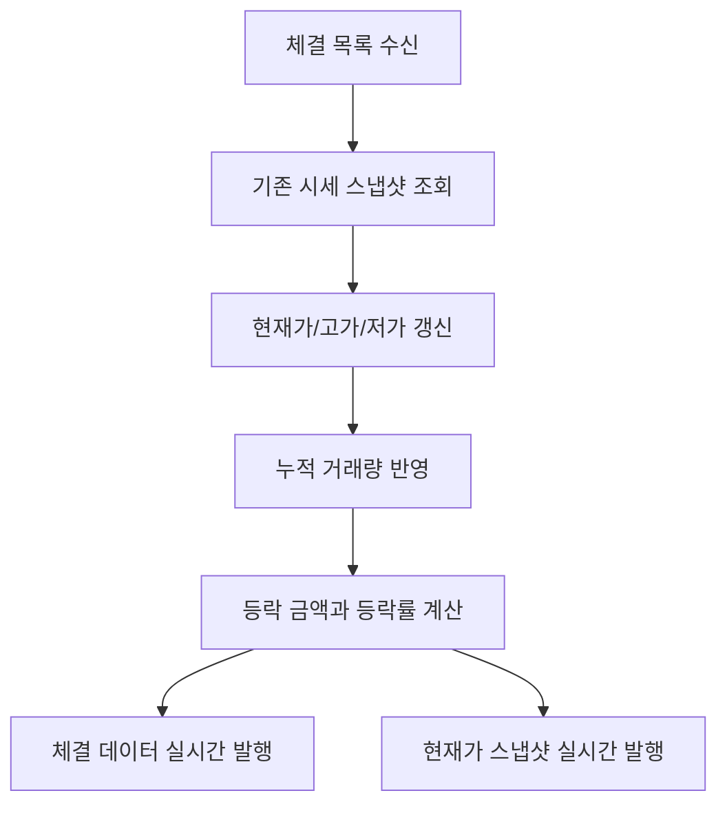

# 실시간 시세 캐시

## 문서 포털

문서의 상세 구현, API, 아키텍처, 트러블슈팅은 아래 문서를 참고하세요.

| 분류 | 문서 | 분류 | 문서 |
| --- | --- | --- | --- |
| 루트 README | [README](../../../README.md) | 서비스 README | [README](../README.md) |
| Engineering Notes | [Engineering Notes](../../../docs/ENGINEERING.md) | Database Schema ERD | [Database Schema ERD](../../../docs/database-schema.md) |
| 01 | [개요](01-overview.md) | 02 | [종목 API](02-stock-api.md) |
| 03 | [실시간 시세 캐시](03-realtime-stock-cache.md) | 04 | [Kafka 체결 처리](04-kafka-trade-execution.md) |
| 05 | [실시간 연결](05-websocket.md) | 06 | [주기 작업](06-scheduler.md) |
| 07 | [Candle 구조](07-candle-structure.md) | 08 | [외부 시세 연동 사용 중단](08-external-market-data-disabled.md) |
| 09 | [도메인 모델](09-domain-model.md) | 10 | [stock-service 이슈](10-stock-service-issues.md) |

## 목차

> [개요](#개요) ·
> [실시간 시세 캐시](#실시간-시세-캐시)

> [시세 스냅샷 데이터](#시세-스냅샷-데이터) ·
> [체결 반영](#체결-반영) ·
> [흐름](#흐름) ·
> [핵심 구현 파일](#핵심-구현-파일)
## 개요

실시간 시세는 DB를 직접 갱신하는 방식이 아니라 메모리 시세 스냅샷을 중심으로 관리된다. Kafka 체결 이벤트가 들어오면 종목별 스냅샷을 갱신하고, 현재가와 체결 내역을 실시간으로 발행한다.

## 실시간 시세 캐시

`StockCache`는 `ConcurrentHashMap<String, StockRealTimeSnapshot>`을 감싼 컴포넌트다.

주요 메서드:

- `getCache()`
- `get(stockCode)`
- `put(stockCode, stock)`
- `values()`

## 시세 스냅샷 데이터

스냅샷 필드:

- `stockCode`
- `stockName`
- `yesterdayClosePrice`
- `currentPrice`
- `highPrice`
- `lowPrice`
- `totalVolume`
- `changeAmount`
- `changeRate`

## 체결 반영

체결 반영 흐름은 같은 종목의 체결 목록을 받아 시세 캐시를 갱신한다.

처리 내용:

1. 체결 목록이 비어 있으면 종료
2. 첫 체결의 `stockCode`로 `StockCache` 조회
3. 캐시가 없으면 종료
4. 마지막 체결 가격을 현재가로 설정
5. 체결 목록의 최고가/최저가를 스냅샷 고가/저가에 반영
6. 체결 수량 합계를 누적 거래량에 더함
7. 전일 종가 기준 등락 금액과 등락률 계산
8. 각 체결을 `/topic/execution/{stockCode}`로 발행
9. 현재가 스냅샷을 `/topic/stock/{stockCode}`로 발행

## 흐름

## 핵심 구현 파일

기준 경로

`StockBackEndDistributed/stock-service/src/main/java/Poi/Stock`

| 파일 |
| --- |
| `features/Stock/StockCache.java` |
| `features/Stock/StockService.java` |
| `features/Stock/StockRealTimeSnapshot.java` |
| `features/webSocket/WebSocketService.java` |
| `object/TradeExecution.java` |
| `object/TradeExecutionList.java` |

[문서 맨 위로](#top)

