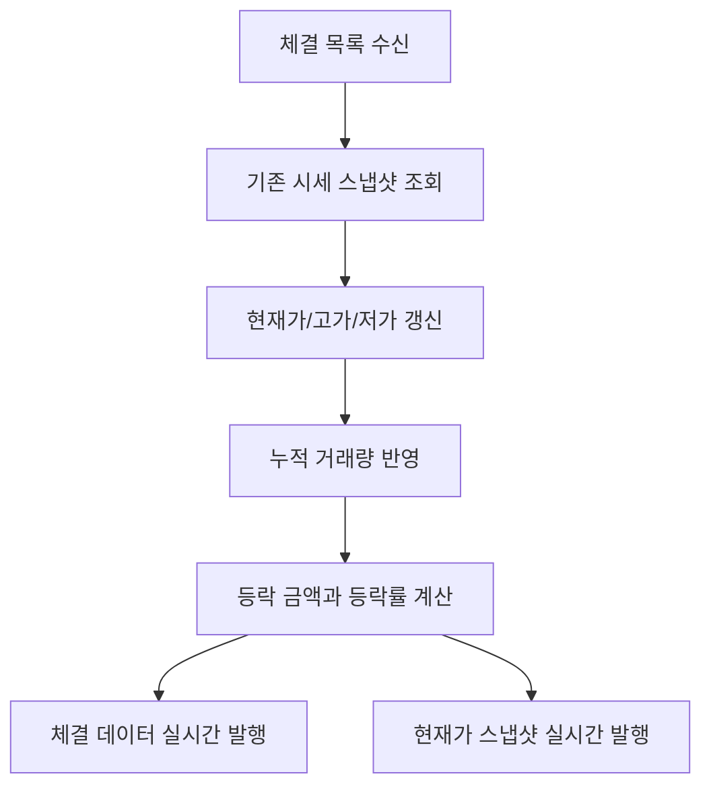

<a id="top"></a>

# 실시간 시세 캐시

## 문서 포털

문서의 상세 구현, API, 아키텍처, 트러블슈팅은 아래 문서를 참고합니다.

| 분류 | 문서 | 분류 | 문서 |
| --- | --- | --- | --- |
| 주식 README | [README](../../../README.md) | 종목 서비스 README | [README](../README.md) |
| 설계 노트 | [Engineering Notes](../../../docs/ENGINEERING.md) | 데이터베이스 ERD | [Database Schema ERD](../../../docs/database-schema.md) |
| 개요 | [개요](01-overview.md) | 종목 API | [종목 API](02-stock-api.md) |
| 실시간 시세 캐시 | [실시간 시세 캐시](03-realtime-stock-cache.md) | Kafka 체결 처리 | [Kafka 체결 처리](04-kafka-trade-execution.md) |
| 실시간 연결 | [실시간 연결](05-websocket.md) | 주기 작업 | [주기 작업](06-scheduler.md) |
| Candle 구조 | [Candle 구조](07-candle-structure.md) | 외부 시세 연동 사용 중단 | [외부 시세 연동 사용 중단](08-external-market-data-disabled.md) |
| 도메인 모델 | [도메인 모델](09-domain-model.md) | 주식 서비스 이슈 | [stock-service 이슈](10-stock-service-issues.md) |

## 목차

> [개요](#개요) ·
> [실시간 시세 캐시](#실시간-시세-캐시)

> [시세 스냅샷 데이터](#시세-스냅샷-데이터) ·
> [체결 반영](#체결-반영) ·
> [흐름](#흐름) ·
> [핵심 구현 파일](#핵심-구현-파일) · [관련 문서](#관련-문서)
## 개요

실시간 시세 상태는 종목별 현재가, 고가, 저가와 누적 거래량을 빠르게 조회할 수 있도록 메모리에 유지합니다. 체결 결과가 도착하면 해당 종목의 값을 갱신하고 사용자 화면에 현재가와 체결 내역을 전달합니다.

체결 결과 수신에는 Kafka를 사용하고 화면 전달에는 WebSocket을 사용합니다.


## 실시간 시세 캐시

종목 코드를 기준으로 최신 시세 스냅샷을 저장하고 조회합니다. 동시 요청에서도 안전하게 값을 변경하도록 `ConcurrentHashMap`을 사용합니다.

주요 메서드:

- `getCache()`
- `get(stockCode)`
- `put(stockCode, stock)`
- `values()`

### 동작 순서

1. 종목 코드를 캐시 키로 사용합니다.
2. 체결 처리와 API 조회가 같은 스냅샷 객체를 공유합니다.
3. 전체 목록 조회에서는 현재 캐시 값만 순회합니다.

### 핵심 코드

```java
private final Map<String, StockRealTimeSnapshot> stockCache =
        new ConcurrentHashMap<>();

public StockRealTimeSnapshot get(String stockCode) {
    return stockCache.get(stockCode);
}

public void put(String stockCode, StockRealTimeSnapshot stock) {
    stockCache.put(stockCode, stock);
}

public Collection<StockRealTimeSnapshot> values() {
    return stockCache.values();
}
```

체결 이벤트 처리와 REST 조회가 동일한 최신 상태를 공유하면서 동시 접근으로 내부 Map이 손상되지 않도록 `ConcurrentHashMap`을 사용합니다. 종목 코드와 스냅샷을 입력받아 저장하며, 조회 결과는 종목 API와 WebSocket 발행의 기준이 됩니다.

### 구현 위치

- 시세 저장과 조회: `features/Stock/StockCache.java`
- 시세 모델: `features/Stock/StockRealTimeSnapshot.java`

## 시세 스냅샷 데이터

시세 스냅샷은 데이터베이스 테이블이 아니라 메모리에 유지하는 조회 모델입니다.

| 구분 | 필드 | Java 타입 | 역할 |
| --- | --- | --- | --- |
| 종목 식별 | `stockCode`, `stockName` | `String` | 종목 코드와 이름 |
| 가격 | `yesterdayClosePrice`, `currentPrice` | `int` | 전일 종가와 현재가 |
| 당일 범위 | `highPrice`, `lowPrice` | `int` | 당일 고가와 저가 |
| 거래량 | `totalVolume` | `long` | 당일 누적 거래량 |
| 등락 | `changeAmount`, `changeRate` | `int`, `double` | 전일 종가 대비 금액과 비율 |

### 구현 위치

- 실시간 시세 모델: `features/Stock/StockRealTimeSnapshot.java`

## 체결 반영

같은 종목의 체결 목록을 현재 시세에 반영하고 변경 결과를 실시간으로 발행합니다.

### 동작 순서

1. 체결 목록이 비어 있으면 종료
2. 첫 체결의 `stockCode`로 `StockCache` 조회
3. 캐시가 없으면 종료
4. 마지막 체결 가격을 현재가로 설정
5. 체결 목록의 최고가/최저가를 스냅샷 고가/저가에 반영
6. 체결 수량 합계를 누적 거래량에 더함
7. 전일 종가 기준 등락 금액과 등락률 계산
8. 체결 내역을 전달하는 WebSocket Topic(`/topic/execution/{stockCode}`)으로 각 체결을 발행
9. 현재가를 전달하는 WebSocket Topic(`/topic/stock/{stockCode}`)으로 시세 스냅샷을 발행

### 핵심 코드

#### 현재가와 당일 범위 갱신

```java
TradeExecution lastExecution = executions.get(executions.size() - 1);
int lastPrice = lastExecution.getPrice();
int maxPrice = executions.stream()
        .mapToInt(TradeExecution::getPrice).max().orElse(lastPrice);
int minPrice = executions.stream()
        .mapToInt(TradeExecution::getPrice).min().orElse(lastPrice);
long addedVolume = executions.stream()
        .mapToLong(TradeExecution::getQuantity).sum();

snapshot.setCurrentPrice(lastPrice);
if (maxPrice > snapshot.getHighPrice()) {
    snapshot.setHighPrice(maxPrice);
}
if (minPrice < snapshot.getLowPrice()) {
    snapshot.setLowPrice(minPrice);
}
snapshot.setTotalVolume(snapshot.getTotalVolume() + addedVolume);
```

한 Kafka 메시지에 여러 체결이 들어와도 마지막 가격과 구간 최고·최저값을 한 번에 계산하기 위한 로직입니다. 체결 목록을 입력으로 현재가·고가·저가·누적 거래량을 갱신하며, 변경된 스냅샷은 이후 API와 WebSocket에서 공유됩니다.

#### 등락 계산과 실시간 발행

```java
int yesterdayClose = snapshot.getYesterdayClosePrice();
int changeAmount = lastPrice - yesterdayClose;
double changeRate = yesterdayClose != 0
        ? ((double) changeAmount / yesterdayClose) * 100.0 : 0.0;

snapshot.setChangeAmount(changeAmount);
snapshot.setChangeRate(changeRate);

for (TradeExecution execution : executions) {
    webSocketService.sendExecution(execution,
            snapshot.getYesterdayClosePrice(), snapshot.getTotalVolume());
}
webSocketService.sendCurrentPrice(snapshot);
```

전일 종가가 0인 경우 나눗셈 오류를 막으면서 화면에 필요한 등락 정보를 계산합니다. 갱신된 스냅샷과 개별 체결을 입력으로 두 종류의 Topic을 발행해 상세 체결과 현재가 화면을 각각 갱신합니다.

### 구현 위치

- 체결 반영: `features/Stock/StockService.java`
- 실시간 발행: `features/webSocket/WebSocketService.java`

## 흐름


## 핵심 구현 파일

기준 경로

`StockBackEndDistributed/stock-service/src/main/java/Poi/Stock`

| 파일 |
| --- |
| `features/Stock/StockCache.java` |
| `features/Stock/StockService.java` |
| `features/Stock/StockRealTimeSnapshot.java` |
| `features/webSocket/WebSocketService.java` |
| `object/TradeExecution.java` |
| `object/TradeExecutionList.java` |

## 관련 문서

- [종목 API](02-stock-api.md)
- [체결 이벤트](04-kafka-trade-execution.md)
- [실시간 발행](05-websocket.md)


<div align="right">

[문서 맨 위로](#top)

</div>


