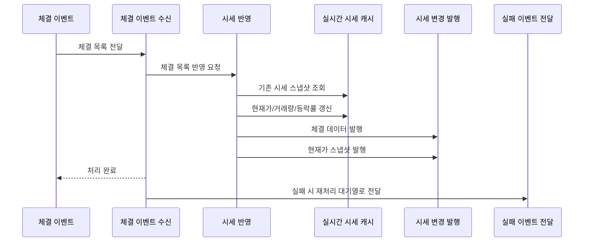

<a id="top"></a>

# 체결 이벤트 처리

## 문서 포털

문서의 상세 구현, API, 아키텍처, 트러블슈팅은 아래 문서를 참고합니다.

| 분류 | 문서 | 분류 | 문서 |
| --- | --- | --- | --- |
| 주식 README | [README](../../../README.md) | 종목 서비스 README | [README](../README.md) |
| 설계 노트 | [Engineering Notes](../../../docs/ENGINEERING.md) | 데이터베이스 ERD | [Database Schema ERD](../../../docs/database-schema.md) |
| 개요 | [개요](01-overview.md) | 종목 API | [종목 API](02-stock-api.md) |
| 실시간 시세 캐시 | [실시간 시세 캐시](03-realtime-stock-cache.md) | Kafka 체결 처리 | [Kafka 체결 처리](04-kafka-trade-execution.md) |
| 실시간 연결 | [실시간 연결](05-websocket.md) | 주기 작업 | [주기 작업](06-scheduler.md) |
| Candle 구조 | [Candle 구조](07-candle-structure.md) | 외부 시세 연동 사용 중단 | [외부 시세 연동 사용 중단](08-external-market-data-disabled.md) |
| 도메인 모델 | [도메인 모델](09-domain-model.md) | 주식 서비스 이슈 | [stock-service 이슈](10-stock-service-issues.md) |

## 목차

> [개요](#개요) ·
> [소비 토픽](#소비-토픽) ·
> [메시지 구조](#메시지-구조)

> [처리 흐름](#처리-흐름) ·
> [실패 처리](#실패-처리) ·
> [체결 이벤트 처리 흐름](#체결-이벤트-처리-흐름) ·
> [설정 주의](#설정-주의) ·
> [핵심 구현 파일](#핵심-구현-파일) · [관련 문서](#관련-문서)
## 개요

주문 서비스에서 전달한 체결 결과를 현재가, 거래량과 등락률에 반영합니다. 정상 처리된 결과는 사용자 화면에 전달하고, 실패한 이벤트는 최대 3회 재처리합니다.

서비스 간 이벤트 전달과 재처리에는 Kafka Topic과 DLT를 사용합니다.


## 소비 토픽

체결 목록을 수신하는 Kafka Topic(`trade-execution-topic`)을 소비합니다.

여러 인스턴스가 체결 이벤트를 나눠 처리하기 위한 Consumer Group:

- `stock-service-group`

## 메시지 구조

`TradeExecutionList`:

- `executions`

`TradeExecution`:

- `tradeType`
- `buyerId`
- `sellerId`
- `quantity`
- `price`
- `stockCode`
- `time`

## 처리 흐름

체결 목록을 종목별 시세에 반영한 뒤 현재가와 체결 데이터를 실시간으로 발행합니다.

### 동작 순서

1. 체결 이벤트 Topic에서 체결 목록을 수신합니다.
2. 종목별 최신 시세를 조회합니다.
3. 현재가, 고가, 저가와 누적 거래량을 갱신합니다.
4. 등락 금액과 등락률을 계산합니다.
5. 변경된 현재가와 체결 내역을 발행합니다.

### 핵심 코드

```java
@KafkaListener(topics = "trade-execution-topic", groupId = "stock-service-group")
@Transactional
public void consumeTradeExecution(@Payload TradeExecutionList message) {
    try {
        stockService.applyTradeExecutions(message.getExecutions());
    } catch (Exception e) {
        log.error("시세 처리 실패: {}", e.getMessage());
        kafkaProducer.sendToExecutionDLT(message);
    }
}
```
시세 반영과 실패 전달을 함께 관리해 예외가 이벤트 유실로 이어지는 것을 막습니다. 체결 목록 메시지를 입력받아 시세 갱신을 시도하고, 실패하면 원본 메시지를 DLT에 보존합니다.

### 구현 위치

- 이벤트 수신: `features/kafka/TradeExecutionConsumer.java`
- 시세 반영: `features/Stock/StockService.java`

## 실패 처리

체결 처리 중 예외가 발생하면 실패 이벤트를 재처리용 Kafka DLT Topic(`trade-execution-topic-DLT`)으로 전달합니다.

같은 메시지는 최대 3회 재처리하며 재시도 사이에는 지수 증가 대기 시간을 둡니다.

### 동작 순서

1. DLT에서 실패한 원본 체결 목록을 수신합니다.
2. 최대 3회까지 동일한 시세 반영을 다시 시도합니다.
3. 재시도 사이의 대기 시간을 지수 형태로 늘립니다.

### 핵심 코드

```java
@KafkaListener(topics = "trade-execution-topic-DLT", groupId = "stock-dlt-group")
public void consumeDLT(@Payload TradeExecutionList message) {
    log.error("DLT 시세 메시지 수신");
    int maxRetry = 3;
    Exception lastException = null;
    for (int attempt = 1; attempt <= maxRetry; attempt++) {
        try {
            stockService.applyTradeExecutions(message.getExecutions());
            log.info("DLT 재처리 성공 - attempt: {}", attempt);
            return;
        } catch (Exception e) {
            lastException = e;
            log.warn("DLT 재시도 실패 [{}/{}]: {}",
                    attempt, maxRetry, e.getMessage());
            if (attempt < maxRetry)
                sleep(attempt);
        }
    }
}
```

이벤트를 복구할 수 있도록 DLT Consumer가 제한된 횟수로 재처리합니다. 실패 메시지를 입력받아 성공 시 즉시 종료하고, 반복 실패 시 다음 후속 처리 대상으로 남깁니다.

### 구현 위치

- 실패 이벤트 발행: `features/kafka/KafkaProducer.java`의 `sendToExecutionDLT()`
- 재처리: `features/kafka/TradeExecutionConsumer.java`

## 체결 이벤트 처리 흐름



## 설정 주의

체결 이벤트를 수신하려면 메시지 서버 주소가 필요합니다. 현재 `application-docker.properties`에서는 Kafka bootstrap 설정을 명확히 확인하기 어려우며, 자세한 내용은 `10-stock-service-issues.md`에서 설명합니다.

## 핵심 구현 파일

기준 경로

`StockBackEndDistributed/stock-service/src/main`

| 파일 |
| --- |
| `java/Poi/Stock/features/kafka/TradeExecutionConsumer.java` |
| `java/Poi/Stock/features/kafka/KafkaProducer.java` |
| `java/Poi/Stock/features/Stock/StockService.java` |
| `java/Poi/Stock/object/TradeExecution.java` |
| `java/Poi/Stock/object/TradeExecutionList.java` |
| `resources/application-docker.properties` |

## 관련 문서

- [실시간 시세](03-realtime-stock-cache.md)
- [실시간 발행](05-websocket.md)
- [서비스 이슈](10-stock-service-issues.md)

<div align="right">

[문서 맨 위로](#top)

</div>


