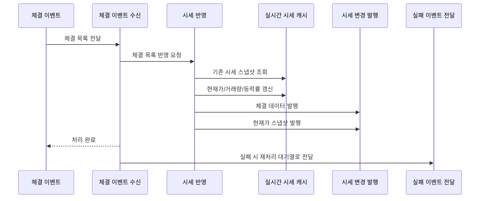

# Kafka 체결 처리

## 문서 포털

문서의 상세 구현, API, 아키텍처, 트러블슈팅은 아래 문서를 참고하세요.

| 분류 | 문서 | 분류 | 문서 |
| --- | --- | --- | --- |
| 루트 README | [README](../../../README.md) | 서비스 README | [README](../README.md) |
| Engineering Notes | [Engineering Notes](../../../docs/ENGINEERING.md) | Database Schema ERD | [Database Schema ERD](../../../docs/database-schema.md) |
| 01 | [개요](01-overview.md) | 02 | [종목 API](02-stock-api.md) |
| 03 | [실시간 시세 캐시](03-realtime-stock-cache.md) | 04 | [Kafka 체결 처리](04-kafka-trade-execution.md) |
| 05 | [실시간 연결](05-websocket.md) | 06 | [주기 작업](06-scheduler.md) |
| 07 | [Candle 구조](07-candle-structure.md) | 08 | [외부 시세 연동 사용 중단](08-external-market-data-disabled.md) |
| 09 | [도메인 모델](09-domain-model.md) | 10 | [stock-service 이슈](10-stock-service-issues.md) |

## 목차

> [개요](#개요) ·
> [소비 토픽](#소비-토픽) ·
> [메시지 구조](#메시지-구조)

> [처리 흐름](#처리-흐름) ·
> [실패 처리](#실패-처리) ·
> [Kafka 체결 처리 흐름](#kafka-체결-처리-흐름) ·
> [설정 주의](#설정-주의) ·
> [핵심 구현 파일](#핵심-구현-파일)
## 개요

stock-service는 Kafka에서 체결 이벤트로 실시간 시세 캐시를 갱신한다. 실패한 메시지는 DLT 토픽으로 전송하고, DLT consumer에서 최대 3회 재처리를 시도한다.

## 소비 토픽

체결 이벤트 수신 흐름은 다음 토픽을 소비한다.

- `trade-execution-topic`

consumer group:

- `stock-service-group`

## 메시지 구조

`TradeExecutionList`:

- `executions`

`TradeExecution`:

- `tradeType`
- `buyerId`
- `sellerId`
- `quantity`
- `price`
- `stockCode`
- `time`

## 처리 흐름

Kafka 메시지를 받으면 체결 목록을 실시간 시세 캐시에 반영하고, 갱신된 현재가와 체결 데이터를 실시간으로 발행한다.

## 실패 처리

체결 처리 중 예외가 발생하면 실패한 체결 메시지를 재처리 대기열로 전달한다.
구현은 `KafkaProducer.sendToExecutionDLT()` (체결 실패 이벤트 전달 기능)에서 담당한다.

DLT 토픽:

- `trade-execution-topic-DLT`

DLT consumer는 같은 메시지를 최대 3회 재처리한다. 재시도 사이에는 지수 증가 대기 시간을 둔다.

## Kafka 체결 처리 흐름

## 설정 주의

Kafka 의존성은 존재하지만 현재 `application-docker.properties`에서 Kafka bootstrap 설정이 명시적으로 확인되지 않는다. 이 부분은 `10-stock-service-issues.md`에 개선 필요 항목으로 정리한다.

## 핵심 구현 파일

기준 경로

`StockBackEndDistributed/stock-service/src/main`

| 파일 |
| --- |
| `java/Poi/Stock/features/kafka/TradeExecutionConsumer.java` |
| `java/Poi/Stock/features/kafka/KafkaProducer.java` |
| `java/Poi/Stock/features/Stock/StockService.java` |
| `java/Poi/Stock/object/TradeExecution.java` |
| `java/Poi/Stock/object/TradeExecutionList.java` |
| `resources/application-docker.properties` |

[문서 맨 위로](#top)

