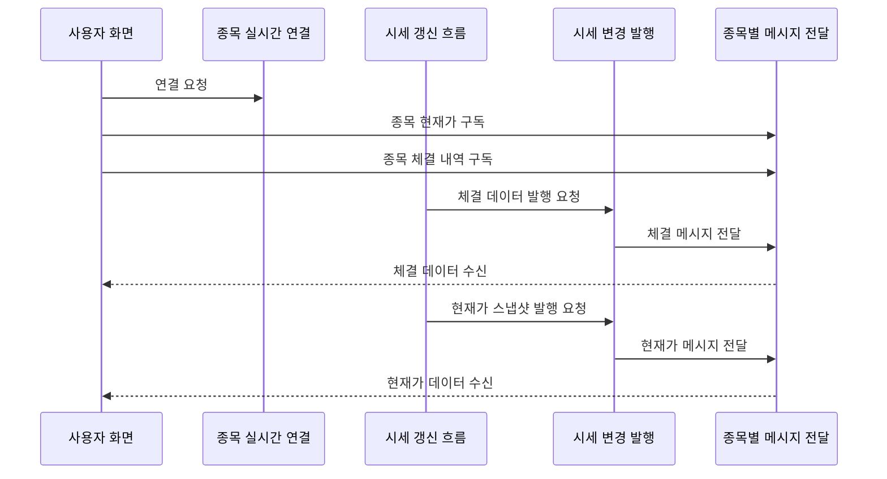

<a id="top"></a>

# 시세 실시간 발행

## 문서 포털

문서의 상세 구현, API, 아키텍처, 트러블슈팅은 아래 문서를 참고합니다.

| 분류 | 문서 | 분류 | 문서 |
| --- | --- | --- | --- |
| 주식 README | [README](../../../README.md) | 종목 서비스 README | [README](../README.md) |
| 설계 노트 | [Engineering Notes](../../../docs/ENGINEERING.md) | 데이터베이스 ERD | [Database Schema ERD](../../../docs/database-schema.md) |
| 개요 | [개요](01-overview.md) | 종목 API | [종목 API](02-stock-api.md) |
| 실시간 시세 캐시 | [실시간 시세 캐시](03-realtime-stock-cache.md) | Kafka 체결 처리 | [Kafka 체결 처리](04-kafka-trade-execution.md) |
| 실시간 연결 | [실시간 연결](05-websocket.md) | 주기 작업 | [주기 작업](06-scheduler.md) |
| Candle 구조 | [Candle 구조](07-candle-structure.md) | 외부 시세 연동 사용 중단 | [외부 시세 연동 사용 중단](08-external-market-data-disabled.md) |
| 도메인 모델 | [도메인 모델](09-domain-model.md) | 주식 서비스 이슈 | [stock-service 이슈](10-stock-service-issues.md) |

## 목차

> [개요](#개요) ·
> [실시간 연결 설정](#실시간-연결-설정) ·
> [Principal 설정](#principal-설정)

> [발행 토픽](#발행-토픽) ·
> [현재가 발행 Payload](#현재가-발행-payload) ·
> [체결 발행 Payload](#체결-발행-payload) ·
> [시세 실시간 발행 흐름](#시세-실시간-발행-흐름) ·
> [핵심 구현 파일](#핵심-구현-파일) · [관련 문서](#관련-문서)
## 개요

시세 실시간 발행은 선택 종목의 현재가와 체결 내역을 사용자 화면에 즉시 전달합니다.

클라이언트는 종목 실시간 연결 Endpoint(`/ws-stock`)에 접속합니다. 이후 현재가와 체결 내역을 전달하는 Topic을 구독하며, 연결에는 SockJS와 STOMP를 사용합니다.


## 실시간 연결 설정

클라이언트 연결과 메시지 전달에 필요한 주소 체계와 heartbeat를 설정합니다.

- 종목 실시간 연결 Endpoint: `/ws-stock`
- 브라우저 호환 연결 방식: SockJS
- 종목별 메시지를 전달하는 Broker prefix: `/topic`, `/queue`
- 클라이언트 요청을 받는 application prefix: `/app`
- 사용자별 메시지를 구분하는 destination prefix: `/user`
- heartbeat: 10초 송신/수신

### 동작 순서

1. 종목 Topic과 사용자 Queue를 처리할 브로커 prefix를 설정합니다.
2. 10초 heartbeat로 끊어진 연결을 감지합니다.
3. `/ws-stock` endpoint에 SockJS fallback을 적용합니다.

### 핵심 코드

#### 메시지 브로커

```java
public void configureMessageBroker(MessageBrokerRegistry config) {
    ThreadPoolTaskScheduler scheduler = new ThreadPoolTaskScheduler();
    scheduler.setPoolSize(1);
    scheduler.setThreadNamePrefix("wss-heartbeat-thread-");
    scheduler.initialize();

    config.enableSimpleBroker("/topic", "/queue")
            .setHeartbeatValue(new long[]{10000, 10000})
            .setTaskScheduler(scheduler);
    config.setApplicationDestinationPrefixes("/app");
    config.setUserDestinationPrefix("/user");
}
```

#### 연결 Endpoint

```java
public void registerStompEndpoints(StompEndpointRegistry registry) {
    registry.addEndpoint("/ws-stock")
            .setAllowedOriginPatterns("*")
            .withSockJS();
}
```

현재가와 체결 메시지의 전달 경로를 역할별 prefix로 분리해 구독 목적지를 예측할 수 있게 합니다. heartbeat와 SockJS 설정은 연결 단절 감지와 브라우저 호환성을 보완합니다.

### 구현 위치

- 연결 설정: `config/WebSocketConfig.java`

## Principal 설정

연결 사용자를 구분하기 위해 요청 header의 `userId`를 사용자 식별자로 설정합니다. 이 과정에서 STOMP CONNECT header와 `StompPrincipal`을 사용합니다.

주의: 현재 구조는 CONNECT header의 `userId`를 그대로 신뢰합니다. 이 문제는 `10-stock-service-issues.md`에 정리합니다.

### 동작 순서

1. STOMP `CONNECT` 메시지를 식별합니다.
2. native header에서 `userId`를 읽습니다.
3. 해당 값을 연결 Principal로 설정합니다.

### 핵심 코드

```java
public Message<?> preSend(Message<?> message, MessageChannel channel) {
    StompHeaderAccessor accessor =
            MessageHeaderAccessor.getAccessor(message, StompHeaderAccessor.class);
    if (accessor != null && StompCommand.CONNECT.equals(accessor.getCommand())) {
        String userId = accessor.getFirstNativeHeader("userId");
        if (userId != null) {
            accessor.setUser(new StompPrincipal(userId));
        }
    }
    return message;
}
```

사용자별 목적지가 필요할 때 STOMP 연결을 식별할 수 있도록 native header를 Principal로 변환합니다. 입력된 `userId`는 연결 사용자 식별에 반영되지만 별도 인증 없이 신뢰한다는 보안 한계가 있습니다.

### 구현 위치

- 연결 사용자 설정: `config/WebSocketConfig.java`의 `configureClientInboundChannel()`

## 발행 토픽

| 전달 역할 | WebSocket Topic | Payload |
| --- | --- | --- |
| 종목별 현재가 변경 전달 | `/topic/stock/{stockCode}` | 현재가, 고가, 저가, 누적 거래량, 등락 금액, 등락률 |
| 종목별 체결 내역 전달 | `/topic/execution/{stockCode}` | 체결 방향, 체결가, 수량, 등락률, 누적 거래량, 시간 |

## 현재가 발행 Payload

현재가 변경 메시지는 다음 값을 전송합니다.

- `stockCode`
- `currentPrice`
- `highPrice`
- `lowPrice`
- `totalVolume`
- `changeAmount`
- `changeRate`

### 동작 순서

1. 최신 시세 스냅샷에서 화면 갱신 필드를 추출합니다.
2. 종목 코드를 현재가 Topic 경로에 결합합니다.
3. 해당 종목 구독자에게 payload를 발행합니다.

### 핵심 코드

```java
public void sendCurrentPrice(StockRealTimeSnapshot snapshot) {
    Map<String, Object> payload = new HashMap<>();
    payload.put("stockCode", snapshot.getStockCode());
    payload.put("currentPrice", snapshot.getCurrentPrice());
    payload.put("highPrice", snapshot.getHighPrice());
    payload.put("lowPrice", snapshot.getLowPrice());
    payload.put("totalVolume", snapshot.getTotalVolume());
    payload.put("changeAmount", snapshot.getChangeAmount());
    payload.put("changeRate", snapshot.getChangeRate());
    messagingTemplate.convertAndSend(
            "/topic/stock/" + snapshot.getStockCode(), payload);
}
```

최신 스냅샷을 입력받아 종목별 Topic에 전송하며, 결과는 목록과 상세 화면의 시세에 반영됩니다.

### 구현 위치

- 현재가 발행: `features/webSocket/WebSocketService.java`의 `sendCurrentPrice()`

## 체결 발행 Payload

체결 메시지는 다음 값을 전송합니다.

- `tradeType`
- `price`
- `quantity`
- `changeRate`
- `totalVolume`
- `time`

### 동작 순서

1. 체결가를 전일 종가와 비교해 등락률을 계산합니다.
2. 체결 정보와 누적 거래량으로 payload를 구성합니다.
3. 종목별 체결 Topic에 메시지를 발행합니다.

### 핵심 코드

```java
public void sendExecution(TradeExecution execution,
        Integer yesterdayClosePrice, Long totalVolume) {
    double changeRate = 0.0;
    if (yesterdayClosePrice != null && yesterdayClosePrice != 0) {
        changeRate = (double) (execution.getPrice() - yesterdayClosePrice)
                / yesterdayClosePrice * 100;
    }
    Map<String, Object> payload = new HashMap<>();
    payload.put("tradeType", execution.getTradeType());
    payload.put("price", execution.getPrice());
    payload.put("quantity", execution.getQuantity());
    payload.put("changeRate", changeRate);
    payload.put("totalVolume", totalVolume);
    payload.put("time", execution.getTime().toString());
    messagingTemplate.convertAndSend(
            "/topic/execution/" + execution.getStockCode(), payload);
}
```

개별 체결이 발생한 즉시 체결 방향과 가격 변화를 상세 화면에 전달하기 위한 로직입니다. 체결·전일 종가·누적 거래량을 입력받아 종목별 체결 payload를 만들고 체결 내역 구독에 반영합니다.

### 구현 위치

- 체결 발행: `features/webSocket/WebSocketService.java`의 `sendExecution()`

## 시세 실시간 발행 흐름




## 핵심 구현 파일

기준 경로

`StockBackEndDistributed/stock-service/src/main/java/Poi/Stock`

| 파일 |
| --- |
| `config/WebSocketConfig.java` |
| `config/StompPrincipal.java` |
| `features/webSocket/WebSocketService.java` |
| `features/Stock/StockService.java` |
| `features/Stock/StockRealTimeSnapshot.java` |
| `object/TradeExecution.java` |

## 관련 문서

- [실시간 시세](03-realtime-stock-cache.md)
- [체결 처리](04-kafka-trade-execution.md)
- [프론트엔드 실시간 연결](../../../StockFrontEnd/docs/09-websocket.md)

<div align="right">

[문서 맨 위로](#top)

</div>


