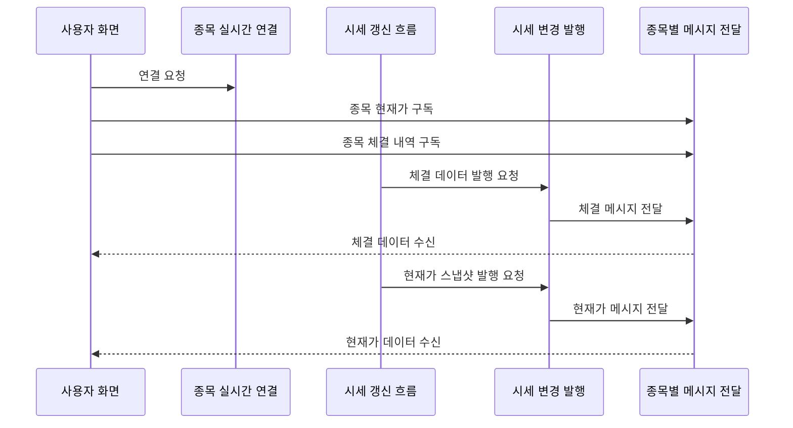

# 시세 실시간 발행

## 문서 포털

문서의 상세 구현, API, 아키텍처, 트러블슈팅은 아래 문서를 참고하세요.

| 분류 | 문서 | 분류 | 문서 |
| --- | --- | --- | --- |
| 루트 README | [README](../../../README.md) | 서비스 README | [README](../README.md) |
| Engineering Notes | [Engineering Notes](../../../docs/ENGINEERING.md) | Database Schema ERD | [Database Schema ERD](../../../docs/database-schema.md) |
| 01 | [개요](01-overview.md) | 02 | [종목 API](02-stock-api.md) |
| 03 | [실시간 시세 캐시](03-realtime-stock-cache.md) | 04 | [Kafka 체결 처리](04-kafka-trade-execution.md) |
| 05 | [실시간 연결](05-websocket.md) | 06 | [주기 작업](06-scheduler.md) |
| 07 | [Candle 구조](07-candle-structure.md) | 08 | [외부 시세 연동 사용 중단](08-external-market-data-disabled.md) |
| 09 | [도메인 모델](09-domain-model.md) | 10 | [stock-service 이슈](10-stock-service-issues.md) |

## 목차

> [개요](#개요) ·
> [핵심 구현 파일](#핵심-구현-파일) ·
> [STOMP 설정](#stomp-설정) ·
> [Principal 설정](#principal-설정)

> [발행 토픽](#발행-토픽) ·
> [현재가 발행 Payload](#현재가-발행-payload) ·
> [체결 발행 Payload](#체결-발행-payload) ·
> [시세 실시간 발행 흐름](#시세-실시간-발행-흐름)

## 개요

stock-service는 STOMP over SockJS 방식으로 프론트에 종목별 현재가와 체결 데이터를 발행한다. 클라이언트는 `/ws-stock` endpoint에 연결하고 `/topic/stock/{stockCode}`, `/topic/execution/{stockCode}`를 구독한다.

## STOMP 설정

`WebSocketConfig` 설정:

- endpoint: `/ws-stock`
- SockJS 사용
- simple broker prefix: `/topic`, `/queue`
- application destination prefix: `/app`
- user destination prefix: `/user`
- heartbeat: 10초 송신/수신

## Principal 설정

STOMP CONNECT 메시지의 native header에서 `userId`를 읽고 `StompPrincipal(userId)`로 설정한다.

주의: 현재 구조는 CONNECT header의 `userId`를 그대로 신뢰한다. 이 문제는 `10-stock-service-issues.md`에 정리한다.

## 발행 토픽

| 토픽 | 발행 메서드 | Payload |
| --- | --- | --- |
| `/topic/stock/{stockCode}` | `sendCurrentPrice(snapshot)` | 현재가, 고가, 저가, 누적 거래량, 등락 금액, 등락률 |
| `/topic/execution/{stockCode}` | `sendExecution(...)` | 체결 방향, 체결가, 수량, 등락률, 누적 거래량, 시간 |

## 현재가 발행 Payload

`sendCurrentPrice()` (현재가 변경 메시지 발행 기능)는 다음 값을 전송한다.

- `stockCode`
- `currentPrice`
- `highPrice`
- `lowPrice`
- `totalVolume`
- `changeAmount`
- `changeRate`

## 체결 발행 Payload

`sendExecution()` (체결 메시지 발행 기능)은 다음 값을 전송한다.

- `tradeType`
- `price`
- `quantity`
- `changeRate`
- `totalVolume`
- `time`

## 시세 실시간 발행 흐름

## 핵심 구현 파일

기준 경로

`StockBackEndDistributed/stock-service/src/main/java/Poi/Stock`

| 파일 |
| --- |
| `config/WebSocketConfig.java` |
| `config/StompPrincipal.java` |
| `features/webSocket/WebSocketService.java` |
| `features/Stock/StockService.java` |
| `features/Stock/StockRealTimeSnapshot.java` |
| `object/TradeExecution.java` |

[문서 맨 위로](#top)

