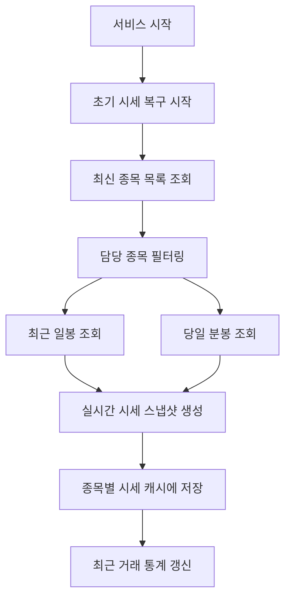
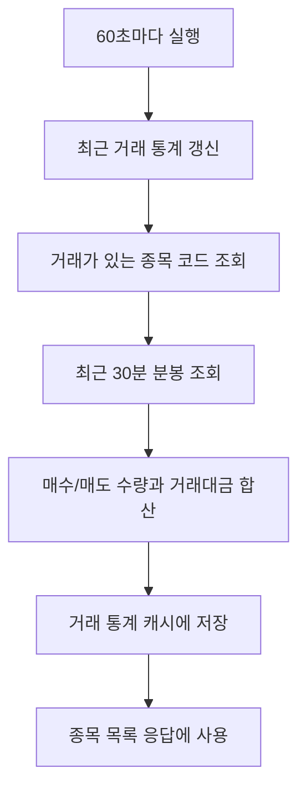

<a id="top"></a>

# 주기 작업 구조

## 문서 포털

문서의 상세 구현, API, 아키텍처, 트러블슈팅은 아래 문서를 참고합니다.

| 분류 | 문서 | 분류 | 문서 |
| --- | --- | --- | --- |
| 주식 README | [README](../../../README.md) | 종목 서비스 README | [README](../README.md) |
| 설계 노트 | [Engineering Notes](../../../docs/ENGINEERING.md) | 데이터베이스 ERD | [Database Schema ERD](../../../docs/database-schema.md) |
| 개요 | [개요](01-overview.md) | 종목 API | [종목 API](02-stock-api.md) |
| 실시간 시세 캐시 | [실시간 시세 캐시](03-realtime-stock-cache.md) | Kafka 체결 처리 | [Kafka 체결 처리](04-kafka-trade-execution.md) |
| 실시간 연결 | [실시간 연결](05-websocket.md) | 주기 작업 | [주기 작업](06-scheduler.md) |
| Candle 구조 | [Candle 구조](07-candle-structure.md) | 외부 시세 연동 사용 중단 | [외부 시세 연동 사용 중단](08-external-market-data-disabled.md) |
| 도메인 모델 | [도메인 모델](09-domain-model.md) | 주식 서비스 이슈 | [stock-service 이슈](10-stock-service-issues.md) |

## 목차

> [개요](#개요) ·
> [주기 작업 활성화](#주기-작업-활성화) ·
> [초기 시세 복구](#초기-시세-복구)

> [초기 시세 복구 흐름](#초기-시세-복구-흐름) ·
> [거래 통계 스케줄러](#거래-통계-스케줄러) ·
> [거래 통계 스케줄러 흐름](#거래-통계-스케줄러-흐름) ·
> [사용처](#사용처) ·
> [핵심 구현 파일](#핵심-구현-파일) · [관련 문서](#관련-문서)
## 개요

주기 작업은 서비스 시작 시 최신 시세를 복구하고 실행 중에는 최근 거래 통계를 갱신합니다. 저장된 종목과 Candle을 기준으로 현재가를 만들며 통계는 1분마다 다시 계산합니다.

정해진 시점과 간격에 실행하기 위해 Spring Scheduling을 사용합니다.


## 주기 작업 활성화

서비스가 주기 작업을 실행할 수 있도록 Scheduling을 활성화합니다.

### 구현 위치

- 활성화 설정: `StockServiceApplication.java`의 `@EnableScheduling`

## 초기 시세 복구

서비스가 시작되면 최신 종목, 전일 종가와 당일 분봉으로 실시간 시세를 복구합니다.

### 동작 순서

1. 최신 종목 목록 조회
2. `stock.assigned-codes` 설정이 있으면 대상 종목 필터링
3. 종목별 최근 일봉에서 전일 종가 조회
4. 당일 분봉 목록 조회
5. 당일 분봉이 있으면 현재가, 고가, 저가, 누적 거래량 복구
6. 당일 분봉이 없으면 전일 종가를 현재가/고가/저가로 사용
7. 전일 종가 기준 등락 금액과 등락률 계산
8. `StockCache`에 `StockRealTimeSnapshot` 저장
9. 최근 거래 통계 갱신

### 핵심 코드

#### 복구 대상 종목 선택

```java
List<Stock> latestStocks = stockRepository.findLatestStocks();
List<Stock> targetStocks = assignedCodes.isEmpty()
        ? latestStocks
        : latestStocks.stream()
                .filter(stock -> assignedCodes.contains(stock.getStockCode()))
                .toList();
```

#### 당일 시세 복구

```java
int currentPrice, highPrice, lowPrice;
long totalVolume;

if (todayCandles.isEmpty()) {
    currentPrice = highPrice = lowPrice = yesterdayClose;
    totalVolume = 0L;
} else {
    currentPrice = todayCandles.get(todayCandles.size() - 1).getClose();
    highPrice = todayCandles.stream()
            .mapToInt(CandleMinute::getHigh).max().orElse(yesterdayClose);
    lowPrice = todayCandles.stream()
            .mapToInt(CandleMinute::getLow).min().orElse(yesterdayClose);
    totalVolume = todayCandles.stream()
            .mapToLong(CandleMinute::getTotalVolume).sum();
}

int changeAmount = currentPrice - yesterdayClose;
double changeRate = yesterdayClose == 0
        ? 0.0 : (changeAmount / (double) yesterdayClose) * 100;
```

전일 종가와 당일 분봉을 입력으로 현재가·당일 범위·거래량을 복원하며, 계산 결과는 실시간 시세 스냅샷에 사용됩니다.

### 구현 위치

- 초기 복구: `init/StockScheduler.java`의 `init()`
- 시세 저장: `features/Stock/StockCache.java`

## 초기 시세 복구 흐름



## 거래 통계 스케줄러

최근 30분의 매수·매도 수량과 거래대금을 60초마다 계산합니다.

### 동작 순서

1. 현재 시각 기준 30분 전 시간 계산
2. 거래가 있는 종목 코드 목록 조회
3. 종목별 최근 30분 분봉 조회
4. `buyQty`, `sellQty`, `tradeAmount` 합산
5. `stockTradeStatusCache`에 `StockTradeStatus` 저장

### 핵심 코드

```java
LocalDateTime from = LocalDateTime.now().minusMinutes(30);
List<String> stockCodes = candleMinuteRepository.findDistinctStockCodes();

for (String stockCode : stockCodes) {
    try {
        List<CandleMinute> recent = candleMinuteRepository
                .findByStockCodeAndTimeAfter(stockCode, from);
        long buyQty = recent.stream()
                .mapToLong(c -> c.getBuyQty() != null ? c.getBuyQty() : 0).sum();
        long sellQty = recent.stream()
                .mapToLong(c -> c.getSellQty() != null ? c.getSellQty() : 0).sum();
        double tradeAmount = recent.stream()
                .mapToDouble(c -> c.getTradeAmount() != null ? c.getTradeAmount() : 0).sum();
        stockTradeStatusCache.put(
                stockCode, new StockTradeStatus(buyQty, sellQty, tradeAmount));
        // 생략: 종목별 통계 갱신 로그
    } catch (Exception e) {
        log.error("캐시 갱신 실패 - stockCode: {} error: {}",
                stockCode, e.getMessage());
    }
}
```

최근 30분이라는 이동 구간을 유지하기 위해 저장된 분봉을 다시 집계합니다. 종목별 매수·매도 수량과 거래대금을 계산하고, 결과는 종목 목록의 거래 통계에 반영됩니다.

### 구현 위치

- 통계 갱신: `Scheduler/StockTradeStatsScheduler.java`의 `refreshFromDb()`
- 분봉 조회: `features/Candle/CandleMinuteRepository.java`

## 거래 통계 스케줄러 흐름



## 사용처

종목 목록은 최신 시세에 최근 거래 통계를 결합해 반환합니다.

### 동작 순서

1. 현재 시세 캐시의 모든 스냅샷을 순회합니다.
2. 종목 코드로 최근 거래 통계를 조회합니다.
3. 시세와 통계를 하나의 목록 DTO로 결합합니다.

### 핵심 코드

```java
public List<StockListResponseDto> getAllStocks() {
    return stockCache.values().stream()
            .map(snapshot -> new StockListResponseDto(snapshot,
                    stockTradeStatsScheduler.getStats(snapshot.getStockCode())))
            .toList();
}
```

시세 갱신 주기와 통계 계산 주기를 분리하면서도 API에서는 하나의 응답으로 제공하기 위한 결합 지점입니다. 최신 스냅샷을 입력으로 종목별 통계를 조회하고 전체 종목 목록에 반영합니다.

### 구현 위치

- 목록 응답 결합: `features/Stock/StockService.java`의 `getAllStocks()`

## 핵심 구현 파일

기준 경로

`StockBackEndDistributed/stock-service/src/main/java/Poi/Stock`

| 파일 |
| --- |
| `StockServiceApplication.java` |
| `init/StockScheduler.java` |
| `Scheduler/StockTradeStatsScheduler.java` |
| `features/Stock/StockCache.java` |
| `features/Stock/StockRealTimeSnapshot.java` |
| `features/Stock/StockTradeStatus.java` |
| `repository/StockRepository.java` |
| `features/Candle/CandleMinuteRepository.java` |
| `features/Candle/CandleDayRepository.java` |

## 관련 문서

- [실시간 시세](03-realtime-stock-cache.md)
- [Candle 구조](07-candle-structure.md)
- [종목 API](02-stock-api.md)

<div align="right">

[문서 맨 위로](#top)

</div>


