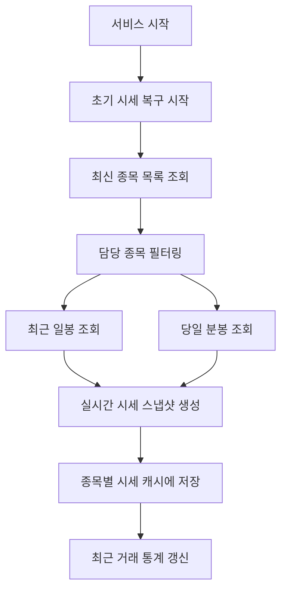
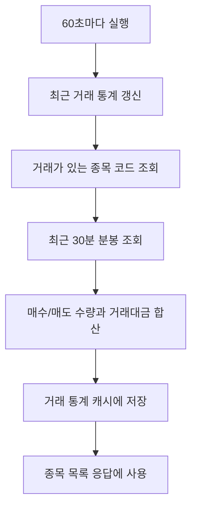

# 주기 작업 구조

## 문서 포털

문서의 상세 구현, API, 아키텍처, 트러블슈팅은 아래 문서를 참고하세요.

| 분류 | 문서 | 분류 | 문서 |
| --- | --- | --- | --- |
| 루트 README | [README](../../../README.md) | 서비스 README | [README](../README.md) |
| Engineering Notes | [Engineering Notes](../../../docs/ENGINEERING.md) | Database Schema ERD | [Database Schema ERD](../../../docs/database-schema.md) |
| 01 | [개요](01-overview.md) | 02 | [종목 API](02-stock-api.md) |
| 03 | [실시간 시세 캐시](03-realtime-stock-cache.md) | 04 | [Kafka 체결 처리](04-kafka-trade-execution.md) |
| 05 | [실시간 연결](05-websocket.md) | 06 | [주기 작업](06-scheduler.md) |
| 07 | [Candle 구조](07-candle-structure.md) | 08 | [외부 시세 연동 사용 중단](08-external-market-data-disabled.md) |
| 09 | [도메인 모델](09-domain-model.md) | 10 | [stock-service 이슈](10-stock-service-issues.md) |

## 목차

> [개요](#개요) ·
> [핵심 구현 파일](#핵심-구현-파일) ·
> [주기 작업 활성화](#주기-작업-활성화) ·
> [초기 시세 복구](#초기-시세-복구)

> [초기 시세 복구 흐름](#초기-시세-복구-흐름) ·
> [거래 통계 스케줄러](#거래-통계-스케줄러) ·
> [거래 통계 스케줄러 흐름](#거래-통계-스케줄러-흐름) ·
> [사용처](#사용처)

## 개요

stock-service는 Spring Scheduling을 사용한다. 시작 시에는 DB의 최신 종목과 캔들 데이터를 기반으로 실시간 시세 캐시를 복구하고, 실행 중에는 최근 30분 거래 통계를 1분마다 갱신한다.

## 주기 작업 활성화

`StockServiceApplication`에 `@EnableScheduling`이 선언되어 있다.

## 초기 시세 복구

`StockScheduler.init()` (서비스 시작 시 실시간 시세 캐시를 복구하는 기능)은 `@PostConstruct`로 애플리케이션 시작 시 실행된다.

처리 순서:

1. 최신 종목 목록 조회
2. `stock.assigned-codes` 설정이 있으면 대상 종목 필터링
3. 종목별 최근 일봉에서 전일 종가 조회
4. 당일 분봉 목록 조회
5. 당일 분봉이 있으면 현재가, 고가, 저가, 누적 거래량 복구
6. 당일 분봉이 없으면 전일 종가를 현재가/고가/저가로 사용
7. 전일 종가 기준 등락 금액과 등락률 계산
8. `StockCache`에 `StockRealTimeSnapshot` 저장
9. 최근 거래 통계 갱신

## 초기 시세 복구 흐름

## 거래 통계 스케줄러

`StockTradeStatsScheduler.refreshFromDb()` (최근 30분 거래 통계를 갱신하는 기능)는 `@Scheduled(fixedDelay = 60_000)`으로 실행된다.

처리 순서:

1. 현재 시각 기준 30분 전 시간 계산
2. 거래가 있는 종목 코드 목록 조회
3. 종목별 최근 30분 분봉 조회
4. `buyQty`, `sellQty`, `tradeAmount` 합산
5. `stockTradeStatusCache`에 `StockTradeStatus` 저장

## 거래 통계 스케줄러 흐름

## 사용처

종목 목록 응답은 실시간 시세 캐시의 각 스냅샷에 최근 거래 통계를 결합해 생성한다.
구현은 `StockService.getAllStocks()` (종목 목록 응답 생성 기능)에서 담당한다.

## 핵심 구현 파일

기준 경로

`StockBackEndDistributed/stock-service/src/main/java/Poi/Stock`

| 파일 |
| --- |
| `StockServiceApplication.java` |
| `init/StockScheduler.java` |
| `Scheduler/StockTradeStatsScheduler.java` |
| `features/Stock/StockCache.java` |
| `features/Stock/StockRealTimeSnapshot.java` |
| `features/Stock/StockTradeStatus.java` |
| `repository/StockRepository.java` |
| `features/Candle/CandleMinuteRepository.java` |
| `features/Candle/CandleDayRepository.java` |

[문서 맨 위로](#top)

