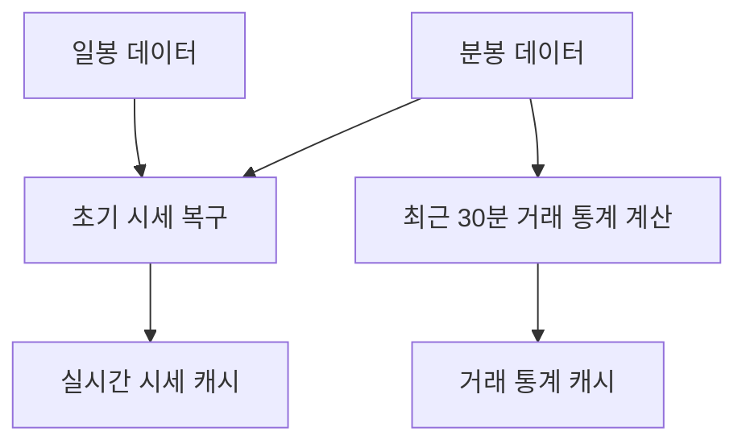

# Candle 구조

## 문서 포털

문서의 상세 구현, API, 아키텍처, 트러블슈팅은 아래 문서를 참고하세요.

| 분류 | 문서 | 분류 | 문서 |
| --- | --- | --- | --- |
| 루트 README | [README](../../../README.md) | 서비스 README | [README](../README.md) |
| Engineering Notes | [Engineering Notes](../../../docs/ENGINEERING.md) | Database Schema ERD | [Database Schema ERD](../../../docs/database-schema.md) |
| 01 | [개요](01-overview.md) | 02 | [종목 API](02-stock-api.md) |
| 03 | [실시간 시세 캐시](03-realtime-stock-cache.md) | 04 | [Kafka 체결 처리](04-kafka-trade-execution.md) |
| 05 | [실시간 연결](05-websocket.md) | 06 | [주기 작업](06-scheduler.md) |
| 07 | [Candle 구조](07-candle-structure.md) | 08 | [외부 시세 연동 사용 중단](08-external-market-data-disabled.md) |
| 09 | [도메인 모델](09-domain-model.md) | 10 | [stock-service 이슈](10-stock-service-issues.md) |

## 목차

> [개요](#개요) ·
> [핵심 구현 파일](#핵심-구현-파일) ·
> [CandleMinute](#candleminute) ·
> [CandleDay](#candleday)

> [조회 저장소](#조회-저장소) ·
> [사용처](#사용처) ·
> [구조](#구조)

## 개요

stock-service에는 `CandleMinute`, `CandleDay` 엔티티와 Repository가 존재한다. 현재 코드 기준 이 Candle 구조는 차트 API 제공용이 아니라 다음 목적에 사용된다.

- 시작 시 초기 시세 복구
- 최근 30분 거래 통계 계산

프론트 차트 조회 API는 이 stock-service 안에 구현되어 있지 않다.

## CandleMinute

테이블:

- `candle_minute`

인덱스:

- `stockCode, time`

주요 필드:

- `stockCode`
- `time`
- `open`
- `high`
- `low`
- `close`
- `buyQty`
- `sellQty`
- `totalVolume`
- `tradeAmount`

`setCandleRedis()` (Redis hash 형태의 candle 데이터를 `CandleMinute`로 변환하는 기능)는 Redis hash 형태의 candle 데이터를 `CandleMinute`로 변환하는 유틸이다. 현재 stock-service 주요 흐름에서 사용하는 코드는 확인되지 않는다.

## CandleDay

테이블:

- `candle_day`

인덱스:

- `stockCode, date`

주요 필드:

- `stockCode`
- `date`
- `open`
- `high`
- `low`
- `close`
- `buyQty`
- `sellQty`
- `totalVolume`
- `tradeAmount`
- `changeAmount`
- `changeRate`

## 조회 저장소

### CandleMinuteRepository

주요 메서드:

- `findByStockCodeAndTimeAfter(stockCode, time)`
- `findDistinctStockCodes()`
- `findByStockCodeAndTimeBetweenOrderByTimeAsc(stockCode, startOfDay, endOfDay)`

### CandleDayRepository

주요 메서드:

- `findByStockCodeAndDateBetweenOrderByDateAsc(stockCode, startDate, endDate)`
- `findByStockCodeAndDate(stockCode, date)`
- `findDistinctStockCodes()`
- `findTopByStockCodeOrderByDateDesc(stockCode)`

## 사용처

| 사용처 | Candle 사용 방식 |
| --- | --- |
| `StockScheduler` | 최근 일봉의 종가와 당일 분봉으로 시세 스냅샷 복구 |
| `StockTradeStatsScheduler` | 최근 30분 분봉의 매수/매도 수량과 거래대금 집계 |

## 구조

## 핵심 구현 파일

기준 경로

`StockBackEndDistributed/stock-service/src/main/java/Poi/Stock`

| 파일 |
| --- |
| `features/Candle/CandleMinute.java` |
| `features/Candle/CandleDay.java` |
| `features/Candle/CandleMinuteRepository.java` |
| `features/Candle/CandleDayRepository.java` |
| `init/StockScheduler.java` |
| `Scheduler/StockTradeStatsScheduler.java` |

[문서 맨 위로](#top)

