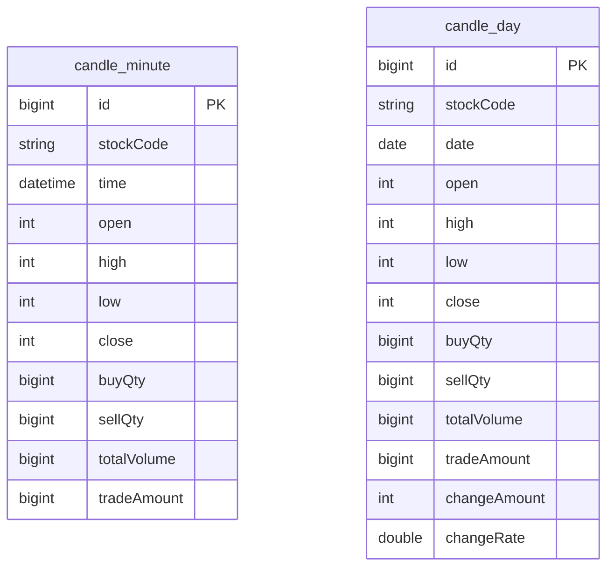
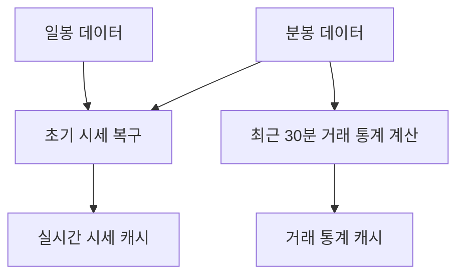

# Candle 구조

## 문서 포털

문서의 상세 구현, API, 아키텍처, 트러블슈팅은 아래 문서를 참고합니다.

| 분류 | 문서 | 분류 | 문서 |
| --- | --- | --- | --- |
| 주식 README | [README](../../../README.md) | 종목 서비스 README | [README](../README.md) |
| 설계 노트 | [Engineering Notes](../../../docs/ENGINEERING.md) | 데이터베이스 ERD | [Database Schema ERD](../../../docs/database-schema.md) |
| 개요 | [개요](01-overview.md) | 종목 API | [종목 API](02-stock-api.md) |
| 실시간 시세 캐시 | [실시간 시세 캐시](03-realtime-stock-cache.md) | Kafka 체결 처리 | [Kafka 체결 처리](04-kafka-trade-execution.md) |
| 실시간 연결 | [실시간 연결](05-websocket.md) | 주기 작업 | [주기 작업](06-scheduler.md) |
| Candle 구조 | [Candle 구조](07-candle-structure.md) | 외부 시세 연동 사용 중단 | [외부 시세 연동 사용 중단](08-external-market-data-disabled.md) |
| 도메인 모델 | [도메인 모델](09-domain-model.md) | 주식 서비스 이슈 | [stock-service 이슈](10-stock-service-issues.md) |

## 목차

> [개요](#개요) ·
> [데이터 구조](#데이터-구조) ·
> [테이블 비교](#테이블-비교)

> [조회 저장소](#조회-저장소) ·
> [사용처](#사용처) ·
> [구조](#구조) ·
> [핵심 구현 파일](#핵심-구현-파일) · [관련 문서](#관련-문서)
## 개요

저장된 Candle은 서비스 시작 시 시세를 복구하고 최근 거래 통계를 계산하는 데 사용합니다. 분봉은 당일 시세와 최근 30분 거래량을 제공하고, 일봉은 전일 종가 기준을 제공합니다.

- 시작 시 초기 시세 복구
- 최근 30분 거래 통계 계산

프론트엔드 차트 조회 기능은 이 서비스가 담당하지 않습니다.

## 데이터 구조

분봉 테이블은 분 단위 가격과 거래량을 저장하고, 일봉 테이블은 하루 단위 집계와 전일 대비 등락 정보를 함께 저장합니다. 두 엔티티 사이에는 JPA 연관관계나 외래키가 없습니다.

## 테이블 비교

| 구분 | 테이블 | PK | 시간 기준 | 인덱스 | 추가 필드 | 주요 사용처 |
| --- | --- | --- | --- | --- | --- | --- |
| 분봉 | `candle_minute` | 자동 증가 `id` | `LocalDateTime time` | 일반 복합 인덱스 `stockCode, time` | 없음 | 당일 시세 복구, 최근 30분 거래 통계 |
| 일봉 | `candle_day` | 자동 증가 `id` | `LocalDate date` | 일반 복합 인덱스 `stockCode, date` | `changeAmount`, `changeRate` | 전일 종가와 초기 시세 복구 |

### 참고

분봉 모델에는 Redis Hash 데이터를 Candle 객체로 변환하는 유틸이 있습니다. 현재 주요 시세 처리 흐름에서는 사용하지 않습니다.

### 구현 위치

- 분봉 엔티티: `features/Candle/CandleMinute.java`
- 일봉 엔티티: `features/Candle/CandleDay.java`
- Redis 변환: `features/Candle/CandleMinute.java`의 `setCandleRedis()`

## 조회 저장소

### 분봉 조회

주요 메서드:

- `findByStockCodeAndTimeAfter(stockCode, time)`
- `findDistinctStockCodes()`
- `findByStockCodeAndTimeBetweenOrderByTimeAsc(stockCode, startOfDay, endOfDay)`

### 일봉 조회

주요 메서드:

- `findByStockCodeAndDateBetweenOrderByDateAsc(stockCode, startDate, endDate)`
- `findByStockCodeAndDate(stockCode, date)`
- `findDistinctStockCodes()`
- `findTopByStockCodeOrderByDateDesc(stockCode)`

## 사용처

| 사용처 | Candle 사용 방식 |
| --- | --- |
| `StockScheduler` | 최근 일봉의 종가와 당일 분봉으로 시세 스냅샷 복구 |
| `StockTradeStatsScheduler` | 최근 30분 분봉의 매수/매도 수량과 거래대금 집계 |

## 구조

## 핵심 구현 파일

기준 경로

`StockBackEndDistributed/stock-service/src/main/java/Poi/Stock`

| 파일 |
| --- |
| `features/Candle/CandleMinute.java` |
| `features/Candle/CandleDay.java` |
| `features/Candle/CandleMinuteRepository.java` |
| `features/Candle/CandleDayRepository.java` |
| `init/StockScheduler.java` |
| `Scheduler/StockTradeStatsScheduler.java` |

## 관련 문서

- [주기 작업](06-scheduler.md)
- [실시간 시세](03-realtime-stock-cache.md)
- [도메인 모델](09-domain-model.md)

[문서 맨 위로](#top)

