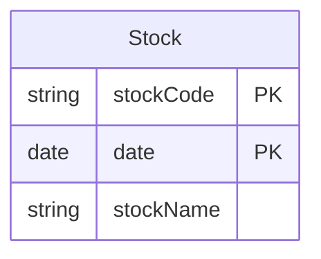
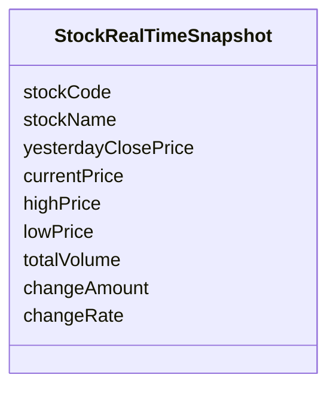
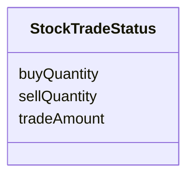
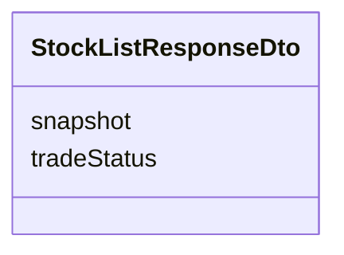
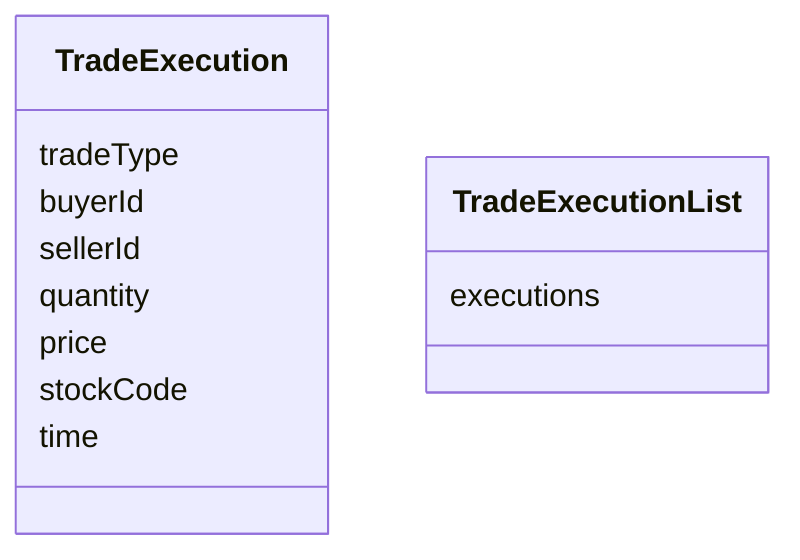
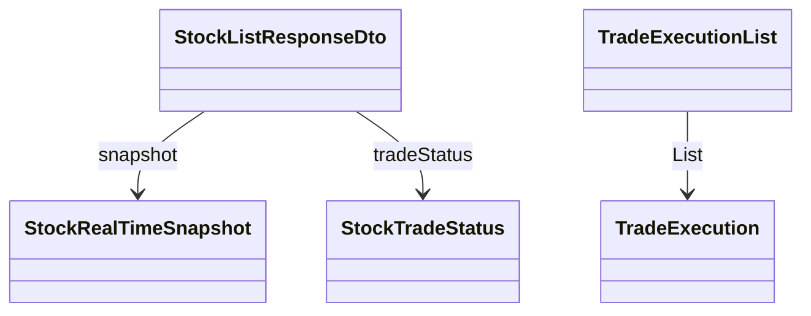

# 도메인 모델

## 문서 포털

문서의 상세 구현, API, 아키텍처, 트러블슈팅은 아래 문서를 참고합니다.

| 분류 | 문서 | 분류 | 문서 |
| --- | --- | --- | --- |
| 주식 README | [README](../../../README.md) | 종목 서비스 README | [README](../README.md) |
| 설계 노트 | [Engineering Notes](../../../docs/ENGINEERING.md) | 데이터베이스 ERD | [Database Schema ERD](../../../docs/database-schema.md) |
| 개요 | [개요](01-overview.md) | 종목 API | [종목 API](02-stock-api.md) |
| 실시간 시세 캐시 | [실시간 시세 캐시](03-realtime-stock-cache.md) | Kafka 체결 처리 | [Kafka 체결 처리](04-kafka-trade-execution.md) |
| 실시간 연결 | [실시간 연결](05-websocket.md) | 주기 작업 | [주기 작업](06-scheduler.md) |
| Candle 구조 | [Candle 구조](07-candle-structure.md) | 외부 시세 연동 사용 중단 | [외부 시세 연동 사용 중단](08-external-market-data-disabled.md) |
| 도메인 모델 | [도메인 모델](09-domain-model.md) | 주식 서비스 이슈 | [stock-service 이슈](10-stock-service-issues.md) |

## 목차

> [개요](#개요) ·
> [종목 일별 정보](#종목-일별-정보) ·
> [종목 복합키](#종목-복합키) ·
> [실시간 시세 스냅샷](#실시간-시세-스냅샷)

> [최근 거래 통계](#최근-거래-통계) ·
> [종목 목록 응답](#종목-목록-응답) ·
> [체결 이벤트](#체결-이벤트) ·
> [조회 저장소](#조회-저장소) ·
> [모델 관계](#모델-관계) ·
> [핵심 구현 파일](#핵심-구현-파일) · [관련 문서](#관련-문서)
## 개요

종목 서비스의 데이터는 일별 종목 정보, 실시간 시세, 최근 거래 통계, Candle과 체결 이벤트로 구분합니다. 저장 데이터와 실시간 데이터를 분리해 조회와 갱신 목적에 맞게 사용합니다.

## 종목 일별 정보

종목명과 종목 코드를 날짜별로 `Stock` 테이블에 저장합니다. 같은 종목의 일별 데이터를 구분하기 위해 `stockCode`와 `date`를 복합 PK로 사용합니다.

날짜 단독 조회를 위해 `date`에 일반 인덱스 `idx_date`를 둡니다. 다른 엔티티와 연결된 외래키나 JPA 연관관계는 없습니다.

가격대별 주문 단위를 계산하며, 이 기능은 `getTickSize(int price)`에서 제공합니다.

### 구현 위치

- 종목 모델: `features/Stock/Stock.java`

## 종목 복합키

종목 코드와 날짜를 묶어 일별 종목 정보를 식별합니다. 위 ERD의 복합 PK는 `StockDailyPriceId`로 구현하며, 별도 데이터베이스 테이블은 생성하지 않습니다.

### 구현 위치

- 복합키: `features/Stock/StockDailyPriceId.java`

## 실시간 시세 스냅샷

사용자 요청과 체결 반영에 빠르게 응답하도록 메모리에 유지하는 실시간 시세 모델입니다.

현재가, 고가, 저가, 누적 거래량과 등락 정보를 빠르게 조회하기 위해 사용합니다.

### 구현 위치

- 시세 모델: `features/Stock/StockRealTimeSnapshot.java`

## 최근 거래 통계

최근 30분의 매수·매도 수량과 거래대금을 종목별로 제공합니다. 이 통계는 `StockTradeStatus`에 저장합니다.

### 구현 위치

- 거래 통계 모델: `features/Stock/StockTradeStatus.java`

## 종목 목록 응답

목록 화면에 최신 시세와 최근 거래 통계를 함께 전달합니다. 응답 항목은 `StockListResponseDto`로 구성합니다.

### 구현 위치

- 목록 응답: `DTO/stock/StockListResponseDto.java`

## 체결 이벤트

주문 서비스에서 발생한 체결 가격, 수량과 거래 방향을 시세 갱신 흐름에 전달합니다. 이벤트 전달에는 `TradeExecution`과 `TradeExecutionList`를 사용합니다.

여러 체결을 한 번에 전달할 수 있도록 목록을 하나의 객체로 감싸며, `TradeExecutionList`를 사용합니다.

### 구현 위치

- 개별 체결: `object/TradeExecution.java`
- 체결 목록: `object/TradeExecutionList.java`

## 조회 저장소

### 종목 조회

주요 메서드:

- `findFirstByStockCodeOrderByDateDesc(stockCode)`
- `findByStockCodeAndDate(stockCode, date)`
- `findByStockCodeAndDateBetweenOrderByDateDesc(stockCode, startDate, endDate)`
- `findByDate(date)`
- `findLatestStocks()`
- `findByStockCodeIn(codes)`

### 분봉 조회

최근 분봉 조회와 종목 코드 추출에 사용합니다.

### 일봉 조회

최근 일봉 조회와 전일 종가 기준값 조회에 사용합니다.

## 모델 관계

이 그림은 데이터베이스 관계가 아니라 메모리 모델과 DTO의 포함 관계를 나타냅니다. `StockDailyPriceId`는 `Stock`의 복합 PK 구현에만 사용합니다.
## 핵심 구현 파일

기준 경로

`StockBackEndDistributed/stock-service/src/main/java/Poi/Stock`

| 파일 |
| --- |
| `features/Stock/Stock.java` |
| `features/Stock/StockDailyPriceId.java` |
| `features/Stock/StockRealTimeSnapshot.java` |
| `features/Stock/StockTradeStatus.java` |
| `features/Candle/CandleMinute.java` |
| `features/Candle/CandleDay.java` |
| `DTO/stock/StockListResponseDto.java` |
| `DTO/user/ApiResponse.java` |
| `object/TradeExecution.java` |
| `object/TradeExecutionList.java` |
| `repository/StockRepository.java` |
| `features/Candle/CandleMinuteRepository.java` |
| `features/Candle/CandleDayRepository.java` |
| `util/EnumUtil.java` |

## 관련 문서

- [종목 API](02-stock-api.md)
- [실시간 시세](03-realtime-stock-cache.md)
- [Candle 구조](07-candle-structure.md)

[문서 맨 위로](#top)

