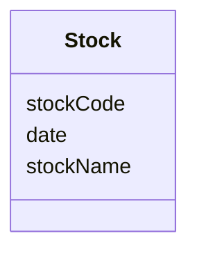
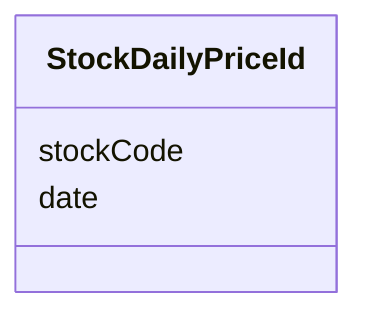
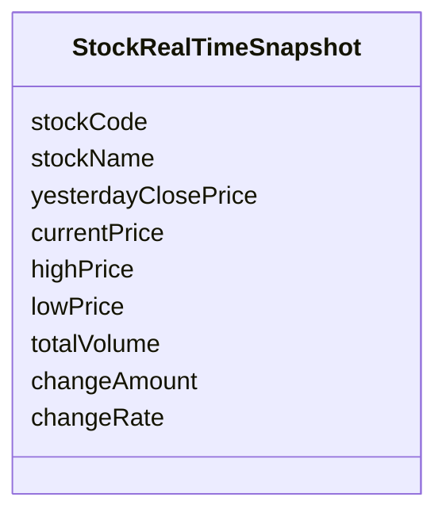
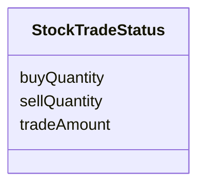
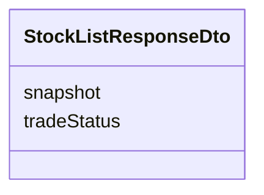
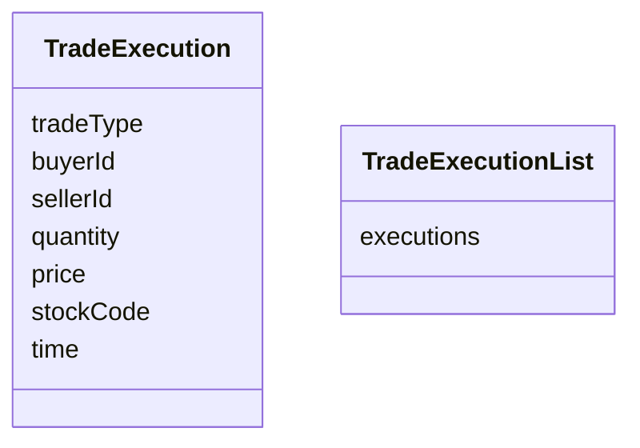
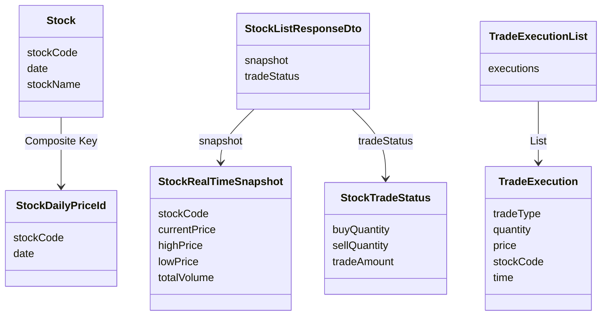

# 도메인 모델

## 문서 포털

문서의 상세 구현, API, 아키텍처, 트러블슈팅은 아래 문서를 참고하세요.

| 분류 | 문서 | 분류 | 문서 |
| --- | --- | --- | --- |
| 루트 README | [README](../../../README.md) | 서비스 README | [README](../README.md) |
| Engineering Notes | [Engineering Notes](../../../docs/ENGINEERING.md) | Database Schema ERD | [Database Schema ERD](../../../docs/database-schema.md) |
| 01 | [개요](01-overview.md) | 02 | [종목 API](02-stock-api.md) |
| 03 | [실시간 시세 캐시](03-realtime-stock-cache.md) | 04 | [Kafka 체결 처리](04-kafka-trade-execution.md) |
| 05 | [실시간 연결](05-websocket.md) | 06 | [주기 작업](06-scheduler.md) |
| 07 | [Candle 구조](07-candle-structure.md) | 08 | [외부 시세 연동 사용 중단](08-external-market-data-disabled.md) |
| 09 | [도메인 모델](09-domain-model.md) | 10 | [stock-service 이슈](10-stock-service-issues.md) |

## 목차

> [개요](#개요) ·
> [Stock](#stock) ·
> [StockDailyPriceId](#stockdailypriceid) ·
> [실시간 시세 스냅샷](#실시간-시세-스냅샷)

> [StockTradeStatus](#stocktradestatus) ·
> [StockListResponseDto](#stocklistresponsedto) ·
> [TradeExecution / TradeExecutionList](#tradeexecution-tradeexecutionlist) ·
> [조회 저장소](#조회-저장소) ·
> [모델 관계](#모델-관계) ·
> [핵심 구현 파일](#핵심-구현-파일)
## 개요

stock-service의 핵심 모델은 DB 기반 종목 일별 데이터, 메모리 기반 실시간 시세 스냅샷, 분/일봉 Candle, 체결 이벤트 객체로 나뉜다.

## Stock

`Stock` 테이블의 일자별 종목 기본 정보다. `stockCode`와 `date`를 복합키로 사용한다.

`getTickSize(int price)` 메서드는 가격대별 호가 단위를 반환한다.

## StockDailyPriceId

`Stock` 엔티티의 복합키 클래스다.

## 실시간 시세 스냅샷

DB 엔티티가 아닌 메모리 실시간 시세 모델이다.

## StockTradeStatus

최근 거래 통계 모델이다.

## StockListResponseDto

종목 목록 응답 항목이다.

## TradeExecution / TradeExecutionList

Kafka 체결 이벤트 객체다.

`TradeExecutionList`는 체결 이벤트 목록을 감싼다.

## 조회 저장소

### StockRepository

주요 메서드:

- `findFirstByStockCodeOrderByDateDesc(stockCode)`
- `findByStockCodeAndDate(stockCode, date)`
- `findByStockCodeAndDateBetweenOrderByDateDesc(stockCode, startDate, endDate)`
- `findByDate(date)`
- `findLatestStocks()`
- `findByStockCodeIn(codes)`

### CandleMinuteRepository

최근 분봉 조회와 종목 코드 추출에 사용된다.

### CandleDayRepository

최근 일봉 조회와 전일 종가 기준값 조회에 사용된다.

## 모델 관계

## 핵심 구현 파일

기준 경로

`StockBackEndDistributed/stock-service/src/main/java/Poi/Stock`

| 파일 |
| --- |
| `features/Stock/Stock.java` |
| `features/Stock/StockDailyPriceId.java` |
| `features/Stock/StockRealTimeSnapshot.java` |
| `features/Stock/StockTradeStatus.java` |
| `features/Candle/CandleMinute.java` |
| `features/Candle/CandleDay.java` |
| `DTO/stock/StockListResponseDto.java` |
| `DTO/user/ApiResponse.java` |
| `object/TradeExecution.java` |
| `object/TradeExecutionList.java` |
| `repository/StockRepository.java` |
| `features/Candle/CandleMinuteRepository.java` |
| `features/Candle/CandleDayRepository.java` |
| `util/EnumUtil.java` |

[문서 맨 위로](#top)

