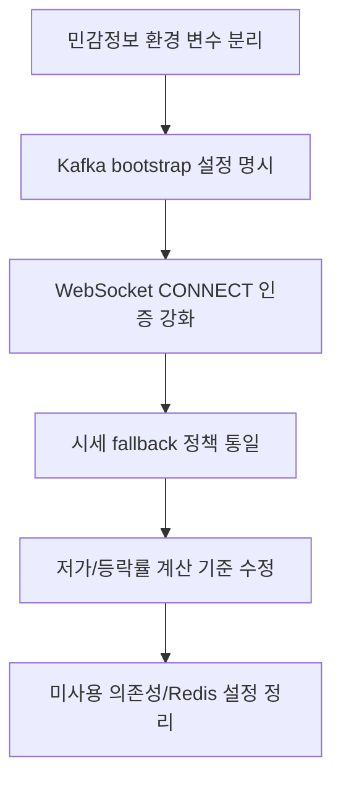

<a id="top"></a>

# stock-service 현재 이슈와 개선 필요 항목

## 문서 포털

문서의 상세 구현, API, 아키텍처, 트러블슈팅은 아래 문서를 참고하세요.

| 분류 | 문서 | 분류 | 문서 |
| --- | --- | --- | --- |
| 루트 README | [README](../../../README.md) | 서비스 README | [README](../README.md) |
| Engineering Notes | [Engineering Notes](../../../docs/ENGINEERING.md) | Database Schema ERD | [Database Schema ERD](../../../docs/database-schema.md) |
| 01 | [개요](01-overview.md) | 02 | [종목 API](02-stock-api.md) |
| 03 | [실시간 시세 캐시](03-realtime-stock-cache.md) | 04 | [Kafka 체결 처리](04-kafka-trade-execution.md) |
| 05 | [실시간 연결](05-websocket.md) | 06 | [주기 작업](06-scheduler.md) |
| 07 | [Candle 구조](07-candle-structure.md) | 08 | [외부 시세 연동 사용 중단](08-external-market-data-disabled.md) |
| 09 | [도메인 모델](09-domain-model.md) | 10 | [stock-service 이슈](10-stock-service-issues.md) |

## 목차

> [개요](#개요) ·
> [검증 결과](#검증-결과) ·
> [민감정보 관리](#민감정보-관리) ·
> [Kafka 설정 누락 가능성](#kafka-설정-누락-가능성) ·
> [WebSocket userId 신뢰 문제](#websocket-userid-신뢰-문제) ·
> [공개 API 범위가 넓음](#공개-api-범위가-넓음) ·
> [Redis 설정은 있으나 주요 흐름에서 직접 사용 거의 없음](#redis-설정은-있으나-주요-흐름에서-직접-사용-거의-없음)

> [미사용 주입 의존성](#미사용-주입-의존성) ·
> [fallback snapshot 값 문제](#fallback-snapshot-값-문제) ·
> [전일 종가 임의 fallback](#전일-종가-임의-fallback) ·
> [저가 갱신 문제 가능성](#저가-갱신-문제-가능성) ·
> [체결 changeRate 계산 기준 불일치 가능성](#체결-changerate-계산-기준-불일치-가능성) ·
> [assignedCodes 바인딩 확인 필요](#assignedcodes-바인딩-확인-필요) ·
> [개선 우선순위](#개선-우선순위)

## 개요

이 문서는 현재 `StockBackEndDistributed/stock-service` 코드 기준으로 확인된 위험 요소와 개선 필요 항목을 정리한다. 기능 문서에는 실제 존재하는 구현만 설명하고, 불안정하거나 깨질 수 있는 부분은 이 문서에 모았다.

## 검증 결과

다음 명령으로 Java 컴파일은 성공했다.

```bash
.\gradlew.bat compileJava
```

컴파일은 성공했지만 unchecked/unsafe operations 경고가 있다.

## 민감정보 관리

`application-docker.properties`에 DB, Redis, JWT 관련 민감정보가 직접 들어 있다.

문서에는 값을 기록하지 않는다. 해당 값들은 환경 변수로 분리 필요하다.

핵심 구현 파일:

기준 경로

`StockBackEndDistributed/stock-service/src/main/resources`

| 파일 |
| --- |
| `application-docker.properties` |

## Kafka 설정 누락 가능성

`build.gradle`에는 Kafka 의존성이 있고 `TradeExecutionConsumer`는 Kafka listener를 사용한다. 하지만 현재 `application-docker.properties`에서 Kafka bootstrap 설정이 명시적으로 확인되지 않는다.

문제:

- Docker 환경에서 기본 Kafka 주소로 연결을 시도할 수 있다.
- 실제 컨테이너 네트워크에서 Kafka 연결 실패 가능성이 있다.

핵심 구현 파일:

기준 경로

`StockBackEndDistributed/stock-service`

| 파일 |
| --- |
| `build.gradle` |
| `src/main/java/Poi/Stock/features/kafka/TradeExecutionConsumer.java` |
| `src/main/resources/application-docker.properties` |

## WebSocket userId 신뢰 문제

`WebSocketConfig`는 STOMP CONNECT native header의 `userId` 값을 그대로 `StompPrincipal`로 설정한다.

문제:

- JWT 검증 없이 클라이언트가 보낸 `userId`를 신뢰한다.
- 다른 사용자 ID를 넣어 연결할 수 있는 구조다.

핵심 구현 파일:

기준 경로

`StockBackEndDistributed/stock-service/src/main/java/Poi/Stock/config`

| 파일 |
| --- |
| `WebSocketConfig.java` |
| `StompPrincipal.java` |

## 공개 API 범위가 넓음

`SecurityConfig`에서 `/stock/**`, `/ws-stock/**`가 permitAll이다.

핵심 구현 파일:

기준 경로

`StockBackEndDistributed/stock-service/src/main/java/Poi/Stock/config`

| 파일 |
| --- |
| `SecurityConfig.java` |

## Redis 설정은 있으나 주요 흐름에서 직접 사용 거의 없음

`RedisConfig`와 `RedisTemplate<String, String>` Bean은 존재한다. 하지만 현재 stock-service 주요 흐름에서 Redis를 직접 사용하는 코드는 거의 확인되지 않는다.

개선 방향:

- Redis가 필요 없다면 설정 제거 또는 향후 사용 목적 명확화
- 필요하다면 어떤 캐시/분산 상태에 사용할지 문서화

핵심 구현 파일:

기준 경로

`StockBackEndDistributed/stock-service/src/main/java/Poi/Stock/config`

| 파일 |
| --- |
| `RedisConfig.java` |

## 미사용 주입 의존성

`StockService`에는 `WebClient.Builder`가 주입되지만 현재 사용되지 않는다.

`TradeExecutionConsumer`에는 `StockCache`, `WebSocketService`, `StockRepository`가 주입되지만 현재 메서드에서 직접 사용되지 않는다.

핵심 구현 파일:

기준 경로

`StockBackEndDistributed/stock-service/src/main/java/Poi/Stock/features`

| 파일 |
| --- |
| `Stock/StockService.java` |
| `kafka/TradeExecutionConsumer.java` |

## fallback snapshot 값 문제

`StockService.getStock()` (단일 종목 스냅샷 조회 기능)은 캐시에 종목이 없으면 DB의 최신 `Stock`을 조회해 fallback `StockRealTimeSnapshot`을 만든다. 이때 가격/거래량 값 대부분을 0으로 둔다.

문제:

- `StockScheduler`는 Candle 기반으로 더 정확하게 복구하지만, `getStock()` fallback은 0 기반이다.
- 두 경로의 fallback 정책이 다르다.

핵심 구현 파일:

기준 경로

`StockBackEndDistributed/stock-service/src/main/java/Poi/Stock`

| 파일 |
| --- |
| `features/Stock/StockService.java` |
| `init/StockScheduler.java` |

## 전일 종가 임의 fallback

`StockScheduler`는 최근 일봉이 없으면 전일 종가를 임의 값으로 둔다.

문제:

- 실제 데이터가 없을 때 등락률과 등락 금액이 왜곡될 수 있다.

핵심 구현 파일:

기준 경로

`StockBackEndDistributed/stock-service/src/main/java/Poi/Stock/init`

| 파일 |
| --- |
| `StockScheduler.java` |

## 저가 갱신 문제 가능성

`applyTradeExecutions()` (체결 목록을 실시간 시세 스냅샷에 반영하는 기능)는 `minPrice < snapshot.getLowPrice()`일 때만 저가를 갱신한다.

문제:

- fallback snapshot처럼 `lowPrice`가 0이면 실제 체결가가 0보다 크기 때문에 저가가 갱신되지 않을 수 있다.

핵심 구현 파일:

기준 경로

`StockBackEndDistributed/stock-service/src/main/java/Poi/Stock/features/Stock`

| 파일 |
| --- |
| `StockService.java` |

## 체결 changeRate 계산 기준 불일치 가능성

`sendCurrentPrice()` (현재가 변경 메시지 발행 기능)는 전일 종가 기준으로 계산된 `snapshot.changeRate`를 보낸다.

반면 체결 발행 흐름은 체결 메시지를 만들 때 `snapshot.getHighPrice()`를 기준값으로 전달한다. 해당 구현은 두 번째 인자를 기준가처럼 사용해 `changeRate`를 계산한다.
관련 구현은 `applyTradeExecutions()` (체결 목록 반영 기능)와 `sendExecution()` (체결 메시지 발행 기능)에서 확인된다.

문제:

- 체결 WebSocket의 `changeRate`가 전일 종가가 아니라 고가 기준으로 계산될 가능성이 있다.

핵심 구현 파일:

기준 경로

`StockBackEndDistributed/stock-service/src/main/java/Poi/Stock/features`

| 파일 |
| --- |
| `Stock/StockService.java` |
| `webSocket/WebSocketService.java` |

## assignedCodes 바인딩 확인 필요

`StockScheduler`는 `@Value("${stock.assigned-codes:}") private List<String> assignedCodes;`를 사용한다.

문제:

- 설정이 없거나 빈 문자열일 때 List 바인딩이 기대대로 동작하는지 확인이 필요하다.

핵심 구현 파일:

기준 경로

`StockBackEndDistributed/stock-service/src/main/java/Poi/Stock/init`

| 파일 |
| --- |
| `StockScheduler.java` |

## 개선 우선순위



<div align="right">

[문서 맨 위로](#top)

</div>


