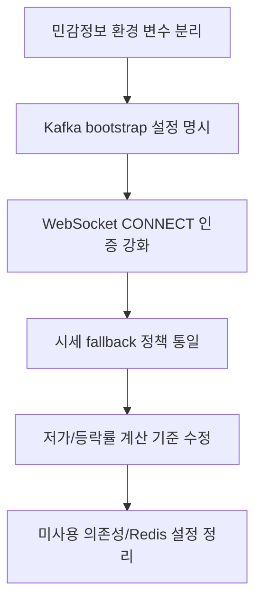

<a id="top"></a>

# stock-service 현재 이슈와 개선 필요 항목

## 문서 포털

문서의 상세 구현, API, 아키텍처, 트러블슈팅은 아래 문서를 참고합니다.

| 분류 | 문서 | 분류 | 문서 |
| --- | --- | --- | --- |
| 주식 README | [README](../../../README.md) | 종목 서비스 README | [README](../README.md) |
| 설계 노트 | [Engineering Notes](../../../docs/ENGINEERING.md) | 데이터베이스 ERD | [Database Schema ERD](../../../docs/database-schema.md) |
| 개요 | [개요](01-overview.md) | 종목 API | [종목 API](02-stock-api.md) |
| 실시간 시세 캐시 | [실시간 시세 캐시](03-realtime-stock-cache.md) | Kafka 체결 처리 | [Kafka 체결 처리](04-kafka-trade-execution.md) |
| 실시간 연결 | [실시간 연결](05-websocket.md) | 주기 작업 | [주기 작업](06-scheduler.md) |
| Candle 구조 | [Candle 구조](07-candle-structure.md) | 외부 시세 연동 사용 중단 | [외부 시세 연동 사용 중단](08-external-market-data-disabled.md) |
| 도메인 모델 | [도메인 모델](09-domain-model.md) | 주식 서비스 이슈 | [stock-service 이슈](10-stock-service-issues.md) |

## 목차

> [개요](#개요) ·
> [검증 결과](#검증-결과) ·
> [민감정보 관리](#민감정보-관리) ·
> [체결 이벤트 연결 설정](#체결-이벤트-연결-설정) ·
> [연결 사용자 검증](#연결-사용자-검증) ·
> [공개 API 범위가 넓음](#공개-api-범위가-넓음) ·
> [분산 캐시 활용 범위](#분산-캐시-활용-범위)

> [미사용 주입 의존성](#미사용-주입-의존성) ·
> [fallback snapshot 값 문제](#fallback-snapshot-값-문제) ·
> [전일 종가 임의 fallback](#전일-종가-임의-fallback) ·
> [저가 갱신 문제 가능성](#저가-갱신-문제-가능성) ·
> [체결 changeRate 계산 기준 불일치 가능성](#체결-changerate-계산-기준-불일치-가능성) ·
> [assignedCodes 바인딩 확인 필요](#assignedcodes-바인딩-확인-필요) ·
> [개선 우선순위](#개선-우선순위) ·
> [핵심 구현 파일](#핵심-구현-파일) ·
> [관련 문서](#관련-문서)

## 개요

이 문서는 현재 `StockBackEndDistributed/stock-service` 코드 기준으로 확인된 위험 요소와 개선 필요 항목을 정리합니다. 기능 문서에는 실제 존재하는 구현만 설명하고, 불안정하거나 깨질 수 있는 부분은 이 문서에 모았습니다.

## 검증 결과

다음 명령으로 Java 컴파일은 성공했습니다.

```bash
.\gradlew.bat compileJava
```

컴파일은 성공했지만 unchecked/unsafe operations 경고가 있습니다.

## 민감정보 관리

`application-docker.properties`에 DB, Redis, JWT 관련 민감정보가 직접 들어 있습니다.

문서에는 값을 기록하지 않습니다. 해당 값들은 환경 변수로 분리 필요합니다.

핵심 구현 파일:

기준 경로

`StockBackEndDistributed/stock-service/src/main/resources`

| 파일 |
| --- |
| `application-docker.properties` |

## 체결 이벤트 연결 설정

체결 이벤트를 안정적으로 수신하려면 실행 환경의 메시지 서버 주소가 명확해야 합니다. 현재 의존성과 Listener는 존재하지만 `application-docker.properties`에서 Kafka bootstrap 설정을 확인하기 어렵습니다.

문제:

- Docker 환경에서 기본 Kafka 주소로 연결을 시도할 수 있습니다.
- 실제 컨테이너 네트워크에서 Kafka 연결 실패 가능성이 있습니다.

핵심 구현 파일:

기준 경로

`StockBackEndDistributed/stock-service`

| 파일 |
| --- |
| `build.gradle` |
| `src/main/java/Poi/Stock/features/kafka/TradeExecutionConsumer.java` |
| `src/main/resources/application-docker.properties` |

## 연결 사용자 검증

실시간 연결의 사용자 식별자는 인증된 사용자와 일치해야 합니다. 현재는 클라이언트가 보낸 `userId`를 별도 JWT 검증 없이 사용하며, STOMP CONNECT header와 `StompPrincipal`로 처리합니다.

문제:

- JWT 검증 없이 클라이언트가 보낸 `userId`를 신뢰합니다.
- 다른 사용자 ID를 넣어 연결할 수 있는 구조입니다.

핵심 구현 파일:

기준 경로

`StockBackEndDistributed/stock-service/src/main/java/Poi/Stock/config`

| 파일 |
| --- |
| `WebSocketConfig.java` |
| `StompPrincipal.java` |

## 공개 API 범위가 넓음

종목 조회 경로(`/stock/**`)와 종목 실시간 연결 경로(`/ws-stock/**`)는 인증 없이 접근할 수 있습니다. 이 공개 범위는 `SecurityConfig`의 `permitAll` 설정에서 관리합니다.

핵심 구현 파일:

기준 경로

`StockBackEndDistributed/stock-service/src/main/java/Poi/Stock/config`

| 파일 |
| --- |
| `SecurityConfig.java` |

## 분산 캐시 활용 범위

분산 캐시 설정은 존재하지만 현재 주요 시세 흐름에서 직접 사용하는 코드는 거의 확인되지 않습니다. 설정을 유지한다면 Redis의 사용 목적을 명확히 해야 합니다.

개선 방향:

- Redis가 필요 없다면 설정 제거 또는 향후 사용 목적 명확화
- 필요하다면 어떤 캐시/분산 상태에 사용할지 문서화

핵심 구현 파일:

기준 경로

`StockBackEndDistributed/stock-service/src/main/java/Poi/Stock/config`

| 파일 |
| --- |
| `RedisConfig.java` |

## 미사용 주입 의존성

`StockService`에는 `WebClient.Builder`가 주입되지만 현재 사용되지 않습니다.

`TradeExecutionConsumer`에는 `StockCache`, `WebSocketService`, `StockRepository`가 주입되지만 현재 메서드에서 직접 사용되지 않습니다.

핵심 구현 파일:

기준 경로

`StockBackEndDistributed/stock-service/src/main/java/Poi/Stock/features`

| 파일 |
| --- |
| `Stock/StockService.java` |
| `kafka/TradeExecutionConsumer.java` |

## fallback snapshot 값 문제

메모리에 종목 시세가 없으면 저장된 최신 종목 정보로 기본 스냅샷을 생성합니다. 이때 가격과 거래량 대부분을 0으로 두며 `StockService.getStock()`이 처리합니다.

문제:

- `StockScheduler`는 Candle 기반으로 더 정확하게 복구하지만, `getStock()` fallback은 0 기반입니다.
- 두 경로의 fallback 정책이 다릅니다.

핵심 구현 파일:

기준 경로

`StockBackEndDistributed/stock-service/src/main/java/Poi/Stock`

| 파일 |
| --- |
| `features/Stock/StockService.java` |
| `init/StockScheduler.java` |

## 전일 종가 임의 fallback

최근 일봉이 없으면 전일 종가에 임의 값을 사용합니다. 초기 복구 과정의 `StockScheduler`에서 이 값을 결정합니다.

문제:

- 실제 데이터가 없을 때 등락률과 등락 금액이 왜곡될 수 있습니다.

핵심 구현 파일:

기준 경로

`StockBackEndDistributed/stock-service/src/main/java/Poi/Stock/init`

| 파일 |
| --- |
| `StockScheduler.java` |

## 저가 갱신 문제 가능성

체결 최저가는 기존 저가보다 낮을 때만 갱신합니다. 이 비교는 `applyTradeExecutions()`에서 수행합니다.

문제:

- fallback snapshot처럼 `lowPrice`가 0이면 실제 체결가가 0보다 크기 때문에 저가가 갱신되지 않을 수 있습니다.

핵심 구현 파일:

기준 경로

`StockBackEndDistributed/stock-service/src/main/java/Poi/Stock/features/Stock`

| 파일 |
| --- |
| `StockService.java` |

## 체결 changeRate 계산 기준 불일치 가능성

현재가 메시지는 전일 종가 기준 등락률을 전달합니다. 이 값은 `sendCurrentPrice()`에서 발행합니다.

반면 체결 메시지는 고가를 기준값으로 전달해 `changeRate`를 계산합니다. 관련 동작은 `applyTradeExecutions()`와 `sendExecution()`에서 확인할 수 있습니다.

문제:

- 체결 WebSocket의 `changeRate`가 전일 종가가 아니라 고가 기준으로 계산될 가능성이 있습니다.

핵심 구현 파일:

기준 경로

`StockBackEndDistributed/stock-service/src/main/java/Poi/Stock/features`

| 파일 |
| --- |
| `Stock/StockService.java` |
| `webSocket/WebSocketService.java` |

## assignedCodes 바인딩 확인 필요

서비스가 담당할 종목 코드를 설정에서 주입받으며, `StockScheduler`의 `assignedCodes`에 저장합니다.

문제:

- 설정이 없거나 빈 문자열일 때 List 바인딩이 기대대로 동작하는지 확인이 필요합니다.

핵심 구현 파일:

기준 경로

`StockBackEndDistributed/stock-service/src/main/java/Poi/Stock/init`

| 파일 |
| --- |
| `StockScheduler.java` |

## 개선 우선순위



## 핵심 구현 파일

기준 경로: `StockBackEndDistributed/stock-service`

| 파일 |
| --- |
| `src/main/resources/application-docker.properties` |
| `src/main/java/Poi/Stock/config/WebSocketConfig.java` |
| `src/main/java/Poi/Stock/features/Stock/StockService.java` |
| `src/main/java/Poi/Stock/init/StockScheduler.java` |
| `src/main/java/Poi/Stock/features/kafka/TradeExecutionConsumer.java` |

## 관련 문서

- [체결 처리](04-kafka-trade-execution.md)
- [실시간 발행](05-websocket.md)
- [주기 작업](06-scheduler.md)

<div align="right">

[문서 맨 위로](#top)

</div>


