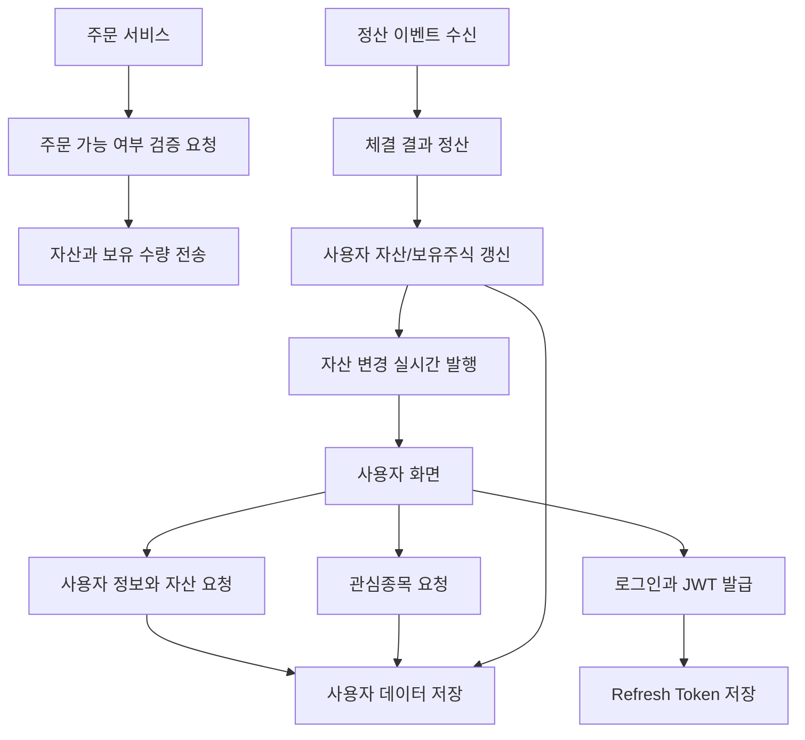

<a id="top"></a>

# 사용자 서비스 (user-service)

[](https://openjdk.org/)
[](https://spring.io/projects/spring-boot)
[](https://spring.io/guides/gs/rest-service/)
[](https://spring.io/projects/spring-security)
[](https://spring.io/projects/spring-data-jpa)
[](https://spring.io/projects/spring-data-redis)
[](https://spring.io/projects/spring-kafka)
[](https://docs.spring.io/spring-framework/reference/web/websocket.html)
[](https://github.com/jwtk/jjwt)
[](https://www.postgresql.org/)

## 문서 포털

문서의 상세 구현, API, 아키텍처, 트러블슈팅은 아래 문서를 참고하세요.

| 분류 | 문서 | 분류 | 문서 |
| --- | --- | --- | --- |
| 주식 README | [README](../../README.md) | 사용자 서비스 README | [README](README.md) |
| 설계 노트 | [Engineering Notes](../../docs/ENGINEERING.md) | 데이터베이스 ERD | [Database Schema ERD](../../docs/database-schema.md) |
| 개요 | [개요](docs/01-overview.md) | 인증/JWT | [인증/JWT](docs/02-auth-jwt.md) |
| 회원가입/프로필 | [회원가입/프로필](docs/03-user-register-profile.md) | 자산/주문 검증 | [자산/주문 검증](docs/04-user-asset-order-validation.md) |
| Kafka 정산 | [Kafka 정산](docs/05-settlement-kafka.md) | 관심종목 | [관심종목](docs/06-watchlist.md) |
| 실시간 연결 | [실시간 연결](docs/07-websocket.md) | 도메인 모델 | [도메인 모델](docs/08-domain-model.md) |
| 보안 설정 | [보안 설정](docs/09-security-config.md) | 유저 서비스 이슈 | [user-service 이슈](docs/10-user-service-issues.md) |

## 목차

> [서비스 개요](#서비스-개요) ·
> [주요 구현 내용](#주요-구현-내용)

> [시스템 아키텍처](#시스템-아키텍처) ·
> [실행 방법](#실행-방법)

## 서비스 개요

사용자 계정, 인증, 자산, 관심종목, 주문 검증, 정산 처리를 담당하는 서비스입니다.

로그인과 JWT 발급을 처리하고, 보안토큰을 Redis에 저장합니다. 또한 order-service가 주문을 접수하기 전에 매수/매도 가능 여부를 검증하고, 체결 이후에는 Kafka `settlement-topic` 이벤트로 사용자 보유 현금과 보유 주식을 갱신합니다.

## 주요 구현 내용

| 영역 | 주요 구현 내용 | 사용 기술/처리 방식 | 관련 문서 |
| --- | --- | --- | --- |
| 인증 | 회원가입 및 로그인<br>access token/refresh token 발급 | JWT 기반 인증<br>Redis에 refresh token 저장 | [인증/JWT](docs/02-auth-jwt.md) |
| 회원/프로필 | 사용자 프로필 조회<br>프로필 정보 수정 | 사용자 식별 정보 기반<br>프로필 조회 및 갱신 | [회원가입/프로필](docs/03-user-register-profile.md) |
| 자산 관리 | 보유 현금과 사용 가능 현금 관리<br>보유 주식과 사용 가능 수량 관리 | 주문 예약 자산을 분리해<br>가용 현금·수량 계산 | [자산/주문 검증](docs/04-user-asset-order-validation.md) |
| 주문 검증 | 매수 가능 금액·매도 가능 수량 검증<br>정정·취소 시 예약 자산 복구 | 주문 처리 전 동기 검증<br>주문 상태에 따른 예약 자산 조정 | [자산/주문 검증](docs/04-user-asset-order-validation.md) |
| 정산 | `settlement-topic` 정산 이벤트 소비<br>현금과 보유 주식 반영 | Kafka 이벤트 기반 정산<br>체결 결과에 따른 자산 갱신 | [Kafka 정산](docs/05-settlement-kafka.md) |
| 관심종목 | 관심종목 등록 및 삭제<br>관심종목 목록 조회 | 사용자별 관심종목 관계<br>등록 여부 저장 및 조회 | [관심종목](docs/06-watchlist.md) |
| 웹소켓 | 사용자 자산 변경 발행<br>보유 주식 변경 발행 | WebSocket을 통한<br>사용자별 실시간 알림 | [실시간 연결](docs/07-websocket.md) |
| 도메인 모델 | 사용자와 보유 주식 구조<br>관심종목 엔티티 구조 | JPA 엔티티 관계로<br>사용자 도메인 모델링 | [도메인 모델](docs/08-domain-model.md) |

## 시스템 아키텍처



- 로그인 흐름은 JWT를 발급하고 refresh token을 Redis에 저장한다.
- 사용자 정보와 자산 요청은 PostgreSQL의 사용자 데이터를 기준으로 처리한다.
- 관심종목 흐름은 사용자별 종목 등록, 삭제, 조회를 담당한다.
- 정산 흐름은 Kafka `settlement-topic` 이벤트를 받아 자산과 보유 주식에 반영한다.
- 자산 또는 보유 주식 변경은 사용자 화면으로 실시간 발행된다.

## 실행 방법

```bash
.\gradlew.bat bootRun
```

`application-docker.properties` 기준 서비스 포트는 `8081`입니다. DB, Redis, JWT 등 민감 설정 값은 문서에 기록하지 않으며 환경 변수로 분리 필요합니다.

<div align="right">

[문서 맨 위로](#top)

</div>


