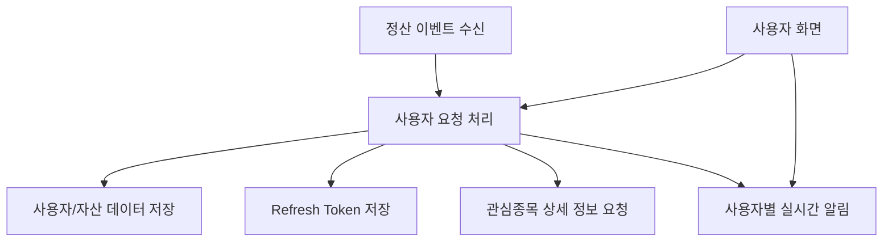

# user-service 개요

## 문서 포털

문서의 상세 구현, API, 아키텍처, 트러블슈팅은 아래 문서를 참고하세요.

| 분류 | 문서 | 분류 | 문서 |
| --- | --- | --- | --- |
| 주식 README | [README](../../../README.md) | 사용자 서비스 README | [README](../README.md) |
| 설계 노트 | [Engineering Notes](../../../docs/ENGINEERING.md) | 데이터베이스 ERD | [Database Schema ERD](../../../docs/database-schema.md) |
| 개요 | [개요](01-overview.md) | 인증/JWT | [인증/JWT](02-auth-jwt.md) |
| 회원가입/프로필 | [회원가입/프로필](03-user-register-profile.md) | 자산/주문 검증 | [자산/주문 검증](04-user-asset-order-validation.md) |
| Kafka 정산 | [Kafka 정산](05-settlement-kafka.md) | 관심종목 | [관심종목](06-watchlist.md) |
| 실시간 연결 | [실시간 연결](07-websocket.md) | 도메인 모델 | [도메인 모델](08-domain-model.md) |
| 보안 설정 | [보안 설정](09-security-config.md) | 유저 서비스 이슈 | [user-service 이슈](10-user-service-issues.md) |

## 목차

> [개요](#개요) ·
> [서비스 포트와 외부 의존성](#서비스-포트와-외부-의존성)

> [주요 기능](#주요-기능) ·
> [상위 구조](#상위-구조) ·
> [핵심 구현 파일](#핵심-구현-파일)
## 개요

`user-service`는 분산 백엔드 구조에서 사용자 도메인을 담당한다. 

## 주요 기능

 주요 책임 및 기능은 인증, 회원가입, 프로필 조회, 관심종목 관리, 자산/보유주식 관리, 주문 전 자산 검증, 체결 정산 반영, 사용자 WebSocket 알림입니다.

| 기능 | 설명 |
| --- | --- |
| 인증 | 로그인, refresh token 갱신, 인증 확인, 로그아웃 |
| 회원가입 | 사용자 등록, 비밀번호 BCrypt 암호화 |
| 프로필 | 현재 로그인 사용자 프로필 조회 |
| 자산 관리 | 총 보유 자산(`asset`), 주문 가능 현금(`availableAsset`), 보유 주식 목록(`haveStocks`) 조회 |
| 주문 검증 | 매수 금액 예약, 매도 가능 수량 예약, 주문 정정 검증, 취소 복구 |
| 정산 | Kafka 정산 이벤트를 받아 자산과 보유 주식 반영 |
| 관심종목 | 관심종목 추가, 삭제, 목록 조회, 관심 여부 조회 |
| 웹소켓 | 사용자별 자산/보유 주식 변경 알림 |

## 상위 구조

## 서비스 포트와 외부 의존성

`application-docker.properties` 기준으로 user-service는 별도 포트에서 실행되며, 다음 외부 시스템에 의존합니다.

- PostgreSQL
- Redis
- Kafka
- stock-service

주의: 설정 파일에는 DB, Redis, JWT 관련 민감정보가 포함되어 있습니다. 문서에는 값을 기록하지 않으며, 운영/공개 저장소 기준으로는 환경 변수로 분리 필요합니다.

## 핵심 구현 파일

기준 경로

`StockBackEndDistributed/user-service`

| 파일 |
| --- |
| `build.gradle` |
| `settings.gradle` |
| `Dockerfile` |
| `src/main/resources/application-docker.properties` |
| `src/main/java/Poi/Stock/UserServiceApplication.java` |

[문서 맨 위로](#top)

