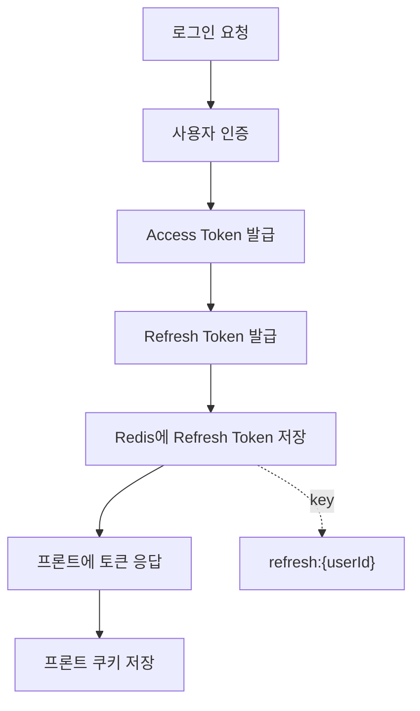
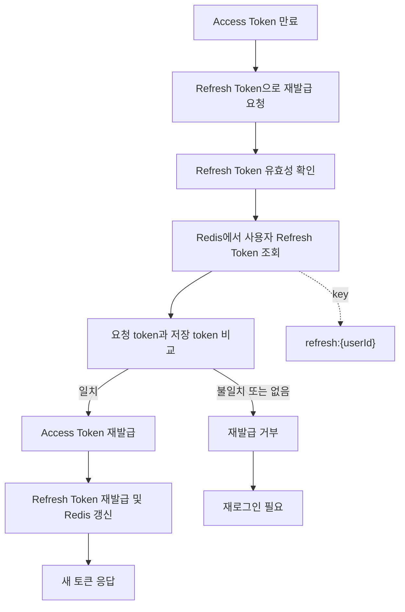

<a id="top"></a>

# 인증과 JWT

## 문서 포털

문서의 상세 구현, API, 아키텍처, 트러블슈팅은 아래 문서를 참고하세요.

| 분류 | 문서 | 분류 | 문서 |
| --- | --- | --- | --- |
| 주식 README | [README](../../../README.md) | 사용자 서비스 README | [README](../README.md) |
| 설계 노트 | [Engineering Notes](../../../docs/ENGINEERING.md) | 데이터베이스 ERD | [Database Schema ERD](../../../docs/database-schema.md) |
| 개요 | [개요](01-overview.md) | 인증/JWT | [인증/JWT](02-auth-jwt.md) |
| 회원가입/프로필 | [회원가입/프로필](03-user-register-profile.md) | 자산/주문 검증 | [자산/주문 검증](04-user-asset-order-validation.md) |
| Kafka 정산 | [Kafka 정산](05-settlement-kafka.md) | 관심종목 | [관심종목](06-watchlist.md) |
| 실시간 연결 | [실시간 연결](07-websocket.md) | 도메인 모델 | [도메인 모델](08-domain-model.md) |
| 보안 설정 | [보안 설정](09-security-config.md) | 유저 서비스 이슈 | [user-service 이슈](10-user-service-issues.md) |

## 목차

> [개요](#개요) ·
> [엔드포인트](#엔드포인트) ·
> [로그인](#로그인) ·
> [Refresh](#refresh)

> [JWT Filter](#jwt-filter) ·
> [Security 설정](#security-설정) ·
> [인증 흐름](#인증-흐름) ·
> [Refresh 흐름](#refresh-흐름) ·
> [민감정보](#민감정보) ·
> [핵심 구현 파일](#핵심-구현-파일)
## 개요

인증 기능은 Spring Security, JWT, Redis를 사용합니다. 로그인 성공 시 access token과 refresh token을 발급하고, refresh token은 Redis에 저장합니다. 이후 요청은 `Authorization: Bearer {accessToken}` 헤더를 통해 인증됩니다.


## 엔드포인트

| Method | Path | 설명 | 인증 |
| --- | --- | --- | --- |
| POST | `/auth/login` | 로그인, access/refresh token 발급 | 불필요 |
| POST | `/auth/refresh` | refresh token 검증 후 토큰 재발급 | 불필요 |
| GET | `/auth/check` | 현재 인증 여부 확인 | 필요 |
| POST | `/auth/logout` | Redis에 저장된 refresh token 삭제 | 필요 |

## 로그인

로그인 요청은 사용자 ID와 비밀번호를 검증합니다. 인증에 성공하면 access token과 refresh token을 생성하고, refresh token을 Redis에 저장한 뒤 프론트엔드에 토큰을 응답합니다.

Redis에는 사용자별 refresh token이 저장됩니다. 같은 사용자가 다시 로그인하거나 refresh에 성공하면 해당 사용자의 refresh token 값이 새 값으로 갱신됩니다.

Redis 저장 key 패턴:

- `refresh:{userId}`

refresh token 저장 기간은 코드에서 7일로 지정되어 있습니다.

### 동작 순서

1. 사용자 ID와 비밀번호를 Spring Security 인증 관리자에 전달합니다.
2. 인증된 사용자 ID로 Access Token과 Refresh Token을 발급합니다.
3. Refresh Token을 Redis에 7일 동안 저장하고 두 토큰을 응답합니다.

### 핵심 코드

```java
public ResponseEntity<ApiResponse> login(LoginDTO loginDTO) {
    try {
        Authentication auth = authenticationManager.authenticate(
                new UsernamePasswordAuthenticationToken(loginDTO.getId(), loginDTO.getPassword()));
        String userId = auth.getName();
        String accessToken = jwtProvider.createAccessToken(userId);
        String refreshToken = jwtProvider.createRefreshToken(userId);
        redisTemplate.opsForValue().set(
                REFRESH_PREFIX + userId, refreshToken, 7, TimeUnit.DAYS);
        return ResponseEntity.ok(new ApiResponse(true, "로그인 성공",
                Map.of("accessToken", accessToken, "refreshToken", refreshToken, "userId", userId)));
    } catch (AuthenticationException e) {
        return ResponseEntity.status(HttpStatus.UNAUTHORIZED)
                .body(new ApiResponse(false, "로그인 실패: " + e.getMessage()));
    }
}
```

사용자 인증 상태를 유지하기 위해 인증 성공 시 두 종류의 JWT를 발급합니다. 로그인 DTO를 입력으로 사용자 ID를 검증하고, 장기 재발급에 사용하는 Refresh Token만 Redis에 저장합니다. 결과는 프론트엔드의 인증 Cookie 생성에 사용됩니다.

### 구현 위치

- 로그인과 토큰 저장: `features/Auth/AuthController.java`의 `login()`
- 토큰 생성: `config/JwtProvider.java`

## Refresh

만료된 Access Token을 갱신하는 API(`POST /auth/refresh`)는 request body의 `refreshToken`을 검증합니다. user-service는 Redis에 저장된 사용자별 Refresh Token과 요청 Token을 비교합니다.

검증 조건:

- JWT 자체가 유효해야 합니다.
- token claim `type`이 `refresh`여야 합니다.
- Redis에 저장된 refresh token과 요청 refresh token이 같아야 합니다.

검증에 성공하면 access token과 refresh token을 새로 발급하고 Redis 값을 새 refresh token으로 갱신합니다. Redis에 값이 없거나 요청 token과 다르면 토큰 갱신을 거부하며, 사용자는 다시 로그인해야 합니다.

### 동작 순서

1. 요청의 Refresh Token이 유효하고 `refresh` 유형인지 확인합니다.
2. 사용자 ID로 Redis의 저장 Token을 조회해 요청 값과 비교합니다.
3. 두 토큰을 재발급하고 Redis 값을 새 Refresh Token으로 교체합니다.

### 핵심 코드

```java
public ResponseEntity<ApiResponse> refresh(Map<String, String> body) {
    String refreshToken = body.get("refreshToken");
    if (!jwtProvider.validate(refreshToken)
            || !"refresh".equals(jwtProvider.getTokenType(refreshToken))) {
        return ResponseEntity.status(HttpStatus.UNAUTHORIZED)
                .body(new ApiResponse(false, "유효하지 않은 refresh token"));
    }
    String userId = jwtProvider.getUserId(refreshToken);
    String saved = redisTemplate.opsForValue().get(REFRESH_PREFIX + userId);
    if (!refreshToken.equals(saved)) {
        return ResponseEntity.status(HttpStatus.UNAUTHORIZED)
                .body(new ApiResponse(false, "토큰이 일치하지 않습니다"));
    }
    String newAccess = jwtProvider.createAccessToken(userId);
    String newRefresh = jwtProvider.createRefreshToken(userId);
    redisTemplate.opsForValue().set(REFRESH_PREFIX + userId, newRefresh, 7, TimeUnit.DAYS);
    return ResponseEntity.ok(new ApiResponse(true, "토큰 갱신 성공",
            Map.of("accessToken", newAccess, "refreshToken", newRefresh)));
}
```

Refresh Token의 재사용을 막기 위해 JWT 검증만으로 갱신하지 않고 Redis의 최신 값과도 비교합니다. 요청 Token을 입력으로 새 토큰 쌍을 만들고 저장 값을 회전시키며, 불일치하면 인증을 거부합니다.

### 구현 위치

- 토큰 재발급과 Redis 비교: `features/Auth/AuthController.java`의 `refresh()`

## JWT Filter

`JwtAuthenticationFilter`는 모든 요청에서 `Authorization` 헤더를 확인합니다.

처리 조건:

- 헤더가 `Bearer `로 시작해야 합니다.
- JWT가 유효해야 합니다.
- token claim `type`이 `access`여야 합니다.

조건을 만족하면 `SecurityContextHolder`에 `UsernamePasswordAuthenticationToken`을 설정합니다. 인증 사용자 이름 조회 결과는 사용자 ID로 사용된다(`authentication.getName()`).

### 동작 순서

1. `Authorization` 헤더에서 Bearer Token을 추출합니다.
2. 유효성과 Token 유형을 검증합니다.
3. 사용자 ID를 Spring Security 인증 Context에 저장합니다.

### 핵심 코드

```java
protected void doFilterInternal(HttpServletRequest req, HttpServletResponse res,
        FilterChain chain) throws ServletException, IOException {
    String token = resolveToken(req);
    if (StringUtils.hasText(token) && jwtProvider.validate(token)
            && "access".equals(jwtProvider.getTokenType(token))) {
        String userId = jwtProvider.getUserId(token);
        var auth = new UsernamePasswordAuthenticationToken(
                userId, null, List.of(new SimpleGrantedAuthority("ROLE_USER")));
        SecurityContextHolder.getContext().setAuthentication(auth);
    }
    chain.doFilter(req, res);
}
```

Bearer Token을 입력으로 사용자 ID와 권한을 구성하고, 이후 Controller가 `Authentication.getName()`으로 같은 사용자 식별자를 사용하게 합니다.

### 구현 위치

- 요청 인증 처리: `config/JwtAuthenticationFilter.java`

## Security 설정

`SecurityConfig`는 stateless 세션 정책을 사용합니다.

- CSRF 비활성화
- form login 비활성화
- http basic 비활성화
- JWT filter 등록
- CORS 허용 origin: `http://localhost:3000`

인증 없이 회원가입을 처리하는 경로(`/user/register`), 인증 API 경로(`/auth/**`), 사용자 WebSocket 연결 경로(`/ws-user/**`), 상태 점검 경로(`/actuator/**`)는 `permitAll`로 허용합니다.

### 동작 순서

1. HTTP 세션과 기본 로그인 방식을 비활성화합니다.
2. 공개 경로와 인증이 필요한 경로를 구분합니다.
3. 사용자 인증 전에 JWT Filter를 실행합니다.

### 핵심 코드

```java
public SecurityFilterChain filterChain(HttpSecurity http) throws Exception {
    http.cors(cors -> cors.configurationSource(corsConfigurationSource()))
        .csrf(csrf -> csrf.disable())
        .sessionManagement(session -> session
                .sessionCreationPolicy(SessionCreationPolicy.STATELESS))
        .authorizeHttpRequests(auth -> auth
                .requestMatchers(HttpMethod.OPTIONS, "/**").permitAll()
                .requestMatchers("/", "/hello", "/user/register", "/stock/**",
                        "/ws-user/**", "/auth/**", "/order/orderbook/*",
                        "/api/kis/stock/**", "/actuator/**").permitAll()
                .anyRequest().authenticated())
        .addFilterBefore(new JwtAuthenticationFilter(jwtProvider),
                UsernamePasswordAuthenticationFilter.class)
        .formLogin(form -> form.disable())
        .httpBasic(basic -> basic.disable());
    return http.build();
}
```

JWT 기반 인증과 서버 세션이 동시에 동작해 상태가 이중화되지 않도록 Stateless 정책을 적용합니다. 공개 endpoint만 명시적으로 허용하고 나머지 요청은 JWT Filter의 인증 결과를 사용하도록 구성합니다.

### 구현 위치

- 접근 정책과 Filter 순서: `config/SecurityConfig.java`

## 인증 흐름



## Refresh 흐름



## 민감정보

JWT secret, Redis 접속 정보는 설정 파일에 존재하지만 문서에 직접 기록하지 않습니다. 해당 값들은 환경 변수로 분리 필요합니다.

## 핵심 구현 파일

기준 경로

`StockBackEndDistributed/user-service/src/main/java/Poi/Stock`

| 파일 |
| --- |
| `features/Auth/AuthController.java` |
| `config/SecurityConfig.java` |
| `config/JwtProvider.java` |
| `config/JwtAuthenticationFilter.java` |
| `config/CustomUserDetailsService.java` |
| `config/AuthenticationManagerConfig.java` |
| `config/RedisConfig.java` |
| `DTO/user/LoginDTO.java` |
| `DTO/user/ApiResponse.java` |

<div align="right">

[문서 맨 위로](#top)

</div>


