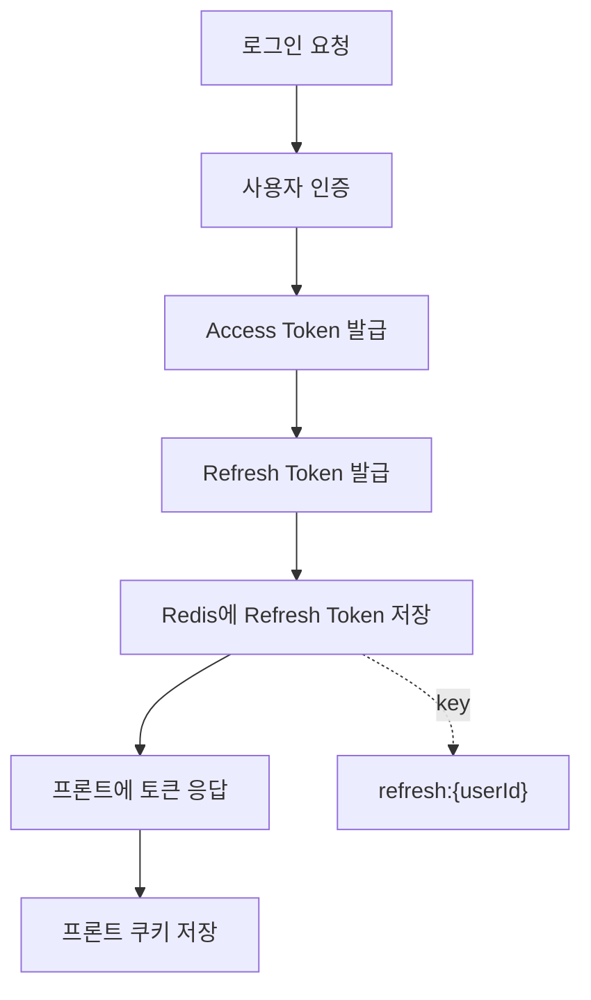
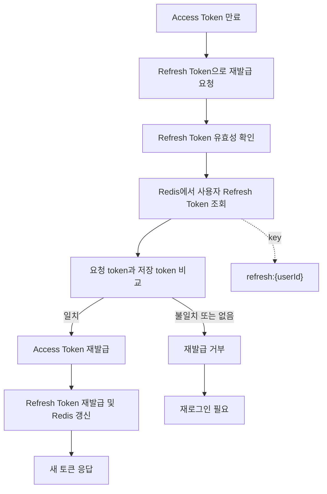

# 인증과 JWT

## 문서 포털

문서의 상세 구현, API, 아키텍처, 트러블슈팅은 아래 문서를 참고하세요.

| 분류 | 문서 | 분류 | 문서 |
| --- | --- | --- | --- |
| 루트 README | [README](../../../README.md) | 서비스 README | [README](../README.md) |
| Engineering Notes | [Engineering Notes](../../../docs/ENGINEERING.md) | Database Schema ERD | [Database Schema ERD](../../../docs/database-schema.md) |
| 01 | [개요](01-overview.md) | 02 | [인증/JWT](02-auth-jwt.md) |
| 03 | [회원가입/프로필](03-user-register-profile.md) | 04 | [자산/주문 검증](04-user-asset-order-validation.md) |
| 05 | [Kafka 정산](05-settlement-kafka.md) | 06 | [관심종목](06-watchlist.md) |
| 07 | [실시간 연결](07-websocket.md) | 08 | [도메인 모델](08-domain-model.md) |
| 09 | [보안 설정](09-security-config.md) | 10 | [user-service 이슈](10-user-service-issues.md) |

## 목차

> [개요](#개요) ·
> [핵심 구현 파일](#핵심-구현-파일) ·
> [엔드포인트](#엔드포인트) ·
> [로그인](#로그인) ·
> [Refresh](#refresh)

> [JWT Filter](#jwt-filter) ·
> [Security 설정](#security-설정) ·
> [인증 흐름](#인증-흐름) ·
> [Refresh 흐름](#refresh-흐름) ·
> [민감정보](#민감정보)

## 개요

인증 기능은 Spring Security, JWT, Redis를 사용한다. 로그인 성공 시 access token과 refresh token을 발급하고, refresh token은 Redis에 저장한다. 이후 요청은 `Authorization: Bearer {accessToken}` 헤더를 통해 인증된다.

## 엔드포인트

| Method | Path | 설명 | 인증 |
| --- | --- | --- | --- |
| POST | `/auth/login` | 로그인, access/refresh token 발급 | 불필요 |
| POST | `/auth/refresh` | refresh token 검증 후 토큰 재발급 | 불필요 |
| GET | `/auth/check` | 현재 인증 여부 확인 | 필요 |
| POST | `/auth/logout` | Redis에 저장된 refresh token 삭제 | 필요 |

## 로그인

로그인 요청은 사용자 ID와 비밀번호를 검증한다. 인증에 성공하면 access token과 refresh token을 생성하고, refresh token을 Redis에 저장한 뒤 프론트엔드에 토큰을 응답한다.

Redis에는 사용자별 refresh token이 저장된다. 같은 사용자가 다시 로그인하거나 refresh에 성공하면 해당 사용자의 refresh token 값이 새 값으로 갱신된다.

Redis 저장 key 패턴:

- `refresh:{userId}`

refresh token 저장 기간은 코드에서 7일로 지정되어 있다.

## Refresh

`POST /auth/refresh`는 request body의 `refreshToken`을 검증한다. access token이 만료된 사용자는 refresh token을 보내고, user-service는 Redis에 저장된 사용자별 refresh token과 요청 token을 비교한다.

검증 조건:

- JWT 자체가 유효해야 한다.
- token claim `type`이 `refresh`여야 한다.
- Redis에 저장된 refresh token과 요청 refresh token이 같아야 한다.

검증에 성공하면 access token과 refresh token을 새로 발급하고 Redis 값을 새 refresh token으로 갱신한다. Redis에 값이 없거나 요청 token과 다르면 토큰 갱신을 거부하며, 사용자는 다시 로그인해야 한다.

## JWT Filter

`JwtAuthenticationFilter`는 모든 요청에서 `Authorization` 헤더를 확인한다.

처리 조건:

- 헤더가 `Bearer `로 시작해야 한다.
- JWT가 유효해야 한다.
- token claim `type`이 `access`여야 한다.

조건을 만족하면 `SecurityContextHolder`에 `UsernamePasswordAuthenticationToken`을 설정한다. 인증 사용자 이름 조회 결과는 사용자 ID로 사용된다(`authentication.getName()`).

## Security 설정

`SecurityConfig`는 stateless 세션 정책을 사용한다.

- CSRF 비활성화
- form login 비활성화
- http basic 비활성화
- JWT filter 등록
- CORS 허용 origin: `http://localhost:3000`

permitAll 경로에는 `/user/register`, `/auth/**`, `/ws-user/**`, `/actuator/**` 등이 포함된다.

## 인증 흐름

## Refresh 흐름

## 민감정보

JWT secret, Redis 접속 정보는 설정 파일에 존재하지만 문서에 직접 기록하지 않는다. 해당 값들은 환경 변수로 분리 필요하다.

## 핵심 구현 파일

기준 경로

`StockBackEndDistributed/user-service/src/main/java/Poi/Stock`

| 파일 |
| --- |
| `features/Auth/AuthController.java` |
| `config/SecurityConfig.java` |
| `config/JwtProvider.java` |
| `config/JwtAuthenticationFilter.java` |
| `config/CustomUserDetailsService.java` |
| `config/AuthenticationManagerConfig.java` |
| `config/RedisConfig.java` |
| `DTO/user/LoginDTO.java` |
| `DTO/user/ApiResponse.java` |

[문서 맨 위로](#top)

