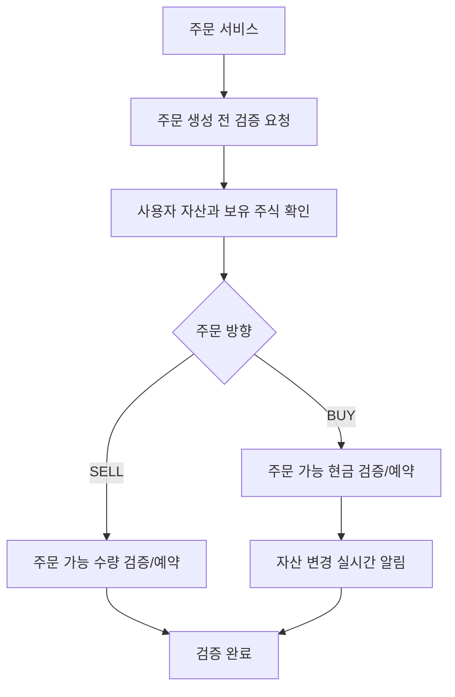
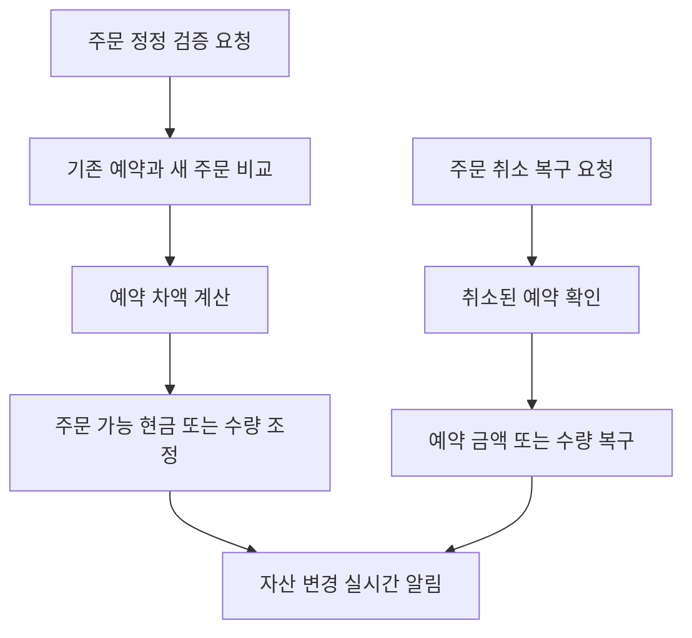

# 사용자 자산과 주문 검증

## 문서 포털

문서의 상세 구현, API, 아키텍처, 트러블슈팅은 아래 문서를 참고하세요.

| 분류 | 문서 | 분류 | 문서 |
| --- | --- | --- | --- |
| 루트 README | [README](../../../README.md) | 서비스 README | [README](../README.md) |
| Engineering Notes | [Engineering Notes](../../../docs/ENGINEERING.md) | Database Schema ERD | [Database Schema ERD](../../../docs/database-schema.md) |
| 01 | [개요](01-overview.md) | 02 | [인증/JWT](02-auth-jwt.md) |
| 03 | [회원가입/프로필](03-user-register-profile.md) | 04 | [자산/주문 검증](04-user-asset-order-validation.md) |
| 05 | [Kafka 정산](05-settlement-kafka.md) | 06 | [관심종목](06-watchlist.md) |
| 07 | [실시간 연결](07-websocket.md) | 08 | [도메인 모델](08-domain-model.md) |
| 09 | [보안 설정](09-security-config.md) | 10 | [user-service 이슈](10-user-service-issues.md) |

## 목차

> [개요](#개요) ·
> [엔드포인트](#엔드포인트) ·
> [주문 생성 검증](#주문-생성-검증) ·
> [주문 정정 검증](#주문-정정-검증)

> [주문 취소 복구](#주문-취소-복구) ·
> [보유 자산 조회](#보유-자산-조회) ·
> [주문 검증 흐름](#주문-검증-흐름) ·
> [정정/취소 흐름](#정정취소-흐름) ·
> [핵심 구현 파일](#핵심-구현-파일)
## 개요

사용자 자산 기능은 보유 현금, 주문 가능 현금, 보유 주식 수량을 관리한다. 주문 서비스는 주문 생성/정정/취소 과정에서 user-service API로 자산 또는 보유 수량 예약과 복구를 요청할 수 있다.

## 엔드포인트

| Method | Path | 설명 | 인증 |
| --- | --- | --- | --- |
| POST | `/user/validate-order` | 주문 생성 전 자산/수량 예약 검증 | 필요 |
| POST | `/user/validate-editOrder` | 주문 정정 전 예약 차액 검증 | 필요 |
| POST | `/user/cancel-reserve` | 취소된 주문의 예약 금액/수량 복구 | 필요 |
| GET | `/user/haveAsset` | 보유 자산과 보유 주식 조회 | 필요 |

## 주문 생성 검증

`validateOrder()` (주문 생성 전 자산 또는 보유 수량을 검증하고 예약하는 기능)는 주문 방향에 따라 다르게 동작한다.

### BUY

1. 사용자 조회
2. `가격 * 수량` 계산
3. 주문 가능 현금(`availableAsset`)이 부족하면 예외 발생
4. 충분하면 주문 가능 현금(`availableAsset`)에서 주문 금액 차감
5. 사용자 자산 WebSocket 알림 전송

### SELL

1. 사용자와 종목 코드로 주문 가능 수량(`availableQuantity`) 조회
2. 주문 가능 수량(`availableQuantity`)이 부족하면 예외 발생
3. 충분하면 주문 가능 수량(`availableQuantity`)에서 주문 수량 차감

## 주문 정정 검증

`validateEditOrder()` (주문 정정 전 예약 차액을 검증하고 반영하는 기능)는 기존 예약 금액/수량과 새 주문 금액/수량의 차이를 계산한다.

### BUY

- 새 예약 금액이 더 크면 추가 차액만큼 주문 가능 현금(`availableAsset`) 차감
- 새 예약 금액이 더 작으면 차액만큼 주문 가능 현금(`availableAsset`) 복구

### SELL

- 새 수량이 더 크면 추가 수량만큼 주문 가능 수량(`availableQuantity`) 차감
- 새 수량이 더 작으면 차액만큼 주문 가능 수량(`availableQuantity`) 복구

## 주문 취소 복구

`cancelReserve()` (취소된 주문의 예약 금액 또는 수량을 복구하는 기능)는 취소된 주문의 예약 값을 복구한다.

- BUY: `가격 * 수량`만큼 주문 가능 현금(`availableAsset`) 복구
- SELL: `수량`만큼 주문 가능 수량(`availableQuantity`) 복구

처리 후 사용자 자산 WebSocket 알림을 전송한다.

## 보유 자산 조회

`GET /user/haveAsset`는 다음 데이터를 `ApiResponse.data`로 반환한다.

- 보유 주식 목록(`haveStocks`)
- 총 보유 자산(`asset`)
- 주문 가능 현금(`availableAsset`)

`haveStocks`는 `getHaveStockDTO` 객체 목록으로 반환되며, 각 객체는 다음 필드를 포함한다.

- 보유 주식 ID(`id`)
- 종목 코드(`stockCode`)
- 보유 수량(`quantity`)
- 주문 가능 수량(`availableQuantity`)
- 평균 매입가(`averagePrice`)

## 주문 검증 흐름

## 정정/취소 흐름

## 핵심 구현 파일

기준 경로

`StockBackEndDistributed/user-service/src/main/java/Poi/Stock`

| 파일 |
| --- |
| `features/User/UserAssetController.java` |
| `features/User/UserAssetService.java` |
| `features/User/StockUser.java` |
| `features/User/HaveStock.java` |
| `features/UserWebsocket/UserWebsocketService.java` |
| `repository/StockUserRepository.java` |
| `repository/HaveStockRepository.java` |
| `DTO/user/getHaveStockDTO.java` |
| `util/EnumUtil.java` |

[문서 맨 위로](#top)

