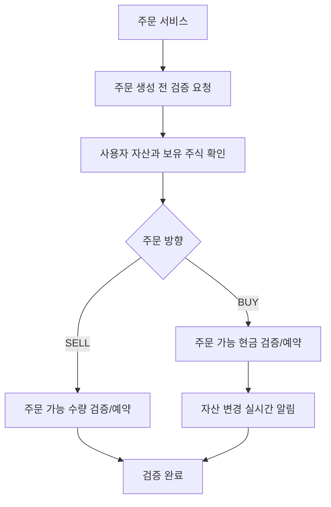
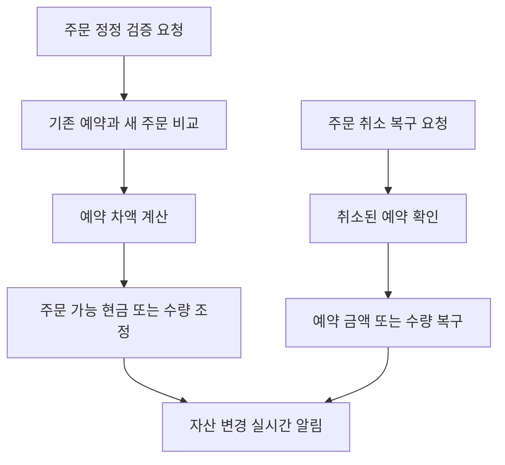

<a id="top"></a>

# 사용자 자산과 주문 검증

## 문서 포털

문서의 상세 구현, API, 아키텍처, 트러블슈팅은 아래 문서를 참고하세요.

| 분류 | 문서 | 분류 | 문서 |
| --- | --- | --- | --- |
| 주식 README | [README](../../../README.md) | 사용자 서비스 README | [README](../README.md) |
| 설계 노트 | [Engineering Notes](../../../docs/ENGINEERING.md) | 데이터베이스 ERD | [Database Schema ERD](../../../docs/database-schema.md) |
| 개요 | [개요](01-overview.md) | 인증/JWT | [인증/JWT](02-auth-jwt.md) |
| 회원가입/프로필 | [회원가입/프로필](03-user-register-profile.md) | 자산/주문 검증 | [자산/주문 검증](04-user-asset-order-validation.md) |
| Kafka 정산 | [Kafka 정산](05-settlement-kafka.md) | 관심종목 | [관심종목](06-watchlist.md) |
| 실시간 연결 | [실시간 연결](07-websocket.md) | 도메인 모델 | [도메인 모델](08-domain-model.md) |
| 보안 설정 | [보안 설정](09-security-config.md) | 유저 서비스 이슈 | [user-service 이슈](10-user-service-issues.md) |

## 목차

> [개요](#개요) ·
> [엔드포인트](#엔드포인트) ·
> [주문 생성 검증](#주문-생성-검증) ·
> [주문 정정 검증](#주문-정정-검증)

> [주문 취소 복구](#주문-취소-복구) ·
> [보유 자산 조회](#보유-자산-조회) ·
> [주문 검증 흐름](#주문-검증-흐름) ·
> [정정/취소 흐름](#정정취소-흐름) ·
> [핵심 구현 파일](#핵심-구현-파일)
## 개요

사용자 자산 기능은 보유 현금, 주문 가능 현금, 보유 주식 수량을 관리합니다. 주문 서비스는 주문 생성/정정/취소 과정에서 user-service API로 자산 또는 보유 수량 예약과 복구를 요청할 수 있습니다.

## 엔드포인트

| Method | Path | 설명 | 인증 |
| --- | --- | --- | --- |
| POST | `/user/validate-order` | 주문 생성 전 자산/수량 예약 검증 | 필요 |
| POST | `/user/validate-editOrder` | 주문 정정 전 예약 차액 검증 | 필요 |
| POST | `/user/cancel-reserve` | 취소된 주문의 예약 금액/수량 복구 | 필요 |
| GET | `/user/haveAsset` | 보유 자산과 보유 주식 조회 | 필요 |

## 주문 생성 검증

`validateOrder()` (주문 생성 전 자산 또는 보유 수량을 검증하고 예약하는 기능)는 주문 방향에 따라 다르게 동작합니다.

### 동작 순서

#### 구매

1. 사용자 조회
2. `가격 * 수량` 계산
3. 주문 가능 현금(`availableAsset`)이 부족하면 예외 발생
4. 충분하면 주문 가능 현금(`availableAsset`)에서 주문 금액 차감
5. 사용자 자산 WebSocket 알림 전송

#### 판매

1. 사용자와 종목 코드로 주문 가능 수량(`availableQuantity`) 조회
2. 주문 가능 수량(`availableQuantity`)이 부족하면 예외 발생
3. 충분하면 주문 가능 수량(`availableQuantity`)에서 주문 수량 차감

### 핵심 코드

#### 매수 자산 예약

```java
if (type == tradeType.BUY) {
    int totalCost = price * quantity;
    if (user.getAvailableAsset() < totalCost)
        throw new RuntimeException(
            String.format(
                "자산이 부족합니다. 필요: %d원, 보유: %d원",
                totalCost, user.getAvailableAsset()));
    user.setAvailableAsset(user.getAvailableAsset() - totalCost);
    stockUserRepository.save(user);
    userWebsocketService.sendUserAsset(user);
}
```

동시에 접수된 주문이 자산을 중복 사용하지 못하도록 검증과 예약을 한 단계에서 처리합니다. 주문 가격과 수량을 입력으로 필요한 금액을 계산하고 주문 가능 현금에서 즉시 차감하며, 변경 결과는 사용자 WebSocket에 반영됩니다.

#### 매도 수량 예약

```java
if (type == tradeType.SELL) {
    HaveStock haveStock = haveStockRepository
            .findByStockUserAndStockCode(user, stockCode)
            .orElseThrow(() -> new RuntimeException("보유한 주식이 없습니다."));
    if (haveStock.getAvailableQuantity() < quantity)
        throw new RuntimeException(
            String.format(
                "보유 수량이 부족합니다. 보유: %d주, 매도 요청: %d주",
                haveStock.getAvailableQuantity(), quantity));
    haveStock.setAvailableQuantity(haveStock.getAvailableQuantity() - quantity);
    haveStockRepository.save(haveStock);
}
```

보유 수량과 주문 가능 수량을 분리해 이미 매도 주문에 예약된 주식이 다시 사용되는 문제를 막습니다. 사용자·종목·주문 수량을 입력으로 판매 가능 여부를 확인하고 예약 수량을 저장합니다.

### 구현 위치

- 생성 주문 검증과 예약: `features/User/UserAssetService.java`의 `validateOrder()`

## 주문 정정 검증

`validateEditOrder()` (주문 정정 전 예약 차액을 검증하고 반영하는 기능)는 기존 예약 금액/수량과 새 주문 금액/수량의 차이를 계산합니다.

### 동작 순서

#### 구매

- 새 예약 금액이 더 크면 추가 차액만큼 주문 가능 현금(`availableAsset`) 차감
- 새 예약 금액이 더 작으면 차액만큼 주문 가능 현금(`availableAsset`) 복구

#### 판매

- 새 수량이 더 크면 추가 수량만큼 주문 가능 수량(`availableQuantity`) 차감
- 새 수량이 더 작으면 차액만큼 주문 가능 수량(`availableQuantity`) 복구

### 핵심 코드

```java
if (type == tradeType.BUY) {
    int oldCost = oldPrice * RemainingQuantity;
    int newCost = newPrice * newQuantity;
    int diff = newCost - oldCost;
    if (diff > 0) {
        if (user.getAvailableAsset() < diff)
            throw new RuntimeException(
                String.format(
                    "자산이 부족합니다. 추가 필요: %d원, 보유: %d원",
                    diff, user.getAvailableAsset()));
        user.setAvailableAsset(user.getAvailableAsset() - diff);
    } else {
        user.setAvailableAsset(user.getAvailableAsset() + Math.abs(diff));
    }
    stockUserRepository.save(user);
}
```

정정 주문 전체 금액을 다시 예약하지 않고 기존 미체결 예약과 새 주문의 차액만 조정합니다. 이전 가격·잔여 수량과 새 가격·수량을 입력으로 추가 차감 또는 환급 금액을 계산해 주문 가능 현금에 반영합니다.

### 구현 위치

- 정정 차액 검증: `features/User/UserAssetService.java`의 `validateEditOrder()`

## 주문 취소 복구

`cancelReserve()` (취소된 주문의 예약 금액 또는 수량을 복구하는 기능)는 취소된 주문의 예약 값을 복구합니다.

- BUY: `가격 * 수량`만큼 주문 가능 현금(`availableAsset`) 복구
- SELL: `수량`만큼 주문 가능 수량(`availableQuantity`) 복구

처리 후 사용자 자산 WebSocket 알림을 전송합니다.

### 동작 순서

1. 취소 주문의 방향과 남은 예약 값을 확인합니다.
2. 매수 금액 또는 매도 가능 수량을 복구합니다.
3. 복구된 자산 상태를 실시간으로 전송합니다.

### 핵심 코드

```java
public void cancelReserve(String userId, tradeType type, String stockCode,
        int price, int quantity) {
    StockUser user = stockUserRepository.findById(userId)
            .orElseThrow(() -> new RuntimeException("사용자를 찾을 수 없습니다"));
    if (type == tradeType.BUY) {
        int refundAmount = price * quantity;
        user.setAvailableAsset(user.getAvailableAsset() + refundAmount);
        stockUserRepository.save(user);
    }
    if (type == tradeType.SELL) {
        HaveStock haveStock = haveStockRepository
                .findByStockUserAndStockCode(user, stockCode)
                .orElseThrow(() -> new RuntimeException("보유한 주식이 없습니다."));
        haveStock.setAvailableQuantity(haveStock.getAvailableQuantity() + quantity);
        haveStockRepository.save(haveStock);
    }
    userWebsocketService.sendUserAsset(user);
}
```

취소된 주문이 점유하던 자산을 다시 주문 가능한 상태로 돌려놓는 보상 로직입니다. 주문 방향·가격·잔여 수량을 입력으로 현금 또는 수량을 복구하고, 저장 결과를 사용자 화면에 전송합니다.

### 구현 위치

- 예약 복구: `features/User/UserAssetService.java`의 `cancelReserve()`

## 보유 자산 조회

로그인 사용자의 자산과 보유 주식을 조회하는 API(`GET /user/haveAsset`)는 다음 데이터를 반환합니다.

- 보유 주식 목록(`haveStocks`)
- 총 보유 자산(`asset`)
- 주문 가능 현금(`availableAsset`)

`haveStocks`는 `getHaveStockDTO`로 반환되며, 다음 필드를 포함합니다.

- 보유 주식 ID(`id`)
- 종목 코드(`stockCode`)
- 보유 수량(`quantity`)
- 주문 가능 수량(`availableQuantity`)
- 평균 매입가(`averagePrice`)

### 동작 순서

1. 인증 사용자와 보유 주식 목록을 조회합니다.
2. 엔티티를 화면에 필요한 보유 주식 DTO로 변환합니다.
3. 자산과 보유 목록을 하나의 응답으로 구성합니다.

### 핵심 코드

```java
public Map<String, Object> userHaveAsset(String userId) {
    StockUser stockUser = stockUserRepository.findById(userId)
            .orElseThrow(() -> new RuntimeException("유저 없음: " + userId));
    List<getHaveStockDTO> stocks = haveStockRepository.findByStockUser(stockUser).stream()
            .map(h -> {
                getHaveStockDTO dto = new getHaveStockDTO();
                dto.setId(h.getId());
                dto.setStockCode(h.getStockCode());
                dto.setAveragePrice((int) h.getAveragePrice());
                dto.setQuantity(h.getQuantity());
                dto.setAvailableQuantity(h.getAvailableQuantity());
                return dto;
            }).collect(Collectors.toList());
    return Map.of("haveStocks", stocks, "asset", stockUser.getAsset(),
            "availableAsset", stockUser.getAvailableAsset());
}
```

사용자 ID를 입력으로 보유 주식을 DTO로 변환하고 총 보유 자산·주문 가능 현금과 함께 응답합니다.

### 구현 위치

- 자산 응답 구성: `features/User/UserAssetService.java`의 `userHaveAsset()`

## 주문 검증 흐름



## 정정/취소 흐름



## 핵심 구현 파일

기준 경로

`StockBackEndDistributed/user-service/src/main/java/Poi/Stock`

| 파일 |
| --- |
| `features/User/UserAssetController.java` |
| `features/User/UserAssetService.java` |
| `features/User/StockUser.java` |
| `features/User/HaveStock.java` |
| `features/UserWebsocket/UserWebsocketService.java` |
| `repository/StockUserRepository.java` |
| `repository/HaveStockRepository.java` |
| `DTO/user/getHaveStockDTO.java` |
| `util/EnumUtil.java` |

<div align="right">

[문서 맨 위로](#top)

</div>


