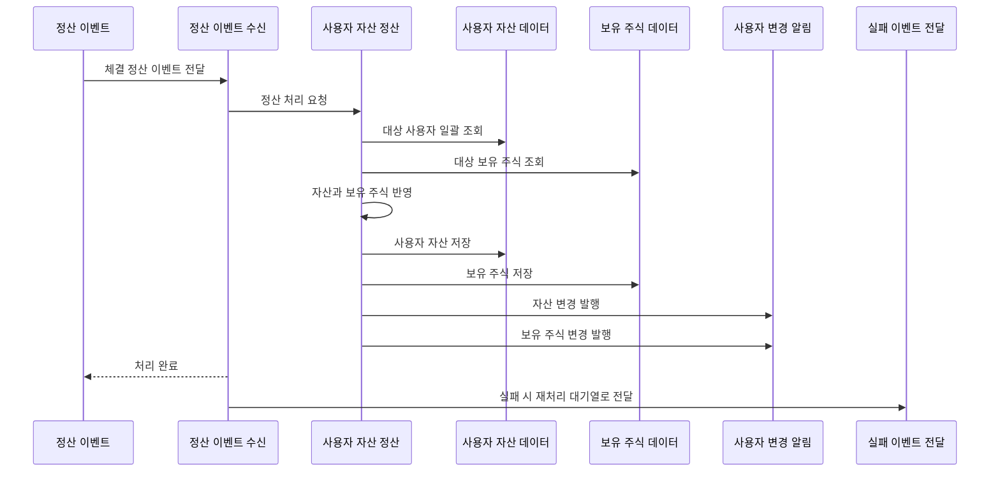

<a id="top"></a>

# Kafka 체결 정산

## 문서 포털

문서의 상세 구현, API, 아키텍처, 트러블슈팅은 아래 문서를 참고하세요.

| 분류 | 문서 | 분류 | 문서 |
| --- | --- | --- | --- |
| 주식 README | [README](../../../README.md) | 사용자 서비스 README | [README](../README.md) |
| 설계 노트 | [Engineering Notes](../../../docs/ENGINEERING.md) | 데이터베이스 ERD | [Database Schema ERD](../../../docs/database-schema.md) |
| 개요 | [개요](01-overview.md) | 인증/JWT | [인증/JWT](02-auth-jwt.md) |
| 회원가입/프로필 | [회원가입/프로필](03-user-register-profile.md) | 자산/주문 검증 | [자산/주문 검증](04-user-asset-order-validation.md) |
| Kafka 정산 | [Kafka 정산](05-settlement-kafka.md) | 관심종목 | [관심종목](06-watchlist.md) |
| 실시간 연결 | [실시간 연결](07-websocket.md) | 도메인 모델 | [도메인 모델](08-domain-model.md) |
| 보안 설정 | [보안 설정](09-security-config.md) | 유저 서비스 이슈 | [user-service 이슈](10-user-service-issues.md) |

## 목차

> [개요](#개요) ·
> [소비 토픽](#소비-토픽) ·
> [이벤트 구조](#이벤트-구조) ·
> [정산 처리](#정산-처리)

> [매수 정산](#매수-정산) ·
> [매도 정산](#매도-정산) ·
> [WebSocket 알림](#websocket-알림) ·
> [실패 처리](#실패-처리) ·
> [정산 흐름](#정산-흐름) ·
> [핵심 구현 파일](#핵심-구현-파일)
## 개요

user-service는 Kafka의 정산 이벤트를 소비해 실제 사용자 자산과 보유 주식을 갱신합니다. 주문 생성 시점에는 주문 가능 현금(`availableAsset`) 또는 주문 가능 수량(`availableQuantity`)만 예약 처리하고, 실제 총 보유 자산(`asset`), 보유 수량(`quantity`), 평균 매입가(`averagePrice`)는 체결 정산 이벤트에서 반영됩니다.

## 소비 토픽

체결 결과를 사용자 자산에 반영하기 위해 정산 이벤트 Topic(`settlement-topic`)을 소비합니다.

consumer group:

- `settlement-group`

## 이벤트 구조

정산 이벤트는 데이터베이스 테이블이 아니라 서비스 간 전달 객체입니다.

| 구조 | 필드 | 역할 |
| --- | --- | --- |
| `SettlementEvent` | `stockCode` | 정산할 종목 코드 |
| `SettlementEvent` | `stockChanges` | 사용자별 보유 주식 변경 목록 |
| `haveStockChange` | `userId` | 정산 대상 사용자 |
| `haveStockChange` | `tradeQuantity` | 거래 방향을 포함한 체결 수량 |
| `haveStockChange` | `tradePrice` | 체결 가격 |

`tradeQuantity`는 방향을 포함한 수량으로 처리됩니다.

- 양수: 매수 체결
- 음수: 매도 체결

## 정산 처리

`UserAssetService.applySettlement()` (체결 정산 이벤트를 사용자 자산과 보유 주식에 반영하는 기능)는 저장소 접근을 일괄 처리해 같은 정산 안에서 변경 기준을 맞춥니다.

### 동작 순서

1. 이벤트의 사용자 ID 목록 추출
2. 사용자 목록 일괄 조회
3. 해당 종목 보유 주식 목록 일괄 조회
4. `applyStockChanges()`로 자산과 보유 주식 반영
5. `sendUpdates()`로 사용자별 WebSocket 알림 전송

### 핵심 코드

```java
public void applySettlement(SettlementEvent event) {
    List<String> userIds = event.getStockChanges().stream()
            .map(haveStockChange::getUserId).toList();
    Map<String, StockUser> userMap = stockUserRepository.findAllById(userIds).stream()
            .collect(Collectors.toMap(StockUser::getId, u -> u));
    Map<String, HaveStock> haveStockMap = haveStockRepository
            .findByUserIdsAndStockCode(userIds, event.getStockCode()).stream()
            .collect(Collectors.toMap(h -> h.getStockUser().getId(), h -> h));
    applyStockChanges(event, userMap, haveStockMap);
    sendUpdates(event, userMap, haveStockMap);
}
```

사용자와 보유 주식을 먼저 일괄 조회합니다. 정산 이벤트를 입력으로 ID 기반 Map을 구성하고 자산 변경과 실시간 알림을 처리합니다.

### 구현 위치

- 정산 대상 일괄 조회와 처리 조정: `features/User/UserAssetService.java`의 `applySettlement()`

## 매수 정산

`tradeQuantity > 0`이면 매수로 처리됩니다.

- 총 보유 자산(`asset`)에서 `tradePrice * tradeQuantity` 차감
- 평균 매입가(`averagePrice`)와 보유 수량(`quantity`) 갱신
- 주문 가능 수량(`availableQuantity`)에 체결 수량 추가

### 동작 순서

1. 체결 금액을 계산합니다.
2. 총 보유 자산과 평균 매입가를 갱신합니다.
3. 체결 수량을 주문 가능 수량에 반영합니다.

### 핵심 코드

```java
int tradeMoney = change.getTradePrice() * Math.abs(change.getTradeQuantity());
if (change.getTradeQuantity() > 0) {
    user.setAsset(user.getAsset() - tradeMoney);
}

// 생략: 보유 주식 조회 또는 생성
if (change.getTradeQuantity() > 0) {
    hs.updateAveragePrice(change.getTradeQuantity(), change.getTradePrice());
    hs.setAvailableQuantity(
            hs.getAvailableQuantity() + change.getTradeQuantity());
}
```

주문 접수 단계에서 예약한 현금과 실제 체결 결과를 분리하기 위해 매수 체결 시점에 총자산과 보유 주식을 확정합니다. 양수 체결 수량과 가격을 입력으로 자산을 차감하고 평균 매입가·주문 가능 수량을 갱신합니다.

### 구현 위치

- 매수 체결 반영: `features/User/UserAssetService.java`의 `applyStockChanges()`

## 매도 정산

`tradeQuantity < 0`이면 매도로 처리됩니다.

- 총 보유 자산(`asset`)에 매도 대금 추가
- 주문 가능 현금(`availableAsset`)에 매도 대금 추가
- 보유 수량(`quantity`)에서 매도 수량 차감

### 동작 순서

1. 음수 체결 수량의 절댓값으로 매도 대금을 계산합니다.
2. 총 보유 자산과 주문 가능 현금에 대금을 더합니다.
3. 보유 수량에서 체결 수량을 차감합니다.

### 핵심 코드

```java
int tradeMoney = change.getTradePrice() * Math.abs(change.getTradeQuantity());
if (change.getTradeQuantity() > 0) {
    // 생략: 매수 자산 처리
} else {
    user.setAsset(user.getAsset() + tradeMoney);
    user.setAvailableAsset(user.getAvailableAsset() + tradeMoney);
}

// 생략: 보유 주식 조회 또는 생성
if (change.getTradeQuantity() > 0) {
    // 생략: 매수 보유 주식 처리
} else {
    hs.setQuantity(hs.getQuantity() + change.getTradeQuantity());
}
```

매도 주문에서 미리 예약한 수량은 체결 이후 실제 보유 수량과 현금으로 확정되어야 합니다. 음수 체결 수량과 가격을 입력으로 매도 대금을 자산에 반영하고 보유 수량을 줄입니다.

### 구현 위치

- 매도 체결 반영: `features/User/UserAssetService.java`의 `applyStockChanges()`

## WebSocket 알림

정산 후 총자산과 주문 가능 현금 변경을 전달하는 WebSocket Queue(`/user/queue/asset`)로 자산 알림을 전송합니다.

보유 수량과 평균 매입가 변경은 보유 종목 알림 Queue(`/user/queue/havestock`)로 전송합니다.

### 동작 순서

1. 변경된 사용자 자산과 보유 주식으로 payload를 구성합니다.
2. 사용자 ID를 STOMP 사용자 목적지의 식별자로 사용합니다.
3. 자산과 보유 주식 Queue에 각각 전송합니다.

### 핵심 코드

#### 자산 변경 전송

```java
public void sendUserAsset(StockUser user) {
    Map<String, Object> payload = new HashMap<>();
    payload.put("asset", user.getAsset());
    payload.put("availableAsset", user.getAvailableAsset());

    log.info("자산 전송 userId={}, asset={}", user.getId(), user.getAsset());
    messagingTemplate.convertAndSendToUser(user.getId(), "/queue/asset", payload);
}
```

거래 화면이 필요한 자산 필드만 메시지로 전달합니다. 저장된 사용자 자산을 입력으로 payload를 만들고 `/user/queue/asset` 구독 화면에 반영합니다.

#### 보유 주식 변경 전송

```java
public void sendUserStock(String userId, HaveStock hs, String stockCode) {
    Map<String, Object> payload = new HashMap<>();
    payload.put("stockCode", stockCode);
    if (hs != null && hs.getQuantity() > 0) {
        payload.put("id", hs.getId());
        payload.put("quantity", hs.getQuantity());
        payload.put("availableQuantity", hs.getAvailableQuantity());
        payload.put("averagePrice", hs.getAveragePrice());
    } else {
        payload.put("quantity", 0);
        payload.put("availableQuantity", 0);
        payload.put("averagePrice", 0);
    }
    log.info("보유주식 전송 userId={}, stockCode={}", userId, stockCode);
    messagingTemplate.convertAndSendToUser(userId, "/queue/havestock", payload);
}
```

보유 주식이 사라진 경우에도 프론트엔드가 기존 항목을 제거할 수 있도록 수량 0 메시지를 보냅니다. 사용자 ID·종목 코드·보유 정보를 입력으로 상태 payload를 만들고 보유 종목 Queue에 반영합니다.

### 구현 위치

- 사용자별 자산·보유 주식 전송: `features/UserWebsocket/UserWebsocketService.java`

## 실패 처리

사용자 자산 정산 이벤트를 수신하는 Kafka Topic(`settlement-topic`) 처리 중 예외가 발생하면 실패 이벤트를 재처리 대기열로 전달합니다.
구현은 `KafkaProducer.sendToSettlementDLT()` (정산 실패 이벤트 전달 기능)에서 담당합니다.

### 동작 순서

1. 정산 이벤트 처리를 시도합니다.
2. 예외가 발생하면 실패 원인을 기록합니다.
3. 원본 이벤트를 DLT로 전달합니다.

### 핵심 코드

```java
@KafkaListener(topics = "settlement-topic", groupId = "settlement-group")
@Transactional
public void consume(@Payload SettlementEvent event) {
    try {
        userAssetService.applySettlement(event);
    } catch (Exception e) {
        log.error("정산 처리 실패: {}", e.getMessage(), e);
        kafkaProducer.sendToSettlementDLT(event);
    }
}
```

정산 실패로 소비가 중단되거나 이벤트가 유실되지 않도록 정상 처리와 실패 전달을 같은 Consumer 경계에서 관리합니다. 정산 이벤트를 입력으로 자산 반영을 시도하고 예외가 발생하면 원본 이벤트를 재처리 경로로 전달합니다.

### 구현 위치

- 정산 소비와 실패 전달: `features/Kafka/KafkaConsumer.java`의 `consume()`

## 정산 흐름


## 핵심 구현 파일

기준 경로

`StockBackEndDistributed/user-service/src/main`

| 파일 |
| --- |
| `java/Poi/Stock/features/Kafka/KafkaConsumer.java` |
| `java/Poi/Stock/features/Kafka/KafkaProducer.java` |
| `java/Poi/Stock/features/User/UserAssetService.java` |
| `java/Poi/Stock/features/UserWebsocket/UserWebsocketService.java` |
| `java/Poi/Stock/object/SettlementEvent.java` |
| `java/Poi/Stock/repository/StockUserRepository.java` |
| `java/Poi/Stock/repository/HaveStockRepository.java` |
| `resources/application-docker.properties` |


<div align="right">

[문서 맨 위로](#top)

</div>


