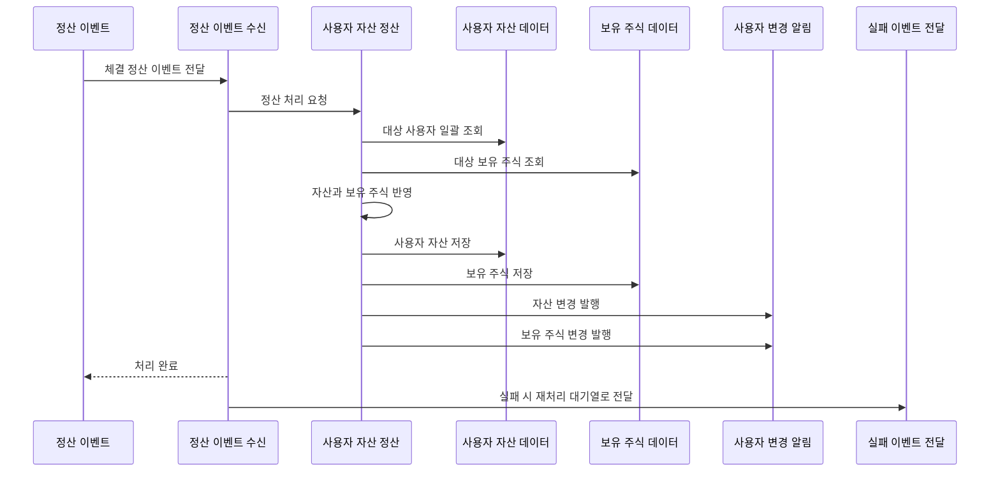

# Kafka 체결 정산

## 문서 포털

문서의 상세 구현, API, 아키텍처, 트러블슈팅은 아래 문서를 참고하세요.

| 분류 | 문서 | 분류 | 문서 |
| --- | --- | --- | --- |
| 루트 README | [README](../../../README.md) | 서비스 README | [README](../README.md) |
| Engineering Notes | [Engineering Notes](../../../docs/ENGINEERING.md) | Database Schema ERD | [Database Schema ERD](../../../docs/database-schema.md) |
| 01 | [개요](01-overview.md) | 02 | [인증/JWT](02-auth-jwt.md) |
| 03 | [회원가입/프로필](03-user-register-profile.md) | 04 | [자산/주문 검증](04-user-asset-order-validation.md) |
| 05 | [Kafka 정산](05-settlement-kafka.md) | 06 | [관심종목](06-watchlist.md) |
| 07 | [실시간 연결](07-websocket.md) | 08 | [도메인 모델](08-domain-model.md) |
| 09 | [보안 설정](09-security-config.md) | 10 | [user-service 이슈](10-user-service-issues.md) |

## 목차

> [개요](#개요) ·
> [소비 토픽](#소비-토픽) ·
> [이벤트 구조](#이벤트-구조) ·
> [정산 처리](#정산-처리)

> [매수 정산](#매수-정산) ·
> [매도 정산](#매도-정산) ·
> [WebSocket 알림](#websocket-알림) ·
> [실패 처리](#실패-처리) ·
> [정산 흐름](#정산-흐름) ·
> [핵심 구현 파일](#핵심-구현-파일)
## 개요

user-service는 Kafka의 정산 이벤트를 소비해 실제 사용자 자산과 보유 주식을 갱신한다. 주문 생성 시점에는 주문 가능 현금(`availableAsset`) 또는 주문 가능 수량(`availableQuantity`)만 예약 처리하고, 실제 총 보유 자산(`asset`), 보유 수량(`quantity`), 평균 매입가(`averagePrice`)는 체결 정산 이벤트에서 반영된다.

## 소비 토픽

정산 이벤트 수신 흐름은 다음 토픽을 소비한다.

- `settlement-topic`

consumer group:

- `settlement-group`

## 이벤트 구조

`SettlementEvent` 필드:

- `stockCode`
- `stockChanges`

`SettlementEvent.haveStockChange` 필드:

- `userId`
- `tradeQuantity`
- `tradePrice`

`tradeQuantity`는 방향을 포함한 수량으로 처리된다.

- 양수: 매수 체결
- 음수: 매도 체결

## 정산 처리

`UserAssetService.applySettlement()` (체결 정산 이벤트를 사용자 자산과 보유 주식에 반영하는 기능)는 다음 순서로 처리한다.

1. 이벤트의 사용자 ID 목록 추출
2. 사용자 목록 일괄 조회
3. 해당 종목 보유 주식 목록 일괄 조회
4. `applyStockChanges()`로 자산과 보유 주식 반영
5. `sendUpdates()`로 사용자별 WebSocket 알림 전송

## 매수 정산

`tradeQuantity > 0`이면 매수로 처리된다.

- 총 보유 자산(`asset`)에서 `tradePrice * tradeQuantity` 차감
- 평균 매입가(`averagePrice`)와 보유 수량(`quantity`) 갱신
- 주문 가능 수량(`availableQuantity`)에 체결 수량 추가

## 매도 정산

`tradeQuantity < 0`이면 매도로 처리된다.

- 총 보유 자산(`asset`)에 매도 대금 추가
- 주문 가능 현금(`availableAsset`)에 매도 대금 추가
- 보유 수량(`quantity`)에서 매도 수량 차감

## WebSocket 알림

정산 후 사용자별로 다음 알림을 전송한다.

- `/user/queue/asset`
- `/user/queue/havestock`

## 실패 처리

`settlement-topic` 처리 중 예외가 발생하면 실패한 정산 이벤트를 재처리 대기열로 전달한다.
구현은 `KafkaProducer.sendToSettlementDLT()` (정산 실패 이벤트 전달 기능)에서 담당한다.

## 정산 흐름

## 핵심 구현 파일

기준 경로

`StockBackEndDistributed/user-service/src/main`

| 파일 |
| --- |
| `java/Poi/Stock/features/Kafka/KafkaConsumer.java` |
| `java/Poi/Stock/features/Kafka/KafkaProducer.java` |
| `java/Poi/Stock/features/User/UserAssetService.java` |
| `java/Poi/Stock/features/UserWebsocket/UserWebsocketService.java` |
| `java/Poi/Stock/object/SettlementEvent.java` |
| `java/Poi/Stock/repository/StockUserRepository.java` |
| `java/Poi/Stock/repository/HaveStockRepository.java` |
| `resources/application-docker.properties` |

[문서 맨 위로](#top)

