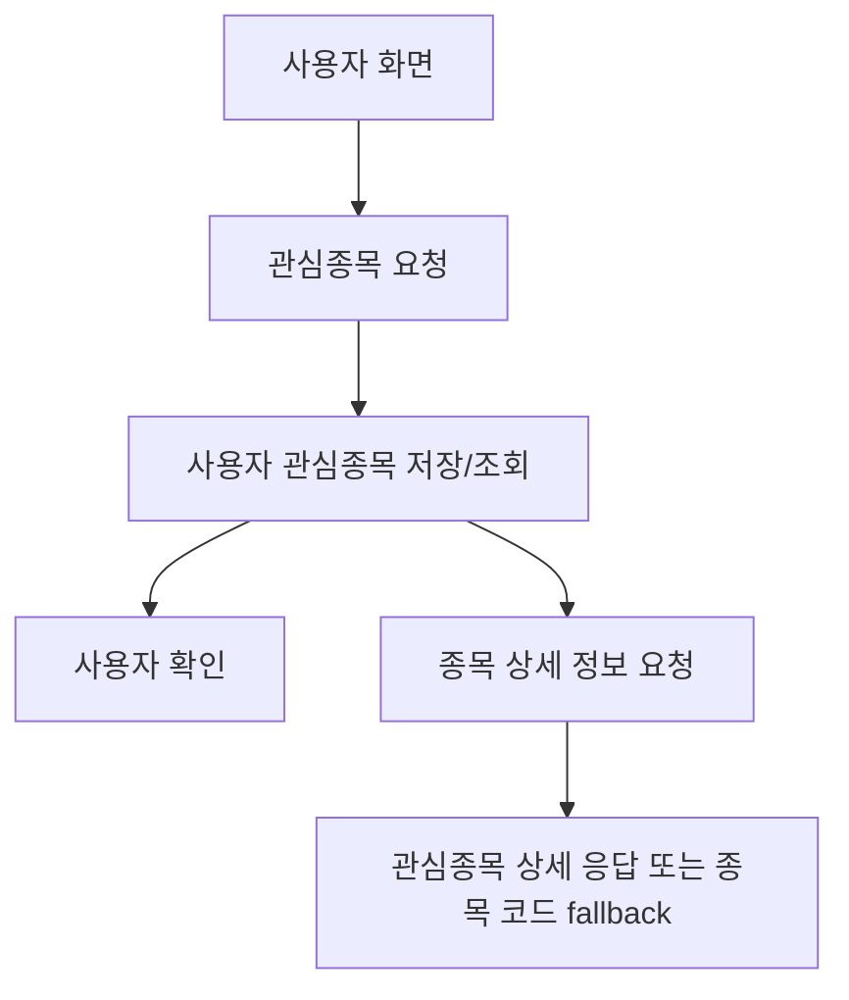

# 관심종목 기능

## 문서 포털

문서의 상세 구현, API, 아키텍처, 트러블슈팅은 아래 문서를 참고하세요.

| 분류 | 문서 | 분류 | 문서 |
| --- | --- | --- | --- |
| 루트 README | [README](../../../README.md) | 서비스 README | [README](../README.md) |
| Engineering Notes | [Engineering Notes](../../../docs/ENGINEERING.md) | Database Schema ERD | [Database Schema ERD](../../../docs/database-schema.md) |
| 01 | [개요](01-overview.md) | 02 | [인증/JWT](02-auth-jwt.md) |
| 03 | [회원가입/프로필](03-user-register-profile.md) | 04 | [자산/주문 검증](04-user-asset-order-validation.md) |
| 05 | [Kafka 정산](05-settlement-kafka.md) | 06 | [관심종목](06-watchlist.md) |
| 07 | [실시간 연결](07-websocket.md) | 08 | [도메인 모델](08-domain-model.md) |
| 09 | [보안 설정](09-security-config.md) | 10 | [user-service 이슈](10-user-service-issues.md) |

## 목차

> [개요](#개요) ·
> [엔드포인트](#엔드포인트) ·
> [관심종목 추가](#관심종목-추가)

> [관심종목 삭제](#관심종목-삭제) ·
> [목록 조회](#목록-조회) ·
> [관심 여부 조회](#관심-여부-조회) ·
> [흐름](#흐름) ·
> [핵심 구현 파일](#핵심-구현-파일)
## 개요

관심종목 기능은 사용자별 관심 종목을 저장하고 조회한다. 목록 조회 시에는 저장된 종목 코드별로 stock-service에서 종목 상세 정보를 함께 가져오려고 시도한다.

## 엔드포인트

| Method | Path | 설명 | 인증 |
| --- | --- | --- | --- |
| POST | `/watch/{stockCode}` | 관심종목 추가 | 필요 |
| DELETE | `/watch/{stockCode}` | 관심종목 삭제 | 필요 |
| GET | `/watch/list` | 관심종목 목록 조회 | 필요 |
| GET | `/watch/{stockCode}` | 특정 종목 관심 여부 조회 | 필요 |

## 관심종목 추가

`WatchListService.addWatch()`는 사용자를 확인한 뒤 선택한 종목을 관심종목 데이터로 저장한다.

저장 필드:

- `stockUser`
- `stockCode`

## 관심종목 삭제

사용자가 관심종목을 해제하면 사용자 ID와 종목 코드를 기준으로 기존 관심종목 데이터를 삭제한다.
구현은 `removeWatch()` (관심종목 삭제 처리)에서 담당한다.

## 목록 조회

`getWatchListWithStockInfo()` (관심종목 목록과 종목 상세 정보를 함께 조회하는 기능)는 다음 순서로 처리한다.

1. 사용자 관심종목 목록 조회
2. `stockCode` 목록 추출
3. 각 `stockCode`에 대해 stock-service에 종목 상세 정보 요청
4. 성공 시 stock-service 응답 body 반환
5. 실패 시 `{ stockCode }`만 포함한 Map 반환

stock-service 요청 경로:

- `{stock.service.url}/stock/watch/{stockCode}`

## 관심 여부 조회

`isWatched()는 사용자 ID와 종목 코드를 기준으로 관심종목 존재 여부를 확인한다.

## 흐름

## 핵심 구현 파일

기준 경로

`StockBackEndDistributed/user-service/src/main`

| 파일 |
| --- |
| `java/Poi/Stock/features/WatchList/WatchListController.java` |
| `java/Poi/Stock/features/WatchList/WatchListService.java` |
| `java/Poi/Stock/features/WatchList/WatchList.java` |
| `java/Poi/Stock/repository/WatchListRepository.java` |
| `java/Poi/Stock/repository/StockUserRepository.java` |
| `java/Poi/Stock/config/RestTemplateConfig.java` |
| `resources/application-docker.properties` |

[문서 맨 위로](#top)

