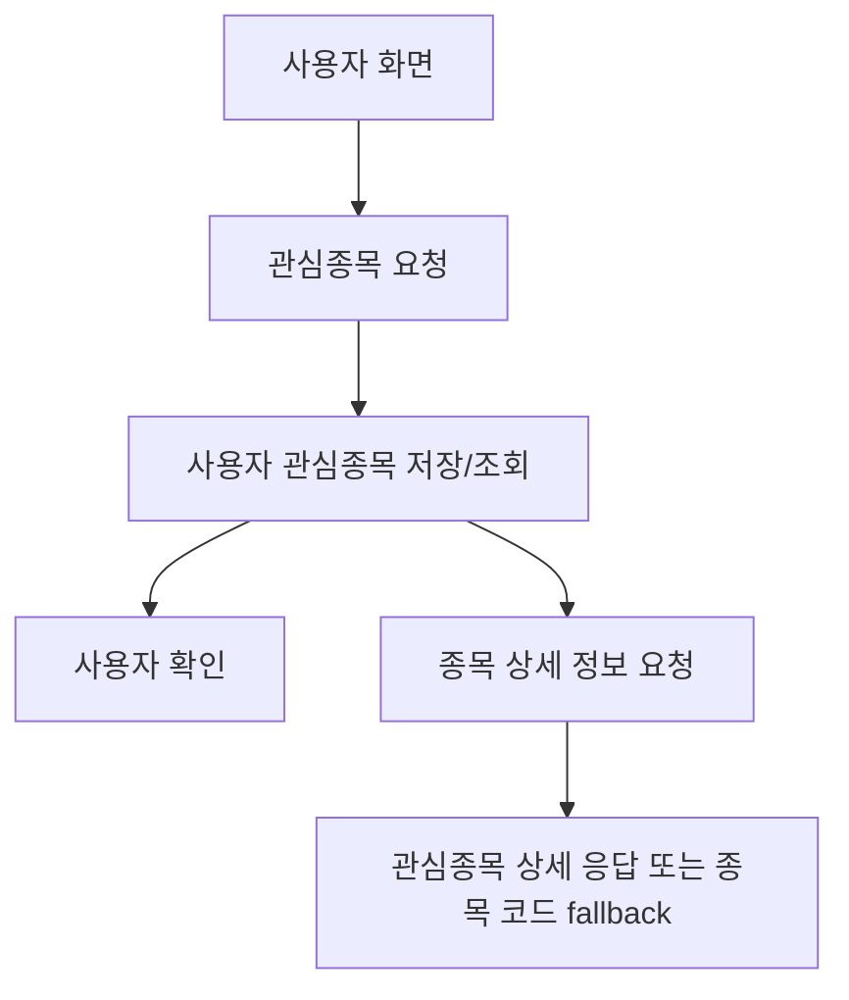

<a id="top"></a>

# 관심종목 기능

## 문서 포털

문서의 상세 구현, API, 아키텍처, 트러블슈팅은 아래 문서를 참고하세요.

| 분류 | 문서 | 분류 | 문서 |
| --- | --- | --- | --- |
| 주식 README | [README](../../../README.md) | 사용자 서비스 README | [README](../README.md) |
| 설계 노트 | [Engineering Notes](../../../docs/ENGINEERING.md) | 데이터베이스 ERD | [Database Schema ERD](../../../docs/database-schema.md) |
| 개요 | [개요](01-overview.md) | 인증/JWT | [인증/JWT](02-auth-jwt.md) |
| 회원가입/프로필 | [회원가입/프로필](03-user-register-profile.md) | 자산/주문 검증 | [자산/주문 검증](04-user-asset-order-validation.md) |
| Kafka 정산 | [Kafka 정산](05-settlement-kafka.md) | 관심종목 | [관심종목](06-watchlist.md) |
| 실시간 연결 | [실시간 연결](07-websocket.md) | 도메인 모델 | [도메인 모델](08-domain-model.md) |
| 보안 설정 | [보안 설정](09-security-config.md) | 유저 서비스 이슈 | [user-service 이슈](10-user-service-issues.md) |

## 목차

> [개요](#개요) ·
> [엔드포인트](#엔드포인트) ·
> [관심종목 추가](#관심종목-추가)

> [관심종목 삭제](#관심종목-삭제) ·
> [목록 조회](#목록-조회) ·
> [관심 여부 조회](#관심-여부-조회) ·
> [흐름](#흐름) ·
> [핵심 구현 파일](#핵심-구현-파일)
## 개요

관심종목 기능은 사용자별 관심 종목을 저장하고 조회합니다. 목록 조회 시에는 저장된 종목 코드별로 stock-service에서 종목 상세 정보를 함께 가져오려고 시도합니다.

## 엔드포인트

| Method | Path | 설명 | 인증 |
| --- | --- | --- | --- |
| POST | `/watch/{stockCode}` | 관심종목 추가 | 필요 |
| DELETE | `/watch/{stockCode}` | 관심종목 삭제 | 필요 |
| GET | `/watch/list` | 관심종목 목록 조회 | 필요 |
| GET | `/watch/{stockCode}` | 특정 종목 관심 여부 조회 | 필요 |

## 관심종목 추가

`WatchListService.addWatch()`는 사용자를 확인한 뒤 선택한 종목을 관심종목 데이터로 저장합니다.

관심종목은 자동 증가 `id`, 사용자 FK(`user_id`), 종목 코드(`stockCode`)로 저장합니다. 사용자와 관심종목의 전체 관계는 [도메인 모델](08-domain-model.md)에서 확인할 수 있습니다.

### 동작 순서

1. 인증 사용자 ID로 사용자를 조회합니다.
2. 사용자와 종목 코드를 관심종목 엔티티로 연결합니다.
3. 관심종목 저장소에 신규 항목을 저장합니다.

### 핵심 코드

```java
public void addWatch(String userId, String stockCode) {
    StockUser user = stockUserRepository.findById(userId)
            .orElseThrow(() -> new RuntimeException("유저를 찾을 수 없습니다"));
    WatchList watchList = new WatchList();
    watchList.setStockUser(user);
    watchList.setStockCode(stockCode);
    watchListRepository.save(watchList);
}
```

관심종목이 반드시 실제 사용자에 귀속되도록 저장 전에 사용자 존재 여부를 확인합니다. 사용자 ID와 종목 코드를 입력으로 연관 엔티티를 만들고 개인 관심 목록에 반영합니다.

### 구현 위치

- 관심종목 저장: `features/WatchList/WatchListService.java`의 `addWatch()`

## 관심종목 삭제

사용자가 관심종목을 해제하면 사용자 ID와 종목 코드를 기준으로 기존 관심종목 데이터를 삭제합니다.
구현은 `removeWatch()` (관심종목 삭제 처리)에서 담당합니다.

### 동작 순서

1. 인증 사용자 ID와 삭제할 종목 코드를 받습니다.
2. 두 값을 복합 삭제 조건으로 사용합니다.
3. 현재 사용자의 항목만 삭제합니다.

### 핵심 코드

```java
@DeleteMapping("/{stockCode}")
public ResponseEntity<?> removeWatch(
        @PathVariable("stockCode") String stockCode,
        Authentication authentication) {
    String userId = authentication.getName();
    watchListService.removeWatch(userId, stockCode);
    return ResponseEntity.ok(new ApiResponse(true, "관심종목 삭제 완료"));
}
```

다른 사용자의 관심종목이 삭제되지 않도록 사용자 ID와 종목 코드를 함께 삭제 조건으로 사용합니다. 삭제 결과는 다음 목록 조회와 관심 여부 확인에 즉시 반영됩니다.

### 구현 위치

- 삭제 요청과 사용자 식별: `features/WatchList/WatchListController.java`의 `removeWatch()`
- 사용자별 관심종목 삭제: `features/WatchList/WatchListService.java`의 `removeWatch()`

## 목록 조회

`getWatchListWithStockInfo()` (관심종목 목록과 종목 상세 정보를 함께 조회하는 기능)는 서비스별 책임을 유지하면서 화면에 필요한 정보를 한 번에 제공하기 위해 다음 순서로 처리합니다.

### 동작 순서

1. 사용자 관심종목 목록 조회
2. `stockCode` 목록 추출
3. 각 `stockCode`에 대해 stock-service에 종목 상세 정보 요청
4. 성공 시 stock-service 응답 body 반환
5. 실패 시 `{ stockCode }`만 포함한 Map 반환

관심 종목의 상세 정보를 조회하기 위해 stock-service API(`{stock.service.url}/stock/watch/{stockCode}`)를 호출합니다.

### 핵심 코드

```java
public List<Object> getWatchListWithStockInfo(String userId) {
    List<String> stockCodes = watchListRepository.findByStockUserId(userId).stream()
            .map(WatchList::getStockCode).collect(Collectors.toList());
    return stockCodes.stream().map(stockCode -> {
        try {
            ResponseEntity<Object> response = restTemplate.getForEntity(
                    stockServiceUrl + "/stock/watch/" + stockCode, Object.class);
            return response.getBody();
        } catch (Exception e) {
            log.error("stock-service 조회 실패: {} / {}", stockCode, e.getMessage());
            return java.util.Map.of("stockCode", stockCode);
        }
    }).collect(Collectors.toList());
}
```

사용자 ID를 입력으로 관심 코드를 조회하고 종목 상세 응답을 모으며, 외부 서비스 장애 시에도 종목 코드 fallback을 반환합니다.

### 구현 위치

- 관심 목록과 종목 정보 결합: `features/WatchList/WatchListService.java`의 `getWatchListWithStockInfo()`

## 관심 여부 조회

isWatched()는 사용자 ID와 종목 코드를 기준으로 관심종목 존재 여부를 확인합니다.

### 동작 순서

1. 인증 사용자 ID와 종목 코드를 받습니다.
2. 사용자별 관심종목 존재 여부를 조회합니다.
3. Boolean 결과를 상세 화면에 반환합니다.

### 핵심 코드

```java
@GetMapping("/{stockCode}")
public ResponseEntity<ApiResponse> isWatched(
        @PathVariable("stockCode") String stockCode,
        Authentication authentication) {
    boolean watched = watchListService.isWatched(authentication.getName(), stockCode);
    return ResponseEntity.ok(new ApiResponse(true, "조회 완료", watched));
}
```

전체 관심 목록을 내려받지 않고 상세 화면에서 한 종목의 등록 상태만 확인하기 위한 조회입니다. 사용자 ID와 종목 코드를 입력으로 존재 여부만 반환해 관심 버튼의 초기 상태에 반영합니다.

### 구현 위치

- 관심 여부 응답: `features/WatchList/WatchListController.java`의 `isWatched()`
- 관심 여부 확인: `features/WatchList/WatchListService.java`의 `isWatched()`

## 흐름



## 핵심 구현 파일

기준 경로

`StockBackEndDistributed/user-service/src/main`

| 파일 |
| --- |
| `java/Poi/Stock/features/WatchList/WatchListController.java` |
| `java/Poi/Stock/features/WatchList/WatchListService.java` |
| `java/Poi/Stock/features/WatchList/WatchList.java` |
| `java/Poi/Stock/repository/WatchListRepository.java` |
| `java/Poi/Stock/repository/StockUserRepository.java` |
| `java/Poi/Stock/config/RestTemplateConfig.java` |
| `resources/application-docker.properties` |


<div align="right">

[문서 맨 위로](#top)

</div>


